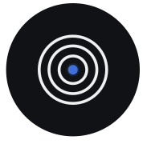

<p align="center">
  
</p>

<h1 align="center">GeoForge Desktop</h1>

<p align="center">
  <b>An agent-driven graphical workspace for scientific models and tools.</b><br>
  Plan, prepare data, run professional software and inspect results through Knowledge Infrastructure.
</p>

<p align="center">
  
  
  
  
</p>

GeoForge Desktop brings the project, agent, scientific tools, data access and run
records into one graphical workspace. Describe your study, review the proposed
inputs and plan, then let the agent operate the real model through its
**Knowledge Infrastructure (KI)**: model-specific tools, staged instructions,
checks and diagnostic guidance. You can follow progress, resolve missing inputs
and inspect the resulting files and plots in the same application.

The app runs on your computer; on Windows, its interface opens in your browser
and model tools execute locally. AI providers and online data services connect
over the network. The library contains **127 model KI packages**, including
MODFLOW 6, WRF-Hydro, SWAT+, VIC and SUMMA. A KI supplies operational knowledge;
it does not mean that the model is already installed or scientifically validated
for your study.

| In the workspace | What you can do |
|---|---|
| **Chat and Project status** | Choose an agent and KI, review a plan, follow approved execution and inspect recorded outputs. |
| **KI Library and KI Observatory** | Find models, check their setup state on this machine and explore the workflow each KI describes. |
| **KI Studio with KDT** | Have an agent build a model or task/workflow KI from your source and supporting material; inspect its checks before importing it. The reviewed KDT engine is installed separately. |
| **GeoForge Database** | Activate this optional integration with a Database token for built-in catalogue search and reviewed data retrieval. Some files require manual delivery. |
| **Investigate KI** | Ask three independent reviewer conversations to inspect the same frozen project evidence, compare findings and prepare a separate repair draft. |
| **Calibration** | Run a real model through its adapter, review parameter bounds and the fitting/holdout protocol, then examine scores and run evidence. |

Data access and software checks help prepare a run. They do not establish that
the data are suitable, that a generated KI is scientifically valid, or that the
model predicts your study site accurately.

## Download and install

### Windows x64 — 0.6.57

Download from the [**Windows 0.6.57 release**](https://github.com/lzwei196/KISS-Knowledge-Infrastructure-for-Scientific-Simulation/releases/tag/windows-v0.6.57):

- [**Installer — recommended**](https://github.com/lzwei196/KISS-Knowledge-Infrastructure-for-Scientific-Simulation/releases/download/windows-v0.6.57/GeoForge-Desktop-Setup-v0.6.57-Windows-x64.exe)
- [**Portable ZIP**](https://github.com/lzwei196/KISS-Knowledge-Infrastructure-for-Scientific-Simulation/releases/download/windows-v0.6.57/GeoForge-Desktop-v0.6.57-Windows-x64.zip)
- [SHA-256 checksums](https://github.com/lzwei196/KISS-Knowledge-Infrastructure-for-Scientific-Simulation/releases/download/windows-v0.6.57/SHA256SUMS-Windows.txt)

No separate Python installation is needed for the desktop application. Model
binaries, compilers and model-specific environments may still need setup. Open
**KI Library → Set up with agent** and check the final verification result;
installation can require your help.

### macOS Apple Silicon

Use the separate [macOS v0.6.54 release](https://github.com/lzwei196/KISS-Knowledge-Infrastructure-for-Scientific-Simulation/releases/tag/v0.6.54).
Its build and documentation may differ from Windows. The app is not notarised:

```bash
unzip GeoForge-Desktop-macos-arm64.app.zip
xattr -dr com.apple.quarantine "GeoForge Desktop.app"   # after checking the download
open "GeoForge Desktop.app"
```

### Run from source

For Linux, Intel Macs or development, use Python 3.11 or newer:

```bash
git clone https://github.com/lzwei196/KISS-Knowledge-Infrastructure-for-Scientific-Simulation.git
cd KISS-Knowledge-Infrastructure-for-Scientific-Simulation
git switch windows-version       # this Desktop implementation
pip install -e kiss/ -e ki_tools_common/
kiss gui                         # opens the local graphical interface
```

## Illustrated quickstart and guides

The **three-page quickstart** follows one real SHAW example: **connect DeepSeek
→ set up the KI and model → approve the run and inspect outputs**. It includes
actual interface screenshots and a preview from that documented example, in
both English and Simplified Chinese.

| Guide | English | 简体中文 |
|---|---|---|
| Illustrated quickstart — exactly 3 pages | [PDF](https://github.com/lzwei196/KISS-Knowledge-Infrastructure-for-Scientific-Simulation/releases/download/windows-v0.6.57/GeoForge-Desktop-Quickstart-EN-v0.6.55.pdf) | [PDF](https://github.com/lzwei196/KISS-Knowledge-Infrastructure-for-Scientific-Simulation/releases/download/windows-v0.6.57/GeoForge-Desktop-Quickstart-ZH-CN-v0.6.55.pdf) |
| Full user manual | [PDF](https://github.com/lzwei196/KISS-Knowledge-Infrastructure-for-Scientific-Simulation/releases/download/windows-v0.6.57/GeoForge-Desktop-Manual-EN-v0.6.55.pdf) | [PDF](https://github.com/lzwei196/KISS-Knowledge-Infrastructure-for-Scientific-Simulation/releases/download/windows-v0.6.57/GeoForge-Desktop-Manual-ZH-CN-v0.6.55.pdf) |
| Calibration guide | [PDF](https://github.com/lzwei196/KISS-Knowledge-Infrastructure-for-Scientific-Simulation/releases/download/windows-v0.6.57/GeoForge-Desktop-Calibration-EN-v0.6.55.pdf) | [PDF](https://github.com/lzwei196/KISS-Knowledge-Infrastructure-for-Scientific-Simulation/releases/download/windows-v0.6.57/GeoForge-Desktop-Calibration-ZH-CN-v0.6.55.pdf) |

The app's **Guide / 使用指南** menu opens the same guides as offline HTML or PDF.
These are the unchanged **0.6.55 guide edition**, included with Windows 0.6.57;
the document filenames retain that edition number. [Guide sources and earlier
editions](docs/manual/README.md) are also available in the repository.

## Your first project

1. Connect an agent in **Settings → AI services**: use an authenticated local
   CLI, or save and test an API key. Select **Local** or **API**, its provider and
   model before the first message in a chat.
2. Create a chat and select a KI with **Auto KI**, or let the agent help choose
   one. Use **KI Library** to install and verify any missing model software.
3. Describe the scientific task and supply your files, or review proposed data
   sources. GeoForge Database access is optional; official examples and your own
   data can be used without a Database token.
4. Review the inputs, parameters, outputs and executable steps. Approve the
   concrete plan, then follow **Project status** and open the project folder to
   inspect outputs. A changed plan or tool can require a new review.

GeoForge's completion checks use recorded execution and output validation; an
agent's message saying “done” is not sufficient. A passing installation check
only establishes the checked runtime requirements. Scientific suitability and
validation remain specific to your model, data and research question.

## Investigate and repair a project KI

Open **Investigate KI / 排查 KI** in a project and describe the issue. Three
independent conversations review the same frozen project context and report
cited findings, uncertainties and tests not run. Use a configured API connection
or a supported Claude Code/Codex CLI profile; reviewer agreement is not a model
test result.

After all three reports finish, choose **Create repair draft → Build repair with
agent → Verify with KDT**. Inspect the repair summary, draft folder and changed
files before explicitly choosing **Apply repair and continue**. The project
keeps its earlier records and returns to fresh plan review and preflight.

New or edited KI packages follow **Draft → Verified → Active** checks shared
across providers. KDT and Desktop verification establish package structure;
native model tests and scientific validation require separate evidence. The
**Guide / 使用指南** menu includes this workflow in English and Chinese.

## The literature

Each package ships `docs/papers.json` — 2,301 papers across 124 models, with
the DOI, the role each plays, and which quantities it covers:

```
$ kiss papers TOPMODEL --quantity discharge
TOPMODEL — 17 papers covering discharge
  [open] A history of TOPMODEL
          https://doi.org/10.5194/hess-25-527-2021  supporting
  ...
```

**Metadata only — no PDFs.** 1,138 of those papers are subscription articles;
redistributing them would be republishing other people's work. The DOI
travels, the article stays with its publisher. Roughly half (1,163) are open
access and anyone can download them.

This matters more than it sounds. An agent that has read the paper describing
a model's snow routine sets that model up far better than one working from a
title. If you have institutional access, download the ones for your task and
drop them beside the KI.

## What a model package holds

```
models/MODFLOW6/
├── SKILL.md                  how an agent drives this model, start to finish
├── dag.yaml                  inputs, outputs, units — machine-readable
├── preflight_check.py        what must be present before running
├── diagnostics/triplets.md   symptom → cause → fix, from real failures
├── docs/
│   ├── papers.json           the literature, as metadata
│   ├── REFERENCES.md         official documentation and manuals
│   └── format_spec.yaml      exact input file formats
└── tools/                    setup and post-processing scripts
```

The `diagnostics` file is the unusual one. It records failures that produce
*plausible wrong numbers* rather than crashes — a unit confusion between
permeability and hydraulic conductivity is seven orders of magnitude and no
error message.

## Driving a KI with your own agent — the KI harness

> **The KI tells an agent how to run one model. The harness makes sure the
> agent is actually told.** Three lines, and any agent — Claude, codex, your
> own loop — drives any of the 127 models the same way.

```python
from pathlib import Path
from ki_tools_common import harness

contract = harness.contract(Path("models/MODFLOW6").resolve(), execute=True)
```

Put `contract` in your system prompt. That is the whole integration.

### Why it exists

This started as two copies of the same thing. The chat application and the
self-improve loop each had their own way of pointing an agent at a KI, and they
drifted: one kept its rules in a branch table where 29 of them sat in the wrong
branch, and its per-KI review gate reached 3 of 458 packages. The other embedded
its rules in one place and could not be partial.

The lesson was **chokepoint, not routing** — a rule that lives at a junction can
be skipped by whoever takes the other road. So the two were replaced by one
function that every caller goes through, with no branch on who is asking.

### What the contract says

`contract()` renders the KI's operating instructions as obligations. Ten of
them, held as a registry in `ki_harness.py` rather than as prose, so a parity
test can fail the moment any driver drops one:

| | |
|---|---|
| **Run the real thing** | no toy substitute, no literature value passed off as a result |
| **Follow SKILL.md in order** | the protocol is a sequence, not a menu |
| **Absolute tool paths** | run tools with the project interpreter — do not search, do not disk-glob |
| **Know the outputs** | before running, not after |
| **Units from the files** | from the file's own attributes, never from documentation |
| **Preflight first** | check the environment before the run |
| **Failure ladder** | triplets, then documentation, then think — in that order |
| **Never weaken** | do not quietly relax the test to make it pass |
| **Not your own judge** | verdicts belong to the caller |
| **Evidence series** | write the simulated series to CSV, so the result is reproducible |

### The rest of the API

```python
m = harness.manifest(ki)          # what this KI actually ships
m["artifacts"]                    # {'SKILL.md': True, 'dag.yaml': True, ...}
m["missing"]                      # [] — stated up front, not discovered mid-run
m["tools"]                        # 30 tool scripts for MODFLOW 6

harness.tool_command(ki, "tools/calib_run.py")
# '/usr/bin/python3 /abs/path/models/MODFLOW6/tools/calib_run.py'

harness.run_preflight(ki, timeout=60)
# {'report': ..., 'returncode': 1, 'raw_tail': ...}

harness.assert_injected(prompt)   # raises unless the prompt carries the contract
```

Two of these refuse rather than guess. `tool_command()` raises `KiHarnessError`
for a tool that is not there, because a fabricated path fails later and more
confusingly. `assert_injected()` is the conformance hook: it raises unless the
prompt carries the `[KI HARNESS v1]` marker, so a spawn site that bypassed the
contract fails immediately instead of producing plausible unguided work. Wire it
into your own runner and the same guarantee applies.

| | |
|---|---|
| `HC_PROJECT_PYTHON` | interpreter for `tool_command()` and `run_preflight()`. Set it to your project environment |
| `KI_HARNESS_FULL=1` | adds the run-time attention digest: dag caveats, format spec, top triplets |

### How it was verified

Each piece shipped with its own proof, not a green tick: resolution tested on
four naming cases, the contract rendered against three models and *refused* on a
KI too thin to execute, prompts checked for the marker, the numeric strip proven
to leave zero threshold statements on the runner path, and the spawn
environment proven to send a bare `python` to the project interpreter. The chat
application adopted it behind a flag with a byte-level diff against the old
text, because that prompt had been tested heavily and a silent rewrite was not
acceptable. Live proof came from an HBV run against its Eidselva baseline.

### Resolving a model name

`resolve_ki_path()` maps a model *id* to its directory through the database of
the fleet the harness was written for, and refuses to guess — a folder name is
not always the model id. That is real here too: 8 of these 127 packages differ,
`SWAT+` living in `SWAT_Plus`, `HEC-RAS` in `HEC_RAS`, `Noah-MP` in `Noah_MP`.
A plain clone has no such database, so use the catalogue, which resolves the
same spellings and reports ambiguity rather than picking one:

```python
from kiss_cli.catalog import Catalog
ki = Catalog.discover().get("SWAT+").root
```

[**KDT-single**](https://github.com/lzwei196/KDT-single) is the separate knowledge-dissection engine used by Desktop **KI Studio** to help author new KI packages. Desktop installs a reviewed engine revision and keeps the source and authoring workspace separate from the imported KI.

## Terminal use

The same engine without the window:

```bash
kiss list                    # the 127 packages
kiss info SWAT_Plus          # what this model needs
kiss init MODFLOW6           # set it up here
kiss verify                  # what actually runs on this machine
kiss papers WRF_Hydro        # the literature behind it
kiss doctor                  # what would stop a KI working elsewhere
```

## Validation scope

- The Desktop catalogue contains **127 model KI packages**; they are not all installed or verified on every platform.
- Earlier [Windows example-run evidence](docs/WINDOWS_E2E_CRHM_VIC_SHAW_2026-10-01.md) and [calibration evidence](docs/WINDOWS_CALIBRATION_2026-10-02.md) retain their dated scope. The new investigation and structural checks do not certify a native run or scientific result.
- Setup can require compiler/runtime repairs, licensed software, protected downloads or other user input. Check the selected KI on your own machine.
- Windows x64 and macOS Apple Silicon have separate releases. The builds are unsigned; use the matching release files and checksums.

## Digging deeper

The idea behind the packaging — why operational knowledge has to be
structured, and the validation protocol behind these numbers — is in
[docs/KNOWLEDGE_INFRASTRUCTURE.md](docs/KNOWLEDGE_INFRASTRUCTURE.md).

Live demonstration: [Geoforgehhu.com](https://Geoforgehhu.com)

## License

MIT for the KI packages and the application. **The models themselves keep
their own licences** — some are public domain (USGS, EPA), others require
registration or a licence agreement. `kiss info <model>` states which, and the
installer will tell you when a model needs you to accept terms yourself.
