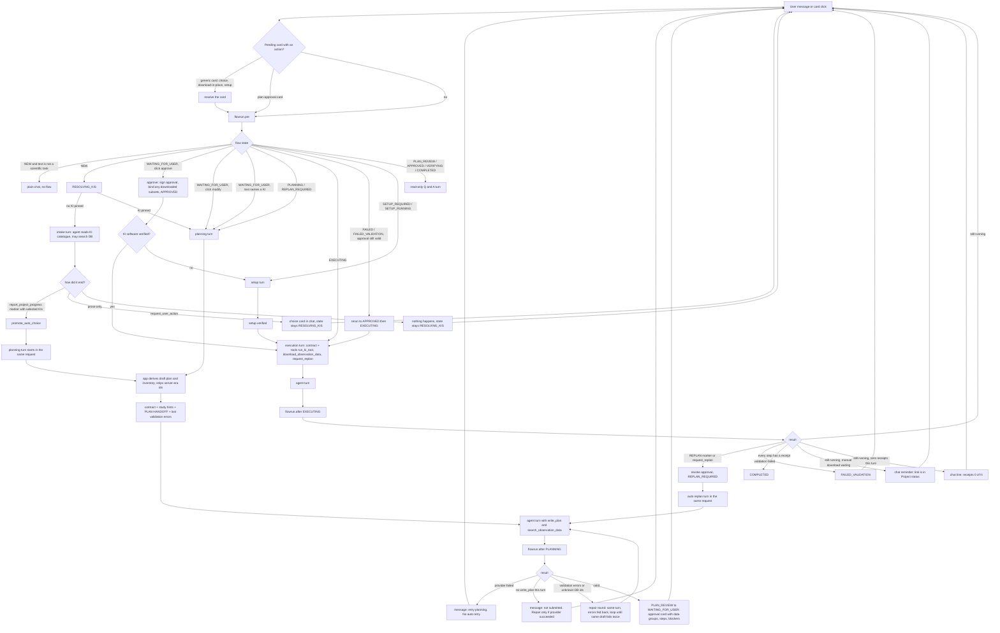
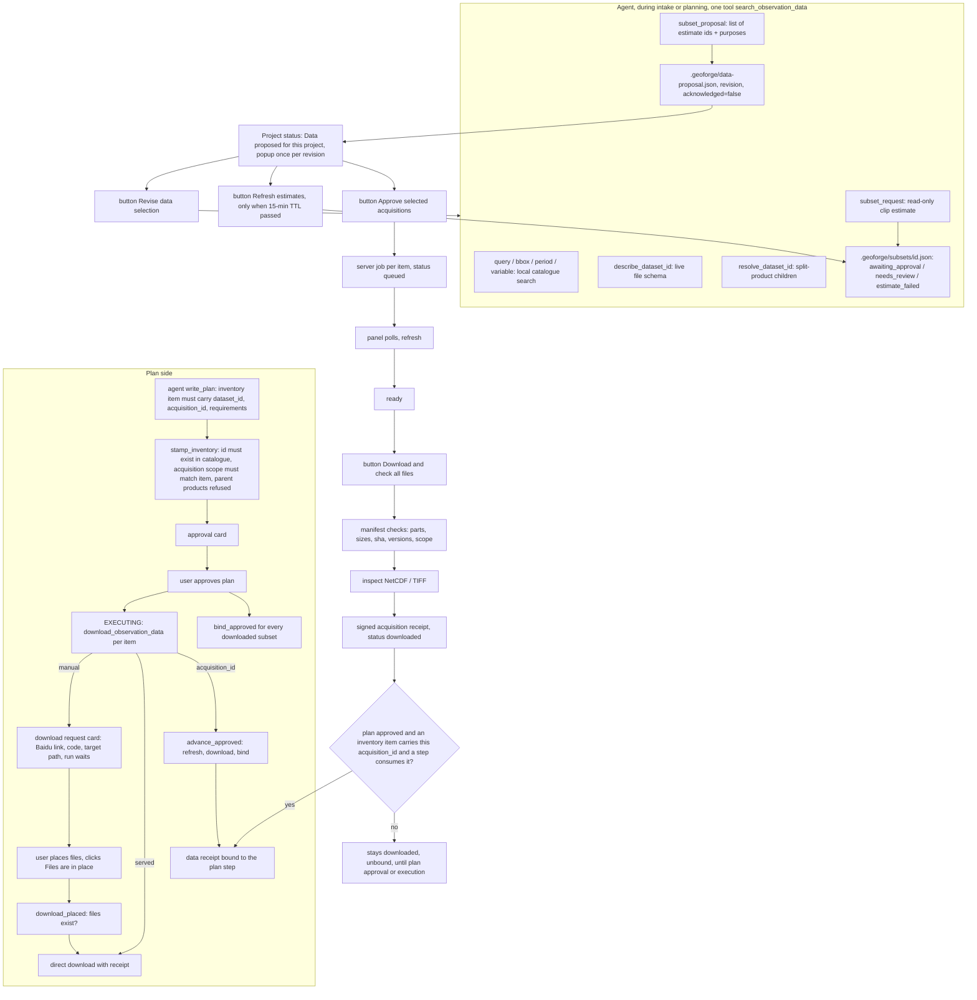

# GeoForge Desktop: how one chat turn actually runs today (as-is, from code)

Read on 2026-09-16 from `kiss/kiss_cli/gui.py` (chat handler), `kiss/kiss_cli/flowrun.py`
(`pre`, `turn`, `after`), `ki_tools_common/.../flow/states.py` (state table), `policy.py`
(tools per state), `kiss/kiss_cli/obs_subset.py` + `data_proposal.py` (subset side path).
This is what the code does, not what we want it to do.

## 1. The main loop: one user message

## 2. The data side path (runs beside the state machine, not inside it)

## 3. Exact sequence, in words

1. A message arrives. If a generic card is pending and the message carries the click, the click is resolved first. The plan-approval card is not resolved here; it is passed to the flow.
2. `pre()` looks at the state. On an approve click it signs the approval, binds any subset already downloaded, moves to APPROVED, and to EXECUTING if the KI software is verified, otherwise to SETUP_REQUIRED. On a modify click it goes back to PLANNING with the note as the reason.
3. NEW with a non-scientific message is plain chat. NEW with a scientific message becomes RESOLVING_KIS. With no KI pinned, an intake turn runs. The agent must end it with a hidden marker naming the KI, or with a choice card. If it ends with prose, nothing happens and the next message starts intake again.
4. Once a KI is chosen, planning starts inside the same request. The app derives a draft plan and inventory, feeds the contract, the study hints from the local catalogue, the "save both files" instruction, and the last validation errors. CLI providers get a scratch copy of the project. API providers get `write_plan`.
5. `after()` for planning: provider failure prints "retry planning" and stops. No `write_plan` prints "not submitted" and, only if the provider did not fail, starts a repair round. Validation errors and unknown catalogue ids start repair rounds until the same draft fails twice. A valid plan produces the approval card and the state becomes WAITING_FOR_USER. There is no auto-approval.
6. Execution turns get the execution contract and the run tools. `after()` for execution: a replan marker revokes the approval and starts a replan turn immediately. Validation failure lands in FAILED_VALIDATION; the next user message reruns under the same approval. All receipts present ends in COMPLETED. Otherwise the chat gets a reminder if a manual download is waiting, or a "0 receipts" line if the agent ran nothing.
7. The subset path is separate. The agent can estimate any time it has the search tool, publish a proposal, and the user gets a second approval in Project status. Jobs, downloads and receipts happen there. They join the plan only if the agent copied the acquisition id into the inventory item and the plan is approved.

## 4. Where the seams are (facts, not opinions)

- Two approvals: plan card in chat, acquisition button in Project status. Either can come first.
- The join between them is a string the agent copies by hand (`acquisition_id`).
- Estimates expire after 15 minutes; a refresh creates new ids, which the plan does not know.
- One tool, `search_observation_data`, has five modes chosen by which optional field is filled.
- An intake or planning turn that ends in prose is not an error to the agent; it is only reported to the user afterwards.
- A provider timeout in planning is reported, not retried.
- Data status is read from five places: subset state files, `data-proposal.json`, `data-inventory.json`, `inventory-updates.jsonl`, receipts.
- Project status has six data sections: needs-you request, proposal, active jobs, exploration history, manual estimate form, data in this plan.
