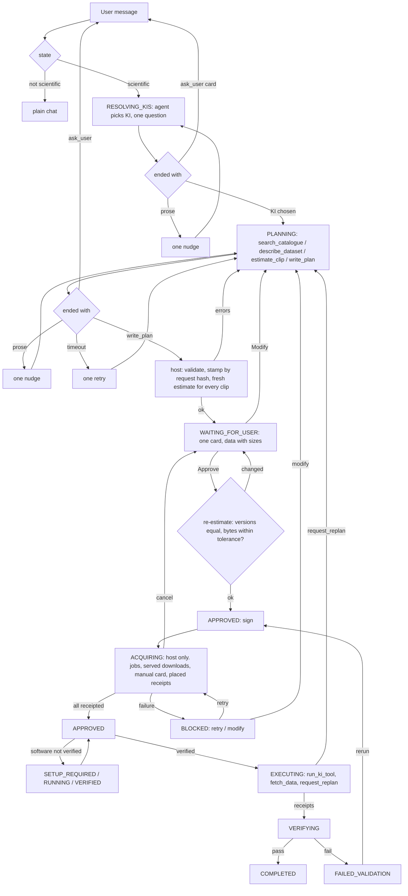

# GeoForge Desktop: target flow, one state machine, data inside it

Companion to `FLOW-AS-IS-2026-09-16.md`. Decision 2026-09-17 (user): merge the plan flow and
the data-proposal flow into one flow. This is the proposal for what that one flow is.

## The one flow

## Revisions after the independent review (2026-09-17, accepted)

1. Re-estimate **before** the card and again at the Approve click, never after signing. If versions or size
   (beyond +10 % or 16 MB) changed, the card comes back unsigned. `ESTIMATE_TTL_SECONDS` is deleted.
2. ACQUIRING sits between APPROVED and the setup gate and **returns to APPROVED** when every item has a
   receipt, mirroring SETUP_VERIFIED. Moves: `acquire`, `acquired` (evidence `data_receipted`), `cancel` →
   WAITING_FOR_USER, `acquisition_failed` → BLOCKED (Retry / Modify), `retry_acquire`. Host only; restart resumes.
3. Manual (Baidu) datasets get a **signed placed-file receipt** when the user clicks "Files are in place".
   One request card carries N rows. (This also fixes a live bug: placed files block COMPLETED today.)
4. The host never writes into `runs/data-inventory.json` after approval. Progress lives in a host-owned
   `.geoforge/acquisition.json`, which replaces `data-proposal.json`, `inventory-updates.jsonl` and
   `data-binding-status.json`. Estimate files under `.geoforge/subsets/` stay as the log.
5. Items join estimates by `acquisition_request_sha256` (content hash of the request), not by uuid.
6. `estimate_clip` is allowed in intake, capped at 5 per turn. `fetch_data` stays in EXECUTING for public URLs.
7. Step 1 adds the four tools next to the old one; the old tool is removed in step 2.
8. Effort: 8 days (1.5 / 1.5 / 3 / 1.5 / 0.5), not 3.

## What changes, in one line each

| Area | As-is | Target |
|---|---|---|
| Approvals | two: plan card in chat, acquisition button in Project status | one: the plan card. Approving the plan approves its data |
| Proposal | separate `data-proposal.json`, agent copies `acquisition_id` into inventory by hand | the inventory *is* the proposal. `write_plan` items name an estimate; the host fills delivery, size, scope |
| Who downloads | agent, during EXECUTING, tool by tool | the host, in ACQUIRING (APPROVED → ACQUIRING → APPROVED), no agent turn |
| Expiry | 15-min TTL, user clicks Refresh, ids change | host re-estimates before the card and at the Approve click; a changed size or version re-issues the card before signing |
| Agent tools for data | one tool with five modes | four tools: `search_catalogue`, `describe_dataset`, `estimate_clip`, and `write_plan`; `resolve` folds into search |
| Turn ending | prose is legal | intake and planning turns must end with a tool call; prose gets one nudge; timeout gets one retry |
| Data state | five files | inventory (approved, hashed) + `.geoforge/acquisition.json` (host progress) + receipts (proof); estimate files are a log |
| Project status | six data sections | three: Needs you · Data in this plan · Progress. Everything else under a collapsed technical log |
| Manual datasets | request card mid-execution | surfaced in ACQUIRING before any step runs; the same card |

## What stays

- The state table, receipts, approval signing, tool policy per state, KI contracts.
- The subset client (`obs_subset.py`, `data_contract.py`): estimate, job, manifest checks, inspection, receipts. It moves from "user-driven panel" to "host-driven step".
- The study hints, catalogue store, describe, stamp_inventory.
- Baidu handoff card, "files are in place" check.

## What goes

- `data_proposal.py` and its routes, the proposal popup, Refresh / Approve selected / Revise buttons.
- The exploration-history and manual-estimate panels (kept as a technical log entry).
- `download_observation_data` as an agent tool in EXECUTING; data is already there when EXECUTING starts.
- `subset_request` / `subset_proposal` / `describe_dataset_id` modes on the search tool.

## Progress

- Step 1 done 2026-09-17: four tools, prose-only nudge, transport retry. Live: intake ends with a card, planning ends with write_plan.
- Step 2 done 2026-09-17: host join by requirements/hash, re-estimate before card and at approve, approval creates jobs, proposal path removed. Live (DSSAT wheat, Harbin): plan passed first time, card showed the 502 KB clip, Approve created job, replan kept the clip bound.
- Step 3 done 2026-09-18: ACQUIRING (APPROVED→ACQUIRING→APPROVED), host acquire.py, acquisition.json, manual N-row card + placed receipt, BLOCKED retry/modify, poll-driven resume, legacy EXECUTING convergence. Live (DSSAT wheat): 4 inputs receipted, clip of 176 parts, two renamed items rebound; three real bugs found and fixed (per-part budget, rename re-bind, archive deleted by failed retry).
- Independent code review of steps 1–3 done 2026-09-18 (`FLOW-STEPS-1-3-REVIEW-2026-09-18.md`): 3 blockers and 13 of 15 should-fixes resolved the same day; manual path re-verified against the live server with the real client.
- Next: step 4 (Project status: three data blocks, i18n of host strings, dismissed-card reopen is already in).

## Order of work

1. New tools split + turn-ending rule + timeout retry. Small, independent, fixes the "essay instead of plan" problem on its own.
2. `write_plan` accepts estimate ids on items; host stamps them; approval card shows clip sizes. Remove the proposal file and popup.
3. ACQUIRING state: host runs jobs/downloads/manual card after approval, before EXECUTING.
4. Project status reduced to three data blocks.
5. Delete dead code and tests; update contracts and KI docs.

Estimate: 8 days. Step 1 is 1.5 days and ships first.