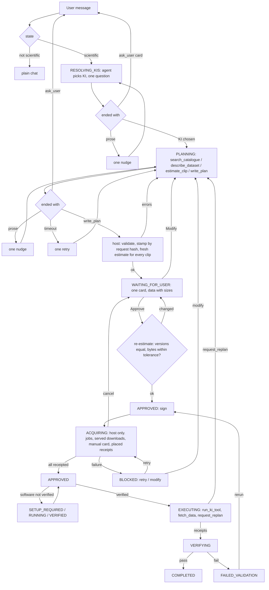

# Review of FLOW-TARGET-2026-09-17 (independent, from code)

Reviewer read: `FLOW-AS-IS-2026-09-16.md`, `FLOW-TARGET-2026-09-17.md`, then
`ki_tools_common/flow/{states,policy,plan,approval,receipts,contracts}.py`,
`kiss_cli/{flowrun,flowgate,gui,api,obs_subset,data_contract,data_proposal,obs_access,setup,cli}.py`,
the GeoForge_Database KI tool, and the tests (`kiss/tests/test_flowrun.py`, `test_flowgate.py`,
`test_obs_subset.py`, `test_data_proposal*.py`, `ki_tools_common/tests/flow/`). Baseline:
159 flow/data tests pass on `mac-version`. Line numbers below are from that tree.

## Verdict

Adopt with changes. The direction is right and most of it is already latent in the code
(`stamp_item`, `acquisition_request_sha256`, `bind_approved`, the SETUP sub-flow pattern), so
the merge is cheaper than a rewrite. Three things in the proposal as written would break the
approval-hash model or violate the receipt constraint, and they must be redesigned before
coding: re-estimating *after* approval, host-writing acquisition results into the approved
inventory, and "sign receipts" for manual datasets when no such receipt exists today.

## Blocking issues

### B1. Re-estimate after approval collides with the approval hash. Move it before the card.

**What.** The proposal says the host re-estimates stale clips in ACQUIRING and "only if size
or scope changed does the card come back".

**Why it breaks.** The approval is an HMAC over `sha256(plan)` and `sha256(inventory)`
(`approval.py:81-82`), `check()` returns `DRIFT` on any inventory byte change
(`approval.py:132`), and the EXECUTING turn turns DRIFT into a forced replan
(`flowrun.py:494-498`). `stamp_item` writes the whole `acquisition_offer` (which includes
`estimate_sha256`) and `catalogue.size` into the item (`obs_subset.py:142-147`), so a
re-estimate that changes *any* estimate field, even a `processor_version` bump with identical
bytes, changes the inventory hash. The approve click also verifies the card's own
`plan_sha256`/`inventory_sha256` against disk (`flowrun.py:283-286`) and bounces to "modify"
on mismatch. There is no place after APPROVED where the host can legally touch
`runs/data-inventory.json`.

**Proposed change.**
- Re-estimate **before** the card, in the PLANNING branch of `after()`, right where
  `stamp_inventory` already runs (`flowrun.py:881-884`). The card therefore always shows an
  estimate that is seconds old. Delete `ESTIMATE_TTL_SECONDS`.
- On the approve click (`pre()`), do one more estimate per clip item and compare:
  `request_sha256` equal (it always is; the request is canonical), `source_version` and
  `processing_version` equal, `estimated_output_bytes` within +10 % or 16 MB (whichever is
  larger), `coverage_complete` still true, no new blockers. If it passes, approve. If not,
  re-stamp, rewrite `runs/plan-review.json`, re-issue the card, stay in WAITING_FOR_USER,
  and say in the card what changed. That is the only "card comes back" path, and it happens
  before any signature exists.
- After APPROVED, never re-estimate. The download-time guards that already exist are the
  post-approval safety net: version equality (`obs_subset.py:424-426`) and the 2x+1 MB budget
  (`obs_subset.py:445`). A failure there is an acquisition failure (see B2), not a re-review.
- Keep the estimate out of the approval hash: stamp only `acquisition_request_sha256`,
  `delivery`, `catalogue.size` and a short `estimate_summary` (bytes, n_parts, versions).
  `selection_sha256` already excludes the estimate (`receipts.py:168-180`); the stamp should
  match that discipline.

### B2. ACQUIRING as specified has no transition table, no restart story, and would trip the rerun path.

**What.** The diagram shows ACQUIRING going to SETUP then EXECUTING, with "card comes back"
and manual-wait arrows, but names no events, no evidence keys and no failure moves.

**Why it matters.** `transition()` refuses any move not in `_MOVES` (`states.py:151-156`);
`FAILED --rerun--> APPROVED --execution_started--> EXECUTING` (`states.py:124,134-135`) is used
by `turn()` (`flowrun.py:488-493`); `setup_verified()` goes SETUP_VERIFIED → APPROVED → EXECUTING
(`flowrun.py:1159-1169`). Any new state must sit in that path or those callers break. A test
already pins the shape of `_MOVES` (`test_flow_core.py:71`).

**Proposed change.** Insert ACQUIRING between APPROVED and the existing gate, and return to
APPROVED when done, exactly like SETUP_VERIFIED does (`states.py:143`). Host-only; agents
never run in it.

```
(APPROVED,   "acquire")         -> (ACQUIRING, "approval")        # host, right after approve/rerun
(ACQUIRING,  "acquired")        -> (APPROVED,  "data_receipted")  # every non-generated item has a bound receipt
(ACQUIRING,  "cancel")          -> (WAITING_FOR_USER, None)       # user cancels; host revokes approval, cancels jobs
(ACQUIRING,  "acquisition_failed") -> (BLOCKED, None)             # server/job/manifest failure; card with retry / modify
(BLOCKED,    "retry_acquire")   -> (ACQUIRING, "approval")
(BLOCKED,    "unblocked")       -> (PLANNING, None)               # exists; approval revoked
```

Evidence key `data_receipted`: `all(item has a verified download receipt bound to this
approval or a still-valid selection)` for items with `delivery in {served, subset, manual}`;
computed by the host from receipts, never from prose. `ALLOWED[ACQUIRING] = _R`,
`API_TOOLS_BY_STATE[ACQUIRING] = _BASE_API`, `DISPLAY_STAGE[ACQUIRING] = "researching"`
(label already exists: "Finding suitable data", `projectrun.py:25-35`).

Then `_start_execution` becomes: APPROVED → (acquire if anything is unreceipted) → setup gate →
EXECUTING. Because the "acquired" move lands on APPROVED, the setup gate, the FAILED→rerun
path and `setup_verified()` are untouched. A rerun re-enters ACQUIRING and passes through
immediately because `_download_still_valid` (`receipts.py:513-519`) and `download()` on a
`downloaded` state (`obs_subset.py:388-392`) are idempotent.

Per-case answers:
- **Partial failure.** Stay in ACQUIRING; per-item status in the host file (B4); after the
  batch, if any item is failed → `acquisition_failed` → BLOCKED with a card: Retry / Modify
  plan. Never auto-FAILED: `FAILED --rerun` needs `approval == OK`, which would loop.
- **User cancels.** `cancel` → WAITING_FOR_USER; host calls `obs_subset.cancel` on live jobs
  (`obs_subset.py:372-380`) and `approval.revoke`. Downloads already receipted stay valid for
  a later identical selection (`receipts.py:546-548`).
- **App restart mid-acquisition.** `flow-state.json` says ACQUIRING; on the next chat turn or
  Project-status poll the host resumes the same routine. Every step is idempotent: `refresh`
  polls, `download` refuses to overwrite (`obs_subset.py:454-455`), the download temp dir is
  under `inputs/geoforge_subsets/.subset-*` and is discarded. A served download in flight is
  lost and simply re-fetched (100 MB cap, `obs_access.py:29`). Document this; no journal needed.
- **Clip whose re-estimate changed size.** Does not happen after approval (B1). A manifest
  that exceeds budget at download time is `acquisition_failed` with the message from
  `obs_subset.py:445-446`.
- **Manual dataset placed, checksum unknown.** See B3: the host hashes what was placed and
  signs that; "unknown server checksum" is a fact on the receipt, not a blocker.
- **SETUP after ACQUIRING.** Acceptable, because download receipts survive a replan when the
  selection is unchanged (`receipts.py:546-548`), so a setup failure that forces a KI change
  does not waste the data. The cost is that a user with an uninstalled model waits for a
  2 GB clip before learning the software will not build; mitigate by running the preflight
  probe (read-only, `run_preflight`) at approve time and warning on the card.
- **Host-driven acquisition vs `ALLOWED` and signing.** Compatible. `record_download` needs
  only `approval_sha256` (`receipts.py:183-190`), which the host has from APPROVED onward.
  `bind_approved` requires `approval.check == OK` (`obs_subset.py:184`), which holds as long as
  the host does not touch the plan files (B4). The capability table governs agents; the host
  is not a capability holder, which is the same footing `bind_approved` and `setup_verified`
  already have.

### B3. Manual (Baidu) datasets have no receipt today, and the proposal does not add one.

**What.** The proposal says ACQUIRING will "download served + clips, verify, sign receipts"
and that manual datasets use "the same card". It does not say a receipt is written when the
user clicks "Files are in place".

**Why it matters.** `record_download` is called only from `flowgate.fetch`,
`flowgate.fetch_observation` (served branch) and `obs_subset.bind_approved`. The manual path
ends at `download_placed` (`setup.py:252-257`), a non-empty-file check. Worse, `evidence()`
scans `inputs/` for `.nc/.csv/.tif/...` files that no receipt names and refuses COMPLETED
while any exist (`receipts.py:522-525, 581-590, 601`). A Baidu dataset placed at
`inputs/observations/<id>/` is therefore an "unreceipted artifact" that makes the project
un-completable. This is a live bug, not just a proposal gap; `test_flowrun.py:1025-1049`
stops before COMPLETED so it never sees it.

**Proposed change.** On "Files are in place" in ACQUIRING the host: verifies
`download_placed`, hashes every file under `expected_path`, and writes
`record_download(item_id, source="manual placement", request_url="", http_status=None,
raw_files=[...], approval_sha256=..., plan_step_id=<consuming step>, inventory_item=item)`.
`_download_files_valid` then re-checks those hashes on every evidence pass, so a swapped
file is caught. The Baidu URL and extraction code never enter the receipt (they are only in
`setup-request.json`, as today). Add one test: manual item → placed → receipt → COMPLETED.

Also: `setup-request.json` is a single slot at the project root (`setup.py:29,106-137`).
Two manual datasets, or a manual dataset plus a BLOCKED retry card, cannot coexist. Either
serialise (one card at a time, stated in the design) or make one card carry N paths.
Recommend one card, N rows, one "Files are in place" click that verifies all rows.

### B4. Host must not write acquisition results into `runs/data-inventory.json`.

**What.** "One file: `runs/data-inventory.json` carries the item and its acquisition".

**Why it breaks.** Same hash problem as B1, plus `policy.py:34-35,113-114`: the plan files are
agent-writable in PLANNING/REPLAN_REQUIRED and protected otherwise; `.geoforge` is always
protected. Making the inventory host-written after approval means either the approval hash
covers a moving file or the host keeps a second unhashed copy, which is the five-file mess
again. `inventory-updates.jsonl` is already write-only dead code (three writers, zero readers).

**Proposed layout.**

| File | Owner | Writable when | Hashed by approval |
|---|---|---|---|
| `runs/plan.json` | agent (host stamps before card) | PLANNING, REPLAN_REQUIRED | yes |
| `runs/data-inventory.json` | agent (host stamps before card) | PLANNING, REPLAN_REQUIRED | yes |
| `.geoforge/acquisition.json` | host | ACQUIRING, "files in place" click | no |
| `.geoforge/subsets/<id>.json` | host | estimate/job lifecycle | no (log) |
| `.geoforge/receipts/data-receipts/*.json` | host, signed | ACQUIRING, EXECUTING (fetch_data) | binds to it |

`acquisition.json` = `{approval_sha256, items: {item_id: {kind, status, job_id?,
received_bytes?, receipt?, error?, updated_at}}}`, replacing `inventory-updates.jsonl`,
`.geoforge/data-binding-status.json` and `.geoforge/data-proposal.json`.
`plan_data_status()` then reads three things with distinct roles: inventory (what was
approved), acquisition.json (progress), receipts (proof). The `.geoforge/subsets/` files stay
as-is: they already hold the signed job authorization (`obs_subset.py:346-349`) and are the
right log.

## Non-blocking recommendations

1. **Join key.** Use `acquisition_request_sha256` (= `data_contract.fingerprint(request)`,
   already computed at `obs_subset.py:139`) as the item's binding, and keep `acquisition_id`
   as a pointer to the latest estimate file for that hash. `estimate_clip` returns both. The
   host stamps by hash: an old id from a previous planning round is fine as long as the hash
   matches; a stale id whose hash does not match is a validation error with the current id
   named. This also matches the server's own contract ("idempotency key bound to the
   canonical request", `docs/issues/GEODATA-CLIPPING-SERVICE-REQUEST-2026-09-14.md:36-37`).
2. **Two items, one estimate.** Reject in `validate`/stamp, as `data_proposal.publish`
   already did (`data_proposal.py:96-98`). One download is one item; the agent can list the
   same item as an input of several steps.
3. **`estimate_clip` in intake.** Allow it. It is read-only, project-scoped, and the intake
   turn already gets the search adapter for the same reason (`policy.py:284-289`,
   `flowrun.py:1214-1223`). Availability and size change the KI choice and the first question.
   Cap it (e.g. 5 estimates per intake turn) so a curious agent does not hammer the server.
4. **Turn-ending rule placement.** API providers: inside the `api.run` loop, using the
   existing one-retry pattern at `api.py:2037-2061`; condition "state in
   {RESOLVING_KIS, PLANNING, REPLAN_REQUIRED} and this turn produced neither
   `plan_submission` nor a `request_user_action` nor an intake marker". CLI providers: the
   nudge *is* the existing repair round (`flowrun.py:869-874` + `gui.py:3384-3400`), which
   replays the full prompt in a fresh process (planning fingerprints carry a uuid,
   `flowrun.py:486`); cap it at one round for the "nothing saved" case. Timeout retry:
   in `gui._stream_session_chat` after `_chat_with_models`, when `provider_succeeded is False`
   and the failure is a transport timeout, once. Guard the ask-every-turn loop with a counter
   in `flow-state.json` (`consecutive_questions`), and at 3 tell the user the agent cannot
   converge and offer Modify.
5. **`download_observation_data` removal.** Valid, on two conditions: replan re-enters
   ACQUIRING (so an added dataset is fetched by the host), and `fetch_data` stays in EXECUTING
   for the public-URL case the contracts already promise (`contracts.py:269-271`). Run-time
   fetches inside a KI tool (NASA POWER) happen under the run receipt and are unaffected. Also
   drop `obs-download` from `_post_agent_flow_command` (`gui.py:962`).
6. **Extract the flow-turn loop.** `_stream_session_chat` calls `_chat_with_models` +
   `after()` in four copy-pasted blocks (`gui.py:3323-3405`); ACQUIRING would add a fifth
   trigger. One `_flow_turn(flow_pre)` helper before touching this.
7. **Move flow cards out of the agent-writable slot.** `setup-request.json` sits at the
   project root and CLI agents write it directly (`setup.py:69-75`). The approval card lives
   there too. The `plan_sha256` check in `pre()` prevents forged approval, but an agent can
   clear or overwrite the card. Put the plan card and the acquisition cards under
   `.geoforge/requests/` (protected) and leave `setup-request.json` for the setup sub-flow.
8. **Delete `ESTIMATE_TTL_SECONDS`.** It is a client-side guess (`obs_subset.py:24,339`)
   with no server contract behind it; B1 makes it redundant.

## Answers to the ten questions

1. **State machine.** Sound if ACQUIRING returns to APPROVED (B2 table) rather than jumping to
   SETUP/EXECUTING, so the setup gate and rerun paths keep working. Evidence key
   `data_receipted`. Partial failure → BLOCKED with retry; cancel → WAITING_FOR_USER + revoke;
   restart → resume idempotently; size change is impossible after approval (B1); manual =
   placed receipt (B3); SETUP after ACQUIRING is acceptable given receipt reuse. Host-driven
   acquisition is compatible with `ALLOWED` (agents read-only) and signing (host holds
   `approval_sha256`).
2. **Inventory is the proposal.** Yes, with a content-hash join (`acquisition_request_sha256`)
   not a uuid; `stamp_item` already enforces dataset/bbox/period/variable agreement
   (`obs_subset.py:117-135`). Estimate mutated between write_plan and approval: re-stamp before
   card handles it. Previous-round ids: hash match or error. Two items one estimate: reject.
   dataset_id without estimate: the existing regular path in `stamp_inventory`
   (`obs_access.py:1185-1228`) already covers served and manual; keep it.
3. **Re-estimate vs TTL.** Trigger: approve click; compare versions equal, bytes within
   +10 %/16 MB, coverage complete, no blockers. Loop hazard: bounded because a second
   mismatch on the same request is surfaced as a server instability and the card offers
   Modify; never auto-approve. It conflicts with the approval hash only if done after
   signing, so do it before (B1).
4. **Tool split.** Four is right; fold `resolve` into `search_catalogue` as a `parent` filter.
   `estimate_clip` allowed in intake, capped. The CLI bridge (`_DATABASE_HELPER`,
   `search_catalogue.py`) mirrors all four with `--describe`, `--subset`; only `--propose`
   dies. The route at `gui.py:1607-1614` already serves estimates by `cwd`, so codex/kimi
   planning worktrees keep working (`_database_project` walks ancestors, `gui.py:909-918`).
5. **Turn-ending rule.** `api.run` loop for API; `after()` + capped repair round for CLI;
   timeout retry in `gui`. For CLI the "tool call" is the plan-file save in the worktree, which
   `after()` already detects via `_plan_versions` (`flowrun.py:865-866`). Failure modes and
   guards in recommendation 4. Cost: each CLI nudge is a full prompt replay (KI contracts +
   study hints); one is affordable, two is not.
6. **Removing `download_observation_data` from EXECUTING.** Valid with replan → ACQUIRING and
   `fetch_data` kept. Discovered-as-needed data is by definition a replan
   (`contracts.py:295-304` already says so).
7. **State file consolidation.** Not into the inventory (B4). Layout in B4: two
   agent/hashed files, one host progress file, the subset log, receipts.
8. **Migration.** `data-proposal.json`: ignore, leave on disk, remove routes.
   `.geoforge/subsets/*.json`: unchanged format, still the estimate/job log. Old inventories
   with `acquisition_id` but no `acquisition_request_sha256`: `stamp_item` computes it
   (`obs_subset.py:139-141`), no shim. `inventory-updates.jsonl`: dead, delete. Sessions
   already EXECUTING with unreceipted served/subset items: make the EXECUTING branch of
   `turn()` call the same host `acquire()` routine when any item lacks a receipt (this is also
   the replan-adds-a-dataset path), so old projects converge without a version flag. Sessions
   in WAITING_FOR_USER with a card that carries the old `review` hashes keep working because
   `pre()` compares against disk.
9. **Order of work.** Step 1 is shippable only if the four new tools are *added* and
   `search_observation_data(subset_proposal=...)` is left alive until step 2, otherwise no
   clip can be approved in between. The turn-ending rule and timeout retry are independent.
   Missing from the list: contract text (`contracts.py:105-123` names the old tool and
   `acquisition_id`), intake rules text (`gui.py:3587-3600`), GeoForge_Database `SKILL.md`,
   `_DATABASE_HELPER` argparse, `cli.py` obs-search/obs-download, i18n (`app.html` has zh/en
   ternaries on every card string), the manual receipt (B3), and tests for restart/cancel.
   Effort re-estimate below.
10. **Unaddressed smells.**
    - `obs_subset.download` calls `_save` (fsync + rename) per 1 MB chunk
      (`obs_subset.py:474-475`, `_atomic_json` at `obs_access.py:1049-1061`): 2048 fsyncs for a
      2 GB clip. Throttle to once per second or per 64 MB.
    - Per-project locks in `obs_subset`/`data_proposal` are per-process, but CLI wrappers run
      `obs-download` in a subprocess (`gui.py:975-985`), so a UI-thread `download` and a
      wrapper `advance_approved` on the same id are not mutually excluded; today only
      `target.exists()` saves you. Host-only acquisition removes the race; say so in the
      design. The `_LOCKS` dicts also never shrink.
    - `plan.write_artifacts` is a plain `write_text` (`plan.py:823-829`) while `states.save`
      and `approval.approve` are atomic; a Project-status poll can read half a plan.
    - `evidence()` counts placed inputs as unreceipted artifacts (B3); it also lists run
      receipt `inputs` nowhere, so any input file that is not a download output blocks
      COMPLETED. Consider excluding `inputs/` from the artifact scan once every input is
      receipted by the host.
    - `after()` can throw between `fs.move("run_finished")` and `fs.move("validation_failed")`
      (`flowrun.py:932-933`); the gui prints "could not close the turn" and leaves VERIFYING.
    - Worktree planning: `after()` rejects a submission if the project's plan files changed
      during the turn (`flowrun.py:885-886`). Any host stamping during a planning turn would
      false-trigger this; keep host writes to `after()` only.

## Revised diagram

The state machine should differ from the proposal: ACQUIRING returns to APPROVED, "card comes
back" happens before approval, and cancel/failure moves exist.



## Revised effort estimate

| Step | Proposal | Honest |
|---|---|---|
| 1. Four tools (added, old tool deprecated not removed), CLI helper + KI tool, contracts/intake text, turn-ending rule for API, capped CLI repair, timeout retry, tests | 0.5 d | 1.5 d |
| 2. Hash-based stamp, re-estimate before card and at approve click, card shows sizes, remove proposal routes/popup/TTL | 1 d | 1.5 d |
| 3. ACQUIRING: `_MOVES` + tables, host `acquire()` routine, `acquisition.json`, manual placed receipt, N-row manual card, cancel/retry/restart, EXECUTING convergence for old sessions, tests | 1 d | 3 d |
| 4. Project status to three blocks, zh/en strings, `plan_data_status` on the new files | 0.5 d | 1.5 d |
| 5. Delete `data_proposal.py`, `inventory-updates.jsonl`, dead routes/tests; SKILL.md and KI docs | trivial | 0.5 d |
| Total | 3 d | 8 d |

Order stands, with the caveat in Q9. Ship step 1 first; it fixes the essay-instead-of-plan
problem on its own and touches no state.
