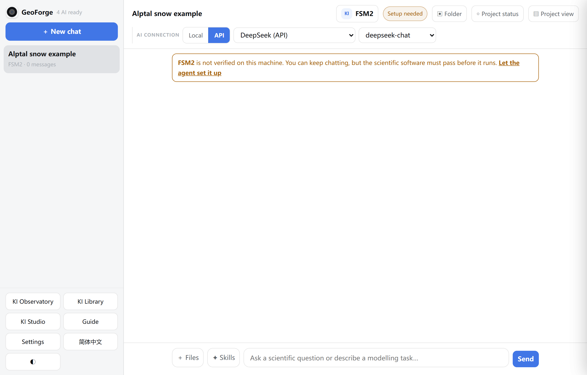
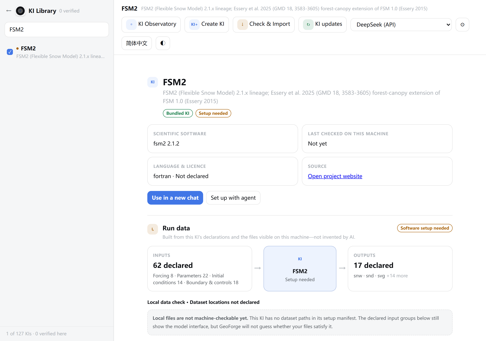
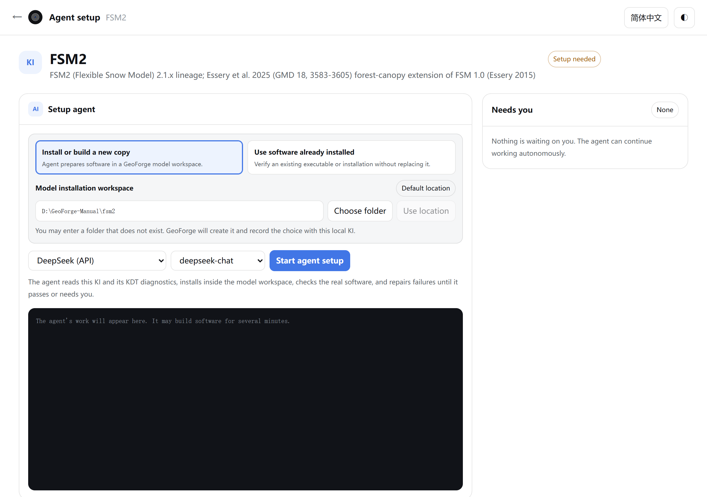
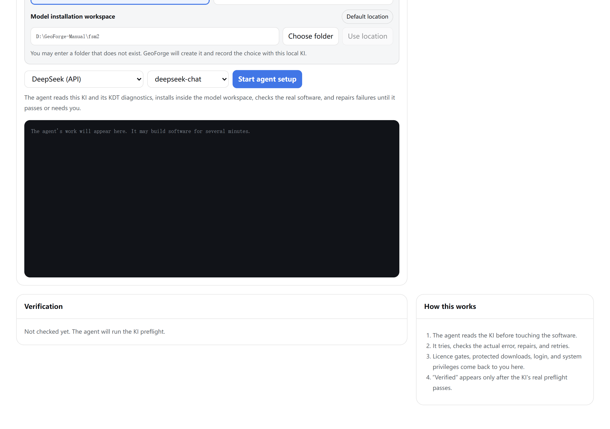
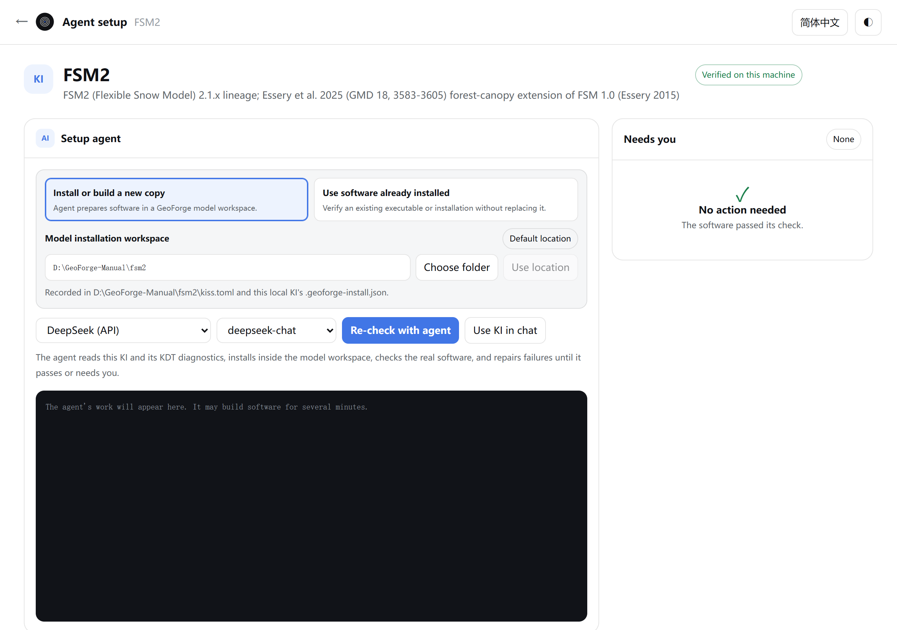
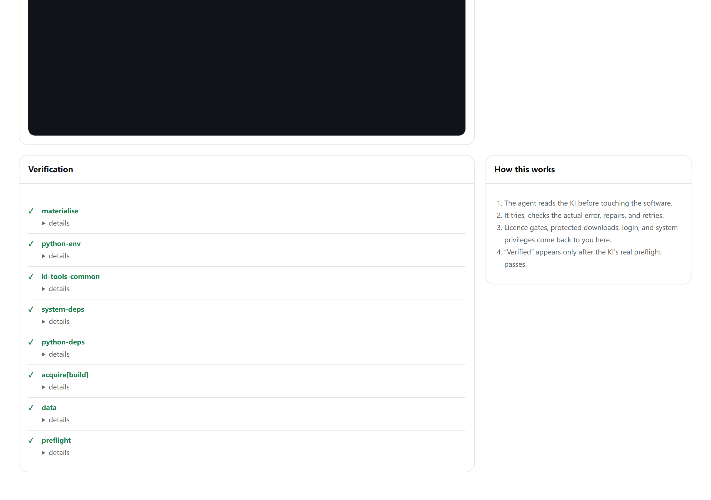
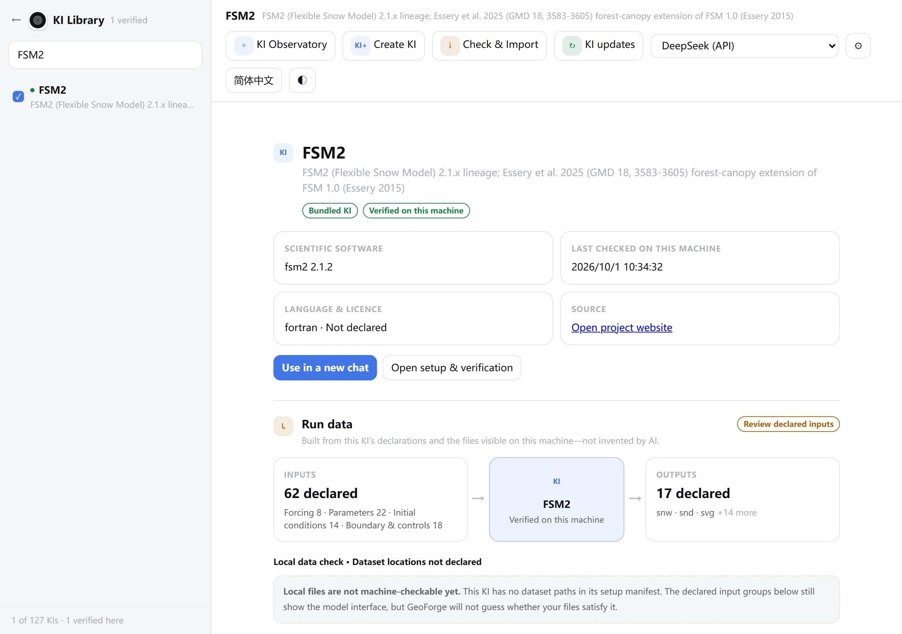

# 4 Install a scientific model

In this chapter you will get a model's software running on your computer, either inside a project after you approve a plan or ahead of time on the **Agent setup** page, read what **Verified on this machine** means, and choose the KI for a chat.

The examples use FSM2, the snow model of the worked example in Chapter 5, with **DeepSeek (API)**. That is the combination tested end to end on Windows in 0.6.54.

## KIs and model software

GeoForge keeps two things apart for every model:

| | The KI | The model software |
|---|---|---|
| What it is | GeoForge's package of checked knowledge about one model: how to install it, prepare its inputs, run it and check it | The scientific program itself, for example `FSM2.exe` |
| Where it comes from | Ships with GeoForge (127 KIs in 0.6.54), or you import it (Chapter 7) | An agent downloads or builds it on your computer, from the official source the KI names |
| Size, for FSM2 | Under 1 MB | About 1.1 GB in the Windows test, almost all of it the private compiler used to build it |

The FSM2 KI holds instructions for the agent, four tools (to convert forcing data and soil parameters, to run FSM2 and to read its output), a list of known errors with their fixes, Windows installation notes and a Windows recipe, and a start-up check. It does not hold the FSM2 program. Installing GeoForge installs no model software.

A KI that came with GeoForge, or with an official KI library update, carries the badge **Bundled KI** in the **KI Library**.

### The software state of a KI

Each KI shows the state of its software on this computer. You see it as a coloured dot before the name in the **KI Library**, as a label in the chat's KI picker, and as a pill next to the KI name in the chat header.

| Label | Dot | Meaning |
|---|---|---|
| **Verified on this machine** | green | The model software passed the KI's final check on this computer. |
| **Setup needed** | orange | Not verified here yet. The agent works out the installation from the KI. |
| **Ready to set up** | orange | Not verified here yet. The KI carries an installation recipe that has been seen to work. |
| **Manual setup** | orange | Not verified here yet. GeoForge cannot fetch the software by itself, so expect to supply some of it yourself. |
| **Verification failed** | red | The last check on this computer failed. Set the software up again. |

For APEX only, **Recheck APEX0806** means an earlier check tested a different APEX version. Set it up again.

1. Click **KI Library** at the bottom of the sidebar.

    

    Check the line at the bottom of the list, here **127 of 127 KIs · 0 verified here**, and the orange dot before every name. On a new installation no model software is verified yet. That is normal.

Verification belongs to one computer. GeoForge saves the result with the installed software, in that model's installation folder. Another computer, another Windows user account or another installation folder starts again at **Setup needed**. On the other hand, once a model is verified, every project on this computer uses the same installation: you set each model up once.

## Two ways to set up the software

| | Inside a project | Ahead of time |
|---|---|---|
| When | After you click **Approve and start** on a plan | Whenever you like, before any project |
| How it starts | GeoForge starts it after your approval, once the approved data are in | **KI Library** → **Set up with agent**, or the chat banner's **Let the agent set it up** |
| Which AI does the work | The chat's AI | The AI you choose on the **Agent setup** page |
| Installation folder | The KI's recorded folder; by default `C:\Users\you\kiss\fsm2` | You can choose the folder, or point to software you already have |
| Where you follow it | The chat, the activity bar and **◇ Project status** | The log and the **Needs you** box on the **Agent setup** page |
| How to stop it | **Stop** in the activity bar | The page has no Stop button; exit GeoForge |
| Afterwards | GeoForge starts your approved run | The KI shows **Verified on this machine** for all later projects |

Both ways use the same installation folder, run the same final check and save the same record. Setting up costs AI usage on the chosen AI, like any other agent work.

Set up ahead of time when you want another folder or drive, want GeoForge to use software you already have, want a different AI for the installation, or simply want to know that the model runs here before you plan a study.

## Let a project set up the software

Nothing is installed during planning. The software is set up only after you approve a plan. Chapter 5 follows the whole FSM2 project; this section covers only the setup part.

1. Start a new chat and choose the KI (see "Use a KI in a chat" below), or leave **Auto KI**.

    

    Check the header: **FSM2** with the pill **Setup needed**, and the banner "**FSM2** is not verified on this machine. You can keep chatting, but the scientific software must pass before it runs." You can ignore the banner's link **Let the agent set it up** if you want the project to set the software up.

2. Send your request (Chapter 5).
3. Answer the planning questions.
4. Read the plan on the approval card.
5. Click **Approve and start**.

    GeoForge first fetches the approved data, if the plan needs any. Then, because the software is not verified, the chat's AI sets it up in the KI's installation folder.

    

    Check that the pill in the header still reads **Setup needed** and that **Stop** is available in the activity bar under the message box. The pill changes to **Verified on this machine** only after the final check passes.

6. Click **◇ Project status** in the chat header to see the stage.

    

    Check that **Prepare** ("Check software and prepare suitable data") is the active stage and that the pill on the right reads **0 / 1 software verified**.

7. Wait for the final check. When it passes, the chat shows "**Software verified. Starting your approved plan in a new session…**" and GeoForge starts the approved steps. Chapter 5 continues from there.

If the approved data finished downloading in the background, the banner above the message box reads **Approved data acquired · software setup needed**. Click **Start the approved run**: GeoForge sets up the software first, then runs (Chapter 3).

To stop the setup, click **Stop** in the activity bar. GeoForge does not run the final check after a Stop. Files already downloaded or built stay in the installation folder. Send a message when you want to continue.

If the turn ends without a passing check, send a message in the same chat, for example "Please continue setting up FSM2." The agent tries again, and the files of the first attempt are still there. Finish a setup that a project has started in that project's chat.

> **Caution:** Known issue in 0.6.54: the agent that sets up the software inside a project may also run the model's whole example. This costs time and AI usage, and those results never count toward your project. In the Windows FSM2 test it left about 15 MB of results in the shared installation folder. In the run for this manual it also wrote results into the project's `outputs` and `artifacts` folders. Files without a run record keep the project from reaching **Completed** until they are regenerated by an approved step or removed (Chapter 5, "If the project does not reach Completed").

> **Tip:** To choose the installation folder, or to use software you already have, open the **Agent setup** page before you approve the plan. A project always uses the folder recorded for the KI.

## Set up the software ahead of time

### Open the Agent setup page

1. Click **KI Library** at the bottom of the sidebar.
2. Type `FSM2` in **Search KIs…**.
3. Click **FSM2** in the list.

    

    Check the two badges under the name, **Bundled KI** and **Setup needed**, the card **Last checked on this machine** with **Not yet**, and the buttons **Use in a new chat** and **Set up with agent**.

4. In the AI list at the top of the **KI Library** (here **DeepSeek (API)**), choose the AI that should do the setup. The **Agent setup** page starts with this AI; you can still change it there.
5. Click **Set up with agent**. The **Agent setup** page opens in the same tab.

From a chat, the banner link **Let the agent set it up** opens the same page for that KI. The page then starts with your default AI (Chapter 2), not necessarily the chat's AI. When a chat has several KIs that are not verified, the banner link reads **Open KI Library** instead.

To go back, click **←** at the top left. It leads to the **KI Library**; its own **←** leads to the main window.

### The parts of the page

Check that **Install or build a new copy** is selected, that the badge beside **Model installation workspace** reads **Default location**, that the lists show **DeepSeek (API)** and **deepseek-chat**, that **Needs you** shows **None**, and that the badge at the top right reads **Setup needed**.

In this screenshot GeoForge's work folder is `D:\GeoForge-Manual`, so the default folder reads `D:\GeoForge-Manual\fsm2`. With a normal installation it is `C:\Users\you\kiss\fsm2`.

| Part | What it shows |
|---|---|
| Header | **Agent setup**, the KI name, **←**, the language button and **◐** |
| Title | The KI name, its reference and, at the right, the software state badge |
| **Setup agent** | Where the software goes, which AI does the work, the start button, the progress card and the log |
| **Needs you** | The only place where the agent asks you for something during this setup |
| **Verification** | The result of the final check, one line per step |
| **How this works** | A four-point summary of the setup |

Check that **Verification** reads "Not checked yet. The agent will run the KI preflight." "Preflight" is the KI's own start-up check.

### Choose where the software goes

With **Install or build a new copy** selected, the agent installs a new copy in the folder shown under **Model installation workspace**. To keep the default folder, skip to "Choose the AI and start".

To use another folder:

1. Click in the path field under **Model installation workspace**.
2. Press Ctrl+A (macOS: Cmd+A) to select the path.
3. Type or paste the full path, for example `D:\GeoForge-Manual\models\fsm2`. The folder does not need to exist yet.
4. Click **Use location**. The button becomes clickable once you change the path.

    GeoForge creates the folder and records it. The badge changes to **Custom location**, and the note reads "Recorded in … and this local KI's .geoforge-install.json."

    > **[Screenshot to add]** Agent setup page for FSM2 after a custom folder was recorded: path `D:\GeoForge-Manual\models\fsm2` in the field, the badge **Custom location**, and the note "Recorded in D:\GeoForge-Manual\models\fsm2\kiss.toml and this local KI's .geoforge-install.json."

| Platform | **Choose folder** |
|---|---|
| Windows | Only shows the message "Type the full path directly in the installation field." Copy the path from File Explorer's address bar and paste it into the field. |
| macOS | Opens the system folder picker. Click **Use location** after you pick a folder. |

GeoForge refuses a path without a drive letter, a whole drive, your home folder, a folder already given to another KI, and a folder you cannot write to. The reason appears in a message box (see "If something goes wrong").

On Windows, choose a short path without spaces, on a drive with several GB free, outside OneDrive. Windows limits most paths to 260 characters, and build tools create deep folders inside the installation folder.

> **Caution:** Changing the folder does not move software that is already installed. GeoForge then looks for the software in the new folder, so the KI shows **Setup needed** again until you set it up there. The old folder stays on disk.

### Use software that is already installed

If the model is already installed on this computer, for example by your lab, GeoForge can check that copy instead of building a new one. GeoForge gives the agent only read and run access to that software, and does not overwrite it. GeoForge's own files for the KI (its working copy, the log and the verification record) still go in the KI's installation folder.

1. Click **Use software already installed**. The panel **Existing installation or executable** appears, with the badge **Not selected**.
2. Click in the path field of that panel.
3. Paste the full path of the program file, for example `D:\GeoForge-Manual\lab-models\FSM2\FSM2.exe`, or of its folder.
4. Click **Use path**.

    The badge reads **Found**, and the note reads "Will verify … The agent may read and run this software but will not overwrite it." The start button now reads **Verify existing software**.

    > **[Screenshot to add]** Agent setup page for FSM2 with **Use software already installed** selected: an existing `FSM2.exe` path in the field, the badge **Found**, the note "Will verify …", and the start button **Verify existing software**.

5. Continue with "Choose the AI and start" below.

| Platform | **Choose folder** and **Choose file** |
|---|---|
| Windows | Only show the message "Type the full existing software path directly." Paste the path instead. |
| macOS | Open the system folder or file picker. |

If you do not know where the software is, choose the AI first, then click **Let Agent find and verify it** instead of steps 2 to 5. This starts the agent at once.

GeoForge looks for programs named after the model on the Windows program search path, and for folders or programs with that name directly inside `C:\Program Files`, `C:\Program Files (x86)` and `C:\Users\you\AppData\Local`. The agent then checks what was found.

If nothing was found, the log says "No likely installation was found automatically; the agent will ask for a path instead of reinstalling." The agent is told not to install a new copy unless you switch back to **Install or build a new copy**.

### Choose the AI and start

1. In the first list below the folder box, choose the AI. AIs that are not ready are greyed out with "— unavailable".
2. In the second list, choose the model. For a local agent CLI, **Agent default** uses the CLI's own setting.
3. Click the start button.

The start button's label tells you what it will do:

| Label | When it appears |
|---|---|
| **Start agent setup** | First setup of a new copy |
| **Continue agent** | An earlier setup already prepared this folder |
| **Verify existing software** | **Use software already installed** is selected |
| **Re-check with agent** | The KI is already verified |

GeoForge records the folder if you changed it, prepares the folder (its working copy of the KI and written instructions for the agent) and runs the KI's check once. If the check already passes, the log says "FSM2 is already verified and ready to use." and the AI is not used. Otherwise the agent starts from the check's failure.

Unlike a chat, this page does not fix the AI. You can choose another AI for the next attempt.

### Follow the progress

While the agent works, a progress card appears under the start button:

- Its title says what the agent is doing, for example "Running setup commands" or "Reading the KI and diagnostics".
- The line below reads "Agent process connected · signal 3s ago" while the page keeps receiving signals, even during a long compile. If no signal has arrived for more than 14 seconds, it reads "Command still running · awaiting the next agent signal (…s)".
- The timer at the right counts minutes and seconds.
- Three phases light up in turn: **1 · Read KI**, **2 · Install & repair**, **3 · Verify**. GeoForge estimates the phase from the log, so treat it as a guide.

The black log below shows the agent's messages and command output. Runs of tool calls are shortened to lines such as "↳ Running setup commands · 4 steps". GeoForge also saves the log as `setup-agent.log` in the installation folder.

> **[Screenshot to add]** Agent setup page for FSM2 during setup: the progress card with "Running setup commands", the timer, the phase **2 · Install & repair** highlighted, and the log showing the private WinLibs compiler being downloaded and unpacked inside the installation folder.

In the Windows installation test of September 2026, FSM2 took about three minutes; in the run for this manual, setup inside the project took about five. Most models took a few minutes; the slowest model that installed took about 17 minutes. A slow network makes the first build longer, because the agent downloads the source and often a compiler.

> **Caution (Windows):** Keep the Agent setup tab open while the agent works. Do not reload it (F5), close it or click **←**. In the 0.6.54 Windows build, reloading or closing a GeoForge tab during agent work can end that work (a known issue found after release). If it happened, open the page again. If the log no longer grows, click **Continue repair** in **Needs you**.

The page has no Stop button. To stop a setup started here:

- **Windows:** right-click the GeoForge tray icon and choose **Exit GeoForge**. It stops running agents and commands before it quits.
- **macOS:** quit GeoForge or close its window.

Files already downloaded or built stay in the installation folder, and the next setup can reuse them.

### When the agent needs you

The agent stops only for something it should not do by itself: a licence, a protected download, a login, a change to the whole computer, or a scientific choice. Then the badge on **Needs you** reads **Needs you now**, and the log ends with "Paused for the user. The required action is shown beside this log."

The request card can contain:

| Part | What it is for |
|---|---|
| A label: DOWNLOAD, LICENCE, LOGIN, PERMISSION, CHOICE or OTHER | The kind of help needed |
| A title and a short explanation | What to do and why. A long technical report folds under **View the full technical report**. |
| **Open the official page ↗** | The official page for the download, licence or login |
| "Needed at: …" | Where a file has to go |
| A command and **Copy** | A command you can copy and run yourself, for example in PowerShell. Read it first; GeoForge does not run it for you. |
| A file box and **Give file to agent** | DOWNLOAD and LICENCE only: hand the agent a file you downloaded |
| **Optional note for the agent** | A short note sent to the agent with your answer |

To hand over a file you downloaded:

1. Click **Open the official page ↗**.
2. Download the file from that page. If the page asks you to sign in or to accept a licence, you do that yourself.
3. Back on the **Agent setup** page, click the file box above **Give file to agent**.
4. Choose the downloaded file.
5. Click **Give file to agent**.

    GeoForge saves the file in `user-files\` in the installation folder and restarts the agent at once. The file can be up to 300 MB.

For any other request:

1. Do what the card asks.
2. Type a note in **Optional note for the agent** if it helps. For a CHOICE request, write your answer here.
3. Click **I've done this — continue**. The agent continues.

If you cannot do it, click **I can't do this — help me**. GeoForge opens a new chat with this KI and puts a description of the problem in the message box. Read it, then click **Send** to discuss alternatives with the AI. The setup stays paused on the **Agent setup** page until you answer the card there.

> **[Screenshot to add]** **Needs you** box with a DOWNLOAD request, for example during APEX setup: the label DOWNLOAD, the title, **Open the official page ↗**, the "Needed at:" path, the file box with **Give file to agent**, **Optional note for the agent**, and the buttons **I've done this — continue** and **I can't do this — help me**.

> **Caution:** Never type passwords, licence keys or tokens into the note. The note is saved in the installation folder and sent to the AI.

The other badges on **Needs you**: **None** means nothing waits for you. **Action needed** means the agent stopped before the check passed (see "If something goes wrong"). **Ready to resume** means you answered and the agent has not picked up yet. Files you handed over are listed under "Files supplied".

### When the setup finishes

When the final check passes, the log ends with "GeoForge final check: PASS" and "FSM2 is verified and ready to use.", and the badge at the top right reads **Verified on this machine**.

Check that the badge reads **Verified on this machine**, that **Needs you** shows ✓ **No action needed** with "The software passed its check.", and that the buttons **Re-check with agent** and **Use KI in chat** are shown. Here FSM2 was set up inside the project of Chapter 5, so the log on this page shows only its placeholder text and the note under the folder reads "Recorded in D:\GeoForge-Manual\fsm2\kiss.toml and this local KI's .geoforge-install.json."

Check that every line under **Verification** has a ✓. For FSM2 these are **materialise**, **python-env**, **ki-tools-common**, **system-deps**, **python-deps**, **acquire[build]**, **data** and **preflight**.

Each line under **Verification** has a mark:

| Mark | Meaning |
|---|---|
| ✓ | Passed |
| ↺ with "· repaired" | Failed earlier, then passed after the agent's repair |
| ◇ with "· handled in each project" | A data step. Data belong to each project, so this does not block the software. |
| – | Skipped |
| ✕ | Failed |

Click **details** under a line to read the check's output. For FSM2, the **preflight** details list each check as OK, WARN or FAIL. A WARN line, such as "WARN  binary: gfortran", is advice and does not block verification.

After a successful setup:

- **Use KI in chat** creates a new chat with this KI chosen and the AI from this page. It skips the **New project chat** dialog (Chapter 6).
- **Re-check with agent** runs the check again later, for example after a Windows update. If the check passes, the AI is not used.

Back in the **KI Library**, the KI now looks like this:

Check the badges **Bundled KI** and **Verified on this machine**, a date and time under **Last checked on this machine**, and the button **Open setup & verification** in place of **Set up with agent**. On a computer where only FSM2 is set up, the line under the list ends with **1 verified here**.

## What "verified" means

**Verified on this machine** means one thing: after setup, the KI's own final check passed on this computer. GeoForge runs that check itself when the agent has finished. The agent saying "it works" is not enough.

For FSM2, the check confirms that:

- the four FSM2 tools of the KI are present;
- `FSM2.exe` exists and starts: with no input it reaches the point where FSM2 reads its settings, and stops there as expected;
- the FSM2 source folder, its compile script and the official Alptal example files are present;
- Python can load the numpy and pandas packages the tools need.

The check does not run a simulation. Other KIs check other things; read the **preflight** details to see what was checked.

**Verified on this machine** does not mean that your data are ready, that a plan is right, or that the model gives correct results for your site. What GeoForge guarantees for a project is that every approved step has a signed run record before it shows **Completed** (Chapter 5). Even a completed run of an official example is a forward run, not a validation against observations. Judging the science stays your job.

GeoForge saves the result as `status.json` in the installation folder and shows its time under **Last checked on this machine**.

## Windows notes

### What a setup may need, and where it comes from

| Need | How it is handled | Example |
|---|---|---|
| The model's source code | The agent downloads it from the official source named in the KI, usually with Git. GeoForge does not include Git. Install Git for Windows (`https://git-scm.com`) before you set up a model that is built from source. | FSM2: a fixed version from GitHub |
| A compiler (Fortran, C, C++) | The agent downloads a private copy into the installation folder, as the KI's Windows notes describe. It needs no administrator rights and installs nothing for the whole computer. | FSM2: the WinLibs (MinGW-w64) compiler with gfortran |
| Python and Python packages | GeoForge looks for a Python 3 on your computer (step [2/6] of **Test AI & GitHub**, Chapter 2) and records the Python a model uses in `kiss.toml` in the installation folder. The agent installs the packages the KI needs. If GeoForge finds no Python, the agent has to provide one, for example a private copy in the installation folder, or ask you. | FSM2's tools need numpy and pandas. In the Windows test, the computer's own Python 3.13 was used. |
| Other build helpers | Private copies of tools named in the KI's Windows notes | micromamba for conda-forge packages (SUMMA, LISFLOOD and others), 7-Zip to unpack installers (APEX, Alpine3D and others), winflexbison (RHESSys) |
| Tools for the whole computer that the agent may not install | The agent asks you in **Needs you** | "Install the required build libraries" |

All 127 KIs carry Windows installation notes from earlier test installations. 23 also carry a Windows install recipe: APEX, Alpine3D, CAESAR_Lisflood, CE_QUAL_W2, CRHM, Cell2Fire, DSSAT, Daisy, ESMF, FSM2, HYPE, HexWatershed, LISFLOOD, MARRMoT, RAPID, RHESSys, SUMMA, SWAP, SWAT_Plus, SimFire, TELEMAC_MASCARET, TRIGRS and TopoFlow.

Downloads by the agent, including Git, go through your proxy only if that AI is ticked under **Settings** → **Network & proxy** (Chapter 2).

GeoForge reads Windows' program search path only when it starts. After you install Git for Windows or another tool, exit GeoForge from the tray, start it again, and then continue the setup.

### What the setup agent may change

GeoForge tells the setup agent to keep every file it writes inside the installation folder and to leave software outside it unchanged. With an API provider such as **DeepSeek (API)**, GeoForge also enforces this: it runs only known installation tools, and refuses a command whose file paths lead outside the installation folder. Anything that needs administrator rights or a change to the whole computer comes back to you as a request (on the **Agent setup** page, in **Needs you**).

GeoForge starts setup commands without console windows, so a setup normally opens no black windows. A command that waits for keyboard input fails instead of waiting forever.

### The installation folder and disk space

| Item | What it holds |
|---|---|
| `binaries\` | The model software. For FSM2: `binaries\FSM2\source\repo\FSM2.exe` |
| `ki\` | GeoForge's working copy of the KI for this computer |
| `ki_tools_common\` | GeoForge's shared helper tools, used by every KI |
| `kiss.toml` | The folders the KI uses and the Python the model uses |
| `status.json` | The verification record |
| `.geoforge-install.json` | The record of where this installation is |
| `setup-agent.log` | The log of setups started on the **Agent setup** page |
| `user-files\` | Files you handed to the agent |
| `setup-request.json` | The current **Needs you** request; earlier ones are kept with a number in the name |
| `CLAUDE.md`, `AGENTS.md` and similar files | The setup instructions for the agent |

Private compilers and other tools are also stored in this folder. FSM2 took about 1.1 GB in the Windows test, almost all of it the compiler. Larger models can need several GB.

Leave this folder alone. Deleting it removes the software and its verification record, and the KI shows **Setup needed** again.

### Known issues in 0.6.54 (Windows)

- **Setup inside a project can run the whole model example.** See the caution in "Let a project set up the software".
- **Stop and Exit can miss jobs started through Git Bash.** A local agent CLI such as Claude Code runs commands through Git Bash. A job it started with `nohup`, `timeout`, `env`, `sh -c` or a bash script can keep running after **Stop** or **Exit GeoForge**. After stopping a long setup, look in Task Manager and end leftover build programs (Chapter 9, section 9.10).

  > **[Screenshot to add]** Windows Task Manager, **Details** tab, sorted by name, after **Stop** during a setup driven by Claude Code: a leftover `make.exe` or `gfortran.exe` process from the model's installation folder selected, with **End task** visible.

- **Reloading or closing a GeoForge tab during agent work can end that work.** See the caution in "Follow the progress". This also applies to a chat tab.
- **Only FSM2 was set up and run end to end on Windows.** In an installation-only test on Windows in September 2026 (DeepSeek), 91 of the 127 KIs installed and started, 35 stopped to ask a person, and 1 failed (RAPID). That test checked only that each program starts; it is not **Verified on this machine** on your computer, and it says nothing about scientific results.

Of the 35 that asked a person, 6 needed a protected download (for example APEX, DayCent and EPIC), one a login (HEC_RAS) and one a licence (OpenHydroQual). Many of the others are large models usually built on Linux computers, such as WRF, ROMS, MOM6, ParFlow and CLM5. On Windows, expect them to need extra work from you.

## Use a KI in a chat

### Choose the KI for a chat

Choose the KI before the first message. After the first message, the KI is fixed for the chat, like its AI (Chapter 2).

1. Click **＋ New chat** and create the chat (Chapter 6).
2. Click **Auto KI** in the chat header. The window **Knowledge Infrastructures for this chat** opens.
3. Type `FSM2` in **Search KIs…**.

    

    Check the label at the right of the FSM2 row. Here it reads **Setup needed**: you can still choose the KI and plan with it.

4. Click the FSM2 row to tick it.
5. Click **Apply**.

The header now shows **FSM2** and its state, as in the screenshot in "Let a project set up the software". If the software is not verified, the banner "… is not verified on this machine" appears above the chat.

To go back to automatic choice before the first message:

1. Click the KI button in the chat header. It now shows the KI name.
2. Click **Use Auto KI**. This only clears the ticks.
3. Click **Apply**.

You can tick several KIs for a coupled study. The header then shows the number of KIs and, for example, **1/2 verified on this machine**.

> **Tip:** If a chat uses several KIs, set each one up from the **KI Library** before you approve the plan.

### Let GeoForge choose: Auto KI

If you tick nothing, the header shows **Auto KI** and the pill **Chooses for each task**. GeoForge reads your first request, chooses the KI and announces it in the chat, for example "**Task understood · KI: FSM2.** Building the plan…".

If the chosen KI is not verified, its software is set up after you approve the plan, as described above. If GeoForge chose the wrong model, start a new chat and choose the KI yourself.

### Other ways to start a chat with a KI

- **Use in a new chat** in the **KI Library**, with the AI chosen at the top of the **KI Library**.
- **Use KI in chat** on the **Agent setup** page, once the KI is verified.

Both skip the **New project chat** dialog (Chapter 6).

## Keep KIs up to date

A KI library update replaces KI definitions: instructions, tools, checks and installation notes. It never changes installed model software, verification records, your projects or KIs you imported. A verified KI stays verified after an update.

| Platform | How updates work |
|---|---|
| Windows | Only when you ask: **KI Library** → **KI updates** → **Check again**. In 0.6.54 the result is normally "GeoForge kept the current KI library because the repository version would remove Windows installation guidance.", and the button then reads **Library kept**. This is expected and safe. |
| macOS | Checked automatically at each launch |

Chapter 7 describes the **KI library updates** window in full.

## If something goes wrong

| What you see | Cause | What to do |
|---|---|---|
| Message box "Type the full path directly in the installation field." after **Choose folder** | On Windows, GeoForge runs in your browser, which cannot open a folder picker for it. | Copy the path from File Explorer's address bar, paste it into the field and click **Use location**. |
| Message box "Type the full existing software path directly." | The same, for **Use software already installed**. | Paste the path and click **Use path**. |
| "the installation folder must be an absolute path" | The path has no drive letter. | Write the full path, for example `D:\GeoForge-Manual\models\fsm2`. |
| "choose a dedicated model folder, not the disk or home folder" | You entered a whole drive or `C:\Users\you`. | Use a folder of its own for this model. |
| "that folder is already assigned to …" | Another KI uses that folder. | Give each KI its own folder. |
| "the installation folder is not writable: …", or a message with "[WinError 5]" | Your account cannot write to that folder, for example one inside `C:\Program Files`. | Choose a folder on your own drive or in your user folder. |
| "the existing installation was not found: …" | The path of the existing software is wrong. | Check the path in File Explorer, paste it again and click **Use path**. |
| "Choose the existing installation, or let the Agent find it." | **Use software already installed** is selected without a path. | Enter the path, or click **Let Agent find and verify it**. |
| The start button stays grey | **Needs you** shows a request, or no AI is ready ("— unavailable" in the list). | Answer the request first. If no AI is ready, connect one (Chapter 2). |
| **Needs you** shows **Action needed** with "Setup is not finished" or "Agent connection stopped" | The agent stopped before the check passed: "The agent stopped before verification passed. Continue the repair; GeoForge will show a specific request here if an external action is needed." | Click **Continue repair**. If it stops again in the same way, click **Ask what went wrong**. |
| The log ends with "GeoForge final check: FAIL" and "The check still fails. Continue the agent for another repair pass." | The software is not working yet. | Open **details** under the ✕ line in **Verification** and read the FAIL lines. Click **Continue repair**. |
| The log ends with "setup agent failed: …" | GeoForge hit an error while running the agent. | Click **Continue repair**. If it happens again, report it with `setup-agent.log` (Chapter 9, section 9.18). |
| "The live display was interrupted. The agent will continue in the background; this page will refresh from its saved log." | The page lost its connection: the tab was reloaded or closed, or GeoForge could not start the agent. | Watch the log for a minute. If it stops growing, click **Continue repair**. On Windows, keep the tab open during setup. |
| **Needs you** request "Install the required build libraries" | The build needs tools for the whole computer that are missing, for example `gfortran`. The agent may not install them itself. | If the card shows a `pacman -S …` command (it does when MSYS2 is installed), run it in PowerShell, then click **I've done this — continue**. Otherwise you can ask the agent to use a private copy instead: write that in **Optional note for the agent** and click **I've done this — continue**. |
| **Needs you** request "… cannot connect" (LOGIN) | The AI used for setup could not reach its service. The model installation itself has not failed. The text mentions "this Mac" and "AI Settings" even on Windows. | Check your network. If that AI needs a proxy, tick it in **Settings** → **Network & proxy** and click **Save** (Chapter 2). Then click **I've done this — continue**. To switch AI instead, choose another one in the AI list on the page first, then click **I've done this — continue**. |
| Message box "file larger than 300 MB" after **Give file to agent** | Files handed over this way are limited to 300 MB. | Copy the file yourself to the folder shown after "Needed at:", then click **I've done this — continue**. |
| A KI that was verified shows **Setup needed** again | You changed the installation folder, started GeoForge with another work folder, moved or deleted the installation folder, or you are on another computer or user account. | Set it up again with **Set up with agent**. To use the old copy, choose **Use software already installed** and point to it. |
| The KI shows **Verification failed** | The last check on this computer failed. | Click **Set up with agent** in the **KI Library**. On the **Agent setup** page, read the ✕ line under **Verification**, then click **Continue repair** in **Needs you** (or the start button, which then reads **Continue agent**). |
| In a chat: "[could not prepare the FSM2 setup workspace: …]" | GeoForge could not prepare the KI's installation folder. | Open the KI's **Agent setup** page and check the folder under **Model installation workspace**. Choose a folder you can write to, click **Use location**, then send your message again. |
| In a chat, setup ended without "Software verified. Starting your approved plan in a new session…" | The final check did not pass, or you clicked **Stop**. | Send a message in the same chat, for example "Please continue setting up FSM2." |
| Setup inside a project ran the model's example and took long | Known issue 3 in 0.6.54 (Chapter 9, 9.16). | Nothing to fix if the results stayed in the installation folder. If they landed in the project and block **Completed**, see Chapter 5, "If the project does not reach Completed". |
| A build program keeps running after **Stop** or **Exit GeoForge** (Windows) | Known issue 2 (Chapter 9, 9.16): a job started through Git Bash escaped. | End it in Task Manager (Chapter 9, section 9.10). |
| **KI updates** reports that the current KI library was kept | Expected on Windows in 0.6.54. | Nothing. Your KIs and your verified software are unchanged. |
