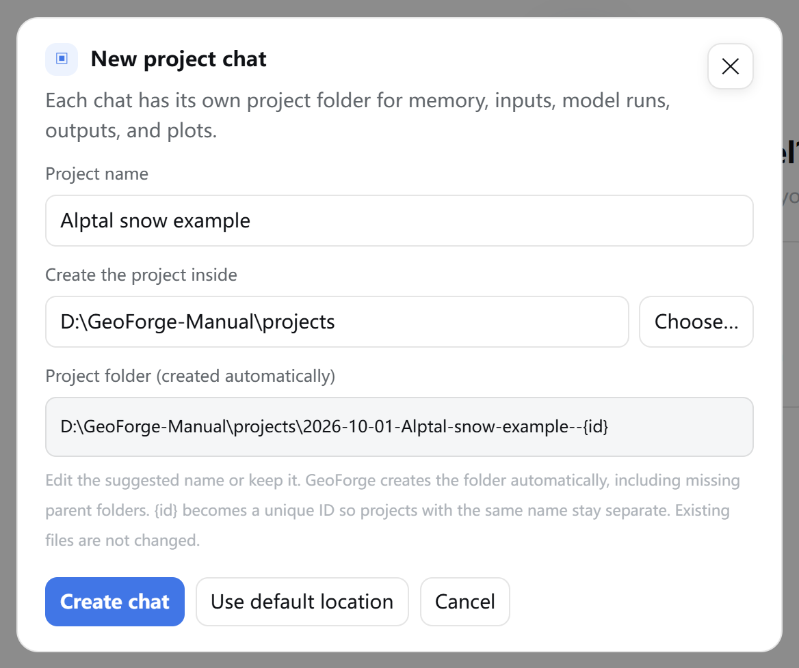

# 6 Projects and files

In this chapter you will learn where GeoForge keeps each chat's work, how to give it your own files, how to read the **Project status** panel, and how to move, share or archive a project without losing what it proves.

## 6.1 One chat, one project folder

Every chat in the sidebar owns one folder on your disk. That folder holds the chat's history, your inputs, the downloaded data, the model runs, the outputs and plots, and the signed run records. GeoForge creates it when you click **Create chat**, before you send anything.

The installed model software is not inside the project. It stays in that model's install folder, by default inside GeoForge's work folder (for example `C:\Users\you\kiss\fsm2`), so all your projects share one installation of each model.

> **Tip:** Use one chat for one scientific objective. A chat's AI and KI are fixed after its first message, so a new question, study area or experiment belongs in a new chat anyway.

## 6.2 Create a project folder

1. Click **＋ New chat** at the top of the sidebar. The **New project chat** dialog opens.
2. Read **Project name**. GeoForge fills it in: with the first line of your message if you typed one before any chat was open, otherwise with a dated name such as `Project 2026-10-01 093015`. Change it if you like.
3. Check **Create the project inside**. This is the parent folder. Keep the default or type a full path, such as `D:\GeoForge-Manual\projects`.
4. Read **Project folder (created automatically)**. This is the exact folder GeoForge will create.
5. Click **Create chat** (or press Enter in **Project name**).

Check that the preview ends in `<date>-<your name>--{id}`. GeoForge replaces `{id}` with a unique 12-character code, so two projects with the same name never share a folder.

The dialog also opens when you click **Send** or **＋ Files** with no chat open. **Use default location** puts the default parent folder back. **Cancel** closes the dialog without creating anything.

Chats started with **Use in a new chat** (**KI Library**), **Ask Agent** (**KI Observatory**) or **Use KI in chat** (a model's setup page) skip this dialog. Their folder is created in the default parent folder and is renamed after your first message.

GeoForge creates missing parent folders for you and does not change files that already exist there. The default parent is the `projects` folder in your GeoForge work folder:

| | Windows | macOS |
|---|---|---|
| Default parent folder | `C:\Users\you\kiss\projects` | `~/kiss/projects` |
| **Choose…** | No folder picker opens, because GeoForge runs in your web browser. The dialog shows "Browser mode: type the folder path here. The desktop build opens the system folder picker." Type the path, or copy it from the File Explorer address bar and paste it. | Opens the macOS folder picker. |

> **[Screenshot to add]** The **New project chat** dialog on Windows right after clicking **Choose…**: the note "Browser mode: type the folder path here. The desktop build opens the system folder picker." is visible under the fields, a typed path `D:\GeoForge-Manual\projects` is in **Create the project inside**, and the preview shows the resulting folder.

**Name rules.** A project name has 1 to 120 characters and must contain at least one letter or number. Chinese names work and give readable folder names. In the folder name, spaces and most punctuation become `-`, and only the first 56 characters are used.

> **Caution:** Choose the final location now. A project's run records are tied to the folder's full path (see 6.9), so moving the folder later means GeoForge can no longer verify them. Pick a local drive with plenty of free space that you can write to.

## 6.3 What is inside a project folder

A project folder looks like this (example: `D:\GeoForge-Manual\projects\2026-10-01-Alptal-snow-example--<id>`). Some folders appear only when they are first needed.

| Item | What it holds |
|---|---|
| `README.md` | A short description of this folder. |
| `session.json` | The chat's working state, used by the app. |
| `kiss.toml` | Path settings that GeoForge writes once a KI is prepared for this chat. |
| `memory\transcript.jsonl` | The full chat history, one message per line. |
| `inputs\` | Input data, in `forcing\`, `parameters\`, `initial_conditions\`, `boundary_conditions\`, `observations\` and `static\`. GeoForge Database downloads go to `observations\<dataset>\` or `geoforge_subsets\`. |
| `inputs\uploads\` | Files you add with **＋ Files**, drag and drop, or **Upload other files**. |
| `inputs\user\<input>\` | Files you upload for one specific plan input (see 6.6). |
| `outputs\<KI>\` | The model's own output files, for example `outputs\FSM2\alptal_0405\`. |
| `artifacts\` | Plots, tables, written run notes and the Project view file (`project-view.json`). |
| `runs\` | The plan (`plan.json`, `data-inventory.json`), your approval (`approval.json`), the progress state, the evidence summary (`evidence.json`), the event log and the run logs (`logs\`). |
| `models\<KI>\` | This project's copy of the KI instructions and tools (`ki\`) and its path settings. Not the model software. |
| `calibration\` | Calibration setup, cases and calibration runs for this project. |
| `references\papers\` | PDF papers you add for the agent to read. |
| `.geoforge\` | GeoForge's protected records: signed run records (`receipts\`), your saved planning answers (`user-answers.json`), download progress and manual download details. |
| `setup-request.json`, `setup-request-<number>.json` | The question or request card that waits for you now, and earlier cards, kept after you answered them. |

On Windows, File Explorer shows `.geoforge`. On macOS, Finder hides folders whose names start with a dot; press Command-Shift-. (period) in Finder to show them.

> **[Screenshot to add]** File Explorer on Windows open at a completed project folder (for example `D:\GeoForge-Manual\projects\2026-10-01-Alptal-snow-example--<id>`), showing `.geoforge`, `artifacts`, `calibration`, `inputs`, `memory`, `models`, `outputs`, `references`, `runs`, `README.md`, `kiss.toml` and `session.json`.

## 6.4 What you may add, open or leave alone

| You may | Where |
|---|---|
| Open and copy at any time | `outputs\`, `artifacts\`, `memory\transcript.jsonl`, `README.md`, and the files in `runs\` (to read only) |
| Add files | `inputs\user\<input>\` (before you approve), `inputs\uploads\`, `references\papers\` |
| Never edit, move or delete | `.geoforge\`, `runs\approval.json`, `runs\plan.json`, `runs\data-inventory.json`, `runs\flow-state.json`, `session.json` |

Why the last row matters:

- The approval, the progress state and every run record are signed: sealed with a key that only GeoForge holds (see 6.9). A hand edit makes the signature fail, and GeoForge then treats the record as invalid.
- If `plan.json` or `data-inventory.json` changes after you approved, your approval no longer matches the plan and you must approve again.
- If `.geoforge\user-answers.json` cannot be read, approval stops until it is fixed.
- If you replace or delete a downloaded file, **Project status** stops showing it as available.

> **Caution:** A data file that the approved plan does not list, and that no recorded run produced, keeps the project from reaching **Completed**. This applies to `.csv`, `.txt`, `.dat`, `.out`, `.bin`, `.nc`, `.tif`, `.png` and `.json` files in `inputs\`, `outputs\`, `artifacts\` and `calibration\`. Add files before you approve, so the plan can include them, and do not save your own notes or test files there. If the chat names such a file, see "If something goes wrong".

> **Tip:** Close output files in Excel or other programs before a run starts or reruns. Windows does not let the model replace a file that another program has open.

## 6.5 Open the folder with the Folder button

1. Open the chat in the sidebar.
2. Click **▣ Folder** in the header.
3. Find the new window that opens at the project folder. If you do not see it, look on the taskbar or in the Dock.

| | Windows | macOS |
|---|---|---|
| The folder opens in | File Explorer | Finder |

Check that **▣ Folder**, **◇ Project status** and **▤ Project view** are in the header. They are greyed out until a chat is open. After you click **▣ Folder**, the line under the message box reads "Opened" followed by the folder path.

Other buttons open the same place. **Open project folder** at the bottom of the **Project view** panel opens the project folder. Once the chat has a KI, the **Data for this run** card under **Project status → Details** has **Open all inputs** and, inside each data group, **Open folder**; they open the input folders.

## 6.6 Give GeoForge your files

There are three main ways to add files. Only one of them ties a file to a specific input of the plan.

| Button | Where it is | Files go to | Tied to a plan input? | Use it for |
|---|---|---|---|---|
| **Upload files** | **◇ Project status → Data in this plan**, on a row under **You** | `inputs\user\<input>\` | Yes, when you approve the plan | Data the plan asks you to provide, such as your own site file or observations |
| **Upload other files** | Bottom of the **Project status** panel | `inputs\uploads\` | No | Loose files for the agent to inspect |
| **＋ Files**, or drag files onto the message box | Left of the message box | `inputs\uploads\` | No | A file that belongs with the message you are writing |

Two more buttons exist for special cases. **Add paper PDF** (in **Project status → Details → See technical data details**, in the **Optional model reading** card once the chat has a KI) saves PDF papers to `references\papers\`, up to 100 MB each. **Add observations** (in the **Calibration** card under **Details**) works like **＋ Files**.

What all three main ways have in common:

- The file is copied into the project at once and appears as a small label (chip) with its name and size above the message box. The agent learns about it only when you click **Send**.
- Uploading never sends, approves or checks anything.
- GeoForge never overwrites a file. If the name is taken, the new copy gets an added ending. Unusual characters in a file name become `_`.
- One file can be up to 300 MB. For larger data, see 6.6.3.

GeoForge's messages write paths with forward slashes, such as `inputs/user/site/`. This is the same folder as `inputs\user\site\` in File Explorer.

### 6.6.1 Attach files to a message

1. Click **＋ Files**.
2. Choose one or more files in the file dialog and confirm.
3. Check the chips above the message box. The line under the message box reads, for example, "2 files ready to send".
4. To drop a file from this message, click ✕ on its chip. The file stays in the project.
5. Type your message.
6. Click **Send**. The agent receives the project paths of the attached files. If you send no text, GeoForge sends "Please inspect the attached files."

> **Tip:** Instead of steps 1 and 2, you can drag files from File Explorer or Finder onto the message box.

> **[Screenshot to add]** The message box of a chat with two attached file chips (names and sizes visible), the line "2 files ready to send" under it, and **Send** enabled.

What you should see: one chip per file, and **Send** enabled.

You cannot attach files while the chat is working: **＋ Files** is greyed out until the AI has finished its current reply (its "turn"). Wait for the reply to finish, or add the files in another chat.

### 6.6.2 Upload a file for a plan input

Use this when the plan says an input must come from you. On the **Approve the plan?** dialog, such an input is listed under **You** with "please provide". The dialog covers the window, so you close it first, upload, and then reopen it.

1. In the **Approve the plan?** dialog, click **Not now**. Nothing is approved or rejected.
2. Click **◇ Project status**.
3. Under **Data in this plan**, find the group **You**. The row for your input shows **Waiting for you**, a note that starts "Provide it yourself:" (format, unit, rules and the target folder), and an **Upload files** button.
4. Click **Upload files**.
5. Choose the file or files in the file dialog and confirm.
6. Check the row. It now shows **Present; not verified**, and its **Upload files** button is gone.
7. Read the line at the bottom of the panel: "Saved and queued for your next message (not sent, approved, or verified): …". GeoForge also puts a note in the message box that asks the agent to inspect the files. You can leave it: when you approve, your approval message replaces it, and the files go with that message.
8. Under **One thing needs you** at the top of the panel, click **Respond**. The **Approve the plan?** dialog opens again.
9. Click **Approve and start**.
10. Click **Continue with this choice**.
11. Wait for the reply in the chat: "Your file is now named as the input: … The updated card is in the chat; approve it to start." GeoForge has linked each file in `inputs\user\<input>\` to that input and recorded its checksum (a fingerprint of the file's exact content). A new **Approve the plan?** dialog opens.
12. Check the **Waiting on you** section of the new dialog. It lists "your file is now named as the input: <input> → inputs/user/<input>/<file name>". The input itself has moved to **The run prepares itself**, marked "already on disk".
13. Click **Approve and start**.
14. Click **Continue with this choice**. The signed approval now records that the input is your file.

> **[Screenshot to add]** **Project status → Data in this plan** for a plan with one input you must provide: the group **You** with that row showing **Waiting for you**, its note starting "Provide it yourself:", and the **Upload files** button.

What you should see: the row's status on the right, and the **Upload files** button under the note.

> **[Screenshot to add]** The re-issued **Approve the plan?** dialog, with the **Waiting on you** section listing "your file is now named as the input: <input> → inputs/user/<input>/<file name>", and the options **Approve and start** and **Modify the plan**.

What you should see: your file's path in **Waiting on you**. If it names the wrong file, choose **Modify the plan** instead of approving.

> **Caution:** If an input waits for your file and its folder is empty, approval stops with "Upload your file with the Upload button on the card". The **Upload files** button is in **Project status → Data in this plan**, not on the card.

At approval, GeoForge links every file in `inputs\user\<input>\` except files whose names start with a dot. To replace a file, delete the old one in File Explorer or Finder before you approve; otherwise both are linked. To use a different file after you approved, ask in the chat for a plan change, so the new file is linked at the next approval.

### 6.6.3 Large files

Uploads stop at 300 MB per file ("file larger than 300 MB"). For larger data:

1. Click **▣ Folder**. The project folder opens in File Explorer or Finder.
2. Open the target folder. For an input the plan asks you to provide, that is `inputs\user\<input>\`; create it if it does not exist, using exactly the input's name shown in **Data in this plan**. For any other file, use `inputs\uploads\`.
3. Copy the data into that folder.
4. Tell the agent in the chat where the files are. Do this before you approve, so the plan can name the files (see the caution in 6.4).

Files in `inputs\user\<input>\` are linked at approval however they got there. GeoForge computes the checksum of each file at every approval, which takes a while for very large files.

## 6.7 The Project status panel

1. Click **◇ Project status** in the header. The panel opens on the right.
2. Read it from top to bottom.
3. Click ✕ to close it, or **Continue in chat** to close it and go back to the message box.

In a new chat, check that the card reads **Ready when you are** with **Auto KI** on the right, that none of the five stages is marked, and that **Details** is folded.

The panel has these blocks:

| Block | What it shows |
|---|---|
| **One thing needs you** | Only when a card waits for you: a choice or question such as **Approve the plan?** (**Respond** reopens it), a manual Baidu Pan download (**Files are in place, continue**), or a licence, login or permission step (sometimes with **Open official page**). |
| Progress card | A headline: **Ready when you are**, **Ready to continue**, **GeoForge is working**, **One thing needs you**, **Project complete**, **Project needs attention** or **Status unconfirmed**; just **Progress** while the **One thing needs you** card is shown above it. On the right, **Auto KI** or "N / M software verified". Then a one-line summary, the **Goal**, the KI chips (for example "General KI: FSM2") and the five stages. The last line says where the status comes from and how old it is. |
| **Data in this plan** | After a plan exists: every input in three groups, **GeoForge fetches**, **You** and **The run prepares itself**, each with its status. |
| **Details** | Folded; its label reads "acquisition log, folders, catalogue search, data sources, calibration". Inside: the status evidence, data download jobs, **Data for this run** (with **Open all inputs** once the chat has a KI), the **GeoForge Database** search, **Data sources & download record** (when there is one), **Calibration** and **See technical data details**. |
| Bottom buttons | **Continue in chat** and **Upload other files**. |

The five stages:

| Stage | Meaning |
|---|---|
| **Understand** | Understand the goal and choose a general KI |
| **Prepare** | Check software and prepare suitable data |
| **Validate** | Check the prepared model inputs |
| **Run** | Run the real scientific model |
| **Results** | Save and explain the results |

The dot marks where the work is now. It is not proof that earlier checks passed, and earlier stages are not ticked as work moves on. All five get a tick only when the project is complete. During planning and data download the dot stays on **Understand**; read the summary line instead.

Statuses in **Data in this plan** come from signed records and files on disk, not from what the agent says:

| Status | Meaning |
|---|---|
| **Waiting for you** | You must upload, download or choose something. |
| **Pending** | Not prepared yet. |
| **Present; not verified** | A file is in place; nobody has checked its content. |
| **Acquired; scientific checks pending** | GeoForge downloaded it and signed a record; its scientific fitness is not yet checked. |
| **Produced; scientific checks pending** | A recorded run step produced it. |
| **Fetch failed** | The download failed. |
| **No step uses it** | Listed in the plan, but no step uses it. |

A completed project can still show "scientific checks pending". That is honest: a finished run is not a validated model.

The **◇ Project status** button keeps its name. Once the project has a goal, a coloured dot after it shows the state, and its tooltip starts with the state name:

| Dot | Tooltip starts with | Meaning |
|---|---|---|
| Blue, pulsing | Working | GeoForge or the agent is working. |
| Amber | Needs you | Something waits for you. |
| Green | Complete | Every approved step has a passing, signed run record, and no unrecorded data file is left. It does not mean the results are scientifically valid. |
| Red | Needs attention | A step failed, work is blocked, or the records could not be read. |
| Grey | Ready or Unconfirmed | Nothing is running and nothing waits for you, or the state could not be confirmed. |

## 6.8 Switch between chats

1. Click any chat in the sidebar to open it. The newest chat is at the top.
2. Read the line under each title: its KI (or **Auto KI**) and the number of messages. A working chat also shows **Active**, **Running · quiet**, **Check status** or **Connection issue**.

Work continues in a chat you leave. While one chat is running, you can open another chat or click **＋ New chat**, either at the top of the sidebar or on the activity bar (the strip under the message box that appears while a chat works); the app is not frozen. When you return, the chat shows its latest message, waiting card or result.

An unsent message stays with its chat while you switch, but it is lost if you reload or close the page. **Stop** on the activity bar stops only the chat you are looking at.

## 6.9 Move, back up or share a project

GeoForge signs the approval, the progress state and every run record with a key kept on this computer, outside the project folder (`C:\Users\you\.config\geoforge\flow-keys` on Windows, `~/.config/geoforge/flow-keys` on macOS). Each key belongs to one folder path.

So if you move, rename or copy a project folder, even on the same computer, or open it on another computer, GeoForge cannot verify that project's records there. The files themselves (outputs, plots, transcript) are unchanged and readable. Once a project has a plan, **Project status** in a moved copy shows **Project needs attention** with "Project evidence is unreadable; inspect status details."

| You want to | Do this |
|---|---|
| Keep working on a project | Leave the folder where it is, with the same name. |
| Back it up | Copy the whole folder to a backup drive and leave the original in place. Treat the copy as a record to read. If you ever restore it on this computer, put it back at exactly the original path and name; its records then verify again. |
| Send results to a colleague | Send the files they need from `artifacts\` and `outputs\`, rather than the whole folder. |
| Free disk space | Archive the chat (6.10), then delete the archived folder yourself. |

> **Caution:** Do not delete or edit the `flow-keys` folder. Without it, GeoForge cannot verify the run records of any of your projects.

Before you send a whole project folder to anyone, know what it contains:

- the full chat history (`memory\transcript.jsonl`);
- Baidu Pan share links and extraction codes from the GeoForge Database, if the project used a manual download. They are saved, for example, in `.geoforge\manual-download-details.json` and in the `setup-request` files, so the download card survives a restart. They were issued to you; do not post them publicly;
- downloaded data, which may have its own licence terms.

Your AI keys and your GeoForge Database token are not stored in the project folder.

**Look at a project someone sent you.**

1. Copy the folder, with its name unchanged (it must end in `--` and the 12-character code), into your default projects folder, such as `C:\Users\you\kiss\projects`.
2. Look at the GeoForge sidebar. The chat appears within a few seconds, because the list refreshes by itself while the GeoForge window is visible.

Use it to read: its records cannot be verified on your computer, it keeps the sender's AI choice, and the model software must be installed on your computer before anything can run. Start a new chat for new runs.

## 6.10 Archive (delete) a chat

1. Hover over the chat in the sidebar. A ✕ appears at the right end of its title line.
2. Click ✕ (tooltip: "Archive chat; project files are kept").
3. Click **OK** in the dialog "Archive this chat? Its local project files will be kept."

> **[Screenshot to add]** The sidebar with the pointer over one chat, its ✕ visible after the title and the tooltip "Archive chat; project files are kept", and the browser confirmation dialog "Archive this chat? Its local project files will be kept." on top.

The chat leaves the sidebar. Nothing is deleted: GeoForge moves the folder into an `_archived` folder next to it and adds `-deleted-<number>` to its name. For a project in the default location that is `C:\Users\you\kiss\projects\_archived\`.

The ✕ is greyed out while the chat is working. Wait for the AI to finish its reply, or click **Stop** first.

To free the disk space, delete the folder in `_archived` yourself with File Explorer or Finder. Model outputs and downloaded data can be large.

> **Tip:** GeoForge has no button to restore an archived chat. To bring one back, move its folder from `_archived` back to where it was and remove the `-deleted-<number>` ending. For a project outside the default location, also move `C:\Users\you\kiss\sessions\_archived\<id>-deleted-<number>.json` back to `C:\Users\you\kiss\sessions\<id>.json`. The chat reappears in the sidebar within a few seconds. Back at its original path, its records verify again.

## If something goes wrong

| What you see | What to do |
|---|---|
| **Choose…** opens nothing and the dialog says "Browser mode: type the folder path here…" (Windows) | This is expected. Type or paste the full folder path. |
| **Create chat** is greyed out and the preview reads "Enter a project name and location to preview its folder." | One of the two fields is empty. Fill in **Project name** and **Create the project inside**. |
| "Could not preview folder: project location must be an absolute folder path" | Type a full path that starts with a drive letter, such as `D:\GeoForge-Manual\projects`. |
| "Could not preview folder: project name must contain a letter or number" | Add at least one letter or digit to the name. |
| "could not create project location …" in red under the preview | The drive does not exist or you cannot write there. Choose another folder. Your entries are kept so you can retry. |
| "Could not open the folder picker; enter the path directly." (macOS) | Type or paste the full folder path into **Create the project inside**. |
| After **▣ Folder**, the line under the message box shows an error (for example "no such session") instead of "Opened …" | The project folder is no longer at its path or under its name. Move it back to its original path and name. |
| "file larger than 300 MB" | Copy the file with File Explorer or Finder instead (6.6.3). |
| "This chat is working. Add the files to a new chat, or wait for this turn to finish." | Wait for the AI to finish its reply, then attach the files. |
| Approval stops with "These still need your decision before anything runs: … Upload your file with the Upload button on the card (it goes to inputs/user/…)" | Click **Not now** on the dialog. Use **Upload files** on that row in **◇ Project status → Data in this plan**, then click **Respond** and approve again (6.6.2). |
| "Your saved answers cannot be read (…). Fix or remove that file, then approve again." | `.geoforge\user-answers.json` was edited or damaged. Undo the change if you can. If you remove the file, approval works again, but GeoForge treats your earlier planning answers as never given; check the card carefully. |
| The chat says "**GeoForge verification:** not complete yet — … these files are not vouched for by a passing receipted run (left by a failed attempt or written outside run-tool); regenerate or remove them: …" | If a listed file is one you added, move it out of the project folder (keep a copy elsewhere). Then send a short message, such as "continue". If the agent made the file outside a recorded run, ask it to regenerate the file through the approved step. On Windows, a background job the agent started can keep running after **Stop** (a known issue) and write such files; end it in Task Manager first. |
| **Project needs attention** with "Project evidence is unreadable; inspect status details." after you moved, renamed or copied the folder | Move the folder back to its original path and name. A copy elsewhere can be read but not verified. |
| A chat disappeared from the sidebar after you moved its folder | Move the folder back to its original path and name. The sidebar shows it again within a few seconds. |
