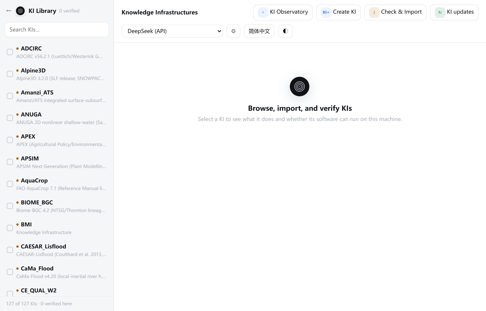
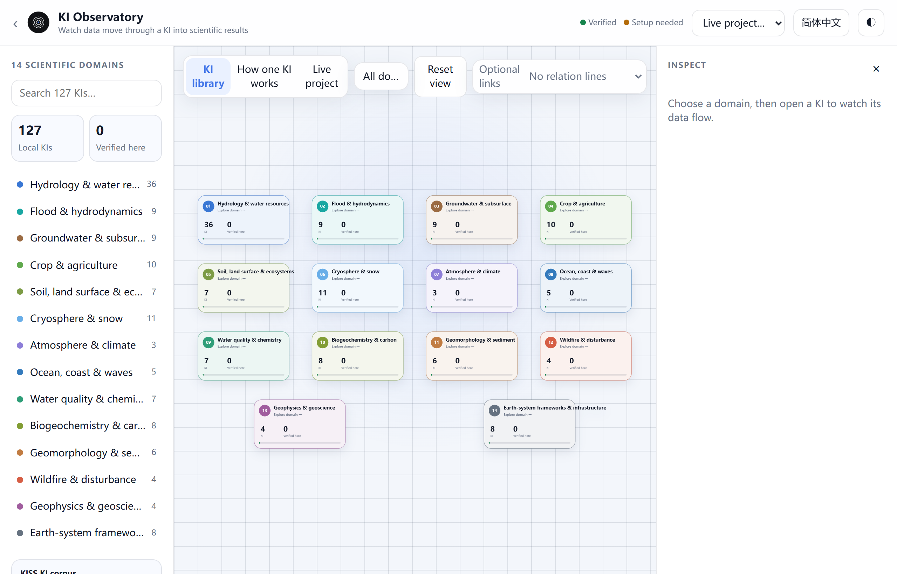
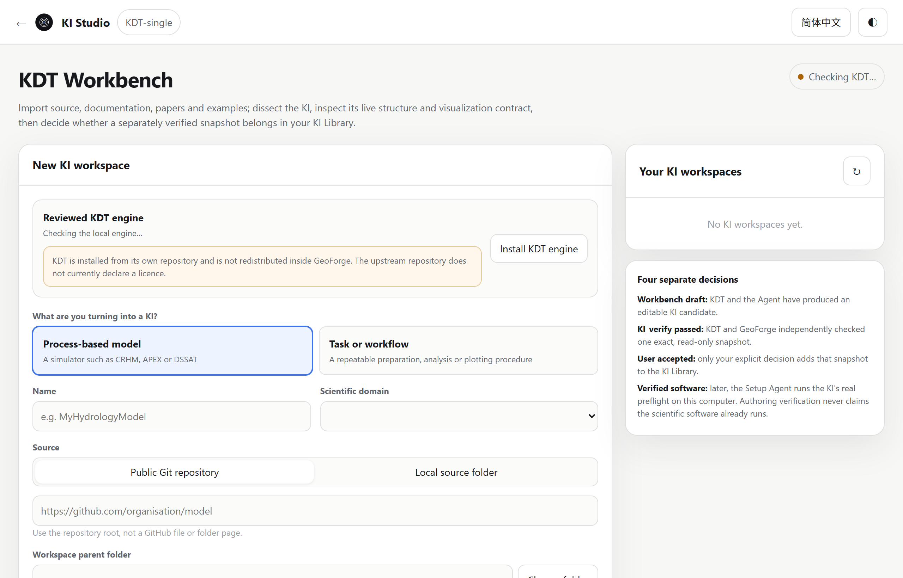
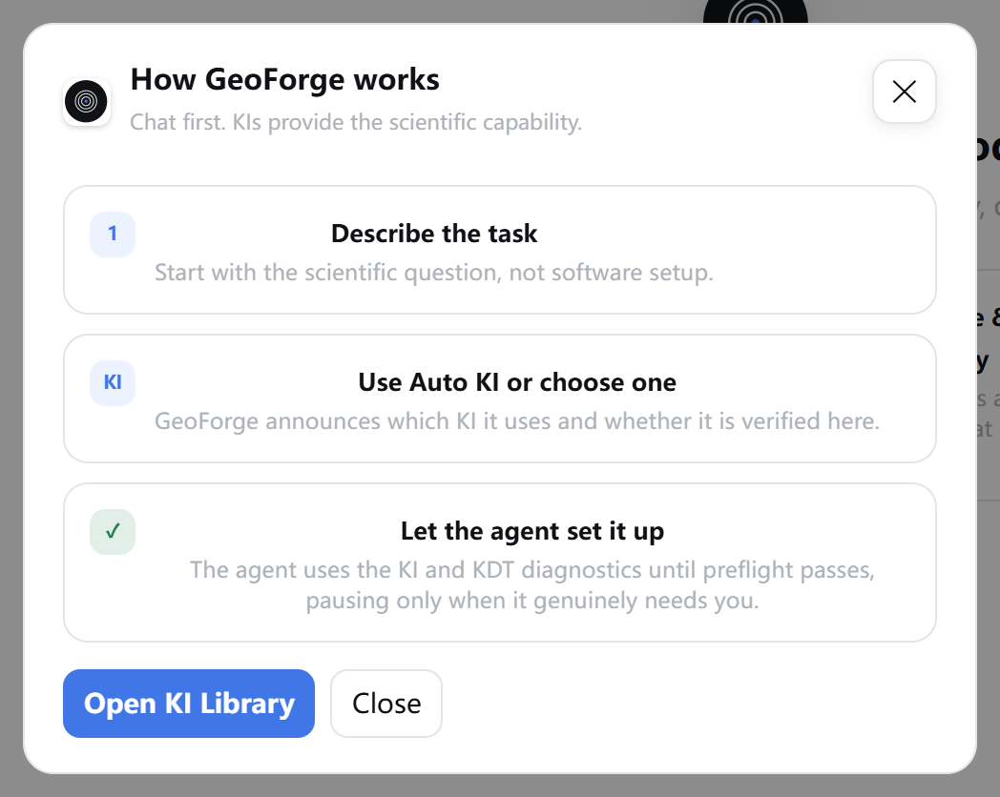

# 7 More tools

In this chapter you will use the tools around the chat: the **KI Library**, the **KI Observatory**, **KI Studio**, skills, MCP servers, the in-app **Guide**, and model calibration.

## Where to find each tool

The first three tools have buttons at the bottom of the sidebar and cards on the start page.

| Tool | Open it from | Use it to |
|---|---|---|
| **KI Library** | Sidebar **KI Library**; start page **Browse & verify**; **Guide** → **Open KI Library** | see every KI, check whether its software runs here, import a KI, update the library |
| **KI Observatory** | Sidebar **KI Observatory**; start page **Observe KIs**; **KI Library** header | learn what KIs exist and how one works; ask the AI about a KI |
| **KI Studio** | Sidebar **KI Studio**; start page **Create a KI**; **KI Library** header **Create KI** | turn your own model or workflow into a checked KI |
| **✦ Skills** | Beside the message box | pin a reusable procedure, such as a plotting method, to a chat |
| MCP servers | **Settings** → **Permissions** | let a local agent in one chat use an outside service, such as GitHub |
| **Guide** | Sidebar **Guide** | read a three-step summary of GeoForge |
| Calibration | **◇ Project status** → **Details** → **Calibration** | tune model parameters against your observations |

The **←** or **‹** at the top left of each page takes you back. From **KI Studio** it goes to the **KI Library**. From the **KI Library** and the **KI Observatory** it goes to the main window.

## KI Library

A KI (Knowledge Infrastructure) is checked guidance for one scientific model: how to install, prepare, run and check it. The **KI Library** lists every KI on this computer and shows whether its model software has been checked here.

### Read a KI's status

1. Click **KI Library** at the bottom of the sidebar.

    

    Check the line at the bottom of the list, for example **127 of 127 KIs · 0 verified here**. On a new installation no KI is verified yet. That is normal.

2. Type part of a model name in **Search KIs…** to shorten the list.
3. Click a KI in the list. Its details open on the right.

    > **[Screenshot to add]** KI Library on Windows with FSM2 selected after its software was verified: badges **Bundled KI** and **Verified on this machine**, the four info cards, the buttons **Use in a new chat** and **Open setup & verification**, and the **Run data** section loaded below.

    Check the two badges under the KI name. The first is about the KI package. The second is about the model software on this computer.

The dot before each name gives the software state at a glance: green means verified here, red means the last check failed, and orange means the software still needs setting up.

| Badge | Meaning |
|---|---|
| **Bundled KI** | The KI came with GeoForge or with an official KI library update. |
| **Valid imported package** | You imported this KI and it passed the package check. |
| **Package not checked** | GeoForge has not checked this package. |
| **Verified on this machine** | The model software passed the KI's own start-up check (its "preflight") on this computer. The date is under **Last checked on this machine**. |
| **Setup needed** or **Ready to set up** | The software is not verified here yet. You can still choose the KI: GeoForge has the agent set the software up after you approve a plan. |
| **Manual setup** | As above, but GeoForge cannot fetch the software by itself, so expect to provide some of it yourself. |
| **Verification failed** | The last check on this computer failed. Set it up again with the agent. |

Keep three ideas apart. A KI being in the library means GeoForge can read its guidance. **Verified on this machine** means the model program runs here. Neither means that a project has the data and decisions it needs, and neither says anything about whether the model's results are scientifically right.

The four cards show the **Scientific software** and its version, **Last checked on this machine** (**Not yet** if never checked), **Language & licence**, and the **Source** (**Open project website**).

### Start a chat or set up the software from the Library

- **Use in a new chat** creates a chat with this KI already chosen. It uses the AI shown in the selector at the top of the **KI Library**. It skips the **New project chat** dialog, so the project goes to the default location (Chapter 6) and the chat takes its name from your first message.
- **Set up with agent** opens **Agent setup** to install and verify the model software. Once the KI is verified, the button reads **Open setup & verification**. Chapter 4 explains this page.
- **Run data** shows what the KI needs: **Inputs** → KI → **Outputs**, a **Local data check**, the **Declared input groups** (**Forcing**, **Parameters**, **Initial conditions**, **Boundary & controls**) and any **Coupled KIs**. Click a group to see its items.

**Run data** is built from the KI's own files and from what GeoForge finds on this computer. It describes the KI, not one of your projects. A project's data is in **◇ Project status** (Chapter 6, section 6.7).

To read **Run data** in plain words, click **Explain my data** under **Need this in simple words?**. The AI in the selector at the top of the page writes the explanation. It cannot change the requirements or the verification marks. If no AI is connected, the button reads **Connect AI first** and cannot be clicked.

> **Tip:** "Local files are not machine-checkable yet." means this KI does not list file paths that GeoForge can check. The input groups still describe the model's interface.

> **Caution:** The ⚙ button in the **KI Library** header opens an older, smaller Settings window. It has no **Permissions** page, and its API-key fields do not hide what you type. Use **Settings** in the main window's sidebar instead, and never share a screenshot of the ⚙ window while you type a key.

### Import a KI package

You can add a KI that a colleague sent you as a `.zip` package. GeoForge checks the package before it adds anything. The KI takes its name from the file name, without `.zip`.

1. In the **KI Library** header, click **Check & Import**.
2. Choose the `.zip` file. The **KI package check** window opens and shows "Checking *name* before importing…".
3. Read the result. **BLOCK** lines stop the import. **WARN** lines are advice and do not stop it.

    > **[Screenshot to add]** **KI package check** window after choosing a valid `.zip` package: the summary "*name* is a valid KI package and can be imported…", one **WARN** finding, and the **Import valid KI** button enabled.

    Check that the summary says the package is valid. Otherwise **Import valid KI** stays greyed out.

4. Click **Import valid KI**. The new KI is selected in the list with the badge **Valid imported package**.

Importing checks the package's structure only. The model software still has to be set up and verified on this computer, like any other KI. Click **Cancel** to leave without importing.

### Update the KI library

GeoForge can download newer KI definitions from the official GeoForge repository. Before it uses a downloaded library, GeoForge checks every package in it. If the download or a check fails, the current library stays in use. An update never changes your chats, input data, installed model software, verification history, or KIs you imported yourself.

| Platform | When GeoForge checks for KI updates |
|---|---|
| Windows | Only when you ask. The first check downloads and checks about 88 MB, so it is not started at launch. |
| macOS | Automatically at each launch. You can also check by hand. |

To check by hand:

1. In the **KI Library** header, click **KI updates**. The **KI library updates** window opens.
2. Click **Check again**. While it runs, the header button reads **Checking KIs…**.
3. Read the summary at the top of the window.

    > **[Screenshot to add]** **KI library updates** window on Windows after **Check again**: summary "GeoForge kept the current KI library because the repository version would remove Windows installation guidance.", the line **Current library kept safely** with its reason, and the buttons **Check again**, **Network settings** and **Open source repository**.

    Check the summary. On Windows in 0.6.54 it normally says the current library was kept.

That result is expected on Windows, and it is safe. Every KI in the Windows build has Windows installation notes, and 23 also have Windows install recipes. The online repository does not have them yet. GeoForge refuses a library that would remove them and keeps the one you have. Updates resume once the repository has the Windows notes.

After a kept result, the header button reads **Library kept**. The main window may also show a notice, **Current KI library kept**, at the bottom right when it opens. Click **View report** to open this window, or **Dismiss** to close the notice.

If GitHub can only be reached through a proxy, set it in the main window: **Settings** → **Network & proxy**, tick **GitHub & KI updates**, then click **Save** (Chapter 2). The **Network settings** button in this window opens the older ⚙ Settings window described above.

## KI Observatory

The **KI Observatory** is a map for learning which KIs exist and how each one turns data into results. It only reads KI descriptions and never runs model code. The one thing it can create is a new chat, through **Ask Agent**.

### Explore the domains and one KI

1. Click **KI Observatory** at the bottom of the sidebar.

    

    Check the left column: **14 SCIENTIFIC DOMAINS** with a count for each, and two boxes, **Local KIs** and **Verified here**. The legend at the top right shows a green dot for **Verified** and an orange dot for **Setup needed**.

2. Click a domain card, or a domain name in the left column. The KIs of that domain appear as cards. Each card shows how many inputs, processes and outputs the KI declares, for example **4 IN · 6 PROCESS · 3 OUT**.
3. Click a KI card. The **How one KI works** tab opens for that KI.

    > **[Screenshot to add]** KI Observatory, **How one KI works** tab for FSM2 in **How it works** mode: the numbered stage cards in a row, one stage selected with its explanation in the **INSPECT** panel, and the buttons **← Back to domain**, **Related KIs** and **Ask Agent** in the KI header.

    Check the badge beside the domain name: **Verified** or **Setup needed** on this computer.

4. Click a stage card. The **INSPECT** panel on the right explains what happens in that stage.
5. Open **Technical evidence** in the **INSPECT** panel to see the exact names the KI uses.
6. To see the KI's complete workflow graph (its "DAG"), click **Full technical DAG**. It shows four lanes: **Inputs**, **Core engine**, **Verification gate** and **Results**.
7. Click **How it works** to go back to the stage view.

Below the graph, **Visualization capability** lists the kinds of displays the KI declares, such as plots or maps.

> **Tip:** The moving current in **How it works** shows the order of the KI's scientific stages. It does not mean a model is running.

Other ways to move around:

- Type in **Search 127 KIs…** to find a KI in any domain.
- Drag the map to move it and use the mouse wheel to zoom.
- On the **KI library** tab, click **Reset view** to go back to all domains. In a KI's view, click **← Back to domain** to go up one level.
- **Related KIs** shows the KIs linked to this one. **Optional links** chooses which links to draw: **No relation lines**, **Scientific coupling**, **Shared data** or **All evidence**.

### Ask the AI about a KI

**Ask Agent** creates a **new** chat with this KI chosen and sends a question about it at once. It appears in the KI header, and in the **INSPECT** panel when a KI, a stage or a graph node is shown there.

1. Before you open the Observatory, check the **AI CONNECTION** (**Local** | **API**, provider and model) at the top of the main window. The new chat uses that choice, and a chat's AI cannot change after its first message.
2. In the Observatory, click **Ask Agent**. The button reads **Creating a new chat…**.
3. Wait. GeoForge switches to the new chat and sends a question such as "Explain in plain language how data moves through the FSM2 KI into results."

Notes:

- The chat skips the **New project chat** dialog. Its project goes to the default location, named after the question.
- Each click creates one more chat and project folder. Archive the ones you do not need with **✕** in the chat list. Archiving keeps the project files (Chapter 6).
- The question asks for an explanation, so it usually gets an answer without starting a plan. To run the model, describe your task in this chat or in a new one.
- If no AI is ready, the question waits in the message box with the hint "The new chat is ready with the question filled in. Connect an AI, then press Send."

### Watch a chat project

The **Live project…** list at the top right shows your chats. Choose one to open the **Live project** tab. It shows the chat's recorded stage in a row of eight steps, from "understanding" to "results", and what the agent is doing now. A **Waiting for you** badge means the chat needs your answer.

This tab is only for watching. To answer a question or approve a plan, go back to the chat. **◇ Project status** in the chat remains the full record of a project (Chapter 6, section 6.7).

## KI Studio

**KI Studio** turns your own model, or a repeatable task such as a data-cleaning or plotting procedure, into a KI that GeoForge can use. It is for advanced users. KI Studio uses a separate engine called KDT to read your source and check the result. An AI agent writes the KI, two independent checks test it, and you decide whether it joins your library.

### Create a KI

1. Click **KI Studio** at the bottom of the sidebar.

    

    Check the pill at the top right. On the first visit it reads **Checking KDT…**, then **KDT setup needed**. Once the engine is installed it reads **KDT ready**. Your earlier workspaces are listed under **Your KI workspaces**.

2. Under **Reviewed KDT engine**, click **Install KDT engine**. You do this once. GeoForge downloads the engine (KDT-single) from GitHub with Git. It is not shipped inside GeoForge, and its repository does not declare a licence.
3. Under **What are you turning into a KI?**, choose **Process-based model** or **Task or workflow**.
4. Type a **Name**.
5. Choose the **Scientific domain**. If yours is not listed, choose **Other — enter your own** and type it. The agent then works out the workflow from your source, examples and tests only.
6. Under **Source**, choose **Public Git repository** or **Local source folder**.
7. Paste the repository's main address (for example `https://github.com/organisation/model`), or the path of your source folder.
8. Check **Workspace parent folder**. GeoForge creates a new folder there and never edits your original source.
9. Choose the **AI agent**.
10. Choose the **Agent model**.
11. Click **Create workspace**. The **KI creation run** panel opens.
12. Optional: under **Source material for this KI**, paste a DOI, a web link or a local path to a paper, manual or example.
13. Click **Add**. Repeat steps 12 and 13 for each item.
14. Work through the five numbered steps of the panel in order:

    | Step | Button | What happens |
    |---|---|---|
    | 1 Map the model source | **Run KDT probe** | KDT reads the source, build files, documentation and input/output paths. |
    | 2 Dissect and build with your agent | **Build or repair KI** | The agent writes the KI: workflow, tools, checks and plots. |
    | 3 Review the live Workbench preview | **View above** | Read the four lanes: **Workflow DAG**, **Tools and data I/O**, **Diagnostics and preflight**, **Visualization functions**. Repeat step 2 to repair. |
    | 4 Finish and run KI_verify | **Finish and verify** | KDT checks the KI, then GeoForge checks a fixed, read-only copy of it (KI_verify is this structural check). |
    | 5 You make the final decision | **Accept and add to KI Library** | Nothing is added until you click this. |

    > **[Screenshot to add]** KI Studio after **Finish and verify** passed: the result "Independent KI_verify passed — This exact snapshot is locked for your decision. Nothing has been imported yet.", the buttons **Open read-only report** and **Continue modifying**, and **Accept and add to KI Library** enabled.

    Check that the result reads **Independent KI_verify passed** before you accept. If it reads **KI_verify needs revision**, read the listed problems, click **Continue modifying** and repeat step 2.

The panel **Four separate decisions** explains why these results are kept apart:

- **Workbench draft**: an editable candidate, nothing more.
- **KI_verify passed**: KDT and GeoForge both checked the KI's structure.
- **User accepted**: happens only when you click step 5.
- **Verified software**: comes later, when the model software passes its check on the computer that runs it.

None of the first three shows that the model program runs, and none of the four shows that the model is scientifically right.

| Platform | Choosing folders in KI Studio |
|---|---|
| Windows | **Choose folder** only shows "Folder picking is available in the desktop app. Paste a path here in browser mode." Copy the path from File Explorer's address bar and paste it, for example `D:\GeoForge-Manual\kis`. |
| macOS | **Choose folder** opens the system folder picker. |

> **Caution:** **Install KDT engine** needs Git, which GeoForge does not include. If Git is missing, the message reads "Git is not installed. Install the Xcode command line tools, then retry." The Xcode tools are for macOS. On Windows, install Git for Windows and try again.

The Windows end-to-end test for 0.6.54 covered only the FSM2 example with the DeepSeek API. KI Studio was not part of that test.

## Skills

A skill is a written procedure that an agent can follow, for example how to make a publication-quality plot. The agent chooses useful skills by itself. Pin a skill only when you want it used throughout one chat.

GeoForge does not ship skills. The list shows the skills already installed for your agents. Each skill is a folder containing a `SKILL.md` file in one of these places:

- `C:\Users\you\.agents\skills`
- `C:\Users\you\.codex\skills`
- `C:\Users\you\.claude\skills`

On macOS the same folders are in your home folder. Both local agents and API providers can use them.

### Pin a skill with the Skills button

1. Open the chat.
2. Click **✦ Skills** beside the message box. The window **Skills for this chat** opens.
3. Type in **Search skills…** if the list is long.
4. Click each skill you want. Click it again to remove it.
5. Click **Apply**.

> **[Screenshot to add]** The **Skills for this chat** window with two installed skills listed as **/name** with their descriptions, one of them ticked, and the buttons **Apply**, **Clear** and **Close**.

Check the button. It now shows the number pinned, for example **✦ 1**. To remove all pinned skills, open the window again, click **Clear**, then click **Apply**.

### Pin a skill with a slash command

1. Type `/` at the start of an empty message box. A menu opens with **/skills** (Browse all installed skills) and up to eight skills.
2. Keep typing to narrow the list, for example `/plot`.
3. Click a skill. The hint "/*name* is active for this chat" confirms it.

You can also type the skill name and your request in one message and press Enter. For example, if you have a skill named `hydrograph-plot`, type `/hydrograph-plot Plot daily discharge for 2015`. GeoForge pins the skill and sends the rest as your message. Sending `/skills` alone opens the **Skills for this chat** window.

## MCP servers for a chat

MCP (Model Context Protocol) servers connect an agent to an outside service, such as GitHub. GeoForge does not run MCP servers itself. It lists the servers you have already set up for the local agents Claude Code and OpenAI Codex, and lets you choose which ones each chat may use.

> **Caution:** Only the local agents Claude Code and OpenAI Codex (**Local** under **AI CONNECTION**) can use MCP servers. API providers, such as DeepSeek, use only GeoForge's own tools. Local agents were not tested end to end on Windows for 0.6.54.

1. Open the chat that should use the server. The button in step 4 does nothing when no chat is open.
2. Click **Settings** at the bottom of the sidebar.
3. Click **Permissions** on the left.

    

    Check that **MCP connections** shows the button **Choose MCP servers for this chat**. **Kimi Code file access** is explained in Chapter 2.

    > **Tip:** If you changed anything else in Settings, click **Save** now. The next step closes the Settings window without saving.

4. Click **Choose MCP servers for this chat**. The Settings window closes and the **MCP connections** window opens.
5. Click each server this chat should use, so that it is ticked. Each line shows which agents it is set up for, such as **Configured for codex, claude · stdio**.
6. Click **Apply**.

> **[Screenshot to add]** The **MCP connections** window opened from Settings → Permissions with a chat open: one configured server ticked, the **GitHub MCP** card with its **Official setup guide** link, and the buttons **Apply** and **Close**.

Check that the servers you want are ticked before you click **Apply**. You can change the choice later in the same chat.

The **GitHub MCP** card offers **Configure for Codex** when the Codex CLI and either the official `github-mcp-server` program or Docker are installed. After it is configured, the message says that GitHub login opens the first time the server is used. Otherwise the card shows a link, **Official setup guide**.

An MCP server gives the agent more reach. It does not replace the KI's checks or the project's run records.

## The in-app Guide

Click **Guide** at the bottom of the sidebar. The window **How GeoForge works** opens.

Check the three steps: **Describe the task**, **Use Auto KI or choose one**, **Let the agent set it up**.

The **Guide** is a short reminder, not the full workflow. It does not mention the planning questions, the plan approval card, data downloads, **Stop** or **Completed**. This manual is the full guide; Chapter 5 follows one project from start to **Completed**. The three cards look like buttons but do nothing when clicked. **Open KI Library** opens the **KI Library**, and **Close** closes the window.

## Calibration

Calibration searches for model parameter values that make the model match your observations better. GeoForge's rules require it to run the real model through its KI, never a simplified stand-in.

### How calibration is organised

| Part | What it is | Where it lives |
|---|---|---|
| Calibration engine | The search methods, shared by all models. It is built into GeoForge and is not edited. | Inside GeoForge |
| KI adapter | Two small files that tell the engine how to write parameters into the model, run it, and read its outputs | `calibration\kis\<KI>\` in the project (a copy of the KI's adapter) |
| Project case | Your parameters and ranges, observations, calibration and held-out periods, and budget | `calibration\cases\` in the project |

The engine offers DDS, SCE-UA and DREAM for one target, and NSGA-II, NSGA-III and MOEA/D for several targets at once. A calibration can use from 1 to 10,000 model runs; this number is its "budget". The held-out period is a stretch of observations kept out of the tuning and used only to test the result. The engine and its Python libraries are part of GeoForge, so you do not need your own Python.

In 0.6.54, 14 KIs ship a ready adapter: CaMa_Flood, CRHM, Daisy, DSSAT, HYPE, MARRMoT, MODFLOW6, Noah_MP, SFINCS, SUMMA, SWAT_Plus, VIC, WOFOST and WRF_Hydro. For other KIs, including FSM2, the agent must first write an adapter inside your project.

### Run a calibration

A calibration is a run like any other: it happens as a step of a plan you have approved.

1. Start a new chat (Chapter 6). A completed chat is read-only, so calibrate in a new chat even after a successful model run.
2. Choose the KI for the chat (Chapter 4), for example HYPE.
3. Type your request. Name the target variable, the observation file, the calibration period, a separate held-out period, and if you wish the method and budget. For example:

    > Calibrate HYPE for my catchment against the daily discharge file I will upload. Calibrate on 2010–2015 and keep 2016–2018 as the held-out check. Use DDS with a budget of 500 model runs, and report NSE and KGE for both periods.

4. Answer the planning questions.
5. Give GeoForge your observations. If the plan lists them as an input, use that input's **Upload files** button in **◇ Project status** → **Data in this plan**, so the file is linked to the plan when you approve it (Chapter 6, section 6.6.2).
6. On the approval card, check that **Steps** includes a calibration step.
7. Click **Approve and start**.
8. Leave GeoForge running. Like every approved step, the calibration gets a signed run record. It also saves `report.json` and `engine.log` in `calibration\runs\<run id>\` in the project.

To end a calibration early, click **Stop** in the activity bar. The attempt is recorded as stopped.

> **Caution:** On Windows, the installed GeoForge opens a black console window for every model run during a calibration. A calibration can make hundreds or thousands of them. Do not close them: a closed window makes that model run count as failed. Each window closes by itself when its run ends. This is a known issue in 0.6.54.

> **[Screenshot to add]** Windows desktop during a calibration in the installed app, showing several black console windows on top of the browser.

Calibration was not run end to end on Windows for 0.6.54. Check each result carefully.

### Read the Calibration card

1. In the chat header, click **◇ Project status**.

    

    Check that the line next to **Details** lists "calibration" among its contents.

2. Click **Details** to open it.
3. Scroll to the **Calibration** card near the end of **Details**.
4. Read the status at the top right of the card.

    > **[Screenshot to add]** **◇ Project status** → **Details** → **Calibration** card after one calibration run with a held-out period: the status **Holdout passed**, the counts line, **Latest calibration · *KI*** with **Validated**, the method and best loss, the report path, and the buttons **Continue calibration** and **Add observations**.

    Check that the status matches one of the rows in the table below.

| Status | Meaning |
|---|---|
| **Choose a KI first** | The chat has no KI yet. |
| **Engine unavailable** | This GeoForge cannot load the calibration engine. No calibration can run. |
| **Adapter needed** | The KI has no ready adapter in this project yet. |
| **Project case needed** | An adapter exists, but this project has no saved case with observations and a held-out period. |
| **Workflow prepared** | A case is saved. The agent must still check it matches this run. |
| **Holdout passed** | The latest calibration passed its held-out check. |
| **Holdout not passed** | The latest calibration finished but did not pass its held-out check. |
| **Run needs review** | The latest attempt did not finish normally. |

Under **Latest calibration**, **Validated** means only that the result passed its held-out check. It is not a scientific validation of the model. **Not promoted** means GeoForge does not treat the result as a valid calibration. The card also shows the method, the best loss (the mismatch score of the best parameter set; lower means a closer fit) and the path of `report.json`.

The card has two buttons:

- **Calibrate with agent** (after a first run: **Continue calibration**) writes a calibration request into the message box and **sends it at once**. If the chat is still working, it waits in the box: "This chat is still working. The calibration request is in the composer and can be sent when it finishes."
- **Add observations** attaches files to the chat, like **＋ Files**. Files attached this way are not linked to a plan input. Prefer the input's **Upload files** button when the plan lists the observations.

A better fit is not proof of a better model. Do not use a calibration whose held-out check did not pass, and judge one that passed with your own scientific sense. Report the scores for both the calibration and the held-out periods.

## If something goes wrong

| What you see | What to do |
|---|---|
| **KI updates** reports "GeoForge kept the current KI library…", or the notice **Current KI library kept** appears. | Nothing. This is expected on Windows in 0.6.54, and your library is unchanged. Click **Dismiss**. |
| "Could not update the KI library. GeoForge kept the last validated version." or the notice **KI update not completed** | The network or a package check failed, and your library is unchanged. If you need a proxy, tick **GitHub & KI updates** under **Settings** → **Network & proxy**, click **Save**, then click **Check again**. |
| "*name* cannot be imported yet. Fix the blocking findings and try again." | Read the **BLOCK** lines and send them to whoever made the package. |
| A **BLOCK** line says "a KI named '…' already exists; rename the zip and re-import". | Rename the `.zip` file, then click **Check & Import** again. The KI takes its name from the file name. |
| **Explain my data** reads **Connect AI first**. | Connect an AI in **Settings** → **AI services** (Chapter 2), then reopen the **KI Library**. |
| **Ask Agent** shows "Could not create chat" and "No existing chat was reused". | The question was not sent and no existing project changed. Close the message and try again. |
| After **Ask Agent**: "The new chat is ready with the question filled in. Connect an AI, then press Send." | Click **API** or **Local** under **AI CONNECTION**, pick a ready provider, then click **Send**. |
| **How one KI works** does nothing. | Open a KI first: click a domain, then a KI card. |
| KI Studio: "Git is not installed. Install the Xcode command line tools, then retry." | On Windows, install Git for Windows. On macOS, install the Xcode command line tools. Then click **Install KDT engine** again. |
| KI Studio: "This page cannot be cloned. Use repository root: …" under the address field | Paste the address the message suggests: the repository's main page, not a file or folder inside it. |
| KI Studio: "Folder picking is available in the desktop app. Paste a path here in browser mode." | On Windows, paste the path from File Explorer's address bar. |
| **Skills for this chat** shows "No matching skills found." | No skills are installed in the skill folders, or none matches your search. |
| **Choose MCP servers for this chat** does nothing. | Open a chat first, then open **Settings** → **Permissions** again. |
| **MCP connections** shows "No MCP servers are configured for the local agents yet." | Set the server up for Claude Code or Codex first, following its own instructions. |
| You closed a black console window during a calibration. | That model run counts as failed. Leave the other windows open. When the turn ends, ask the agent to check the run in `calibration\runs\`. |
| **Calibrate with agent** in a completed chat only gets an explanation. | A completed chat is read-only. Start a new chat for the calibration. |
| The **Calibration** card shows **Engine unavailable**. | This build cannot load the engine, so no calibration can run. Report it (Chapter 9, section 9.18). |
