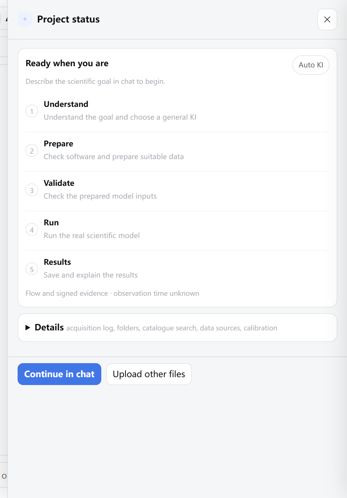
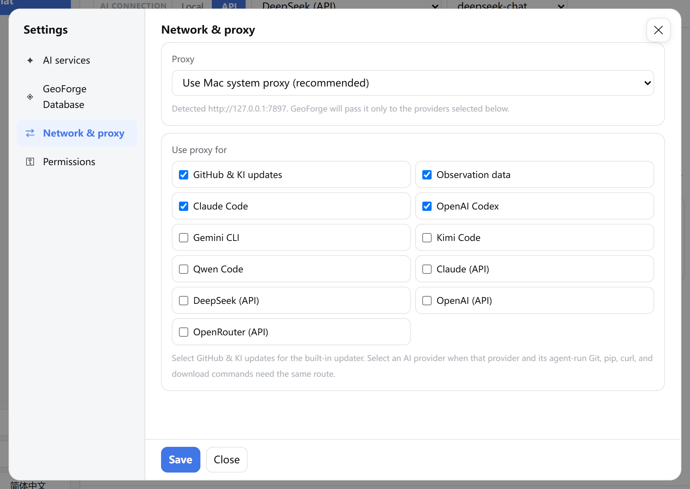
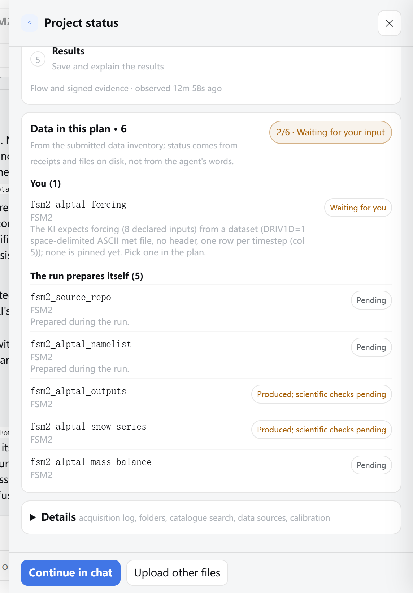
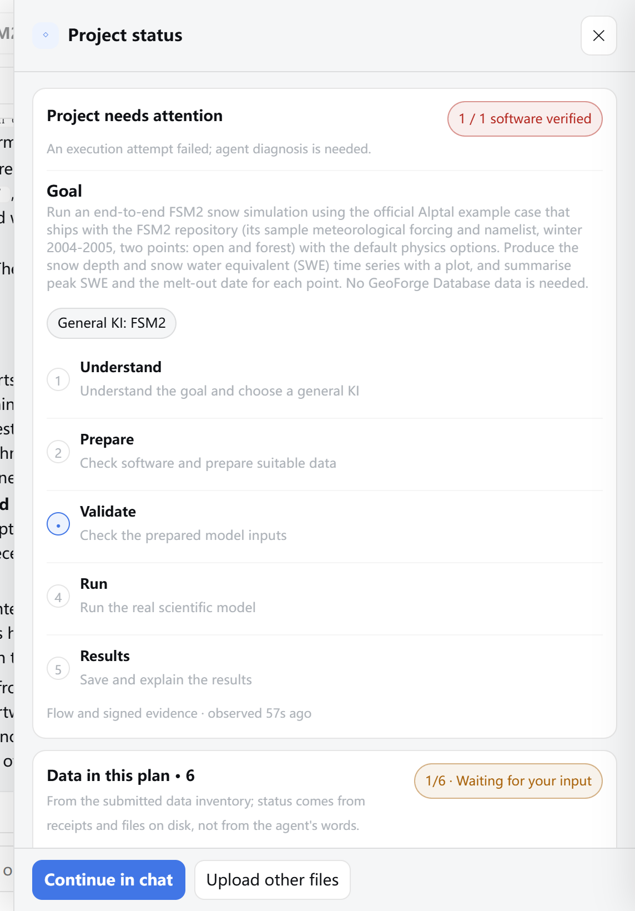
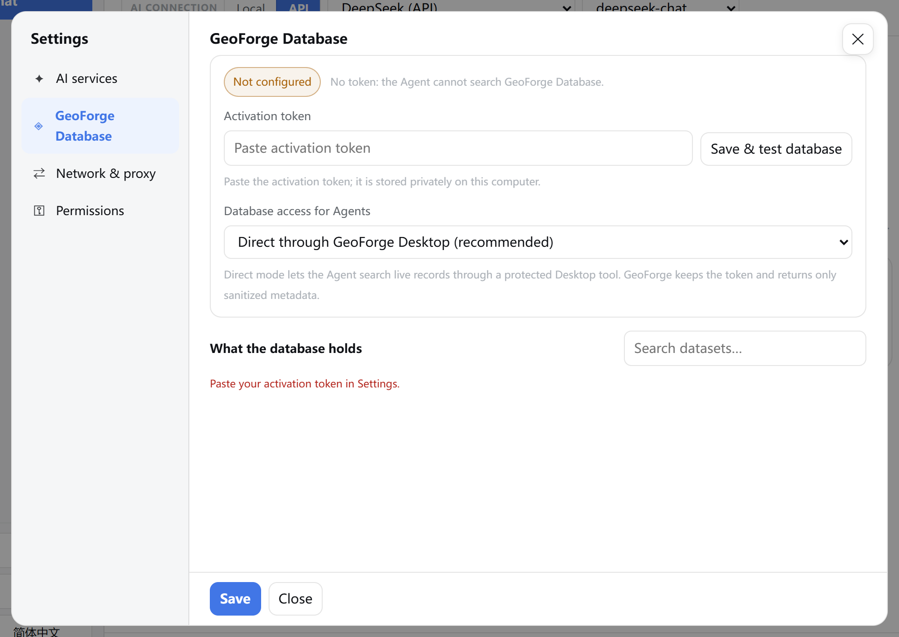

# 9 Troubleshooting, known issues and glossary

In this chapter you will find the fix for the problems people meet most often in GeoForge Desktop 0.6.54, read the known issues of this release in plain words, look up the words the app uses, and learn how to report a problem so that it can be fixed.

> **Tip:** Before you retry or restart anything, read the last real message. Most projects that look stuck are waiting for you: an answer, an approval, a file, or one click.

## 9.1 Where GeoForge tells you what is wrong

Look in these places, in this order:

| Where | What it tells you |
|---|---|
| Top of the sidebar, next to **GeoForge** | How many AI connections work: **N AI ready**, or **AI setup needed**. |
| Banner above the chat | No usable AI (**Connect an AI to begin.**), no usable AI of the kind selected in **AI CONNECTION**, or a KI whose software is not set up yet (**… is not verified on this machine.**). |
| Activity bar below the message box, while the AI works | What the agent is doing, for how long, and the buttons **Recheck**, **Stop** and **＋ New chat**. The chat's entry in the sidebar shows a short state: **Active**, **Running · quiet**, **Check status** or **Connection issue**. |
| **◇ Project status** button in the chat header | A coloured dot. Hover over it to read the state and the summary. |
| **◇ Project status** panel | A headline, a one-line summary, the five stages, **Data in this plan** and **Details**. When something waits for you, a **One thing needs you** card sits on top. |
| Chat lines that start with **GeoForge verification:**, **GeoForge needs you:** or `[GeoForge could not finish this turn: …]` | Messages from GeoForge itself, not from the AI. **GeoForge verification:** reports what the signed run records show. |

To read the project's state:

1. In the chat header, click **◇ Project status**.
2. Read the bold headline (for example **One thing needs you**, **GeoForge is working**, **Project needs attention**, **Project complete** or **Ready to continue**) and the grey summary line under it.
3. If the problem is about data, folders or logs, click **Details**.



Check: the headline (here **Ready when you are**) and the line under it say what GeoForge is waiting for. **Details** holds the acquisition log, folders, catalogue search, data sources and calibration.

Inside **Details**, the first card, **Status evidence**, lists where the status comes from. Its line **Agent/app report (not scientific proof)** ends with GeoForge's latest status sentence, for example "Running — 2 steps done, 0 to go". This chapter calls it the *status line*.

> **Tip:** The five stages (**Understand**, **Prepare**, **Validate**, **Run**, **Results**) show roughly where the work is. During planning and data download the marker stays on **Understand**. Trust the summary line, not the marker.

> **[Screenshot to add]** Chat footer while a DeepSeek (API) planning turn is running: the activity bar below the message box showing a title with elapsed time, a "Project stage: Planning the scientific study" line, and the buttons **Recheck**, **Stop** and **＋ New chat**; the **Send** button reads **Working…**.

## 9.2 Quick fixes: symptom, cause, fix

Find your symptom, then follow the fix. Longer fixes point to a section below.

### Starting and installing

| Symptom | Likely cause | Fix |
|---|---|---|
| **Windows protected your PC** when you run the installer. | GeoForge is not code-signed. | Check the SHA-256 first, then **More info** → **Run anyway**. See 9.12. |
| macOS refuses to open **GeoForge Desktop.app**. | The Mac app is not notarised by Apple. | **Open Anyway** in Privacy & Security, or the `xattr` command. See 9.13. |
| The portable Windows copy does not start. | The zip is not fully extracted, or `GeoForge Desktop.exe` was moved away from its `_internal` folder. | Extract the whole zip to a normal folder. Run `GeoForge Desktop.exe` inside the folder `GeoForge Desktop 0.6.54 Windows`. |
| You closed the browser tab and GeoForge is gone (Windows). | On Windows the tab is only a view. GeoForge keeps running in the tray. | Double-click the GeoForge tray icon, or right-click it → **Open GeoForge**. It may be under the **^** arrow next to the clock. |
| A bookmark to GeoForge stopped working (Windows). | GeoForge uses a new address `http://127.0.0.1:<number>/` at every launch. | Open GeoForge from the tray icon, not from a bookmark. |
| Two GeoForge tray icons, or two GeoForge tabs with different addresses (Windows). | GeoForge was started a second time. | Keep one copy and exit the other. See 9.14. |

### AI connection

| Symptom | Likely cause | Fix |
|---|---|---|
| Sidebar shows **AI setup needed**; banner **Connect an AI to begin.** | No AI provider is usable. | Add an API key or sign in to a CLI in **Settings** → **AI services**. See 9.3. |
| A CLI you just installed still shows **not installed**. | GeoForge reads the list of installed programs only when it starts. | Exit GeoForge from the tray, start it again, then **Recheck local CLIs**. See 9.4. |
| Kimi Code is signed in but never starts (Windows). The chat shows `[Kimi Code was not started: project-scoped security could not be applied …]`. | On Windows, Kimi Code stays off until you allow full computer access. | See 9.3, "Kimi Code on Windows". |
| **Gemini CLI** or **Qwen Code** keeps an amber dot in **Settings**, and the AI list in the chat header shows **… — login checked on first use**. | GeoForge cannot check their sign-in in advance. | Nothing to fix. A failed sign-in shows in the chat the first time you use them. |
| The chat ends with `[GeoForge could not finish this turn: …]`, or the activity bar shows **The live connection may be interrupted** (sidebar entry: **Connection issue**). | Often the connection to the AI provider broke: network, proxy or provider outage. The text after the colon names the error. | Check **Network & proxy**, then send the message again. See 9.3. |

### Chat and cards

| Symptom | Likely cause | Fix |
|---|---|---|
| **Send** is grey. | The AI is still working, a file is still uploading, the selected AI is not usable, or this chat's own AI stopped working. | See 9.5. |
| The **AI CONNECTION** buttons, the AI and model lists and the KI button are grey. Tooltip: **Fixed for this chat — start a new chat to switch AI**. | A chat keeps its AI, model and KI from the first message on. | Click **＋ New chat** and choose them before the first message. See 9.5. |
| The interface suddenly switched to Chinese. | You sent a message that contains Chinese characters. | Click **English** at the bottom of the sidebar. The page reloads in English. See Chapter 8. |
| A question card or the approval card disappeared. | **Not now**, ✕, Esc or a click outside the card hides it for this page visit. The question is still waiting. | **◇ Project status** → **One thing needs you** → **Respond**. See 9.6. |
| You answered in the chat, but GeoForge still waits. | Only an answer given on the card is saved as your answer. | Reopen the card (9.6) and answer there. |
| **Choose one option first.** in red on the card. | You clicked **Continue with this choice** without selecting an option. | Click an option, then **Continue with this choice**. |
| **Enter your answer or file location below.** | You chose **Use my own answer / file** and left the note empty. | Type your value, date range or file location in **Optional note for the agent**. |
| **Return to the chat that asked this question.** | The card belongs to another chat. | Open that chat in the sidebar, then answer. |

### Approval

| Symptom | Likely cause | Fix |
|---|---|---|
| You clicked **Approve and start** and nothing happened. | That click only selects the option. | Click **Continue with this choice**. |
| After you approved, a new approval card appeared. The chat says **The updated card is in the chat; …** | GeoForge re-issued the card: your data pick was re-pinned, an uploaded file was linked to its input, or a server clip size estimate changed. | Read the new card. Approve it again if it still fits. |
| **These still need your decision before anything runs: …** | An input marked **please provide** has no file, or a decision is open. | See 9.7. |
| **Not ready to execute yet** on the approval card. | A step has no tool, or an input is still missing. | Choose **Modify the plan**. See 9.8. |
| The card's **Data** list names a different source than **Data sources, your pick** or a **Waiting on you** line. | Known issue 1. | Do not approve. Choose **Modify the plan**. See 9.16. |
| **GeoForge Database access is off or not activated, but this plan still needs it for … Nothing was approved or downloaded.** | The plan needs Database data, but the Database is off or not activated. | Activate it (Chapter 3) and approve again, or choose **Modify the plan** to use public sources or your own files. |
| **Your saved answers cannot be read (…). Fix or remove that file, then approve again.** | The saved-answers file `.geoforge\user-answers.json` was edited or damaged. | Undo any edit you made to it. If you cannot, report the problem (9.18) before you remove the file: removing it deletes your saved answers. |

### Data

| Symptom | Likely cause | Fix |
|---|---|---|
| Card **Some approved data could not be fetched**, or a row in **Data in this plan** says **Fetch failed**. | Network, server, daily quota, or files already in the target folder. | See 9.9. |
| You clicked **Files are in place, continue**, but the Baidu Pan card stays open. | The files are not exactly in the **Place at** folder, or the copy has not finished. Partial files (for example `.part`, `.crdownload`, or Baidu's `.bc!`) are ignored. | Click **Copy path**, paste it into the File Explorer address bar, move the complete files there, then click the button again. See Chapter 3, 3.7. |
| Banner **Approved data acquired · run not started** (or **· software setup needed**). | The automatic download finished in the background. GeoForge waits for you before it runs the model. | Click **Start the approved run** in the banner. |

### Running and stopping

| Symptom | Likely cause | Fix |
|---|---|---|
| Activity bar: **No new work evidence; the turn may be stuck** (sidebar entry: **Check status**). | Nothing new for about 90 seconds. Compiles and model runs can be quiet for a long time. | Click **Recheck**. If nothing changes for much longer than the step should take, click **Stop**, then send a message that says what you saw. |
| After **Stop** or **Exit GeoForge**, the computer stays busy, or new files keep appearing. | Known issue 2: a job the agent started through Git Bash escaped Stop. | End it in Task Manager. See 9.10. |
| After **Stop**, the chat shows `[… stopped by the user]` and the headline reads **Ready to continue**. | You pressed **Stop**. The stopped attempt is recorded as stopped, not as failed. The status line (9.1) reads "Stopped by you — send a message to continue". | Send a message when you want to continue. |
| After **Approve and start**, GeoForge spends a long time setting up software. | The KI's software is not yet verified on this computer. A first setup can download and compile it. | Wait and watch the activity bar. Known issue 3: setup may also run the model's example. |
| Many black console windows open during calibration (Windows). | Known issue 4. | Leave them open. Closing one counts that model evaluation as failed. |

### Results

| Symptom | Likely cause | Fix |
|---|---|---|
| A **GeoForge verification:** line in the chat, and the project is not **Completed**. | Some approved steps have no passing run record, or files exist that no passing run produced. | See 9.11. |
| Headline **Project needs attention**, summary **An execution attempt failed; agent diagnosis is needed.** | A run's output failed GeoForge's automatic checks. | Send "Please diagnose the failed step and retry." See 9.11. |
| **Completed.** followed by "N earlier failed attempts were superseded by a passing retry". | An earlier attempt failed and a later one passed. | Nothing to fix. The failed attempts stay listed in `runs\evidence.json`. |
| A **Completed** project still shows **Produced; scientific checks pending**, or Project View panels end in "— experimental / unvalidated". | **Completed** means every approved step ran and passed GeoForge's automatic checks. It does not mean the results are validated. | Expected. See **Completed** in the glossary (9.17). |
| After **Completed**, the agent will not run anything more. | **Completed** is final. The chat can still answer questions and draw plots from the existing files. | Start a new chat for another period, scenario or calibration. |

### GeoForge Database

| Symptom | Likely cause | Fix |
|---|---|---|
| **Settings** → **GeoForge Database** shows **Not configured**, **Off**, **Unavailable** or **Not synced**, or a token message. | Token missing, wrong, expired or revoked; access set to off; or no connection. | See 9.15 and Chapter 3. |

## 9.3 No AI is ready

The sidebar shows **AI setup needed**, and a banner says **Connect an AI to begin.** "Open AI Settings" in the banner means the **Settings** button in the sidebar.

A second banner can describe the kind selected under **AI CONNECTION**: **No API connection yet.** when **API** is selected and no key works, or **No local agent CLI is installed.** (or **Local CLIs are installed but not ready**, with a **Recheck** button) when **Local** is selected.

1. In the sidebar, click **Settings**.
2. Click **AI services**.
3. Read the dot and the status word on each card.


Check: a green dot with **signed in** or **key set** means usable. **no key** or **not installed** means not usable yet.

4. For an API provider, paste your key into the **Paste API key** box. Use **Get a key** if you have none.
5. For a local CLI, install it with the command shown on its card and sign in once, then see 9.4. Chapter 2 has the exact commands.
6. Click **Save**. Closing the window without **Save** discards your changes.

Chapter 2 explains each provider and has a longer error table.

### The connection breaks during a turn

A *turn* is one round of work that starts when you send a message. The chat ends with `[GeoForge could not finish this turn: …]` (for example a `ConnectionAbortedError`), or the activity bar shows **The live connection may be interrupted**.

1. In **Settings**, click **Network & proxy**.
2. Under **Proxy**, check the detected address. On Windows, **Use Mac system proxy (recommended)** means your Windows system proxy.
3. Under **Use proxy for**, tick the provider you use if your network reaches it only through the proxy. API providers such as **DeepSeek (API)** are not ticked by default.
4. Click **Save**.



Check: the address under **Proxy**, and a tick next to the provider your chat uses.

5. Send your message again. The chat keeps its history.

> **Tip:** **Test AI & GitHub** on the **AI services** page checks the connection step by step. Its last step sends one tiny real message to the provider, which the provider may bill. If step [2/6] (Python) fails on Windows, it prints macOS advice (`brew install python`). That advice does not apply to Windows; report the failure instead (9.18).

### Kimi Code on Windows

Project-scoped Kimi security is not available on Windows, so Kimi Code does not start by default.

1. In **Settings**, click **Permissions**.
2. Under **Kimi Code file access**, choose **Enable Kimi with full computer access** only if you accept that Kimi Code can read and change every file your Windows account can access.
3. Confirm the warning with **OK**.
4. Click **Save**.


Check: the note under the list. With **Kimi Code disabled (safe)** it says Kimi Code will not start.

## 9.4 A CLI is not detected after you install it

GeoForge reads the list of installed programs (the Windows program path) only when it starts. A CLI installed while GeoForge runs can stay **not installed**, even after **Recheck local CLIs**.

1. Finish installing the CLI.
2. Sign in once in PowerShell, as the CLI's instructions say.
3. Wait until no chat is working.
4. Right-click the GeoForge tray icon.
5. Click **Exit GeoForge**.
6. Start GeoForge again from the Start menu.
7. Click **Settings** → **AI services** → **Recheck local CLIs**.
8. Check that the card now shows a green dot and **signed in**. **Gemini CLI** and **Qwen Code** keep an amber dot even when they work.

On macOS, quit GeoForge and open it again, then recheck.

> **Tip:** CLIs installed with `npm` need Node.js. Claude Code on Windows also needs Git for Windows. OpenAI Codex older than 0.144 shows "update required". Chapter 2 lists the commands.

## 9.5 Your message is not sent, or the chat's AI is locked

Check these causes in order.

1. **The AI is still working.** The **Send** button reads **Working…**. Wait, or click **Stop** in the activity bar. You can work in another chat meanwhile: click **＋ New chat**.
2. **The wrong kind of AI is selected in a new chat.** Look at the **AI CONNECTION** row in the header. **Local** uses a CLI on this computer; **API** uses a key. If you have only an API key and **Local** is selected, **Send** stays grey. Click **API**, then choose the provider and model.


Check: **AI CONNECTION** shows the kind, provider and model you want (here **API**, **DeepSeek (API)**, **deepseek-chat**), and the KI button shows the KI you want (here **Auto KI**). All of them are fixed when you send the first message.

> **Caution:** On Windows the address changes at every launch, so the browser does not remember your last **Local** / **API** choice. A new chat takes the kind of the chat that is open when you click **＋ New chat**. Right after a launch with no chat open, it starts on **Local**. If a CLI is ready, **Send** works, but the chat would then run on that CLI. Check the row before your first message.

3. **The chat is locked to its AI.** After the first message, the **AI CONNECTION** buttons, the AI and model lists and the KI button turn grey. The tooltip says **Fixed for this chat — start a new chat to switch AI**. The conversation lives with the AI that started it, so it cannot move to another one. Click **＋ New chat** and choose again.
4. **This chat's own AI stopped working.** For example, its API key was removed or the CLI signed out. **Send** is grey and you cannot switch. Repair that same AI in **Settings** → **AI services** (paste the key again, or sign in and click **Recheck local CLIs**), or start a new chat.

## 9.6 A question card or the approval card disappeared

**Not now**, ✕, Esc and a click outside the card all hide it. GeoForge does not show the same card again by itself while the page stays open. The question or approval is still waiting.

1. Make sure the chat that asked the question is open.
2. In the chat header, click **◇ Project status**.
3. At the top, find **One thing needs you**. Its bold line is the question, or **Approve the plan?** for an approval card.
4. Click **Respond**. The card opens again.
5. Select an option.
6. Click **Continue with this choice**.

> **[Screenshot to add]** Project status panel of the FSM2 example while the study-period question waits: the card **One thing needs you** at the top with the question title in bold and the **Respond** button, the **Progress** card below it with the marker on **Understand**.

Reloading the page (F5 in the browser tab) and opening the chat again also brings a waiting card back.

> **Caution:** Answer on the card, not by typing in the chat. Only a card answer is saved as your answer and can be cited on the approval card ("From your answer: …"). A typed reply leaves the question open.

## 9.7 Approval is refused because items still need you

After you approve, GeoForge answers **These still need your decision before anything runs:** and lists inputs. Nothing has started, and GeoForge shows the approval card again. If an input expects your own file, the message also says "Upload your file with the Upload button on the card". That text is out of date: the **Upload files** button is in **◇ Project status**, not on the card.

1. Close the card with **Not now**.
2. Click **◇ Project status** and find **Data in this plan**.
3. Under **You**, find the row named in the message. It shows **Waiting for you**.
4. Click that row's **Upload files**.
5. Choose your file. GeoForge saves it in `inputs\user\<input name>\` and says **Saved and queued for your next message (not sent, approved, or verified)**. Uploading does not approve or check anything.
6. In **One thing needs you**, click **Respond** to reopen the approval card.
7. Select **Approve and start**.
8. Click **Continue with this choice**. GeoForge links the file to the input and issues an updated card. The chat says **Your file is now named as the input: …** and **The updated card is in the chat; approve it to start.**
9. Check that the updated card names your file, then approve it the same way.

If the open item is a data source, pick it under **Data sources, your pick** on the card. For anything else, choose **Modify the plan** and say in the note what to use. Chapter 6 (6.6.2) explains uploads for plan inputs.

> **Caution:** Files added with **＋ Files** or **Upload other files** go to `inputs\uploads\` and are never linked to a plan input. Use the row's own **Upload files** button.

## 9.8 "Not ready to execute yet" on the approval card

The approval card can end with a section **Not ready to execute yet**. It lists lines such as "step … has no tool — not ready to execute" or "step … input … is still missing". In **Steps**, such a step shows **no tool — cannot execute** in red.

GeoForge does not block **Approve and start** here. If you approve anyway, a step without a tool cannot produce a run record, so the project cannot reach **Completed** without a plan change.

1. On the approval card, select **Modify the plan**.
2. In **Optional note for the agent**, say exactly what should change. For example: "Step stage_inputs has no tool. Use the KI's run tool to stage the forcing inside the project, and keep all outputs in the project folder."
3. Click **Continue with this choice**. GeoForge sends the plan back to the agent with your note.
4. Answer the question card if the agent asks one.
5. On the new approval card, check that **Not ready to execute yet** is gone.
6. Check that every step in **Steps** names a tool, **run by GeoForge (preflight)** (GeoForge's own check that the model software works), or **written by the agent**. Then approve.

When in doubt, choose **Modify the plan** rather than approving.

> **[Screenshot to add]** Approval card **Approve the plan?** for a plan with an unexecutable staging step: the **Steps** section with one step marked **no tool — cannot execute** in red, and the **Not ready to execute yet** section below it listing that step; the options **Approve and start** and **Modify the plan** visible, **Modify the plan** selected with a note typed.

## 9.9 Approved data could not be downloaded

Signs: a card **Some approved data could not be fetched** lists each failed input with its error; the row in **Data in this plan** says **Fetch failed**; the pill of **Data in this plan** reads **Data needs attention**. The card offers **Retry the missing data**, which fetches only the missing items, and **Modify the plan**, which sends the plan back to the agent with your note.

1. Read the error after each input name on the card.
2. Remove the cause:

| Error on the card | What to do first |
|---|---|
| "GeoForge could not reach GeoForge Database." | Check your internet connection, and **Observation data** under **Use proxy for** in **Network & proxy**. |
| "GeoForge Database server or gateway is unavailable." | Wait and try again later. The problem is on the server side. |
| "Daily download limit reached; resets at midnight server time." | Wait until after midnight server time. |
| "The downloaded file failed integrity verification twice." | Try again later. If it happens again, report it to the database owner. |
| "… already holds files with no receipt … Existing files were not overwritten." | Move the files out of the named folder (do not delete them), then retry. Or choose **Modify the plan** to use them as your own input. |
| A token message ("That token isn't right…", "Your token expired…", "This token was revoked…") | Fix the token first. See 9.15. |

3. On the card, select **Retry the missing data**. To use other data instead, select **Modify the plan** and name the source in the note.
4. Click **Continue with this choice**.

If you closed the card, reopen it with **◇ Project status** → **Respond** (9.6). Chapter 3, section 3.10, lists every database message.

> **[Screenshot to add]** Card **Some approved data could not be fetched** for a plan with one GeoForge Database input, its message listing the input and the error (for example "GeoForge could not reach GeoForge Database."), with the options **Retry the missing data** and **Modify the plan**.

> **Caution:** GeoForge Database downloads were not tested end to end on Windows for 0.6.54. If a retry keeps failing with the same error, report it (9.18).

## 9.10 Stop did not end a background job (Windows)

**Stop** ends the current turn of the chat: the agent, any KI tool or setup command, and the programs they started. Tray **Exit GeoForge** does the same before it quits. Model runs that GeoForge records are stopped normally.

The exception (known issue 2): a local CLI agent such as Claude Code runs commands through Git Bash (the command window that comes with Git for Windows). If it starts a job with `nohup`, `timeout`, `env`, `sh -c` or a bash script, Windows loses the link to that job, and **Stop** cannot find it. Signs: the computer stays busy after **Stop**, or new files keep appearing in the project folder. Files such a job writes later block **Completed**.

1. Press Ctrl+Shift+Esc to open Task Manager.
2. Click **Details**.
3. Right-click any column heading.
4. Click **Select columns**.
5. Tick **Command line**, then click **OK**.
6. Look for processes such as `bash.exe`, `sh.exe`, `nohup.exe`, `timeout.exe`, `python.exe`, or your model's program (for example `FSM2.exe`) whose command line contains your project folder or model folder.
7. Right-click that process.
8. Click **End task**. For a shell (`bash.exe`, `sh.exe`) that started other programs, click **End process tree** instead.
9. Back in GeoForge, send a message when you want to continue.

> **[Screenshot to add]** Windows 11 Task Manager, **Details** page with the **Command line** column added, one `python.exe` row selected whose command line contains `D:\GeoForge-Manual\projects\…`, and the right-click menu showing **End task** and **End process tree**.

> **Caution:** Do not end `GeoForge Desktop.exe` or `geoforge-agent-bridge.exe` (that quits GeoForge without stopping its work cleanly), and do not end processes whose command line does not point to your project or model folder: they may belong to other programs.

## 9.11 The project does not reach Completed

A project is **Completed** only when all of these hold:

- the plan you approved is still valid;
- every approved step has a passing run record, and its outputs passed GeoForge's automatic checks;
- no result file exists that no passing run produced;
- no step used an input file that was rewritten afterwards.

Read the last **GeoForge verification:** line in the chat, and the status line under **◇ Project status** → **Details** → **Status evidence** (9.1). In these messages, a *receipt* is a run record; "unreceipted" or "not vouched for" means no passing run record covers the file.

| You see | What it means | What to do |
|---|---|---|
| Status line **Running — N steps done, M to go** | M approved steps have no passing run record yet. | Ask the agent to run the remaining approved steps. |
| Status line ending "…, K unreceipted files", and **GeoForge verification:** "not complete yet — these files are not vouched for by a passing receipted run … regenerate or remove them: …" | Files exist that a failed attempt left or that were written outside GeoForge's recorder: for example by the setup agent (known issue 3) or by a plan step marked "written by the agent". | Reply: "Please regenerate these files through the approved steps, or remove them if they are not needed." If the agent will not remove them, and they are not your own inputs, move them yourself to a folder of their own inside the project, for example `notes\`, and send a message so GeoForge checks again. GeoForge checks only `outputs\`, `artifacts\`, `inputs\` and `calibration\`. |
| Headline **Ready to continue** after a run, not **Completed**, and no **GeoForge verification:** line in the chat | 0.6.54 drops the verdict of a run that starts straight after software setup (fixed in source). | Send any message in the chat, for example "Why is the project not Completed?". The next turn ends with the verdict. |
| **GeoForge verification:** "not complete yet — these steps passed on input files that were rewritten afterwards; rerun them: …" | An input changed after the step passed. | Ask the agent to rerun the named steps. |
| **GeoForge verification:** "this turn ran no receipted step and downloaded nothing." | The agent described work it did not run through GeoForge. | Do not use numbers from that turn. Ask the agent to run the approved step. |
| Headline **Project needs attention** ("An execution attempt failed; agent diagnosis is needed."); status line **A run failed validation — see runs/evidence.json** | A step's latest attempt failed GeoForge's automatic checks. This also happens when the agent reruns a step that had already passed and that attempt fails. | Send "Please diagnose the failed step and rerun it exactly as approved." GeoForge reruns under the same approval and reuses data it already has. The latest attempt counts, and the agent's own words do not: check the status line again after its reply. |
| Status line **The agent needs a plan change**, then **The agent is revising the plan** | The agent found it needs another tool, data source, period or model. | Wait for the new approval card, read it, and approve it if it fits. Your earlier approval is withdrawn. |
| Headline **Ready to continue**; status line **Stopped by you — send a message to continue** | You pressed **Stop**. | Send a message to continue. |



Check the data list: here the outputs read **Produced; scientific checks pending** and one input still reads **Waiting for you**, although the model ran. **Project status** shows what the run records prove, not what the agent says.



Check the headline **Project needs attention** and its line "An execution attempt failed; agent diagnosis is needed." Chapter 5 shows how this project reached this state.

> **Caution:** Do not edit or delete anything in `.geoforge\`, or the files `runs\plan.json`, `runs\data-inventory.json` and `runs\approval.json`. A plan changed after approval forces a new plan and a new approval.

## 9.12 Windows SmartScreen blocks the installer

GeoForge is not code-signed, so Windows SmartScreen may stop the installer the first time.

1. Download the installer only from the `windows-v0.6.54` release page: <https://github.com/lzwei196/KISS-Knowledge-Infrastructure-for-Scientific-Simulation/releases/tag/windows-v0.6.54>.
2. Check its SHA-256 (a fingerprint of the file) against the value on the release page, as Chapter 1 describes. For example, in PowerShell:
    `Get-FileHash "C:\Users\you\Downloads\GeoForge-Desktop-Setup-v0.6.54-Windows-x64.exe" -Algorithm SHA256`
    If the value differs, delete the file and do not run it.

3. Double-click the installer.
4. If **Windows protected your PC** appears, click **More info**.
5. Check that the app name is `GeoForge-Desktop-Setup-v0.6.54-Windows-x64.exe`.
6. Click **Run anyway**.

> **[Screenshot to add]** Windows SmartScreen dialog **Windows protected your PC** after clicking **More info**, showing App: `GeoForge-Desktop-Setup-v0.6.54-Windows-x64.exe`, Publisher: Unknown publisher, and the buttons **Run anyway** and **Don't run**.

The installer needs no administrator rights. It installs for your user only, into `%LOCALAPPDATA%\Programs\GeoForge Desktop`.

> **Caution:** Use only the Windows files from `windows-v0.6.54`. The tested Windows build is the one on that page.

## 9.13 macOS blocks the app

The Mac app (release `v0.6.54`) is not notarised by Apple. macOS blocks it the first time, and again after every update. Do this only for an app you downloaded from the official release page and checked (Chapter 1).

**With System Settings:**

1. Try to open **GeoForge Desktop** once.
2. Close the warning.
3. Open the Apple menu → **System Settings** → **Privacy & Security**.
4. Scroll to **Security**. Next to the message about GeoForge Desktop, click **Open Anyway**.
5. In the dialog that follows, confirm that you want to open the app.
6. Enter your password or use Touch ID if macOS asks.

> **[Screenshot to add]** macOS System Settings → **Privacy & Security**, scrolled to the **Security** section, showing the line that "GeoForge Desktop" was blocked and the **Open Anyway** button.

**With Terminal:** run this once, using the place where the app is:

```bash
xattr -dr com.apple.quarantine "/Applications/GeoForge Desktop.app"
```

## 9.14 Opening, quitting, and a second copy of GeoForge

| | Windows | macOS |
|---|---|---|
| Where GeoForge shows | In your default web browser, plus a tray icon | In its own window |
| Closing the tab or window | GeoForge keeps running, and so does its work | GeoForge quits, and running work stops |
| Reopen | Double-click the tray icon, or right-click → **Open GeoForge** | Open the app again |
| Quit | Right-click the tray icon → **Exit GeoForge** | Close the window, or quit the app |

On Windows there is no guard against starting GeoForge twice. If you start it from the Start menu or desktop icon while it runs, a second copy starts with its own tray icon and its own address. The two copies do not know about each other: a chat that is working in one copy does not look busy in the other, and **Stop** or **Exit GeoForge** in one copy does not end work started by the other.

1. Find the browser tab where your work runs, and note its address, for example `http://127.0.0.1:52814/`.
2. Double-click each GeoForge tray icon in turn. Each one opens its own address in the browser.
3. Right-click the tray icon whose address you do not need.
4. Click **Exit GeoForge**.
5. Next time, reopen GeoForge from its tray icon instead of the Start menu.

> **[Screenshot to add]** Windows notification area with two GeoForge tray icons visible (hidden-icons flyout open), one of them right-clicked, showing the menu **Open GeoForge** / **Exit GeoForge**.

> **Caution:** **Exit GeoForge** stops all running work of that copy first. A model run in progress is interrupted.

## 9.15 GeoForge Database token problems

Open **Settings** → **GeoForge Database**. Read the pill at the top and the sentence next to it. After you click **Save & test database**, the result appears under the token box.



Check: the pill. **Not configured** means no token is saved, so the agent cannot search the database.

| Pill | Meaning | What to do |
|---|---|---|
| **Not configured** | No token is saved. | Paste your token under **Activation token** and click **Save & test database**. |
| **Off** | **Database access for Agents** is set to **Do not provide database access**. | Choose **Direct through GeoForge Desktop (recommended)**, then **Save**. |
| **Unavailable** | The token cannot be used: the server rejected it, or GeoForge could not read the stored token. | Read the sentence next to the pill, fix the token, and click **Save & test database**. |
| **Not synced** | The token is saved, but the local copy of the catalogue has not been downloaded yet. | Click **Save & test database**, which also downloads the catalogue. Reopen **Settings** after a minute. |

Common token messages are "That token isn't right — check for a copy/paste miss.", "Your token expired — ask the group owner for a new one." and "This token was revoked — ask the group owner." Chapter 3 explains how to get a token (3.2), how to enter it (3.3), and every other message (3.10).

Without the database, plans that use public sources or your own files still work.

## 9.16 Known issues in 0.6.54

These issues were known when `windows-v0.6.54` was published. Most are Windows issues.

### 1. Check the approval card's data list against the data-source choice before approving (important)

The approval card can name the data for an input in two places:

- the **Data** section, with lines like `input ← dataset id`: this is what GeoForge downloads and the model uses;
- **Data sources, your pick**, or a **Waiting on you** line such as "… defaults to NASA POWER unless you pick another": this is the source the planner says it chose.

GeoForge does not check that the two agree. It also hides sources that are not in the GeoForge Database catalogue, such as NASA POWER, yet can still say "defaults to" them. If you approve, the signed approval can record one source while another dataset is downloaded and used.

Before every approval:

1. In **Data**, read each line `input ← dataset id`.
2. Compare it with **Data sources, your pick** (when shown) and with every **Waiting on you** line.
3. If they name different sources, or a source in **Waiting on you** appears nowhere in **Data** or in the choices, do not approve. Select **Modify the plan**.
4. In the note, write the source you want.
5. Click **Continue with this choice**.
6. After a later approval, open **◇ Project status** → **Data in this plan** and check which dataset was fetched.

> **[Screenshot to add]** Approval card **Approve the plan?** with the GeoForge Database activated, where **Waiting on you** says "… defaults to NASA POWER unless you pick another" while the **Data** section shows `forcing ← ` a CMFD dataset id; both places marked with callouts. If this state cannot be reproduced, use an annotated mock-up labelled as such.

### 2. Stop and Exit can miss jobs started through Git Bash (Windows)

Jobs that an agent CLI started with `nohup`, `timeout`, `env`, `sh -c` or a bash script can keep running after **Stop** or **Exit GeoForge**. Recorded model runs stop normally. End leftover jobs in Task Manager (9.10).

### 3. Software setup can run the whole model

After approval, the agent that installs the model software may also run the model's example. This costs time and AI tokens and leaves extra files (about 15 MB for FSM2) in the shared software folder. Those results never count toward your project. If it writes them into the project's `outputs\` folder, as in the first run for this manual, they have no run record and keep the project from **Completed** until they are removed (9.11).

### 4. Calibration opens a console window per model run (Windows)

In the installed Windows app, every model evaluation during calibration opens a black console window, often hundreds. Leave them alone; each closes when its evaluation ends. Closing one by hand counts that evaluation as failed. Chapter 7 covers calibration.

### 5. Not yet tested end to end on Windows

Only FSM2 with the DeepSeek API was run end to end in the Windows app, and it finished **Completed**. That was a forward run of the official example, not a validation against observations. These were not yet exercised end to end on Windows: the Codex, Claude Code and Kimi Code CLI agents; GeoForge Database downloads (direct, server clip and Baidu Pan); calibration; and the other KIs. Expect rough edges there, and report what you find (9.18).

### 6. Found while writing this manual

- **Do not reload or close the GeoForge tab while the agent works (Windows).** Reloading (F5), closing the tab or restarting the browser during planning, setup or a run ends that turn with "GeoForge could not finish this turn: ConnectionAbortedError…" or "The provider failed or was interrupted". If it happens, send a message to continue. Fixed in source for the next build.
- **No verdict after a run that follows setup.** When the software is set up right after your approval, the run's final **GeoForge verification** line or **Completed.** line is not shown, and **◇ Project status** just says **Ready to continue**. Send any message; the next turn shows the verdict (9.11). Fixed in source for the next build.
- **A plan step "written by the agent" can block Completed.** On the approval card, a step marked "written by the agent" has no tool, so it can never get a run record. If it writes result files into `outputs\` or `artifacts\`, the project cannot reach **Completed** until those files are moved out (9.11). If such a step is not essential, select **Modify the plan** and ask for it to be dropped, or for its result to be given in the chat only.
- **The FSM2 plot option fails on Windows.** The FSM2 tools' `--plot` option needs a plotting package that the Windows installation lacks. The agent then draws the plot another way; the numbers are unaffected.
- **Archiving a chat can fail silently (Windows)** when a file in its project folder is open in another program, such as File Explorer or Excel. Close it and try again.

### 7. Smaller items

- **Whole-product sizes.** The agent may quote the size of a whole product (for example CMFD, several hundred GB) as if it were your download. The size on the approval card row is the one that counts.
- **No map check for GeoTIFF.** The Windows app cannot read rasters, so a delivered GeoTIFF that covers the wrong area is kept as pending, not rejected. Check the map extent yourself.
- **Some compressed netCDF files cannot be read** by the Windows app, because the compression plug-ins do not load.
- **Out-of-date wording.** The **Details** → **GeoForge Database** card says "Configure the token in AI settings": use **Settings** → **GeoForge Database**. Banners that say "AI Settings" mean **Settings** → **AI services**. The approval refusal's "Upload button on the card" is the row's **Upload files** button in **◇ Project status** (9.7).
- **"Use Mac system proxy (recommended)" on Windows** means the Windows system proxy.
- **No folder picker on Windows.** **Choose…** in **New project chat** only says "Browser mode: type the folder path here." Copy the path from the File Explorer address bar and paste it.
- **KI library updates on Windows.** **Check again** usually ends with "Current KI library kept", because the online library has no Windows install notes yet. This is expected. See Chapter 7.
- **The Mac release is older.** The macOS `v0.6.54` app (19 September 2026) was built before the Windows 0.6.54 build (30 September 2026). Planning cards, upload linking, background downloads and **Stop** can look or behave differently on a Mac.

## 9.17 Glossary

| Term | Meaning |
|---|---|
| **Agent** | The AI working in your chat. It is either a local CLI on your computer (for example Claude Code, OpenAI Codex, Kimi Code) or an API model (for example DeepSeek (API)). GeoForge decides what it may do at each stage. |
| **Local** / **API** | The two kinds of AI under **AI CONNECTION**. **Local** uses a CLI (command-line program) installed and signed in on this computer. **API** uses a cloud AI service through a key you paste in **Settings**. |
| **Turn** | One round of work that starts when you send a message and ends when the AI's reply is saved. **Stop** ends the current turn. |
| **KI** (Knowledge Infrastructure) | GeoForge's package for one scientific model or workflow: how to install and check the software, which inputs it needs, which tools run it, and which checks its outputs must pass. All KIs are listed in **KI Library**. |
| **Auto KI** | The default: the header shows **Auto KI** and **Chooses for each task**. GeoForge reads your first request, picks the KI, and announces it in the chat, for example "Task understood · KI: FSM2. Building the plan…". If it picked the wrong model, start a new chat with the right KI pinned. |
| **Pinned KI** | A KI you choose yourself in **Knowledge Infrastructures for this chat** (the KI button in the header) before the first message. It is fixed for the chat. Loose word matches and negated mentions ("do not use CaMa-Flood") do not add other KIs, but a catalogue model you name plainly in your first message is added. |
| **Verified on this machine** | The KI's scientific software passed its check on this computer. Otherwise the KI shows **Setup needed**. It says the software runs here. It does not say your data are ready or your results are valid. |
| **Flow** | GeoForge's fixed path for a scientific chat: understand the task, plan (one question at a time), approval, data, software setup, the approved steps with run records, checks, **Completed**. In a chat, nothing is downloaded, installed or run before you approve. **◇ Project status** names its source as "Flow and signed evidence". |
| **Approval card** | The card **Approve the plan?** showing the whole plan: **What I understood**, **Data**, **Data sources, your pick** (when offered), **Steps**, **Scientific decisions**, **Waiting on you** and, if any, **Not ready to execute yet**. Its options are **Approve and start** and **Modify the plan**. Your approval is signed into `runs\approval.json`. |
| **Run record** (receipt) | The signed record GeoForge writes for every approved step and every acquired input: the command, a fingerprint of the program, the exit code, fingerprints of the input and output files, and the approval it belongs to. Messages call it a "receipt". Only run records count as proof, never the agent's words. They are kept in `.geoforge\receipts\`. |
| **Completed** | Panel headline **Project complete**; status line "Completed — every step has a verified receipt". Every approved step has a passing run record, and its outputs passed GeoForge's automatic checks (for example: the files exist and are not empty, contain no missing or infinite values, cover the expected time steps, and are not one constant value). It does **not** mean the model was validated against observations. It is final: the chat can still answer questions and draw plots from the existing files, but a new experiment needs a new chat. |
| **Acquisition** | GeoForge bringing in the approved data after you approve: by direct download, server clip, or Baidu Pan manual delivery. Acquired data are not checked science: rows read **Acquired; scientific checks pending**. |
| **Server clip** | For a large GeoForge Database dataset, the server cuts out your study area (and period or variables), and GeoForge downloads only that part, up to 2 GB. Direct downloads are for files up to 100 MB. |
| **Baidu manual delivery** | For data the server cannot send, **◇ Project status** shows a Baidu Pan card with the link, the **Extraction code**, the file to take from the share and a **Place at** path. You download, place the files, and click **Files are in place, continue**. The link and code are shown only to you, never to the agent. The run record proves which files you placed; there is no server checksum for them. |
| **Project folder** | The folder one chat owns, named `<date>-<project name>--<chat id>`, by default in `C:\Users\you\kiss\projects`. It holds `inputs`, `outputs`, `artifacts`, `runs`, `memory` and `.geoforge`, among others. Open it with **▣ Folder**. Installed model software is kept outside it, in a shared folder such as `C:\Users\you\kiss\fsm2`. |

## 9.18 How to report a problem

A good report lets someone else see what you saw. Collect the items below, read every file before you send it, and remove private data.

### What to include

| Item | Where to find it |
|---|---|
| GeoForge version and release, for example "0.6.54, `windows-v0.6.54` installer" | Windows: Windows **Settings** → **Apps** → **Installed apps** → **GeoForge Desktop**. The portable copy's folder is named `GeoForge Desktop 0.6.54 Windows`. macOS: the release you downloaded (`v0.6.54`). |
| Operating system | Windows: press Win+R, type `winver`, press Enter; note the edition and version, and whether Windows runs in Chinese. macOS: Apple menu → **About This Mac**; note the macOS version and the chip. |
| AI and KI | The **AI CONNECTION** row (**Local** or **API**, provider, model) and the KI shown in the header. |
| What you did, what you expected, what happened | Your own words, with the approximate time. |
| A screenshot of **◇ Project status** | The whole panel. If the problem is about data, open **Details** too. Add a screenshot of the card or message you are reporting. |
| The chat text | Point at a message; a **Copy** button appears next to the sender's name. Paste the text into your report. Exact text helps more than a picture. The whole conversation is in `memory\transcript.jsonl`; send it only if asked, and read it first. |
| Files from `runs\` | Click **▣ Folder** in the chat header to open the project folder. See the table below. |

| File | What it shows |
|---|---|
| `runs\project-events.jsonl` | The project's timeline |
| `runs\evidence.json` | What GeoForge verified, step by step |
| `runs\flow-state.json` | The current Flow state |
| The newest files in `runs\logs\` | The output of each recorded tool run |
| `runs\plan.json`, `runs\data-inventory.json` | The plan and its data list, if the problem is about the plan or data |

For a software-setup problem started from the **Agent setup** page, also include `setup-agent.log` from the model's installation folder (for example `C:\Users\you\kiss\fsm2`), if it exists. For a connection problem, include the text of the **Test AI & GitHub** report.

### Never include

> **Caution:** Never put any of these in a report, a screenshot or a shared folder:
>
> - API keys, and the GeoForge Database activation token;
> - Baidu Pan links and extraction codes, and the file `.geoforge\manual-download-details.json`, which stores them;
> - `%APPDATA%\KISS\settings.json` (macOS: `~/Library/Application Support/KISS/settings.json`), which stores API keys in plain text;
> - the whole project folder or the whole `.geoforge` folder;
> - screenshots of the small settings box inside **KI Library**, which shows the end of each API key.
>
> Replace your user name in paths with `you`, for example `C:\Users\you\kiss\projects\…`.

### Where to send it

- Open an issue at <https://github.com/lzwei196/KISS-Knowledge-Infrastructure-for-Scientific-Simulation/issues>. Issues are public, so check again that nothing private is included.
- For token, quota or Baidu Pan delivery problems, contact the GeoForge Database owner who gave you the token (Chapter 3, 3.2).
