# 5 你的第一个项目

本章带你完整做一个项目，从写下请求一直到 **Completed**（已完成）。用的是 FSM2 积雪模型的官方示例：瑞士 Alptal，2004–2005 年冬季。你会看到 GeoForge 一路上弹出的每张卡片，知道每张卡片要看什么，以及怎样阅读结果。

截图来自 2026 年 10 月 1 日在 Windows 上的一次真实运行，界面为中文，使用 **DeepSeek (API)** 和模型 **deepseek-chat**。你的 AI 提问和写计划的措辞会不一样，但步骤和要检查的地方不变。

中文模式下，有些文字仍显示为英文：批准卡片的标题和选项、GeoForge 在对话里发出的状态消息、**◇ 项目状态** 里标题下面那行摘要，以及 AI 写的内容（本例的请求是英文，所以 AI 的问题、选项和总结也是英文）。本章照原样写出这些英文，第一次出现时在括号里给出中文意思。括号里的中文不会显示在界面上。

## 开始之前

| 你需要 | 在哪里设置 |
|---|---|
| 一个已就绪的 AI，这里是 **DeepSeek (API)** | 第 2 章 |
| FSM2 KI。它随 GeoForge 一起提供。 | 不用做什么 |
| 在这台电脑上验证过的 FSM2 软件 | 可选：如果还没验证，你批准计划后 GeoForge 会设置它（第 4 章）。第一次会多花大约五分钟。 |
| GeoForge 数据库访问 | 不需要：本例使用 FSM2 自带的驱动数据。 |

本章展示的这次运行（FSM2 已经验证过）用了多长时间：

| 时刻 | 点击 **发送** 后的分钟数 |
|---|---|
| 出现第一个规划问题 | 1 |
| 出现批准卡片 | 3 |
| **Completed** | 4 |

规划的每个回合和模型运行都要用你的 AI。回合是指你发一条消息后，AI 做的这一轮工作。用 DeepSeek 跑这个例子花费很少，不过回合数因 AI 而异。

> **注意（Windows）：** 在 0.6.54 中，AI 工作期间请保持 GeoForge 的浏览器标签页打开。刷新（F5）、关闭标签页或重启浏览器，都会结束当前回合（第 9 章 9.16 节）。如果发生了这种情况，发一条消息就能继续。

## 第 1 步：新建项目对话

1. 点击侧边栏顶部的 **＋ 新建对话**。
2. 在 **项目名称** 中输入 `Alptal snow example`。
3. 在 **在此位置创建项目** 中，保留默认文件夹，或者输入其他文件夹，例如 `D:\GeoForge-Manual\projects`。

    

    确认 **项目文件夹（自动创建）** 显示了项目将要创建的位置。

4. 点击 **创建对话**。

第 6 章详细介绍这个对话框和项目文件夹。

## 第 2 步：为这个对话选择 AI

1. 在 **AI 连接** 下，点击 **API**。
2. 在第一个下拉列表中选择 **DeepSeek (API)**。
3. 在第二个下拉列表中选择 **deepseek-chat**。

    

    确认对话名称出现在顶部和侧边栏中，侧边栏里名称下方显示 **Auto KI · 0 messages**（自动选择 KI · 0 条消息）。这一行在中文模式下也是英文。

发送第一条消息后，这些选择就固定了。以后想换 AI，请新建对话。

## 第 3 步：选择 KI

你可以保留 **自动选择 KI**，让 GeoForge 根据你的请求选择模型。自己选择的话，结果更好预料：

1. 点击对话标题栏中的 **自动选择 KI**。
2. 在 **搜索 KI…** 框中输入 `FSM2`。

    

3. 点击 FSM2 这一行，勾选它。
4. 点击 **应用**。

    

    确认标题栏显示 **FSM2** 和它的状态。在一台新电脑上，这里显示 **需要设置**，还有一条英文横幅 "**FSM2** is not verified on this machine. You can keep chatting, but the scientific software must pass before it runs."（FSM2 尚未在本机验证。你可以继续对话，但科学软件必须先通过检查才能运行。）这没有关系：你批准计划后，GeoForge 会设置软件。

## 第 4 步：写下请求

1. 点击消息输入框（**提出科学问题或描述一个建模任务…**）。
2. 输入或粘贴下面的请求：

    > Run an end-to-end FSM2 snow simulation using the official Alptal example case that ships with the FSM2 repository (its sample meteorological forcing and namelist, winter 2004-2005, two points: open and forest) with the default physics options. Produce the snow depth and snow water equivalent (SWE) time series with a plot, and summarise peak SWE and the melt-out date for each point. No GeoForge Database data is needed. Use only the FSM2 KI's own tools for every step.

    中文大意：使用 FSM2 仓库自带的官方 Alptal 示例（自带的气象驱动数据和 namelist，2004-2005 年冬季，开阔地和林地两个点），用默认物理选项端到端运行一次 FSM2 积雪模拟。输出雪深和雪水当量（SWE）时间序列并作图，总结每个点的 SWE 峰值和积雪融尽日期。不需要 GeoForge 数据库的数据。每一步都只使用 FSM2 KI 自带的工具。

    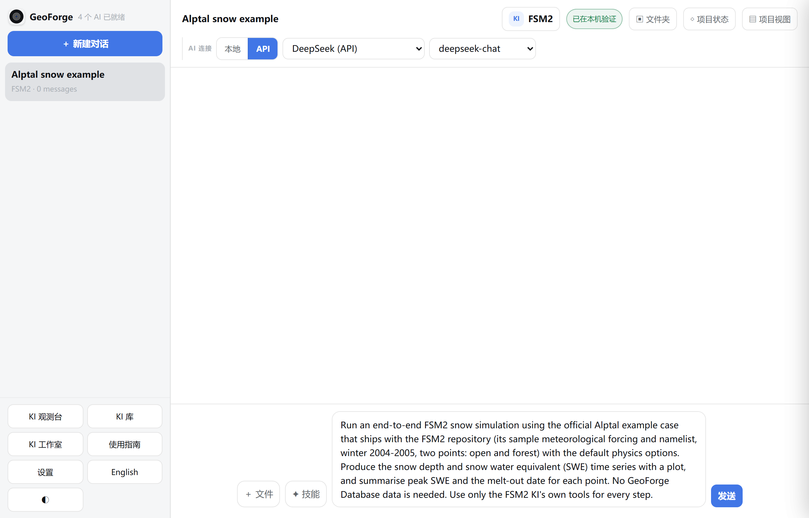

一个好的请求会写清：

| 写什么 | 本例中 |
|---|---|
| 模型和案例 | FSM2，官方 Alptal 示例 |
| 地点和时段 | Alptal，2004–2005 年冬季，开阔地和林地各一个点 |
| 对你重要的设置 | 默认物理选项 |
| 你想要的输出 | 雪深和 SWE 时间序列、一张图、每个点的 SWE 峰值和积雪融尽日期 |
| 你已有的数据，或不想用的数据 | 自带的驱动数据；不用 GeoForge 数据库的数据 |
| 工作该怎么做 | 只用 KI 自带的工具 |

> **提示：** 在请求里要求每一步都使用 KI 自带的工具。为本手册做的第一次运行中，计划里有一个 **由 Agent 直接产出** 的步骤（没有工具），结果项目没能达到 **Completed**（见下文“如果项目没有达到 Completed”）。

## 第 5 步：发送，让 AI 制定计划

1. 点击 **发送**。

    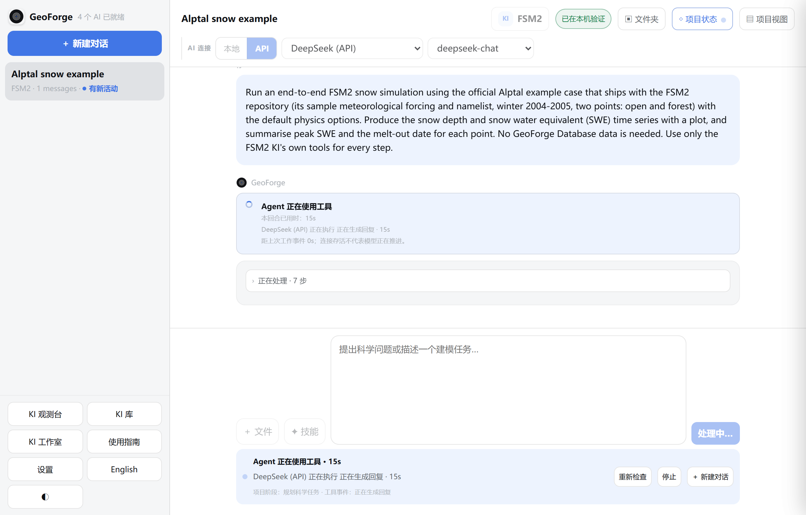

    确认 **发送** 变成了 **处理中…**，并且消息输入框下方的活动栏显示 AI 正在做什么，例如 **Agent 正在使用工具** 和已用时间，以及一行“项目阶段：规划科学任务”。

AI 制定计划期间，GeoForge 只允许它读取 KI 和你的项目，并起草计划。这时它还不能下载、安装或运行任何东西。活动栏有三个按钮：

| 按钮 | 作用 |
|---|---|
| **重新检查** | 刷新活动栏里关于 AI 当前活动的信息 |
| **停止** | 结束当前回合。之后发一条消息即可继续。 |
| **＋ 新建对话** | 开始另一个对话。这个对话继续工作。 |

## 第 6 步：回答规划阶段的问题

AI 需要你做决定时，会弹出一张带 **需要你** 标签的卡片。这次运行只有一个问题：FSM2 用哪套物理选项。

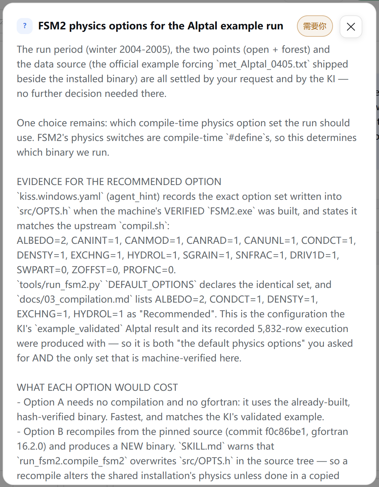

确认卡片标题（这里是 "FSM2 physics options for the Alptal example run"，意思是“Alptal 示例运行的 FSM2 物理选项”）和下面的说明。AI 会说明它依据了哪些证据，以及每个选项的代价。卡片上的问题和选项是 AI 写的，本例中是英文。

1. 阅读问题和说明。在卡片里向下滚动，看完全部内容。
2. 点击你要的选项。本例选择 **A — Use the verified pre-built FSM2.exe with its default physics options (recommended)**（A：直接使用已验证、预先编译好的 FSM2.exe 和它的默认物理选项，推荐）。

    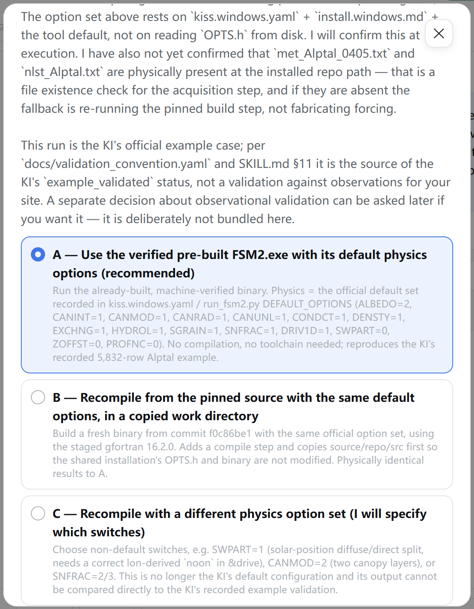

    确认你选的选项已高亮显示。

3. 滚动到卡片底部，点击 **按此选择继续**。

问题卡片的底部有下面这些控件。批准卡片（第 7 步）也有这些控件，只是没有 **使用我的答案 / 文件**。

| 控件 | 用途 |
|---|---|
| **使用我的答案 / 文件** | 用自己的话回答，或者给出文件位置。回答写在 **给 Agent 的可选说明** 里。 |
| **给 Agent 的可选说明** | 为你的选择补充背景 |
| **按此选择继续** | 发送你的回答。AI 接着制定计划。 |
| **询问这些选项** | 做决定之前，先请 AI 解释 |
| **暂不处理** 或 **✕** | 不回答，先关掉卡片。之后可以用 **◇ 项目状态** → **回答这个问题** 重新打开。 |

请在卡片上回答，不要在对话里打字回答：打字的回复不会记为你的回答。

别的运行可能会问更多问题，例如你想做哪种评估、输出放在哪里。每个问题都按同样的方法回答。

## 第 7 步：阅读计划

规划完成后，会弹出 **Approve the plan?**（是否批准计划？）卡片。这张卡片的标题和选项在中文模式下也是英文。

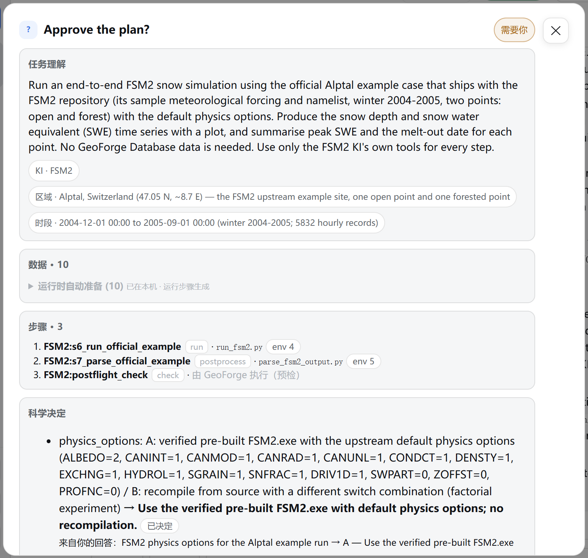

从上往下读：

| 栏目 | 要检查什么 |
|---|---|
| **任务理解** | 和你的请求一致。下面的标签显示 KI；如果 AI 写明了区域和时段，也会显示出来（**区域 · …**、**时段 · …**）。 |
| **数据** | 每一项输入。**需要你处理 (…)** 列出要你提供的输入。**运行时自动准备 (…)** 列出已经在本机、或者由某个步骤生成的输入，点击它可以展开查看。本例的 10 项全部由运行自动准备。 |
| **步骤** | 每个步骤、它的类型（**run**、**postprocess**、**check** 等，显示为英文）和它用的 KI 工具，这里是 `run_fsm2.py` 和 `parse_fsm2_output.py`。**由 GeoForge 执行（预检）** 表示由 GeoForge 运行这个 KI 自带的检查。 |
| **科学决定** | 计划背后的选择。由你决定的那些，下面写着“来自你的回答：…” |
| **等待你处理** | 除非你另选，否则会采用默认值的选择。请读一遍。 |
| **尚不能执行** | 无法按计划运行的步骤，例如 "step 's3_config' has no tool — not ready to execute"（步骤 's3_config' 没有工具，尚不能执行）。 |

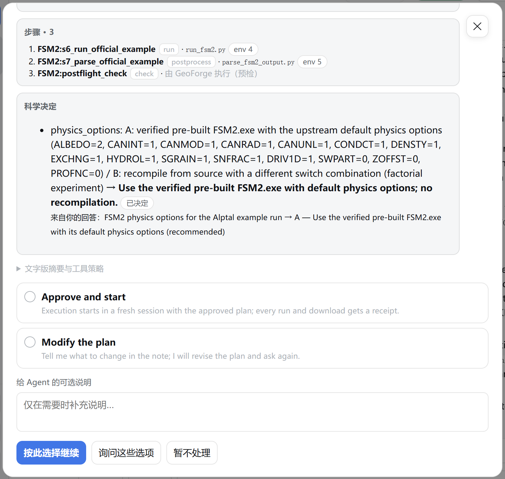

确认下半部分有 **文字版摘要与工具策略**（点击可展开），**Approve and start**（批准并开始）和 **Modify the plan**（修改计划）两个选项，以及 **给 Agent 的可选说明**。

特别留意两件事：

- 标为 **由 Agent 直接产出** 或 **缺少工具，无法执行** 的步骤。这样的步骤永远得不到运行记录。如果它写出结果文件，项目就到不了 **Completed**。
- 出现 **尚不能执行** 一节。GeoForge 仍允许你批准，但运行很可能会中途停下。为本手册做的第三次运行中，批准了这样的计划，结果验证没有通过。

这两种情况都请选择 **Modify the plan**（第 8 步）。截图中的计划有三个步骤，每一步都有工具或由 GeoForge 执行，也没有 **尚不能执行** 一节：可以批准。

> **注意：** 批准前，还要把 **数据** 和所有数据来源选择对照一下（第 9 章 9.16 节的已知问题 1）。本例不下载任何东西，所以不涉及这一点。

## 第 8 步：批准，或要求修改

批准：

1. 选择 **Approve and start**。

    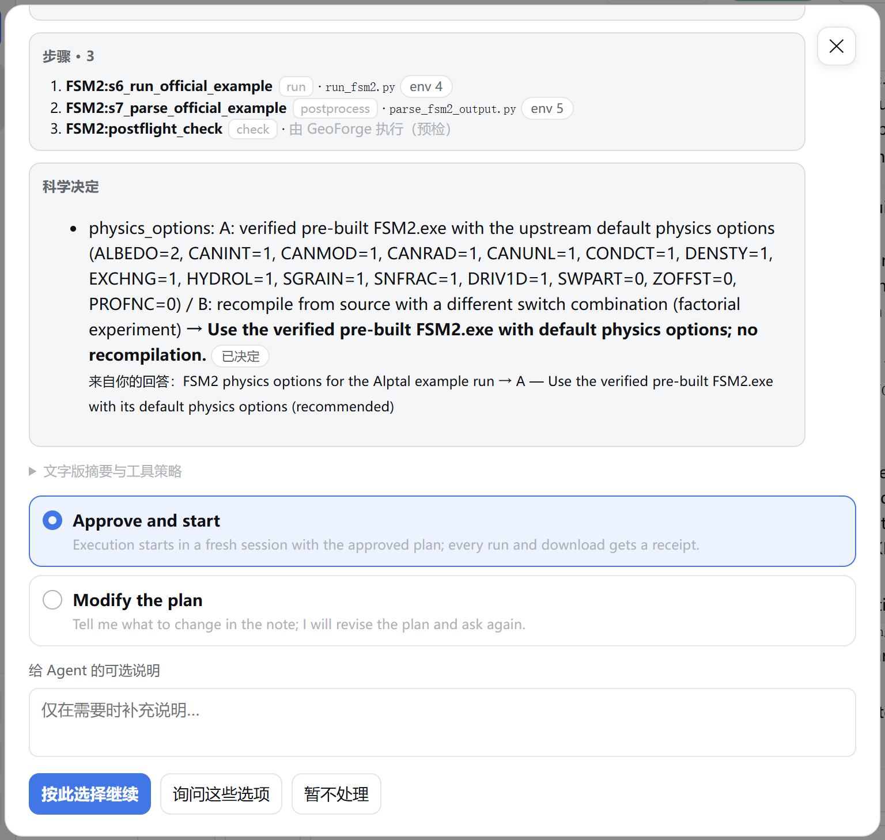

2. 点击 **按此选择继续**。

GeoForge 会记录你的批准，并附上计划的指纹。从这时起，AI 只能用批准的工具运行批准的步骤，每次运行都会得到一份签名的运行记录。

要求修改：

1. 选择 **Modify the plan**。
2. 在 **给 Agent 的可选说明** 中写下要改什么。如果卡片上有 **尚不能执行**，可以写："Some steps cannot run yet (see Not ready to execute yet). Please revise the plan so that every step uses one of the KI's own tools, and drop any step this example does not need."（有些步骤还不能运行，见“尚不能执行”。请修改计划，让每一步都使用这个 KI 自带的工具，并去掉本例不需要的步骤。）
3. 点击 **按此选择继续**。

本章建议你填写或发送的话都按英文原文给出，括号里是中文意思。你也可以直接用中文写。

AI 会修改计划，再显示一张新的 **Approve the plan?** 卡片。请从头再读一遍。

## 第 9 步：设置软件（如果需要）

如果 FSM2 还没有在这台电脑上验证，GeoForge 会在同一个回合里先设置它。对话中会显示设置过程，**◇ 项目状态** 中当前阶段为 **准备**，并显示 **0 / 1 个软件已验证**。

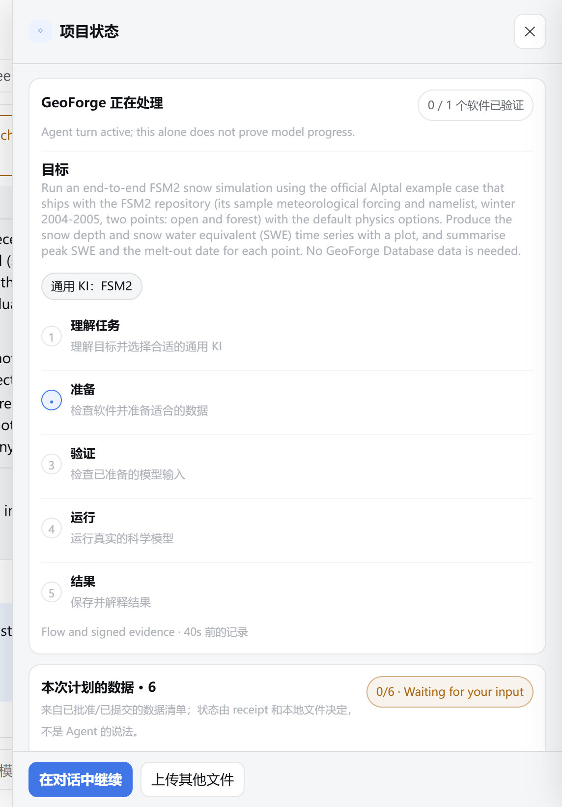

确认当前阶段是 **准备**，右上角显示 **0 / 1 个软件已验证**。

等对话里出现 "**Software verified. Starting your approved plan in a new session…**"（软件已验证，正在新会话中开始你批准的计划…）。为本手册做的第一次运行中，设置用了大约五分钟。第 4 章完整介绍软件设置。

> **注意：** 在 0.6.54 中，负责设置的 Agent 也可能把模型的示例运行一遍，并在你的项目文件夹里留下文件。这些文件没有运行记录，可能让项目到不了 **Completed**（已知问题 3；见下文“如果项目没有达到 Completed”）。事先在 **KI 库** 中设置好模型，就能避免这个问题（第 4 章）。

## 第 10 步：运行

GeoForge 在一个全新的 AI 会话中开始执行批准的步骤。这个会话里只有批准的计划。

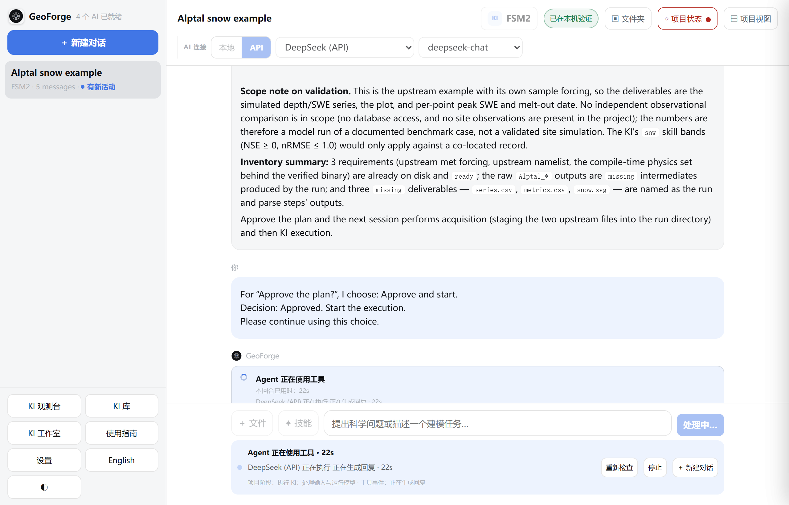

确认活动栏显示“项目阶段：执行 KI：处理输入与运行模型”。如果某次尝试失败，**◇ 项目状态** 按钮上可能会短暂出现红点，截图中就是这样；之后的重试通过了，红点就会被替换。最终的状态才算数。

你可以关掉 **项目状态** 面板，继续看对话。AI 工作期间不要刷新标签页。

## 第 11 步：确认 Completed

回合结束时，对话最后是 AI 的总结，以及一行由 GeoForge 自己发出、以 **Completed.**（已完成。）开头的消息。这一行是英文。

1. 点击对话标题栏中的 **◇ 项目状态**。

    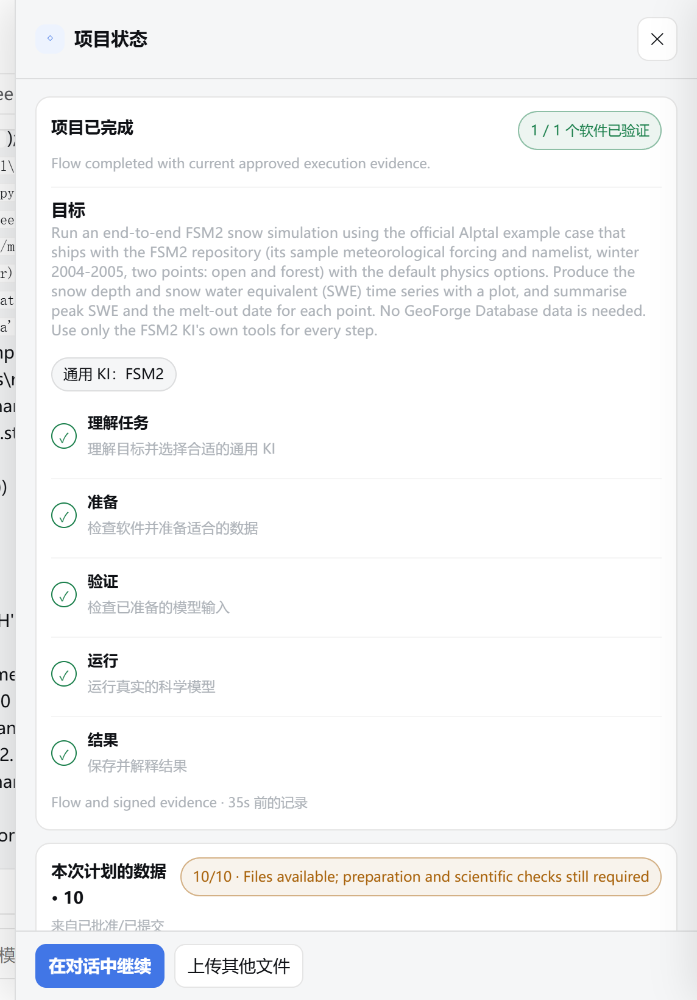

    确认：

    - 标题为 **项目已完成**，下面一行英文 "Flow completed with current approved execution evidence."（流程已完成，依据是当前批准计划的执行证据）；
    - **理解任务**、**准备**、**验证**、**运行** 和 **结果** 五个阶段都打了勾；
    - 右侧的标签显示 **1 / 1 个软件已验证**。

2. 向下滚动到 **本次计划的数据**。这里显示 "10/10 · Files available; preparation and scientific checks still required"（10/10 · 文件已到位，仍需准备和科学检查）。GeoForge 拿到了文件，但从科学上判断它们是否合适，仍然是你的工作。
3. 点击 **✕** 关闭面板。

如果 **Completed.** 这一行还说之前失败的尝试已被后来通过的重试取代，这是正常的。这次运行中，AI 先用 `--help` 和格式错误的参数调用了工具。这些尝试失败了，之后正确的运行通过了。每次尝试都保留在运行历史（`runs\evidence.json`）中。

## 第 12 步：阅读结果

### 在对话中

向上滚动到 AI 的总结。它说明运行了什么，并给出每一步的运行记录（AI 用英文写，把运行记录叫做 receipt）：

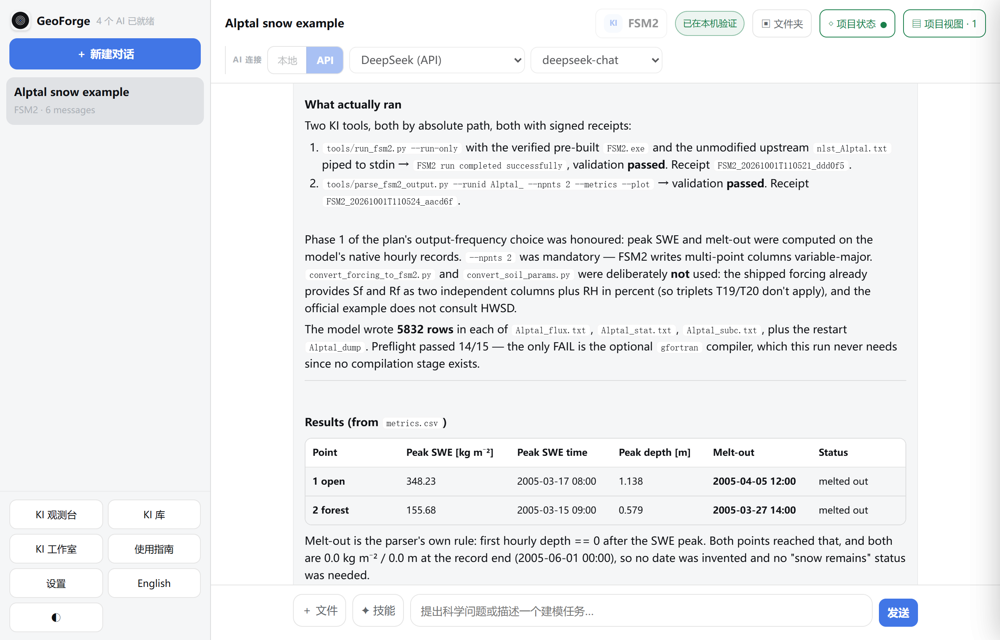

接着是结果：

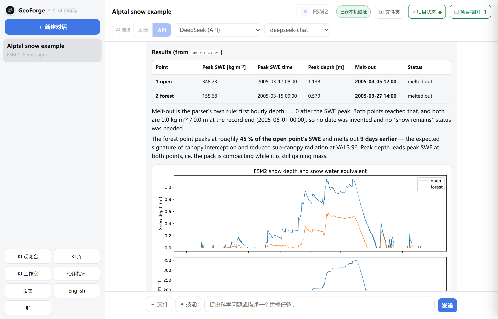

本次运行的结果：

| 点 | SWE 峰值（kg m⁻²） | SWE 峰值时间 | 雪深峰值（m） | 积雪融尽 |
|---|---|---|---|---|
| 1 open（开阔地） | 348.23 | 2005-03-17 08:00 | 1.138 | 2005-04-05 12:00 |
| 2 forest（林地） | 155.68 | 2005-03-15 09:00 | 0.579 | 2005-03-27 14:00 |

林地点的 SWE 峰值约为开阔地点的 45%，积雪融尽早九天。为本手册做的第一次运行得到了完全相同的数字。复现官方示例，本来就应该如此。

### 在项目视图中

1. 点击对话标题栏中的 **▤ 项目视图**。后面的数字是面板的个数。

    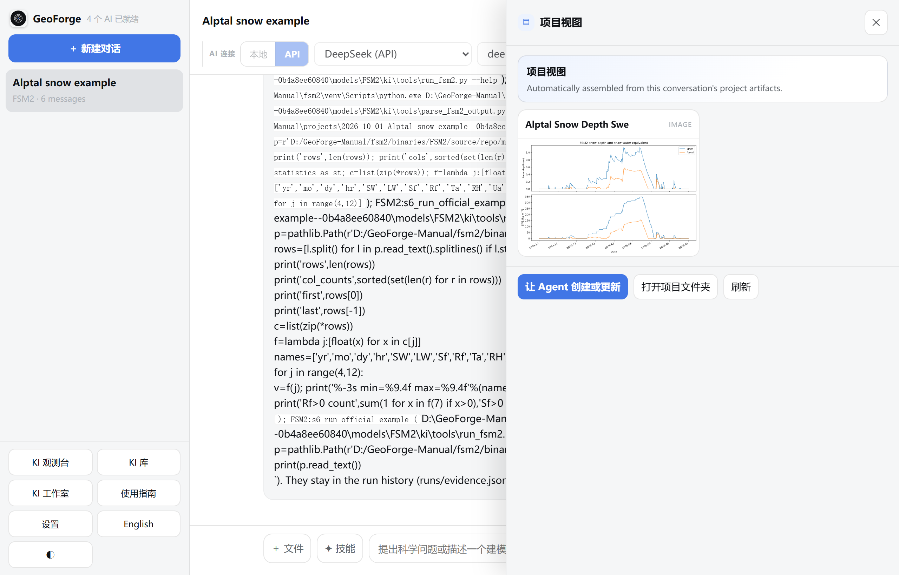

    确认有一个 **Alptal Snow Depth Swe** 面板，里面是上下两部分的图：上面是雪深，下面是 SWE，各有开阔地和林地两条线。

| 按钮 | 作用 |
|---|---|
| **让 Agent 创建或更新** | 请 AI 添加或更新面板 |
| **打开项目文件夹** | 在文件资源管理器（Mac 上是“访达”）中打开项目文件夹 |
| **刷新** | 根据项目文件重新加载面板 |

### 在项目文件夹中

点击对话标题栏中的 **▣ 文件夹**。本次运行的结果在这些位置：

| 文件 | 内容 |
|---|---|
| `outputs\fsm2_alptal\Alptal_flux.txt`、`Alptal_stat.txt`、`Alptal_subc.txt` | FSM2 自己的逐小时输出，每个文件 5,832 行 |
| `outputs\fsm2_alptal\Alptal_dump` | 运行结束时 FSM2 的状态 |
| `outputs\fsm2_alptal\series.csv` | 两个点逐小时的雪深、SWE 和其他变量 |
| `outputs\fsm2_alptal\metrics.csv` | 每个点的 SWE 峰值、雪深峰值和积雪融尽日期 |
| `artifacts\alptal-snow-depth-swe.svg` | 图 |
| `runs\` | 计划、你的批准、证据摘要和运行日志 |

第 6 章完整介绍项目文件夹。

## 这里的 Completed 是什么意思

**Completed** 表示：你批准的计划中，每一步都通过 GeoForge 运行过，每一步都有签名的运行记录，输出通过了 GeoForge 的自动检查（文件存在、不为空、没有 NaN 或无穷大值），而且不存在任何不是由通过的运行生成的结果文件。

它不表示这个模型适用于 Alptal。这次只是用 FSM2 自带的驱动数据，把它的示例正向运行了一遍。没有和观测数据比较，所以没有任何技巧评分，AI 的总结里也这样说了。要评估模型，请另做一个项目，在计划里包含观测数据和明确的比较。

达到 **Completed** 之后，你仍可以在这个对话中向 AI 询问结果，但它在这里不能再运行、下载或修改输入。要换一个时段、地点或物理选项，请新建对话。

## 如果项目没有达到 Completed

为本手册做的第一个项目没有达到 **Completed**，尽管模型运行得没有问题。它的经过说明了要看的三件事。

1. **没有运行记录的文件。** 负责设置的 Agent 在项目里运行了示例（已知问题 3）。计划里还有一个 **由 Agent 直接产出** 的步骤，它写出的审核文件没有运行记录。GeoForge 列出了五个这样的文件，项目一直停在未完成状态。

    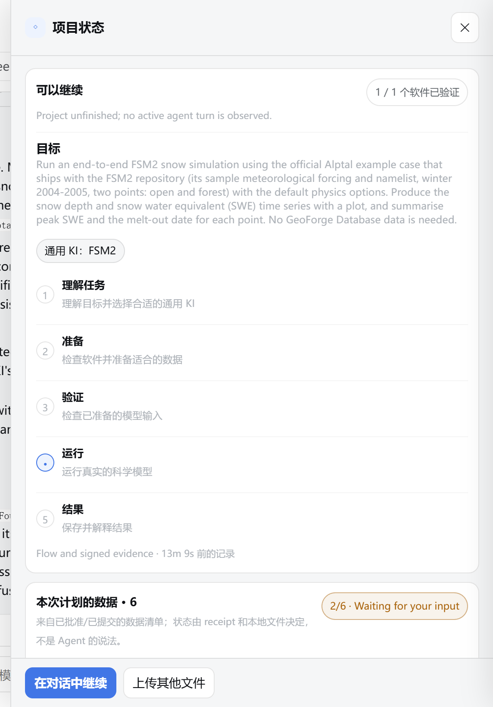

    确认标题是 **可以继续**，而不是 **项目已完成**。在 0.6.54 中，对话里没有说明原因，因为这次运行紧接在软件设置之后（源码中已修复，下个版本生效）。

2. **后来一次尝试失败。** 让 AI 收尾时，它在一个临时文件夹里重新运行了模型步骤，但没有指明输出文件。这次尝试没有通过验证，而每个步骤以最新的一次尝试为准。

    

    确认标题为 **项目需要处理**，下面一行英文 "An execution attempt failed; agent diagnosis is needed."（有一次执行失败，需要 Agent 诊断）。

3. **AI 说的话不算证据。** AI 在下一条回复里说验证已经通过。运行记录显示的却不是这样，**项目状态** 也一直显示失败。

遇到这种情况：

1. 打开 **◇ 项目状态**，读标题和状态行。第 9 章 9.11 节列出了每条消息和对应的解决方法。
2. 发送："GeoForge says the project is not Completed yet. Please read runs/evidence.json, re-run every approved step whose latest attempt failed exactly as approved, and regenerate or remove any file that has no passing run record. Do not change the approved science or inputs."（GeoForge 显示项目还没有 Completed。请读取 runs/evidence.json，把最新一次尝试失败的每个已批准步骤严格按批准的方式重新运行，并重新生成或删除没有通过的运行记录的文件。不要改动已批准的科学设置或输入。）
3. AI 回复后，再看一次 **◇ 项目状态**，不要只相信它的总结。
4. 如果还剩没有运行记录的文件，而且它们不是你自己的输入，就把它们从 `outputs\`、`artifacts\`、`inputs\` 和 `calibration\` 中移出去，例如移到项目里新建的 `notes\` 文件夹，然后发一条消息，让 GeoForge 重新检查。
5. 如果项目还是没有完成，就新建一个对话，写一个更清楚的请求（像第 4 步那样），并先把软件验证好。本章展示的运行就是这样得到的。

## 如果出现问题

| 你看到的情况 | 处理方法 |
|---|---|
| **发送** 一直是灰色 | 在 **AI 连接** 下选择 **API** 或 **本地**，再选一个已就绪的服务商（第 2 章）。 |
| 规划结束后没有出现卡片，对话最后是 "Plan was not submitted for approval: - The provider failed or was interrupted. Your draft is preserved; retry planning."（计划没有提交审批：服务商出错或被中断。草稿已保存，请重新规划。） | 发送 "Please retry planning from your saved draft."（请从保存的草稿重新规划。）在 Windows 上，AI 工作期间请保持标签页打开。 |
| "GeoForge could not finish this turn: ConnectionAbortedError …"（GeoForge 未能完成本回合） | 回合进行中，浏览器标签页被刷新或关闭了（0.6.54，Windows）。发一条消息即可继续。 |
| 问题卡片或批准卡片不见了 | 点击 **◇ 项目状态**，然后点击 **回答这个问题**。 |
| 批准卡片上出现 **尚不能执行** | 选择 **Modify the plan**，要求计划中的每一步都使用 KI 的工具（第 8 步）。 |
| 批准后软件设置失败 | 发送 "Please continue setting up FSM2."（请继续设置 FSM2。）第 4 章列出了软件设置的常见问题。 |
| 运行结束了，但没有 **Completed** | 见上文“如果项目没有达到 Completed”，以及第 9 章 9.11 节。 |
