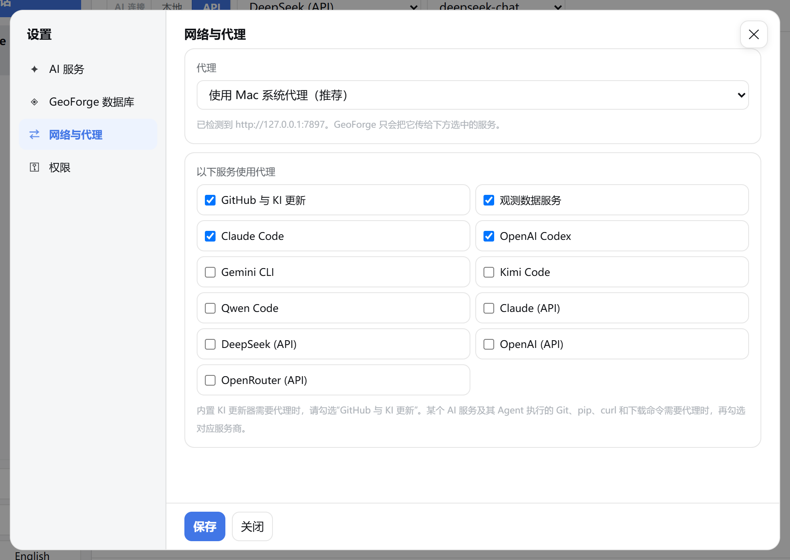
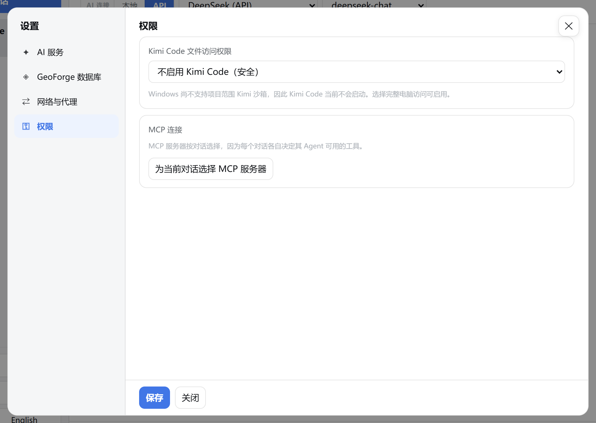
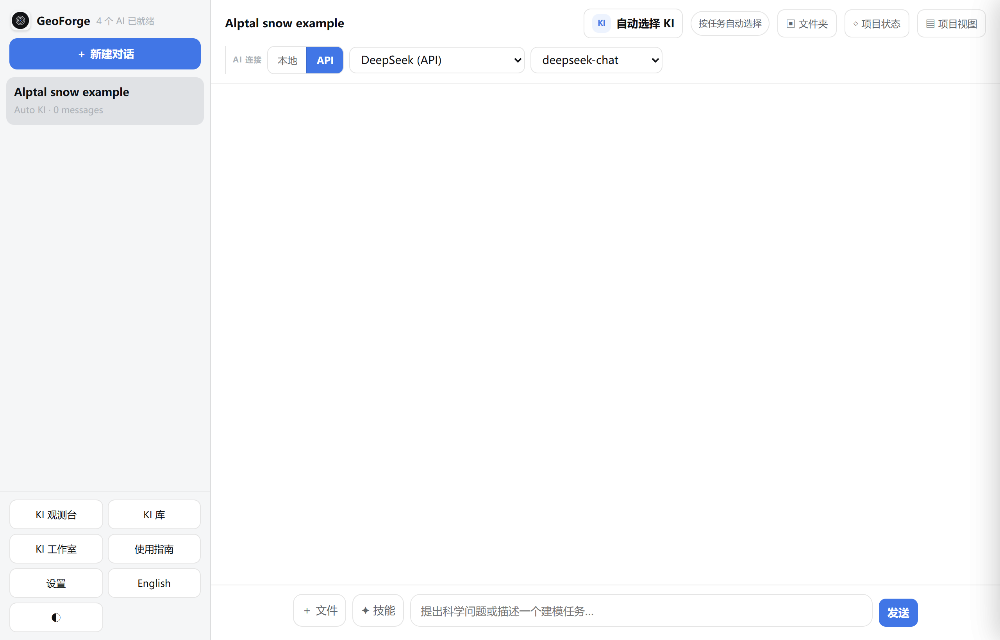
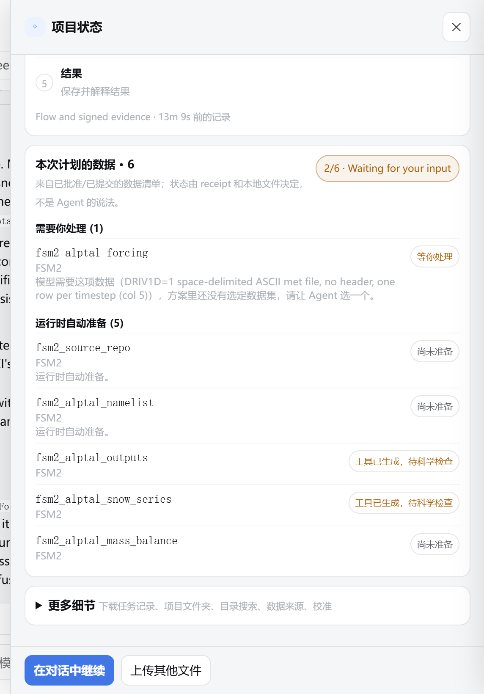
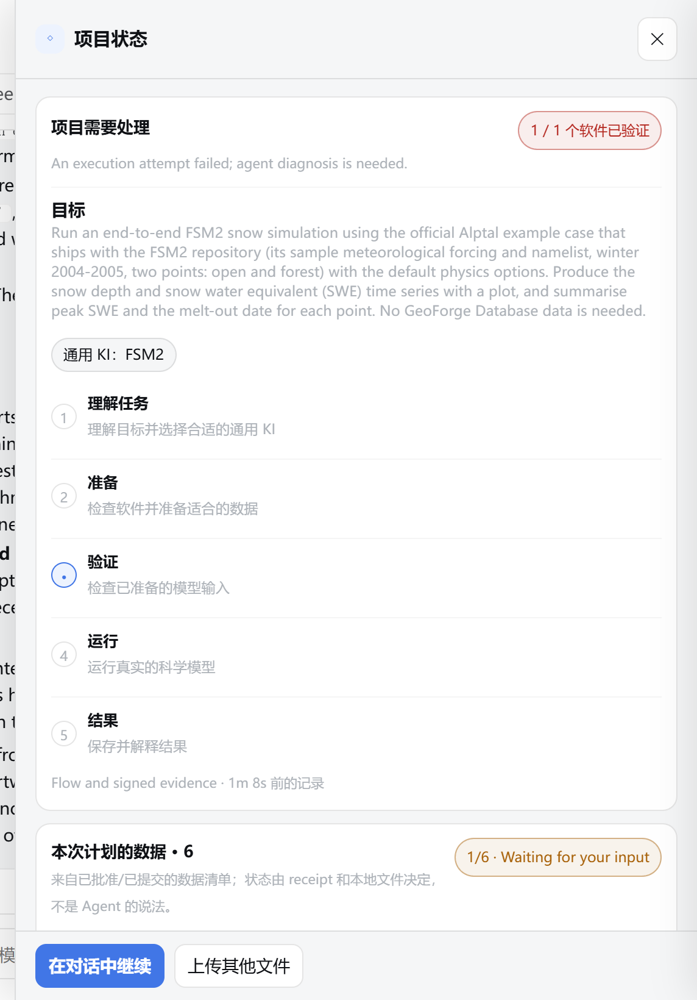
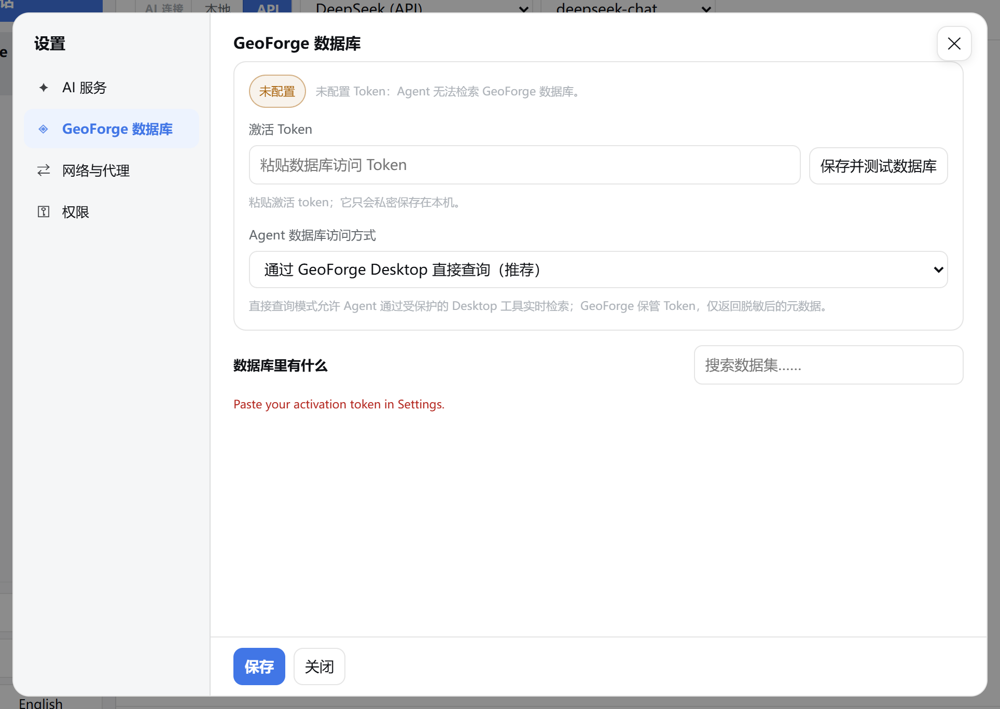

# 9 故障排除、已知问题和术语表

本章帮你解决 GeoForge Desktop 0.6.54 中最常遇到的问题，用平实的话介绍这个版本的已知问题，解释应用里用到的词，并说明怎样报告问题，好让问题得到修复。

关于界面语言：中文界面里仍有一部分文字显示为英文，包括批准卡片、托盘菜单、安装程序、GeoForge 在对话里发出的消息、项目状态里的摘要行和状态行，以及部分横幅。本章照原样写出这些英文，第一次出现时在括号里给出中文意思。Windows 和 macOS 自己的窗口（例如 SmartScreen、任务管理器、系统设置）按系统语言显示；本章写的是中文系统里的名称，第一次出现时在括号里附上英文系统里的名称。

> **提示：** 在重试或重启之前，先读最后一条真实的消息。看起来卡住的项目，多数其实在等你：等你回答、批准、提供文件，或者点一下按钮。

## 9.1 GeoForge 在哪里告诉你出了什么问题

按下面的顺序查看：

| 位置 | 告诉你什么 |
|---|---|
| 侧栏顶部，**GeoForge** 旁边 | 有几个 AI 连接可用：**N 个 AI 已就绪**，或 **需要设置 AI**。 |
| 对话上方的横幅 | 没有可用的 AI（**Connect an AI to begin.**，意思是“请先连接一个 AI”）；在 **AI 连接** 中选的那一类没有可用的 AI；或者某个 KI 的软件还没配置好（**… is not verified on this machine.**，意思是“尚未在本机验证”）。这些横幅显示为英文。 |
| 消息框下方的活动栏（AI 工作时出现） | Agent 在做什么、做了多久，以及 **重新检查**、**停止** 和 **＋ 新建对话** 按钮。侧栏里这个对话的条目会显示简短的状态：**有新活动**、**运行中·静默**、**需要检查** 或 **连接异常**。 |
| 对话标题栏里的 **◇ 项目状态** 按钮 | 一个彩色圆点。把鼠标停在按钮上，可以看到状态和摘要。 |
| **◇ 项目状态** 面板 | 一个标题、一行摘要、五个阶段、**本次计划的数据** 和 **更多细节**。有事情等你处理时，最上面会出现 **需要你处理** 卡片。 |
| 对话里以 **GeoForge verification:**、**GeoForge needs you:** 或 `[GeoForge could not finish this turn: …]` 开头的行 | 这些是 GeoForge 自己发的消息，不是 AI 写的，显示为英文。**GeoForge verification:**（GeoForge 核验）报告已签名的运行记录显示了什么；**GeoForge needs you:** 的意思是“GeoForge 需要你处理”。 |

查看项目状态：

1. 在对话标题栏点击 **◇ 项目状态**。
2. 读加粗的标题（例如 **需要你处理**、**GeoForge 正在处理**、**项目需要处理**、**项目已完成** 或 **可以继续**），以及下面那行灰色摘要。摘要行显示为英文。
3. 如果问题和数据、文件夹或日志有关，点击 **更多细节**。


检查：标题（这里是 **随时可以开始**）和下面那行字说明 GeoForge 在等什么。**更多细节** 里有下载任务记录、项目文件夹、目录搜索、数据来源和校准。

在 **更多细节** 里，第一张卡片 **状态依据** 列出状态从哪里来。其中 **Agent/app report (not scientific proof)**（Agent/应用报告，不是科学证明）这一行的末尾，是 GeoForge 最新的一句状态，例如 "Running — 2 steps done, 0 to go"（运行中：已完成 2 步，还剩 0 步）。本章把它叫做 *状态行*。

> **提示：** 五个阶段（**理解任务**、**准备**、**验证**、**运行**、**结果**）只大致表示工作进行到了哪里。在规划和下载数据期间，标记一直停在 **理解任务**。请以摘要行为准，不要看标记。

> **[待补充截图]** DeepSeek (API) 正在进行规划回合时的对话底部：消息框下方的活动栏显示带已用时间的标题、一行 "项目阶段：规划科学任务"，以及 **重新检查**、**停止** 和 **＋ 新建对话** 按钮；**发送** 按钮显示 **处理中…**。

## 9.2 快速排查：现象、原因、解决方法

找到你遇到的现象，按解决方法操作。较长的解决方法会指向本章后面的小节。

### 启动和安装

| 现象 | 可能的原因 | 解决方法 |
|---|---|---|
| 运行安装程序时出现 **Windows 已保护你的电脑**（Windows protected your PC）。 | GeoForge 没有代码签名。 | 先核对 SHA-256，再点击 **更多信息**（More info）→ **仍要运行**（Run anyway）。见 9.12。 |
| macOS 拒绝打开 **GeoForge Desktop.app**。 | Mac 版应用没有经过 Apple 公证。 | 在 **隐私与安全性**（Privacy & Security）里点击 **仍要打开**（Open Anyway），或使用 `xattr` 命令。见 9.13。 |
| Windows 便携版无法启动。 | zip 没有完全解压，或者 `GeoForge Desktop.exe` 被移到了别处，离开了它的 `_internal` 文件夹。 | 把整个 zip 解压到一个普通文件夹。运行 `GeoForge Desktop 0.6.54 Windows` 文件夹里的 `GeoForge Desktop.exe`。 |
| 关掉浏览器标签页后，GeoForge 不见了（Windows）。 | 在 Windows 上，标签页只是一个显示窗口，GeoForge 仍在托盘里运行。 | 双击托盘里的 GeoForge 图标，或右键点击它 → **Open GeoForge**（打开 GeoForge；托盘菜单为英文）。图标可能藏在时钟旁边的 **^** 箭头里。 |
| GeoForge 的书签打不开了（Windows）。 | GeoForge 每次启动都会换一个新地址 `http://127.0.0.1:<number>/`（末尾的数字每次不同）。 | 从托盘图标打开 GeoForge，不要用书签。 |
| 有两个 GeoForge 托盘图标，或者有两个地址不同的 GeoForge 标签页（Windows）。 | GeoForge 被启动了两次。 | 保留一份，退出另一份。见 9.14。 |

### AI 连接

| 现象 | 可能的原因 | 解决方法 |
|---|---|---|
| 侧栏显示 **需要设置 AI**；横幅显示 **Connect an AI to begin.** | 没有可用的 AI 服务商。 | 在 **设置** → **AI 服务** 里填入 API 密钥，或登录一个 CLI。见 9.3。 |
| 刚装好的 CLI 仍显示 **未安装**。 | GeoForge 只在启动时读取已安装程序的列表。 | 从托盘退出 GeoForge，重新启动，然后点击 **重新检查本地 CLI**。见 9.4。 |
| Kimi Code 已登录，但一直不启动（Windows）。对话里显示 `[Kimi Code was not started: project-scoped security could not be applied …]`。 | 在 Windows 上，除非你允许完整电脑访问，否则 Kimi Code 保持关闭。 | 见 9.3 中的“Windows 上的 Kimi Code”。 |
| **Gemini CLI** 或 **Qwen Code** 在 **设置** 里一直是琥珀色圆点，对话标题栏的 AI 列表显示 **… — login checked on first use**（首次使用时检查登录）。 | GeoForge 无法提前检查它们的登录状态。 | 不需要处理。如果登录有问题，第一次使用时会在对话里显示出来。 |
| 对话以 `[GeoForge could not finish this turn: …]` 结束，或者活动栏显示 **连接可能已经中断**（侧栏条目显示 **连接异常**）。 | 通常是和 AI 服务商的连接断了：网络、代理或服务商故障。冒号后面的文字是具体错误。 | 检查 **网络与代理**，然后重新发送消息。见 9.3。 |

### 对话和卡片

| 现象 | 可能的原因 | 解决方法 |
|---|---|---|
| **发送** 是灰色的。 | AI 还在工作、文件还在上传、选中的 AI 不可用，或者这个对话自己的 AI 停止工作了。 | 见 9.5。 |
| **AI 连接** 按钮、AI 和模型列表以及 KI 按钮都是灰色的。提示文字为 **本对话已锁定 AI，请新建对话后更换**。 | 对话从第一条消息起就固定了 AI、模型和 KI。 | 点击 **＋ 新建对话**，在发第一条消息之前选好。见 9.5。 |
| 界面突然变成了中文。 | 你发送的消息里含有中文字符。 | 如果想用英文界面，点击侧栏底部的 **English**，页面会以英文重新加载。见第 8 章。 |
| 问题卡片或批准卡片不见了。 | 点击 **暂不处理**、✕、按 Esc 或点击卡片外面，都会在本次打开页面期间隐藏卡片。问题仍在等你回答。 | **◇ 项目状态** → **需要你处理** → **回答这个问题**。见 9.6。 |
| 你在对话里回答了，但 GeoForge 还在等。 | 只有在卡片上给出的回答才会保存为你的回答。 | 重新打开卡片（9.6），在卡片上回答。 |
| 卡片上出现红字 **请先选择一项。** | 你没有选任何选项就点击了 **按此选择继续**。 | 先点一个选项，再点击 **按此选择继续**。 |
| **请在下方填写你的答案或文件位置。** | 你选了 **使用我的答案 / 文件**，但说明框是空的。 | 在 **给 Agent 的可选说明** 里填写数值、日期范围或文件位置。 |
| **请返回提出此问题的对话。** | 这张卡片属于另一个对话。 | 在侧栏打开那个对话，再回答。 |

### 批准

批准卡片的标题 **Approve the plan?**（是否批准计划？）和两个选项 **Approve and start**（批准并开始）、**Modify the plan**（修改计划）在中文界面里也是英文。卡片里各部分的小标题是中文。

| 现象 | 可能的原因 | 解决方法 |
|---|---|---|
| 你点击了 **Approve and start**，但什么也没发生。 | 这一下只是选中了这个选项。 | 点击 **按此选择继续**。 |
| 批准之后又出现一张新的批准卡片。对话里写着 **The updated card is in the chat; …**（更新后的卡片已在对话中）。 | GeoForge 重新发出了卡片：你选的数据被重新固定，上传的文件已关联到对应的输入，或者服务器裁剪的大小估算变了。 | 阅读新卡片。如果仍然合适，再批准一次。 |
| **These still need your decision before anything runs: …**（运行前这些事项还需要你决定） | 某个标为 **需你提供文件** 的输入还没有文件，或者还有没做的决定。 | 见 9.7。 |
| 批准卡片上出现 **尚不能执行**。 | 某个步骤没有工具，或者某个输入仍然缺失。 | 选择 **Modify the plan**。见 9.8。 |
| 卡片 **数据** 列表里写的来源，和 **数据来源，你来选** 或 **等待你处理** 里的某一行不一致。 | 已知问题 1。 | 不要批准。选择 **Modify the plan**。见 9.16。 |
| **GeoForge Database access is off or not activated, but this plan still needs it for … Nothing was approved or downloaded.**（GeoForge 数据库访问已关闭或未激活，但计划仍需要它；没有批准或下载任何东西） | 计划需要数据库里的数据，但数据库访问已关闭或未激活。 | 激活数据库（第 3 章）后再次批准，或者选择 **Modify the plan**，改用公开数据源或你自己的文件。 |
| **Your saved answers cannot be read (…). Fix or remove that file, then approve again.**（无法读取你保存的回答，请修复或删除该文件后再批准） | 保存回答的文件 `.geoforge\user-answers.json` 被编辑过或已损坏。 | 撤销你对它做过的修改。如果做不到，先报告问题（9.18），再删除这个文件：删除它会丢掉你保存的所有回答。 |

### 数据

| 现象 | 可能的原因 | 解决方法 |
|---|---|---|
| 出现 **Some approved data could not be fetched**（部分已批准的数据未能获取）卡片，或者 **本次计划的数据** 里某一行显示 **下载失败**。 | 网络、服务器、每日配额，或者目标文件夹里已经有文件。 | 见 9.9。 |
| 你点击了 **文件已放好，继续**，但百度网盘卡片还开着。 | 文件没有正好放在 **放置到** 指定的文件夹里，或者复制还没完成。没下载完的文件（例如 `.part`、`.crdownload` 或百度网盘的 `.bc!`）会被忽略。 | 点击 **复制路径**，粘贴到文件资源管理器的地址栏，把完整的文件移到那里，再点一次按钮。见第 3 章 3.7 节。 |
| 横幅显示 **已获取批准的数据 · 运行尚未开始**（或 **已获取批准的数据 · 需要先配置软件**）。 | 自动下载已在后台完成。GeoForge 在运行模型之前等你确认。 | 点击横幅里的 **开始已批准的运行**。 |

### 运行和停止

| 现象 | 可能的原因 | 解决方法 |
|---|---|---|
| 活动栏显示 **没有新的工作证据，可能已经卡住**（侧栏条目显示 **需要检查**）。 | 大约 90 秒没有新动静。编译和模型运行可能很长时间没有输出。 | 点击 **重新检查**。如果远远超过这一步应有的时间仍然没有变化，点击 **停止**，然后发一条消息说明你看到了什么。 |
| 点击 **停止** 或 **Exit GeoForge**（退出 GeoForge）后，电脑仍然很忙，或者不断出现新文件。 | 已知问题 2：Agent 通过 Git Bash 启动的任务没有被停止。 | 在任务管理器里结束它。见 9.10。 |
| 点击 **停止** 后，对话显示 `[… stopped by the user]`，标题变为 **可以继续**。 | 你点了 **停止**。这次被停止的尝试记为“已停止”，不算失败。状态行（9.1）显示 "Stopped by you — send a message to continue"（已被你停止，发送消息即可继续）。 | 想继续时发一条消息。 |
| 点击 **Approve and start** 后，GeoForge 花很长时间配置软件。 | 这个 KI 的软件还没有在这台电脑上验证过。第一次配置可能要下载并编译软件。 | 等待，并留意活动栏。已知问题 3：配置时也可能把模型的示例运行一遍。 |
| 校准期间打开了很多黑色控制台窗口（Windows）。 | 已知问题 4。 | 不要关掉它们。关掉一个，那次模型评估就会算作失败。 |

### 结果

| 现象 | 可能的原因 | 解决方法 |
|---|---|---|
| 对话里出现 **GeoForge verification:** 行，项目没有到达 **已完成**（Completed）。 | 有些已批准的步骤没有通过的运行记录，或者存在不是由通过的运行生成的文件。 | 见 9.11。 |
| 标题为 **项目需要处理**，摘要为 **An execution attempt failed; agent diagnosis is needed.**（一次执行失败，需要 Agent 诊断） | 某次运行的输出没有通过 GeoForge 的自动检查。 | 发送“请诊断失败的步骤并重试。”见 9.11。 |
| **Completed.** 后面跟着 "N earlier failed attempts were superseded by a passing retry"（之前 N 次失败的尝试已被后来通过的重试取代）。 | 之前的尝试失败了，后来的一次通过了。 | 不需要处理。失败的尝试仍会列在 `runs\evidence.json` 里。 |
| 一个 **已完成** 的项目仍然显示 **工具已生成，待科学检查**，或者项目视图里面板的标题以 "— experimental / unvalidated"（实验性 / 未验证）结尾。 | **已完成** 表示每个已批准的步骤都运行过，并通过了 GeoForge 的自动检查。它不表示结果已经过验证。 | 这是正常的。见术语表（9.17）中的 **已完成**。 |
| 项目 **已完成** 之后，Agent 不再运行任何东西。 | **已完成** 是最终状态。对话仍可以回答问题，并用已有的文件画图。 | 要换一个时段、情景，或者做校准，请新建对话。 |

### GeoForge 数据库

| 现象 | 可能的原因 | 解决方法 |
|---|---|---|
| **设置** → **GeoForge 数据库** 显示 **未配置**、**已关闭**、**不可用** 或 **未同步**，或者出现关于 Token 的消息。 | Token 缺失、错误、过期或被撤销；访问被设为关闭；或者连不上服务器。 | 见 9.15 和第 3 章。 |

## 9.3 没有可用的 AI

侧栏显示 **需要设置 AI**，横幅显示 **Connect an AI to begin.** 横幅里的 "Open AI Settings"（打开 AI 设置）指的是侧栏里的 **设置** 按钮。

还可能出现第二个横幅，说明你在 **AI 连接** 下选的那一类有什么问题：选了 **API** 但没有可用的密钥时，显示 **No API connection yet.**（还没有 API 连接）；选了 **本地** 时，显示 **No local agent CLI is installed.**（没有安装本地 Agent CLI），或者 **Local CLIs are installed but not ready**（本地 CLI 已安装但未就绪），后者带一个 **Recheck**（重新检查）按钮。这些横幅显示为英文。

1. 在侧栏点击 **设置**。
2. 点击 **AI 服务**。
3. 看每张卡片上的圆点和状态文字。


检查：绿色圆点加 **已登录** 或 **已填写密钥** 表示可以用。**缺少密钥** 或 **未安装** 表示暂时不能用。

4. 对于 API 服务商，把密钥粘贴到 **粘贴 API 密钥** 框里。如果还没有密钥，点击 **获取密钥**。
5. 对于本地 CLI，用卡片上显示的命令安装，并登录一次，然后看 9.4。第 2 章有具体的命令。
6. 点击 **保存**。不点 **保存** 就关闭窗口，修改不会保留。

第 2 章逐个介绍了各个服务商，还有一张更完整的错误表。

### 回合中途连接断开

*回合* 指从你发送一条消息开始的一轮工作。对话以 `[GeoForge could not finish this turn: …]` 结束（例如出现 `ConnectionAbortedError`），或者活动栏显示 **连接可能已经中断**。

1. 在 **设置** 里点击 **网络与代理**。
2. 在 **代理** 下，检查检测到的地址。在 Windows 上，**使用 Mac 系统代理（推荐）** 指的是 Windows 的系统代理。
3. 如果你的网络只能通过代理访问你用的服务商，就在 **以下服务使用代理** 下勾选它。**DeepSeek (API)** 这类 API 服务商默认不勾选。
4. 点击 **保存**。



检查：**代理** 下的地址，以及你的对话所用的服务商旁边是否打了勾。

5. 重新发送你的消息。对话记录会保留。

> **提示：** **AI 服务** 页面上的 **测试 AI 与 GitHub** 会一步步检查连接，它生成的报告是英文的。最后一步会向服务商发送一条很短的真实消息，服务商可能会为此计费。如果在 Windows 上第 [2/6] 步（Python）失败，报告会给出 macOS 的建议（`brew install python`）。这条建议不适用于 Windows，请直接报告这个失败（9.18）。

### Windows 上的 Kimi Code

Windows 上没有按项目范围限制 Kimi 的安全机制，所以 Kimi Code 默认不会启动。

1. 在 **设置** 里点击 **权限**。
2. 在 **Kimi Code 文件访问权限** 下，只有当你接受 Kimi Code 可以读取和修改你的 Windows 账户能访问的所有文件时，才选择 **允许完整电脑访问并启用 Kimi**。
3. 在弹出的警告里点击 **确定**（OK）。
4. 点击 **保存**。



检查：列表下方的说明。选择 **不启用 Kimi Code（安全）** 时，说明会写 Kimi Code 不会启动。

## 9.4 安装了 CLI 却检测不到

GeoForge 只在启动时读取一次已安装程序的列表（Windows 的程序路径）。在 GeoForge 运行期间安装的 CLI，即使点了 **重新检查本地 CLI**，也可能仍然显示 **未安装**。

1. 完成 CLI 的安装。
2. 按照 CLI 的说明，在 PowerShell 里登录一次。
3. 等到没有对话在工作。
4. 右键点击托盘里的 GeoForge 图标。
5. 点击 **Exit GeoForge**。
6. 从开始菜单重新启动 GeoForge。
7. 点击 **设置** → **AI 服务** → **重新检查本地 CLI**。
8. 确认卡片现在显示绿色圆点和 **已登录**。**Gemini CLI** 和 **Qwen Code** 即使能正常使用，也一直是琥珀色圆点。

在 macOS 上，退出 GeoForge 再重新打开，然后重新检查。

> **提示：** 用 `npm` 安装的 CLI 需要 Node.js。Windows 上的 Claude Code 还需要 Git for Windows。低于 0.144 的 OpenAI Codex 会显示 "update required"（需要更新）。第 2 章列出了相关命令。

## 9.5 消息发不出去，或对话的 AI 被锁定

按顺序检查下面几种原因。

1. **AI 还在工作。** **发送** 按钮显示 **处理中…**。等它完成，或者点击活动栏里的 **停止**。这期间你可以在别的对话里工作：点击 **＋ 新建对话**。
2. **新对话里选错了 AI 的类型。** 看标题栏里的 **AI 连接** 一行。**本地** 使用这台电脑上的 CLI；**API** 使用密钥。如果你只有 API 密钥，却选了 **本地**，**发送** 会一直是灰色。点击 **API**，再选择服务商和模型。



检查：**AI 连接** 显示的是你想要的类型、服务商和模型（这里是 **API**、**DeepSeek (API)**、**deepseek-chat**），KI 按钮显示的是你想要的 KI（这里是 **自动选择 KI**）。发出第一条消息后，这些都会固定下来。

> **注意：** 在 Windows 上，地址每次启动都会变，所以浏览器不会记住你上次选的 **本地** 或 **API**。新对话会沿用你点击 **＋ 新建对话** 时打开着的那个对话的类型。刚启动、还没打开任何对话时，新对话默认是 **本地**。如果有一个 CLI 已经就绪，**发送** 可以用，但对话会在那个 CLI 上运行。发第一条消息之前，请检查这一行。

3. **对话已锁定它的 AI。** 发出第一条消息后，**AI 连接** 按钮、AI 和模型列表以及 KI 按钮都会变灰。提示文字为 **本对话已锁定 AI，请新建对话后更换**。对话内容跟着开始它的那个 AI，不能转到别的 AI 上。点击 **＋ 新建对话**，重新选择。
4. **这个对话自己的 AI 停止工作了。** 例如它的 API 密钥被删除了，或者 CLI 退出了登录。**发送** 是灰色的，你也不能切换。在 **设置** → **AI 服务** 里修好同一个 AI（重新粘贴密钥，或者登录后点击 **重新检查本地 CLI**），或者新建一个对话。

## 9.6 问题卡片或批准卡片不见了

点击 **暂不处理**、✕、按 Esc 或点击卡片外面，都会隐藏卡片。只要页面还开着，GeoForge 不会自己再弹出同一张卡片。问题或批准请求仍在等你处理。

1. 确认打开的是提出这个问题的对话。
2. 在对话标题栏点击 **◇ 项目状态**。
3. 在最上面找到 **需要你处理**。其中加粗的一行就是问题；如果是批准卡片，这一行是 **Approve the plan?**。
4. 点击 **回答这个问题**，卡片会重新打开。
5. 选择一个选项。
6. 点击 **按此选择继续**。

> **[待补充截图]** FSM2 示例在等你回答研究时段问题时的项目状态面板：最上面是 **需要你处理** 卡片，带加粗的问题标题和 **回答这个问题** 按钮；下面是 **项目进度** 卡片，标记停在 **理解任务**。

重新加载页面（在浏览器标签页里按 F5），再打开这个对话，等待中的卡片也会回来。

> **注意：** 请在卡片上回答，不要在对话里打字回答。只有卡片上的回答会保存为你的回答，并且可以在批准卡片上被引用（“来自你的回答：…”）。打字回复不会关闭这个问题。

## 9.7 批准被拒绝，因为还有事项需要你处理

你批准后，GeoForge 回复 **These still need your decision before anything runs:**，并列出一些输入。这时什么都还没开始，GeoForge 会再次显示批准卡片。如果某个输入需要你自己的文件，消息里还会写 "Upload your file with the Upload button on the card"（用卡片上的上传按钮上传文件）。这句话已经过时：**上传文件** 按钮在 **◇ 项目状态** 里，不在卡片上。

1. 点击 **暂不处理** 关闭卡片。
2. 点击 **◇ 项目状态**，找到 **本次计划的数据**。
3. 在 **需要你处理** 这一组里，找到消息中提到的那一行。它显示 **等你处理**。
4. 点击这一行的 **上传文件**。
5. 选择你的文件。GeoForge 把它保存到 `inputs\user\<input name>\`，并显示 **已保存并加入待发送附件（未自动发送、批准或验证）**。上传不会批准或检查任何东西。
6. 在 **需要你处理** 卡片里点击 **回答这个问题**，重新打开批准卡片。
7. 选择 **Approve and start**。
8. 点击 **按此选择继续**。GeoForge 把文件关联到这个输入，并发出一张更新后的卡片。对话里会写 **Your file is now named as the input: …**（你的文件已按输入的名称命名）和 **The updated card is in the chat; approve it to start.**（更新后的卡片已在对话中，批准后即开始）。
9. 确认更新后的卡片写的是你的文件，然后用同样的方法批准。

如果没处理的是数据来源，在卡片上的 **数据来源，你来选** 里选好。其他情况，选择 **Modify the plan**，在说明里写清楚要用什么。第 6 章 6.6.2 节介绍了怎样为计划输入上传文件。

> **注意：** 用 **＋ 文件** 或 **上传其他文件** 添加的文件会放进 `inputs\uploads\`，不会关联到任何计划输入。请使用那一行自己的 **上传文件** 按钮。

## 9.8 批准卡片上出现“尚不能执行”

批准卡片的末尾可能有一节 **尚不能执行**。它列出类似 "step … has no tool — not ready to execute"（步骤 … 没有工具，尚不能执行）或 "step … input … is still missing"（步骤 … 的输入 … 仍然缺失）的条目。在 **步骤** 里，这样的步骤会用红字标出 **缺少工具，无法执行**。

GeoForge 在这里不会阻止你选择 **Approve and start**。但如果你照样批准，没有工具的步骤无法生成运行记录，不改计划，项目就到不了 **已完成**。

1. 在批准卡片上选择 **Modify the plan**。
2. 在 **给 Agent 的可选说明** 里写清楚要改什么。例如：“步骤 stage_inputs 没有工具。请用这个 KI 的运行工具在项目里准备驱动数据，所有输出都放在项目文件夹里。”
3. 点击 **按此选择继续**。GeoForge 会把计划连同你的说明退回给 Agent。
4. 如果 Agent 发来问题卡片，回答它。
5. 在新的批准卡片上，确认 **尚不能执行** 已经消失。
6. 确认 **步骤** 里的每一步都写有工具、**由 GeoForge 执行（预检）**（GeoForge 自己检查模型软件能否运行）或 **由 Agent 直接产出**。然后再批准。

拿不准时，选 **Modify the plan**，不要直接批准。

> **[待补充截图]** 一个含有无法执行的准备步骤的计划的批准卡片 **Approve the plan?**：**步骤** 一节中有一步用红字标为 **缺少工具，无法执行**，下面的 **尚不能执行** 一节列出这一步；能看到 **Approve and start** 和 **Modify the plan** 两个选项，已选中 **Modify the plan** 并填写了说明。

## 9.9 已批准的数据无法下载

迹象：**Some approved data could not be fetched** 卡片列出每个失败的输入和它的错误；**本次计划的数据** 里对应的一行显示 **下载失败**；**本次计划的数据** 的状态标签显示 **Data needs attention**（数据需要处理）。卡片提供两个选项：**Retry the missing data**（重新获取缺失的数据）只获取缺失的部分；**Modify the plan** 把计划连同你的说明退回给 Agent。这张卡片的标题和选项显示为英文。

1. 读卡片上每个输入名称后面的错误。
2. 排除原因：

| 卡片上的错误 | 先做什么 |
|---|---|
| "GeoForge could not reach GeoForge Database."（无法连接 GeoForge 数据库） | 检查网络连接，并检查 **网络与代理** 里 **以下服务使用代理** 下的 **观测数据服务**。 |
| "GeoForge Database server or gateway is unavailable."（服务器或网关不可用） | 稍后再试。问题出在服务器端。 |
| "Daily download limit reached; resets at midnight server time."（已达到每日下载上限，在服务器时间午夜重置） | 等到服务器时间午夜之后。 |
| "The downloaded file failed integrity verification twice."（下载的文件两次未通过完整性校验） | 稍后再试。如果还是这样，向数据库负责人报告。 |
| "… already holds files with no receipt … Existing files were not overwritten."（文件夹里已有没有运行记录的文件，原有文件未被覆盖） | 把文件从提到的文件夹里移走（不要删除），然后重试。或者选择 **Modify the plan**，把它们作为你自己的输入来用。 |
| 关于 Token 的消息（"That token isn't right…"、"Your token expired…"、"This token was revoked…"） | 先解决 Token 的问题。见 9.15。 |

3. 在卡片上选择 **Retry the missing data**。如果想改用其他数据，选择 **Modify the plan**，并在说明里写明数据来源。
4. 点击 **按此选择继续**。

如果你关掉了卡片，用 **◇ 项目状态** → **回答这个问题** 重新打开它（9.6）。第 3 章 3.10 节列出了所有数据库消息。

> **[待补充截图]** 一个含 GeoForge 数据库输入的计划的 **Some approved data could not be fetched** 卡片：消息中列出该输入和错误（例如 "GeoForge could not reach GeoForge Database."），并显示 **Retry the missing data** 和 **Modify the plan** 两个选项。

> **注意：** 0.6.54 版没有在 Windows 上端到端测试过 GeoForge 数据库下载。如果重试一直报同样的错误，请报告（9.18）。

## 9.10 停止后后台任务仍在运行（Windows）

**停止** 会结束对话的当前回合：包括 Agent、所有 KI 工具或配置命令，以及它们启动的程序。托盘菜单里的 **Exit GeoForge** 在退出前也会做同样的事。GeoForge 记录的模型运行会正常停止。

例外（已知问题 2）：Claude Code 这类本地 CLI Agent 通过 Git Bash（Git for Windows 自带的命令窗口）执行命令。如果它用 `nohup`、`timeout`、`env`、`sh -c` 或 bash 脚本启动任务，Windows 会失去和这个任务的联系，**停止** 就找不到它。迹象：点击 **停止** 后电脑仍然很忙，或者项目文件夹里不断出现新文件。这类任务之后写出的文件会妨碍项目到达 **已完成**。

1. 按 Ctrl+Shift+Esc 打开任务管理器。
2. 点击 **详细信息**（Details）。
3. 右键点击任意一个列标题。
4. 点击 **选择列**（Select columns）。
5. 勾选 **命令行**（Command line），然后点击 **确定**（OK）。
6. 找出命令行里包含你的项目文件夹或模型文件夹的进程，例如 `bash.exe`、`sh.exe`、`nohup.exe`、`timeout.exe`、`python.exe`，或者你的模型程序（例如 `FSM2.exe`）。
7. 右键点击这个进程。
8. 点击 **结束任务**（End task）。如果是启动了其他程序的 shell（`bash.exe`、`sh.exe`），改为点击 **结束进程树**（End process tree）。
9. 回到 GeoForge，想继续时发一条消息。

> **[待补充截图]** Windows 11 任务管理器的 **详细信息** 页面，已添加 **命令行** 列，选中一行 `python.exe`，它的命令行包含 `D:\GeoForge-Manual\projects\…`，右键菜单显示 **结束任务** 和 **结束进程树**。

> **注意：** 不要结束 `GeoForge Desktop.exe` 或 `geoforge-agent-bridge.exe`（这样会直接关掉 GeoForge，正在做的工作不能正常停止）。也不要结束命令行没有指向你的项目或模型文件夹的进程，它们可能属于别的程序。

## 9.11 项目到不了“已完成”

只有同时满足下面所有条件，项目才会 **已完成**：

- 你批准的计划仍然有效；
- 每个已批准的步骤都有通过的运行记录，而且它的输出通过了 GeoForge 的自动检查；
- 不存在任何不是由通过的运行生成的结果文件；
- 没有哪个步骤用过之后又被改写的输入文件。

阅读对话里最后一行 **GeoForge verification:**，以及 **◇ 项目状态** → **更多细节** → **状态依据** 里的状态行（9.1）。这些消息里的 *receipt* 就是运行记录；"unreceipted" 或 "not vouched for" 表示这个文件没有任何通过的运行记录作保证。

| 你看到 | 意思 | 怎么做 |
|---|---|---|
| 状态行 **Running — N steps done, M to go**（运行中：已完成 N 步，还剩 M 步） | 有 M 个已批准的步骤还没有通过的运行记录。 | 请 Agent 运行剩下的已批准步骤。 |
| 状态行以 "…, K unreceipted files"（K 个没有运行记录的文件）结尾，并且 **GeoForge verification:** 写着 "not complete yet — these files are not vouched for by a passing receipted run … regenerate or remove them: …"（尚未完成：这些文件没有通过的运行记录作保证，请重新生成或删除） | 有文件是失败的尝试留下的，或者是在 GeoForge 的记录之外写出的：例如配置软件的 Agent 写的（已知问题 3），或者批准卡片上标着 "written by the agent"（由 Agent 直接产出）的步骤写的。 | 回复：“请通过已批准的步骤重新生成这些文件；如果不需要，就删掉它们。”如果 Agent 不肯删，而这些文件又不是你自己的输入，你可以自己把它们移到项目里单独的文件夹，例如 `notes\`，然后发一条消息，让 GeoForge 重新检查。GeoForge 只检查 `outputs\`、`artifacts\`、`inputs\` 和 `calibration\`。永远不要删除你自己的输入文件。 |
| 运行结束后标题是 **可以继续**，不是 **项目已完成**，对话里也没有 **GeoForge verification:** 这一行 | 0.6.54 中，如果运行紧接在软件配置之后开始，它的结论不会显示出来（源码中已修复）。 | 在对话里随便发一条消息，例如“为什么项目还没有完成？”。下一个回合结束时会显示结论。 |
| **GeoForge verification:** "not complete yet — these steps passed on input files that were rewritten afterwards; rerun them: …"（尚未完成：这些步骤通过后，它们的输入文件被改写过，请重新运行） | 某个步骤通过之后，它的输入文件被改动过。 | 请 Agent 重新运行提到的步骤。 |
| **GeoForge verification:** "this turn ran no receipted step and downloaded nothing."（本回合没有运行任何有记录的步骤，也没有下载任何东西） | Agent 描述了一些工作，但没有通过 GeoForge 运行。 | 不要使用这个回合给出的数字。请 Agent 运行已批准的步骤。 |
| 标题 **项目需要处理**（下面一行英文 "An execution attempt failed; agent diagnosis is needed."，意思是有一次执行失败，需要 Agent 诊断）；状态行 **A run failed validation — see runs/evidence.json**（有一次运行没有通过验证） | 某个步骤最新的一次尝试没有通过 GeoForge 的自动检查。如果 Agent 把一个已经通过的步骤又运行了一遍，而这一次失败了，也会出现这种情况。 | 发送“请诊断失败的步骤，并严格按批准的方式重新运行。”GeoForge 会在同一次批准下重新运行，并复用已有的数据。以最新的一次尝试为准，Agent 自己的说法不算数：它回复之后，再看一次状态行。 |
| 状态行 **The agent needs a plan change**（Agent 需要修改计划），然后是 **The agent is revising the plan**（Agent 正在修改计划） | Agent 发现需要换工具、数据来源、时段或模型。 | 等新的批准卡片出现，读一遍，合适就批准。你之前的批准会被撤回。 |
| 标题 **可以继续**；状态行 **Stopped by you — send a message to continue** | 你点了 **停止**。 | 发一条消息继续。 |



看数据列表：模型虽然运行了，输出显示 **工具已生成，待科学检查**，还有一项输入显示 **等你处理**。**项目状态** 显示的是运行记录能证明的东西，而不是 Agent 说了什么。



看标题 **项目需要处理** 和下面的英文 "An execution attempt failed; agent diagnosis is needed."。第 5 章讲了这个项目是怎样走到这一步的。

> **注意：** 不要编辑或删除 `.geoforge\` 里的任何东西，也不要改动 `runs\plan.json`、`runs\data-inventory.json` 和 `runs\approval.json` 这几个文件。批准后再改动计划，GeoForge 就必须生成新计划，你也要重新批准。

## 9.12 Windows SmartScreen 拦截安装程序

GeoForge 没有代码签名，所以第一次运行安装程序时，Windows SmartScreen 可能会拦下它。

1. 只从 `windows-v0.6.54` 发布页面下载安装程序：<https://github.com/lzwei196/KISS-Knowledge-Infrastructure-for-Scientific-Simulation/releases/tag/windows-v0.6.54>。
2. 按第 1 章的说明，把它的 SHA-256（文件的“指纹”）和发布页面上的值对比。例如在 PowerShell 里运行：
    `Get-FileHash "C:\Users\you\Downloads\GeoForge-Desktop-Setup-v0.6.54-Windows-x64.exe" -Algorithm SHA256`
    如果两个值不一样，删除这个文件，不要运行它。

3. 双击安装程序。
4. 如果出现 **Windows 已保护你的电脑**，点击 **更多信息**。
5. 确认应用名称是 `GeoForge-Desktop-Setup-v0.6.54-Windows-x64.exe`。
6. 点击 **仍要运行**。

> **[待补充截图]** 点击 **更多信息** 后的 Windows SmartScreen 对话框 **Windows 已保护你的电脑**：显示应用 `GeoForge-Desktop-Setup-v0.6.54-Windows-x64.exe`、发布者“未知发布者”，以及 **仍要运行** 和 **不运行** 两个按钮。

安装程序不需要管理员权限。它只为你自己的用户安装，位置是 `%LOCALAPPDATA%\Programs\GeoForge Desktop`。安装程序的界面是英文的。

> **注意：** 只使用 `windows-v0.6.54` 里的 Windows 文件。经过测试的 Windows 版本就是那个页面上的版本。

## 9.13 macOS 拦截应用

Mac 版应用（发布版本 `v0.6.54`）没有经过 Apple 公证。macOS 第一次打开它时会拦截，每次更新后也会再拦截一次。只对你从官方发布页面下载并核对过的应用这样做（第 1 章）。

**用系统设置：**

1. 先尝试打开一次 **GeoForge Desktop**。
2. 关闭警告。
3. 打开苹果菜单 → **系统设置**（System Settings）→ **隐私与安全性**。
4. 向下滚动到 **安全性**（Security）。在关于 GeoForge Desktop 的提示旁边，点击 **仍要打开**。
5. 在接下来的对话框里，确认你要打开这个应用。
6. 如果 macOS 要求，输入密码或使用触控 ID。

> **[待补充截图]** macOS 系统设置 → **隐私与安全性**，滚动到 **安全性** 部分，显示“GeoForge Desktop”已被阻止的提示和 **仍要打开** 按钮。

**用终端：** 按应用实际所在的位置，运行一次下面的命令：

```bash
xattr -dr com.apple.quarantine "/Applications/GeoForge Desktop.app"
```

## 9.14 打开和退出 GeoForge，以及多开了一份

| | Windows | macOS |
|---|---|---|
| GeoForge 显示在哪里 | 在默认浏览器里，另外有一个托盘图标 | 在它自己的窗口里 |
| 关闭标签页或窗口 | GeoForge 继续运行，正在做的工作也继续 | GeoForge 退出，正在做的工作停止 |
| 重新打开 | 双击托盘图标，或右键 → **Open GeoForge** | 再次打开应用 |
| 退出 | 右键点击托盘图标 → **Exit GeoForge** | 关闭窗口，或退出应用 |

Windows 上没有防止 GeoForge 启动两次的保护。如果 GeoForge 正在运行，你又从开始菜单或桌面图标启动它，就会再启动一份，它有自己的托盘图标和自己的地址。两份互相不知道对方：在一份里正在工作的对话，在另一份里看起来并不忙；在一份里点击 **停止** 或 **Exit GeoForge**，不会结束另一份启动的工作。

1. 找到你的工作所在的浏览器标签页，记下它的地址，例如 `http://127.0.0.1:52814/`。
2. 依次双击每个 GeoForge 托盘图标。每个图标都会在浏览器里打开自己的地址。
3. 右键点击你不需要的那个地址对应的托盘图标。
4. 点击 **Exit GeoForge**。
5. 下次从托盘图标重新打开 GeoForge，不要从开始菜单启动。

> **[待补充截图]** Windows 通知区域里能看到两个 GeoForge 托盘图标（已展开隐藏的图标），其中一个被右键点击，显示菜单 **Open GeoForge** / **Exit GeoForge**。

> **注意：** **Exit GeoForge** 会先停止这一份 GeoForge 里所有正在进行的工作。正在运行的模型会被中断。

## 9.15 GeoForge 数据库的 Token 问题

打开 **设置** → **GeoForge 数据库**。看顶部的状态标签和它旁边的那句话。点击 **保存并测试数据库** 后，结果会显示在 Token 输入框下方。



检查：状态标签。**未配置** 表示还没有保存 Token，所以 Agent 无法检索数据库。

| 状态标签 | 含义 | 怎么做 |
|---|---|---|
| **未配置** | 没有保存 Token。 | 把 Token 粘贴到 **激活 Token** 下面，点击 **保存并测试数据库**。 |
| **已关闭** | **Agent 数据库访问方式** 设成了 **不向 Agent 提供数据库访问**。 | 选择 **通过 GeoForge Desktop 直接查询（推荐）**，然后点击 **保存**。 |
| **不可用** | Token 无法使用：服务器拒绝了它，或者 GeoForge 读不到已保存的 Token。 | 读状态标签旁边的那句话，解决 Token 的问题，再点击 **保存并测试数据库**。 |
| **未同步** | Token 已保存，但目录的本地副本还没有下载。 | 点击 **保存并测试数据库**，它也会下载目录。一分钟后重新打开 **设置**。 |

常见的 Token 消息有 "That token isn't right — check for a copy/paste miss."（Token 不对，检查是否复制粘贴有遗漏）、"Your token expired — ask the group owner for a new one."（Token 已过期，请向组负责人要一个新的）和 "This token was revoked — ask the group owner."（Token 已被撤销，请联系组负责人）。第 3 章介绍了怎样获取 Token（3.2）、怎样填写（3.3），以及其他所有消息（3.10）。

没有数据库时，使用公开数据源或你自己文件的计划仍然可以正常运行。

## 9.16 0.6.54 的已知问题

这些问题在 `windows-v0.6.54` 发布时就已经知道。大多数是 Windows 上的问题。

### 1. 批准前，核对批准卡片上的数据列表和数据来源选择（重要）

批准卡片可能在两个地方写出某个输入用什么数据：

- **数据** 一节，写成 `input ← dataset id` 这样的行：这是 GeoForge 实际下载、模型实际使用的数据；
- **数据来源，你来选**，或者 **等待你处理** 里类似 "… defaults to NASA POWER unless you pick another"（除非你另选，否则默认使用 NASA POWER）的行：这是负责规划的 Agent 说它选的来源。

GeoForge 不会检查这两处是否一致。它还会隐藏不在 GeoForge 数据库目录里的来源（例如 NASA POWER），却仍可能说“默认使用”它们。如果你批准了，签名的批准记录里写的可能是一个来源，实际下载和使用的却是另一个数据集。

每次批准前：

1. 在 **数据** 里，读每一行 `input ← dataset id`。
2. 把它和 **数据来源，你来选**（如果有）以及 **等待你处理** 里的每一行对比。
3. 如果两处写的来源不同，或者 **等待你处理** 里提到的来源在 **数据** 和选项里都找不到，就不要批准。选择 **Modify the plan**。
4. 在说明里写上你想用的来源。
5. 点击 **按此选择继续**。
6. 之后再批准时，打开 **◇ 项目状态** → **本次计划的数据**，检查实际获取的是哪个数据集。

> **[待补充截图]** 已激活 GeoForge 数据库时的批准卡片 **Approve the plan?**：**等待你处理** 写着 "… defaults to NASA POWER unless you pick another"，而 **数据** 一节显示 `forcing ← ` 加一个 CMFD 数据集 ID；两处都用标注框标出。如果无法复现这种状态，就用一张注明是示意图的标注图。

### 2. 停止和退出可能漏掉通过 Git Bash 启动的任务（Windows）

Agent CLI 用 `nohup`、`timeout`、`env`、`sh -c` 或 bash 脚本启动的任务，在点击 **停止** 或 **Exit GeoForge** 之后可能继续运行。有记录的模型运行会正常停止。请在任务管理器里结束残留的任务（9.10）。

### 3. 配置软件时可能把整个模型跑一遍

批准后，负责安装模型软件的 Agent 也可能把模型的示例运行一遍。这会花时间和 AI token，还会在共享的软件文件夹里留下额外的文件（FSM2 大约 15 MB）。这些结果不会计入你的项目。如果它把结果写进了项目的 `outputs\` 文件夹（本手册第一次运行时就是这样），这些文件没有运行记录，在被移走之前，项目到不了 **已完成**（9.11）。

### 4. 校准时每次模型运行都会打开一个控制台窗口（Windows）

在安装版的 Windows 应用里，校准期间的每次模型评估都会打开一个黑色控制台窗口，常常有几百个。不要管它们，每个窗口会在对应的评估结束时自己关闭。手动关掉一个，那次评估就算失败。第 7 章介绍校准。

### 5. 尚未在 Windows 上端到端测试的部分

在 Windows 应用里，只有 FSM2 搭配 DeepSeek API 完整跑通过，结果是 **已完成**。那是官方示例的一次正向运行，不是用观测数据做的验证。以下内容还没有在 Windows 上端到端测试过：Codex、Claude Code 和 Kimi Code 这几个 CLI Agent；GeoForge 数据库下载（直接下载、服务器裁剪和百度网盘）；校准；以及其他 KI。这些地方可能还有不完善之处，发现问题请报告（9.18）。

### 6. 编写本手册时发现的问题

- **Agent 工作时不要刷新或关闭 GeoForge 标签页（Windows）。** 在规划、配置或运行期间刷新（F5）、关闭标签页或重启浏览器，会让当前回合以 "GeoForge could not finish this turn: ConnectionAbortedError…" 或 "The provider failed or was interrupted" 结束。遇到这种情况，发一条消息继续即可。源码中已修复，下个版本生效。
- **配置之后紧接着的运行没有结论。** 如果软件是在你批准后才配置的，运行结束时最后的 **GeoForge verification** 行或 **Completed.** 行不会显示，**◇ 项目状态** 只显示 **可以继续**。随便发一条消息，下一个回合会显示结论（9.11）。源码中已修复，下个版本生效。
- **标着 "written by the agent" 的计划步骤可能让项目无法完成。** 批准卡片上标着 "written by the agent"（由 Agent 直接产出）的步骤没有工具，永远不会有运行记录。如果它把结果文件写进 `outputs\` 或 `artifacts\`，在这些文件被移走之前，项目到不了 **已完成**（9.11）。如果这一步不是必需的，选择 **Modify the plan**（修改计划），请 Agent 去掉它，或者只在对话里给出它的结果。
- **Windows 上 FSM2 的作图选项会失败。** FSM2 工具的 `--plot` 选项需要一个作图包，而 Windows 上的安装里没有它。Agent 会改用其他方式作图，数字不受影响。
- **归档对话可能悄悄失败（Windows）。** 如果项目文件夹里的某个文件正被其他程序打开（例如文件资源管理器或 Excel），归档会失败。关掉它再试一次。

### 7. 其他小问题

- **整个产品的大小。** Agent 可能把整个数据产品的大小（例如 CMFD，几百 GB）说成你要下载的大小。以批准卡片上对应那一行写的大小为准。
- **不检查 GeoTIFF 的地图范围。** Windows 应用不能读取栅格数据，所以如果交付的 GeoTIFF 覆盖了错误的区域，它只会被标为待定，而不会被拒绝。请自己检查地图范围。
- **有些压缩的 netCDF 文件读不了。** 原因是 Windows 应用加载不了压缩插件。
- **过时的文字。** **更多细节** → **GeoForge 数据库** 卡片写着“Token 在 AI 设置中配置”：实际应在 **设置** → **GeoForge 数据库** 里配置。横幅里的 “AI Settings”（或 “AI 设置”）指 **设置** → **AI 服务**。批准被拒时提到的 “Upload button on the card”，指的是 **◇ 项目状态** 里那一行的 **上传文件** 按钮（9.7）。
- **Windows 上的“使用 Mac 系统代理（推荐）”** 指的是 Windows 的系统代理。
- **Windows 上没有文件夹选择器。** **新建项目对话** 里的 **选择…** 只会提示“当前在浏览器模式。请直接输入文件夹路径”。从文件资源管理器的地址栏复制路径，粘贴进去。
- **Windows 上的 KI 库更新。** **再次检查** 的结果通常是“已保留当前 KI 库”，因为在线 KI 库还没有 Windows 的安装说明。这是正常的。见第 7 章。
- **Mac 版更旧。** macOS 的 `v0.6.54` 应用（2026 年 9 月 19 日）比 Windows 0.6.54 版本（2026 年 9 月 30 日）构建得早。在 Mac 上，规划卡片、上传文件的关联、后台下载和 **停止** 的外观或行为可能不同。

## 9.17 术语表

| 术语 | 含义 |
|---|---|
| **Agent** | 在你的对话里工作的 AI。它可以是你电脑上的本地 CLI（例如 Claude Code、OpenAI Codex、Kimi Code），也可以是 API 模型（例如 DeepSeek (API)）。GeoForge 决定它在每个阶段可以做什么。 |
| **本地** / **API** | **AI 连接** 下的两类 AI。**本地** 使用这台电脑上已安装并已登录的 CLI（命令行程序）。**API** 通过你在 **设置** 里粘贴的密钥使用云端 AI 服务。 |
| **回合** | 从你发送一条消息开始、到 AI 的回复保存好为止的一轮工作。**停止** 会结束当前回合。 |
| **KI**（Knowledge Infrastructure，知识基础设施） | GeoForge 为一个科学模型或工作流准备的软件包：怎样安装和检查软件、需要哪些输入、用哪些工具运行、输出必须通过哪些检查。所有 KI 都列在 **KI 库** 里。 |
| **自动选择 KI** | 默认设置：标题栏显示 **自动选择 KI** 和 **按任务自动选择**。GeoForge 读你的第一条请求，选出 KI，并在对话里说明，例如 "Task understood · KI: FSM2. Building the plan…"（已理解任务 · KI：FSM2，正在制定计划）。如果选错了模型，新建一个对话，并指定正确的 KI。 |
| **指定的 KI** | 发第一条消息之前，你在 **本对话使用的知识基础设施**（标题栏里的 KI 按钮）中自己选的 KI。它在这个对话里固定不变。宽泛的字词匹配和否定的提法（例如“不要用 CaMa-Flood”）不会加入其他 KI；但如果你在第一条消息里明确写出目录里某个模型的名字，它会被加入。 |
| **已在本机验证** | 这个 KI 的科学软件在这台电脑上通过了检查。否则 KI 显示 **需要设置**。它只说明软件能在这里运行，不说明你的数据已经准备好，也不说明结果有效。 |
| **流程**（Flow） | GeoForge 处理科学对话的固定路线：理解任务、制定计划（一次只问一个问题）、批准、数据、配置软件、带运行记录的已批准步骤、检查、**已完成**。在对话里，你批准之前不会下载、安装或运行任何东西。**◇ 项目状态** 把它的来源写作 "Flow and signed evidence"（流程和签名证据）。 |
| **批准卡片** | 标题为 **Approve the plan?** 的卡片，展示整个计划：**任务理解**、**数据**、**数据来源，你来选**（如果有）、**步骤**、**科学决定**、**等待你处理**，以及（如果有）**尚不能执行**。它的选项是 **Approve and start** 和 **Modify the plan**。你的批准会签名后写入 `runs\approval.json`。 |
| **运行记录**（receipt） | GeoForge 为每个已批准的步骤和每个获取的输入写下的签名记录，包括命令、程序的指纹、退出码、输入和输出文件的指纹，以及它对应的批准。消息里把它叫做 "receipt"。只有运行记录才算证据，Agent 说的话不算。运行记录保存在 `.geoforge\receipts\`。 |
| **已完成**（Completed） | 面板标题为 **项目已完成**；状态行为 "Completed — every step has a verified receipt"（已完成：每一步都有经过验证的运行记录）。每个已批准的步骤都有通过的运行记录，输出也通过了 GeoForge 的自动检查（例如：文件存在且不为空，没有缺失值或无穷值，覆盖了预期的时间步，而且不全是同一个常数）。它**不**表示模型已经用观测数据验证过。这是最终状态：对话仍可以回答问题，并用已有的文件画图，但新的实验需要新建对话。 |
| **数据获取** | 你批准后，GeoForge 获取已批准的数据：直接下载、服务器裁剪，或者百度网盘手动交付。获取到的数据没有经过科学检查：对应的行显示 **已下载，待科学检查**。 |
| **服务器裁剪** | 对于较大的 GeoForge 数据库数据集，服务器会裁出你的研究区（以及时段或变量），GeoForge 只下载这一部分，最多 2 GB。直接下载适用于 100 MB 以内的文件。 |
| **百度网盘手动交付** | 对于服务器不能直接发送的数据，**◇ 项目状态** 会显示一张百度网盘卡片，上面有链接、**提取码**、要从分享里下载的文件，以及 **放置到** 路径。你下载文件、放好，然后点击 **文件已放好，继续**。链接和提取码只显示给你，从不交给 Agent。运行记录能证明你放了哪些文件；这些文件没有服务器提供的校验值。 |
| **项目文件夹** | 一个对话专属的文件夹，名称为 `<date>-<project name>--<chat id>`，默认位于 `C:\Users\you\kiss\projects`。里面有 `inputs`、`outputs`、`artifacts`、`runs`、`memory` 和 `.geoforge` 等。用 **▣ 文件夹** 打开它。已安装的模型软件放在项目文件夹之外的共享文件夹里，例如 `C:\Users\you\kiss\fsm2`。 |

## 9.18 怎样报告问题

好的报告能让别人看到你看到的情况。收集下面这些内容，发送前把每个文件读一遍，并删掉隐私数据。

### 要包含的内容

| 内容 | 在哪里找 |
|---|---|
| GeoForge 的版本和发布包，例如“0.6.54，`windows-v0.6.54` 安装程序” | Windows：Windows **设置** → **应用** → **已安装的应用** → **GeoForge Desktop**。便携版的文件夹名为 `GeoForge Desktop 0.6.54 Windows`。macOS：你下载的发布版本（`v0.6.54`）。 |
| 操作系统 | Windows：按 Win+R，输入 `winver`，按 Enter；记下版本（例如家庭版或专业版）和版本号，以及 Windows 是否为中文。macOS：苹果菜单 → **关于本机**；记下 macOS 版本和芯片。 |
| AI 和 KI | **AI 连接** 这一行（**本地** 或 **API**、服务商、模型），以及标题栏里显示的 KI。 |
| 你做了什么、预期是什么、实际发生了什么 | 用你自己的话写，并写上大概的时间。 |
| **◇ 项目状态** 的截图 | 截整个面板。如果问题和数据有关，也打开 **更多细节** 截图。再附上你要报告的那张卡片或那条消息的截图。 |
| 对话文字 | 把鼠标指向一条消息，发送者名字旁边会出现 **复制** 按钮。把文字粘贴到报告里。准确的文字比截图更有用。完整的对话保存在 `memory\transcript.jsonl` 里；只在别人要求时才发送，发送前先读一遍。 |
| `runs\` 里的文件 | 点击对话标题栏里的 **▣ 文件夹** 打开项目文件夹。见下表。 |

| 文件 | 说明什么 |
|---|---|
| `runs\project-events.jsonl` | 项目的时间线 |
| `runs\evidence.json` | GeoForge 逐步核验了什么 |
| `runs\flow-state.json` | 当前的流程状态 |
| `runs\logs\` 里最新的文件 | 每次有记录的工具运行的输出 |
| `runs\plan.json`、`runs\data-inventory.json` | 计划和它的数据列表，问题和计划或数据有关时附上 |

如果是从 **Agent 设置** 页面开始的软件配置出了问题，还要附上模型安装文件夹（例如 `C:\Users\you\kiss\fsm2`）里的 `setup-agent.log`（如果有）。如果是连接问题，附上 **测试 AI 与 GitHub** 报告的文字。

### 绝对不要包含的内容

> **注意：** 不要把下面任何一项放进报告、截图或共享文件夹：
>
> - API 密钥，以及 GeoForge 数据库的激活 Token；
> - 百度网盘链接和提取码，以及保存它们的文件 `.geoforge\manual-download-details.json`；
> - `%APPDATA%\KISS\settings.json`（macOS：`~/Library/Application Support/KISS/settings.json`），这个文件以明文保存 API 密钥；
> - 整个项目文件夹，或者整个 `.geoforge` 文件夹；
> - **KI 库** 里那个小设置框的截图，它会显示每个 API 密钥的末尾几位。
>
> 把路径里的用户名换成 `you`，例如 `C:\Users\you\kiss\projects\…`。

### 发送到哪里

- 在 <https://github.com/lzwei196/KISS-Knowledge-Infrastructure-for-Scientific-Simulation/issues> 提交 issue。issue 是公开的，所以请再检查一遍，确认没有隐私内容。
- 如果是 Token、配额或百度网盘交付的问题，联系给你 Token 的 GeoForge 数据库负责人（第 3 章 3.2 节）。
