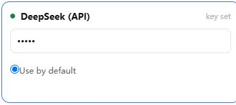

# 1 Connect the agent for our SHAW example

**Example:** run the official SHAW 3.03 Trial, then open its soil-profile plot. These three pages take you through **connect AI → set up SHAW → approve, run and check**. Use GeoForge Desktop 0.6.55 on Windows.

## Connect DeepSeek

1. Open **Settings → AI services**. Find **DeepSeek (API)** and click **Get a key** to create a key in your own provider account.
2. Return to GeoForge, paste the key into **Paste API key**, select **Use by default**, then click **Save**.
3. Click **Test AI & GitHub**. Continue when the **AI** connection test passes. If it fails, read the error and check your provider account or **Network & proxy**.

{: .agent-shot }

*DeepSeek in **Settings → AI services**: the saved key is masked and **Use by default** is selected. Never share the key.*

## Create the example project

4. Close Settings. Click **＋ New chat**, name it `SHAW official Trial`, choose a project parent folder such as `D:\GeoForge\projects`, then click **Create chat**.
5. Before sending a message, select **API → DeepSeek (API) → deepseek-chat** in the chat header.
6. Click **Auto KI**, search `SHAW`, select it and click **Apply**. Continue to page 2.

**Expected result:** the AI test passes and the new chat uses DeepSeek and SHAW. This example needs no GeoForge Database token. Keep all credentials in Settings.

Already use a local CLI? Connect it through **Recheck local CLIs**, then choose **Local** before the first message. This worked example uses DeepSeek API; see the full manual for CLI setup.
