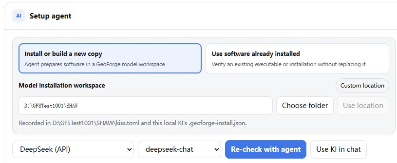

# 2 Set up SHAW and its five inputs

**Goal:** install the real scientific program. The SHAW KI supplies instructions and tools; selecting it does not install the model.

## Install and verify SHAW

1. Open **KI Library**, search `SHAW`, click its search result, select **DeepSeek (API)** and click **Set up with agent**. If already verified, choose **Open setup & verification**.
2. On **Agent setup**, choose **Install or build a new copy**. Use a writable folder such as `D:\GeoForge\models\SHAW`; click **Use location** after changing it.
3. Select `deepseek-chat`, click **Start agent setup**, and respond to any **Needs you** request. Wait for GeoForge's final verification. If it fails, read **Verification** and choose **Continue repair**.

{: .ki-shot }

*An existing installation shows **Re-check with agent**. Setup may need help resolving missing dependencies.*

## Download and attach the official inputs

4. Download the USDA-ARS [official Shaw303.zip](https://www.ars.usda.gov/ARSUserFiles/20520500/SHAW/303/Shaw303.zip). Extract these **five files from `Shaw303/`**, preserving their names and contents:

| File | Contains |
|---|---|
| `Trial.303.inp` | Run controls |
| `Trial.30.sit` | Site and soil parameters |
| `Trial.30.wea` | Weather forcing |
| `Trial.moi` / `Trial.tem` | Initial moisture / temperature |

5. Return to `SHAW official Trial`. Click **＋ Files** and attach all five files. If a planning card requests them, use its **Upload files** row to bind them to the plan.

**Expected result:** verification passed; five original inputs attached. Do not use `Output/Trial/` reference results as inputs.
