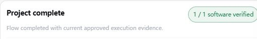
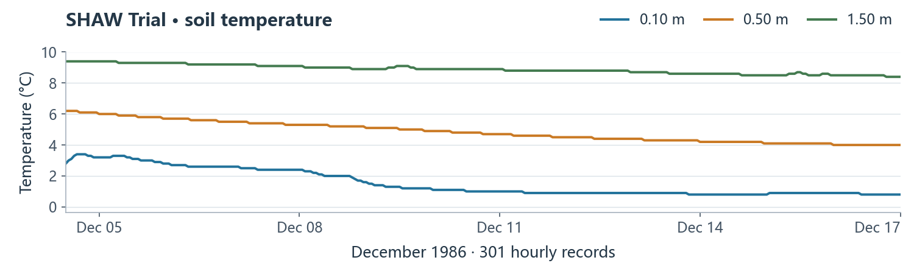

# 3 Run the example and inspect outputs

This is a real SHAW forward example, not calibration against field observations.

## Send this request with the five files

> Run the official SHAW 3.03 Trial using my five uploaded files. Preserve all scientific inputs and control flags. Run native SHAW through its KI: raw files in `outputs/SHAW/trial/`, CSVs in `outputs/SHAW/csv/`, soil-profile plot at `outputs/SHAW/shaw_profiles.png`. No Database, generated forcing or calibration. Check raw rows: temperature/moisture 301 each, liquid 14, energy 300, water 13, frost 48; all end at 1986-12-17 00:00.

## Review and start

1. Answer the planning cards. On **Approve the plan?**, check SHAW, five inputs, output locations and **run → parse → plot**.
2. Choose **Modify the plan** if needed. Otherwise select **Approve and start**, then **Continue with this choice**.
3. Keep GeoForge running. Open **◇ Project status**; wait for **Project complete** and passing records for all three steps.

{: .completion-shot }

*The real completed Trial project, as reported by GeoForge.*

## Open the files

4. Click **▣ Folder**. Open `outputs/SHAW/csv/` and the generated `shaw_profiles.png`. Check the dates, row counts and 11 soil nodes.

{: .result-shot }

*Temperature CSV preview from the verified Trial. This guide preview uses actual data; the app's full plot has five panels.*

**If incomplete:** ask the agent to diagnose and rerun the named failed step. An AI success message alone does not prove completion.
