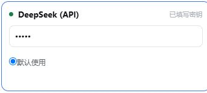

# 1 连接 Agent，开始 SHAW 示例

**本例：** 运行 SHAW 3.03 官方 Trial，再查看土壤剖面图。三页依次完成 **连接 AI → 配置 SHAW → 批准、运行和核对**。使用 Windows 版 GeoForge Desktop 0.6.55。

## 连接 DeepSeek

1. 打开 **设置 → AI 服务**。找到 **DeepSeek (API)**，点击 **获取密钥**，在你自己的服务商账户里创建密钥。
2. 返回 GeoForge，把密钥粘贴到卡片的密钥输入框，选中 **默认使用**，点击 **保存**。
3. 点击 **测试 AI 与 GitHub**。其中 **AI** 连接测试通过后再继续。若失败，先读错误信息，再检查服务商账户或 **网络与代理**。

{: .agent-shot }

*设置 → AI 服务中的 DeepSeek 卡片：密钥已隐藏，**默认使用** 已选中。不要分享密钥。*

## 新建示例项目

4. 关闭设置。点击 **＋ 新建对话**，命名为 `SHAW official Trial`，选择项目父文件夹，例如 `D:\GeoForge\projects`，再点击 **创建对话**。
5. 发第一条消息前，在对话顶部选择 **API → DeepSeek (API) → deepseek-chat**。
6. 点击 **自动选择 KI**，搜索 `SHAW`，选中后点击 **应用**。继续第 2 页。

**预期结果：** AI 测试通过，新对话使用 DeepSeek 和 SHAW。本例不需要 GeoForge 数据库 Token；所有凭据只填在设置中。

已使用本地 CLI？通过 **重新检查本地 CLI** 连接，并在第一条消息前选择 **本地**。本例使用 DeepSeek API；CLI 的详细配置见完整手册。
