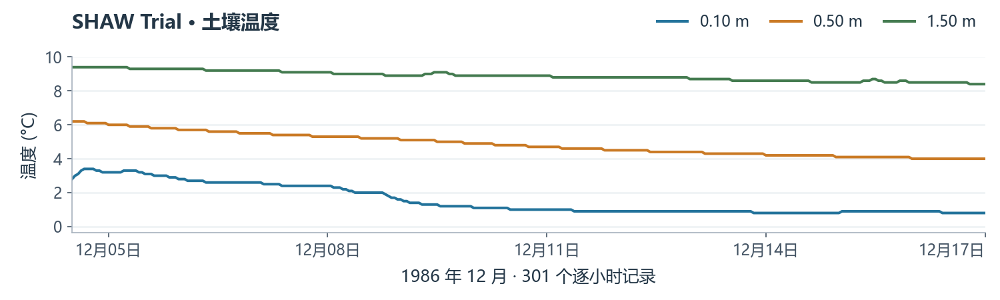

# 3 运行示例，查看真实输出

本例用真实 SHAW 模型做正向检查，不是对实测观测进行校准。

## 附上五个文件，发送此请求

> 请用我上传的五个文件运行 SHAW 3.03 官方 Trial。保留全部科学输入和控制选项。通过 KI 执行原生 SHAW：原始结果存入 `outputs/SHAW/trial/`，CSV 存入 `outputs/SHAW/csv/`，土壤剖面图保存为 `outputs/SHAW/shaw_profiles.png`。不用数据库，不生成驱动，不做校准。核对原始结果行数：温度和含水量各 301 行、液态水 14 行、能量 300 行、水量 13 行、冻土 48 行；全部结束于 1986-12-17 00:00。

## 审阅并开始

1. 回答规划卡片。在 **Approve the plan?**（是否批准计划）中核对 SHAW、五个输入、输出位置及 **运行 → 解析 → 作图**。
2. 需修改时选 **Modify the plan**（修改计划）；否则选 **Approve and start**（批准并开始），再点 **按此选择继续**。
3. 保持 GeoForge 运行。打开 **◇ 项目状态**，等待 **项目已完成**，确认三个步骤都有通过的运行记录。

{: .completion-shot }

*图中是 GeoForge 核对后的真实 Trial 项目完成状态。*

## 打开输出文件

4. 点击 **▣ 文件夹**，打开 `outputs/SHAW/csv/` 及生成的 `shaw_profiles.png`，核对日期、行数和 11 个土壤节点。

{: .result-shot }

*已验证 Trial 的温度 CSV 预览。本指南预览使用真实数据；应用生成的完整图包含五个面板。*

**未完成时：** 请 Agent 诊断并重新执行指出的失败步骤。仅有 AI 宣称成功，不能证明完成。
