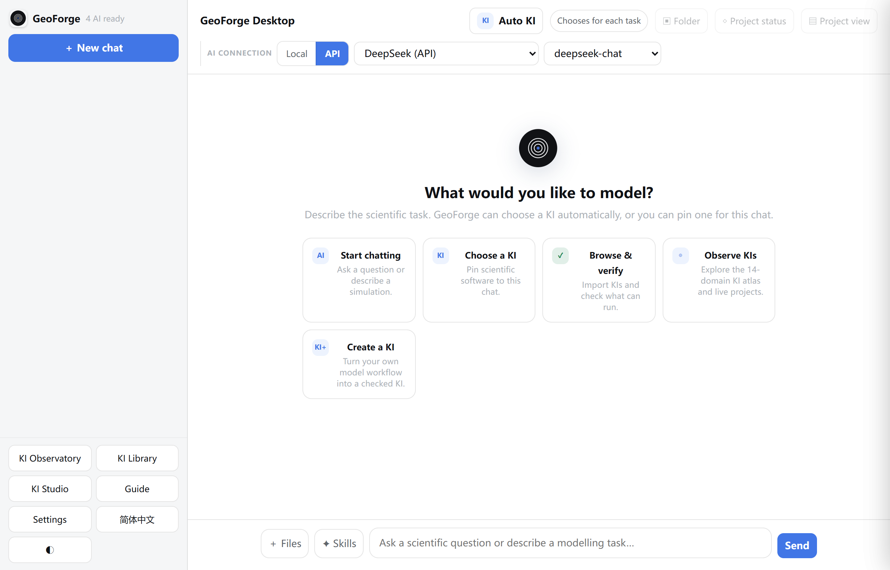
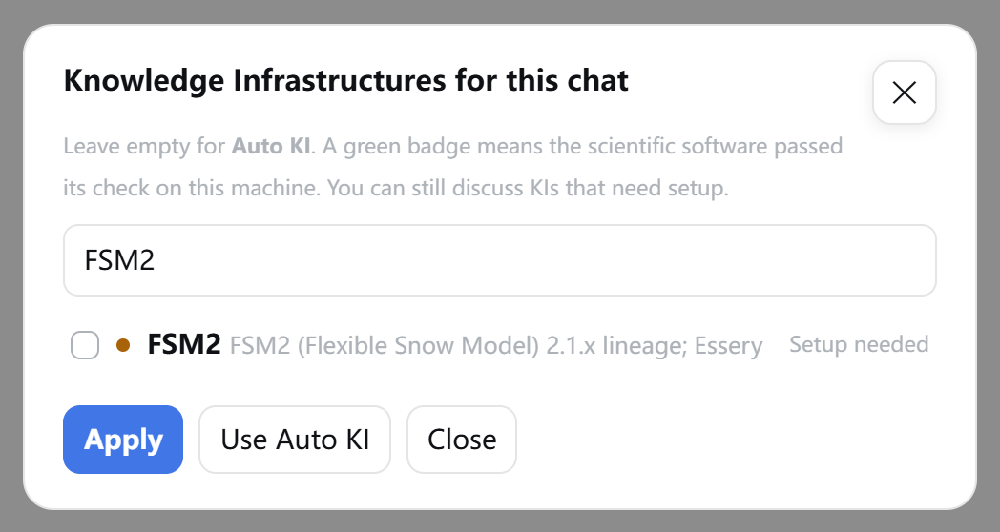
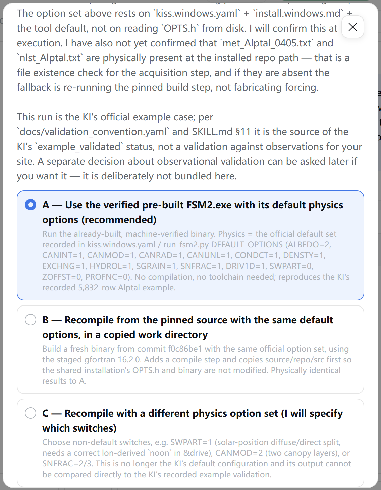
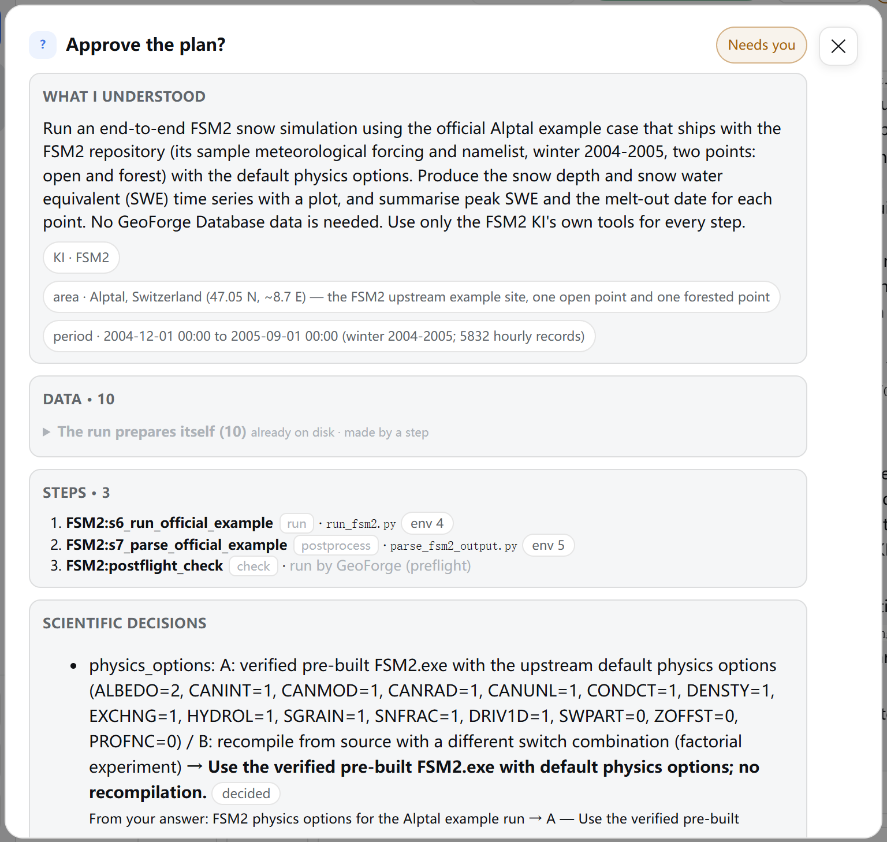
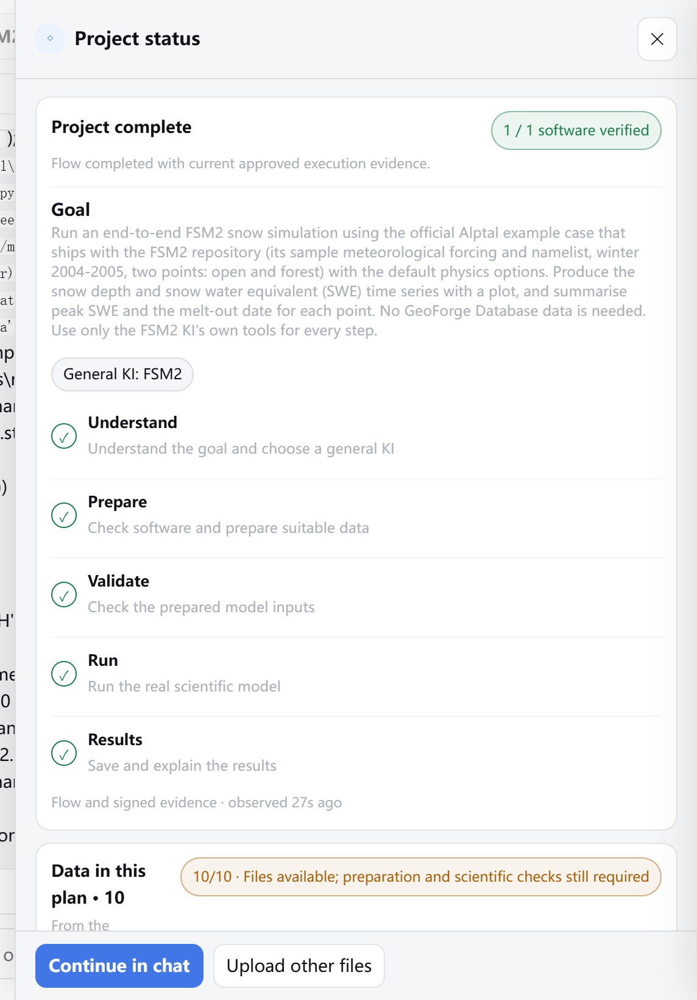

# 0 Quick start

> **Edition 0.6.55 (Windows).** The full manual preserves the detailed real FSM2 walkthrough and screenshots captured for 0.6.54. Current fixes and SHAW/CRHM/VIC verification are described in Chapter 11. For the shortest route, open **Guide → Quickstart · 3 pages**; calibration has its own guide and Chapter 10. Screenshots are from the real application, not invented screens.

In this chapter you will follow the whole path from installing GeoForge Desktop 0.6.55 to a model run that GeoForge marks **Completed**, in eight steps. Each step names the chapter that explains it in detail.

The screenshots show the Windows build in English. The example is the FSM2 snow model run with a DeepSeek API key, the one case tested end to end on Windows for 0.6.54.

## Three ideas worth remembering

1. **Chat is the entry point.** You start every task by describing it in a chat. GeoForge plans from what you write.
2. **A KI describes one scientific model.** A KI (Knowledge Infrastructure) is GeoForge's packaged knowledge about a model such as FSM2: how to install, prepare, run and check it. Having the KI does not mean the model software is on your computer yet.
3. **Every chat is one project folder.** Each chat has its own folder on your computer for its inputs, model runs, outputs, plots and run records. A run record is a signed file GeoForge writes for each step it runs, naming the command and the files read and written.

## Step 1: Install and open GeoForge *(Chapter 1)*

| | Windows | macOS |
|---|---|---|
| Release to use | `windows-v0.6.55` | `v0.6.54` |
| Where GeoForge appears | A page in your default web browser, plus an icon in the system tray | Its own window |
| How to quit | Right-click the tray icon, then choose **Exit GeoForge** | Close the window |

On Windows:

1. Open the [windows-v0.6.55 release page](https://github.com/lzwei196/KISS-Knowledge-Infrastructure-for-Scientific-Simulation/releases/tag/windows-v0.6.55).
2. Download `GeoForge-Desktop-Setup-v0.6.55-Windows-x64.exe`.
3. Double-click the downloaded file and follow the installer to the end. You do not need administrator rights. If Windows blocks the file, see Chapter 1.
4. Open **GeoForge Desktop** from the Start menu.

    Check that GeoForge opens as a page in your web browser and that its icon appears in the system tray.

Closing the browser tab does not quit GeoForge; it keeps running in the tray. To quit, right-click the tray icon and choose **Exit GeoForge**.

On macOS: install from the `v0.6.54` release as Chapter 1 describes. The macOS 0.6.54 build dates from 19 September 2026 and lacks some later changes in the Windows build, so some screens in this manual look different on a Mac.

## Step 2: Connect an AI *(Chapter 2)*

GeoForge needs an AI to plan and run work. This example uses a DeepSeek API key. The GeoForge Database (Chapter 3) is optional and not needed here.

1. Click **Settings** at the bottom of the sidebar.
2. Click **AI services** if that page is not already open.
3. On the **DeepSeek (API)** card, paste your key into the **Paste API key** field.
4. On the same card, select **Use by default**.
5. Click **Save**.

    

    Check that the word "saved" appears briefly next to **Close**, and that the **DeepSeek (API)** card reads **key set** with **Use by default** selected.

6. Click **Close**.

    

    Check that the top of the sidebar reads a number followed by **AI ready** (here **4 AI ready**), not **AI setup needed**.

To use an agent installed on your computer instead (such as Claude Code, OpenAI Codex or Kimi Code):

1. Sign in to the agent in PowerShell (Windows) or Terminal (macOS), as the agent's own instructions say.
2. In **Settings → AI services**, click **Recheck local CLIs**.

    Check that the agent's card reads **signed in**.

> **Caution:** In 0.6.54 only the DeepSeek API path was tested end to end on Windows. Local agents were not. On Windows, Kimi Code does not start until you choose **Enable Kimi with full computer access** under **Settings → Permissions** (Chapter 2 explains the risk).

## Step 3: Start a new chat and choose the model *(Chapters 4 and 5)*

1. Click **＋ New chat**.

    

    Check that **Project name** is filled in and that **Project folder (created automatically)** shows where the project will go. `{id}` is replaced by a unique code.

2. Keep the suggested **Project name**, or type a new one.
3. Keep the folder in **Create the project inside**, or type another path (for example `D:\GeoForge-Manual\projects`). On Windows, **Choose…** cannot open a folder picker, so type or paste the path.
4. Click **Create chat**.

    

    Check that the chat name appears in the header and in the sidebar, with **Auto KI · 0 messages** under it.

5. Under **AI CONNECTION**, click **API** to use an API key, or **Local** to use an agent on your computer.
6. In the first list next to it, choose the provider (here **DeepSeek (API)**).
7. In the second list, choose the model (here **deepseek-chat**).

    > **Tip:** On Windows, each start of GeoForge uses a new local address, so the page can forget your last **Local**/**API** choice. Check **AI CONNECTION** before you send the first message.

To let GeoForge choose the KI from your request, leave **Auto KI** as it is and go to Step 4. To choose the KI yourself:

1. Click **Auto KI** in the header.
2. Type the model name, for example `FSM2`, in **Search KIs…**.

    

    Check that the model's row appears. **Setup needed** means the model software is not yet verified on this computer.

3. Tick the box next to the model.
4. Click **Apply**.

    

    Check that the header shows **FSM2** with **Setup needed**, and that a banner says FSM2 is not verified on this machine. You do not need to set it up now: after you approve the plan, GeoForge sets up the software before it runs the model.

> **Caution:** After you send the first message, the KI, the **Local**/**API** choice, the provider and the model are fixed for this chat. To change any of them, start a new chat.

## Step 4: Describe your task *(Chapter 5)*

1. Click in the message box (**Ask a scientific question or describe a modelling task…**).
2. Type your request. Name the place, the period, the process, the outputs you want, and any data you have or do not want.
3. Click **Send**.

    Check that **Send** changes to **Working…** and that a bar with a **Stop** button appears under the message box while the AI works.

This is the request used for the worked example in Chapter 5 (SWE is snow water equivalent):

> Run an end-to-end FSM2 snow simulation using the official Alptal example case that ships with the FSM2 repository (its sample meteorological forcing and namelist, winter 2004-2005, two points: open and forest) with the default physics options. Produce the snow depth and snow water equivalent (SWE) time series with a plot, and summarise peak SWE and the melt-out date for each point. No GeoForge Database data is needed. Use only the FSM2 KI's own tools for every step.

A plain question such as "What is SWE?" gets an answer but does not start a plan. GeoForge decides by simple keywords: a message that mentions a model, a simulation or a run starts planning.

## Step 5: Answer the planning questions *(Chapter 5)*

While the AI plans, GeoForge allows it only to read and to draft the plan. Downloads, installations and model runs wait for your approval. When the AI needs a decision, a card with a **Needs you** tag opens. Cards come one at a time.

1. Read the question on the card.
2. Select one option. To answer in your own words, select **Use my own answer / file** and type your answer in **Optional note for the agent**.

    

    Check that your option is highlighted. The question in your project will differ from this example.

3. Click **Continue with this choice** at the bottom of the card.
4. Repeat for each new card.

Answer on the card itself: a reply typed in the chat is not saved as your answer. If you close a card with **Not now** or **✕**, reopen it with **◇ Project status → Respond**.

## Step 6: Approve the plan *(Chapter 5)*

When planning is finished, the card **Approve the plan?** opens. Its sections are **What I understood**, **Data**, **Steps**, and, when they apply, **Data sources, your pick**, **Scientific decisions**, **Waiting on you** and **Not ready to execute yet**.

Check **What I understood**, **Data** and the three **Steps**, and that the card shows no **Not ready to execute yet** section.

1. Read **What I understood** and **Steps**, and check that they match your request.
2. Read **Data**. Each row names an input; when a specific dataset is chosen for it, that dataset follows a ← sign.
3. Select **Approve and start**.
4. Click **Continue with this choice**.

To change the plan instead, select **Modify the plan**, write what to change in **Optional note for the agent**, and click **Continue with this choice**. The AI revises the plan and shows a new card.

If a row under **You** in **Data** asks for your own file, approval waits for that file. Upload it with the row's **Upload files** button in **◇ Project status → Data in this plan** (Chapter 6).

> **Check the actual plan:** data sources, required inputs and executable steps must match your request. If they disagree, or if **Not ready to execute yet** appears, choose **Modify the plan**. Chapter 9 explains how to diagnose the current approval state.

## Step 7: Let GeoForge fetch the data and run *(Chapters 3, 4 and 5)*

After you approve, GeoForge downloads the approved data itself and shows progress in a banner above the message box. The FSM2 example uses the forcing data that ships with FSM2, so nothing is downloaded. If the model software is not yet verified on this computer, GeoForge sets it up first, then runs the approved steps.

1. Watch the banner above the message box and the AI's messages in the chat.
2. If the banner shows **Start the approved run**, click it.

> **Current Windows behaviour:** API software setup installs and verifies the environment. Execute the scientific example later through the separately approved project plan.

Some large GeoForge Database files must be downloaded by hand from Baidu Pan, a cloud-storage service. **◇ Project status** then shows a manual download card:

1. Click **Open download link** and download the file, using the **Extraction code** shown on the card.
2. Wait until the download has finished completely.
3. Copy the files into the folder shown after **Place at** (**Copy path** copies it).
4. Click **Files are in place, continue**.

To stop the current work, click **Stop** in the bar under the message box. On Windows, a job the agent started in the background can keep running after **Stop**; check Task Manager (Chapter 9).

## Step 8: Check Completed and read the results *(Chapters 5 and 6)*

1. Click **◇ Project status** in the header.

    

    Check that the panel title reads **Project complete** and that all five steps show a tick. The **◇ Project status** button turns green.

2. Close the panel with **✕**.
3. Read the AI's summary of the results in the chat.
4. Click **▣ Folder** to open the project folder in File Explorer (Finder on macOS).
5. Click **▤ Project view** to see the result panels.

After **Completed**, you can still ask the AI about the results in this chat, but it can no longer run, download or change inputs. For another period or scenario, start a new chat.

## What "Completed" means, and what it does not

**Completed** means GeoForge found a passing, signed run record for every step of the approved plan, and the outputs passed GeoForge's automatic checks. For example: the run reported no error, the output files exist and are not empty, they contain no NaN or infinite values, the time axis is complete, and the main output is not all zero or one constant value. Work the AI only describes in the chat does not count.

**Completed** does not mean the science is validated. Nothing was compared with observations unless your plan included it. Downloaded data were not checked scientifically. Benchmark scores quoted from a KI are not scores of your run.

That is why a completed project can still show "Produced; scientific checks pending" in **Data in this plan**, and "— experimental / unvalidated" on **Project view** panels that no passing run record covers. Ask the AI: "What did you assume, what is measured, and what is generated?"

## If something goes wrong

| What you see | What to do |
|---|---|
| **AI setup needed**, **Connect an AI to begin.**, or "No API connection yet. Open AI Settings and add a key." | Open **Settings → AI services** and add a key or sign in to an agent. "AI Settings" is the old name of that page. See Chapter 2. |
| **Send** stays grey although a key is saved. | Under **AI CONNECTION**, click **API** (or **Local**) and choose a provider that is ready. |
| You closed the browser tab on Windows. | GeoForge is still running. Double-click the tray icon, or right-click it and choose **Open GeoForge**. Do not start it again from the Start menu: that starts a second copy. |
| "Browser mode: type the folder path here. The desktop build opens the system folder picker." | This appears on Windows when you click **Choose…**. Type or paste the folder path into **Create the project inside**. |
| Wrong model or AI, and the first message is already sent. | Start a new chat and choose before you send. |
| A question or approval card disappeared. | Click **◇ Project status**, then **Respond**. |
| "GeoForge verification: not complete yet" and no **Completed**. | Ask the AI to regenerate or remove the files the message lists. Never delete your own input files. See Chapter 9. |

## Where to go next

| Chapter | Read it to… |
|---|---|
| 1 Install GeoForge | install, start and quit on Windows or macOS |
| 2 Connect an AI | set up keys, local agents, proxy and permissions |
| 3 The GeoForge Database | activate the data catalogue and understand its downloads |
| 4 Install a scientific model | set up or verify model software, or use a copy you have |
| 5 Your first project | follow one full run, from request to **Completed** |
| 6 Project files | find outputs, plots and run records |
| 7 More tools | use the KI Library, KI Observatory, KI Studio and other tools |
| 8 Language, appearance and keyboard | switch language (**简体中文**), theme (**◐**) and learn the keys |
| 9 Troubleshooting and known issues | fix problems and check current Windows limits |
