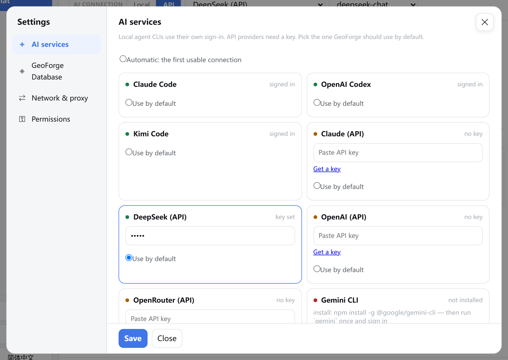
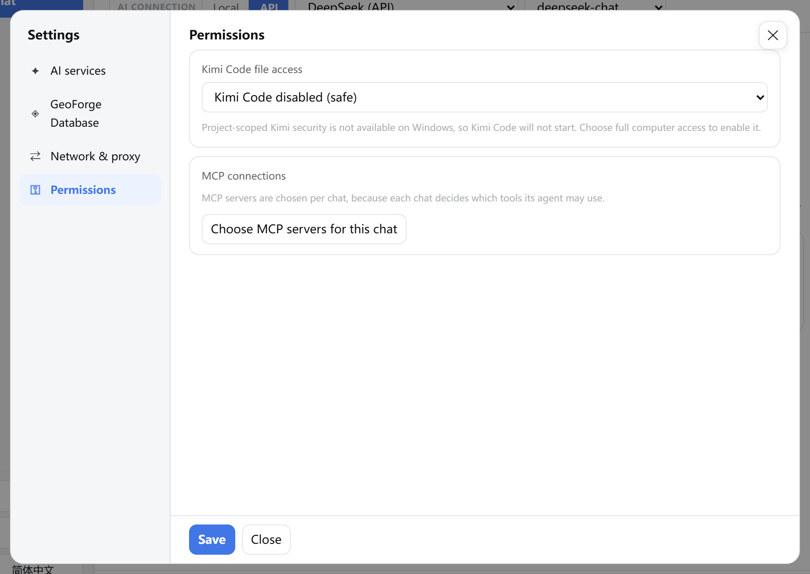
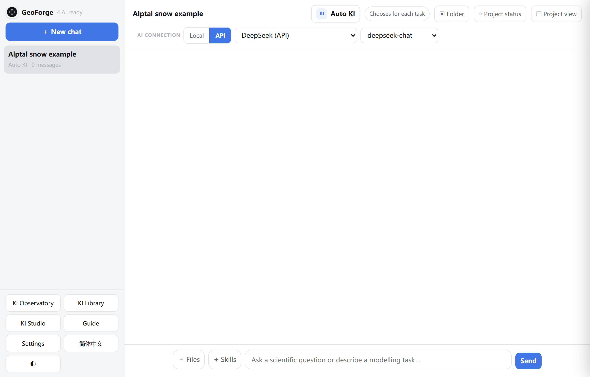

# 2 Connect an AI

In this chapter you will connect GeoForge to an AI, choose which AI a chat uses, set up a proxy if you need one, and check the connection before you start a project.

GeoForge cannot plan or run anything until at least one AI is connected. Until then the top of the sidebar reads **AI setup needed** and a banner says "Connect an AI to begin."

A working AI connection only means GeoForge can talk to the AI. It says nothing about whether a model run is correct. GeoForge's run records show what was actually run; judging whether the results are scientifically right stays your job. Later chapters explain both.

## Two ways to connect an AI

| | API key | Local agent CLI |
|---|---|---|
| What it is | A key from an AI company. GeoForge talks to the service directly. | A command-line AI program that is installed and signed in on this computer. GeoForge runs it for you under your user account. |
| Services in 0.6.54 | **DeepSeek (API)**, **OpenAI (API)**, **OpenRouter (API)**, **Claude (API)** (Anthropic) | **Claude Code**, **OpenAI Codex**, **Kimi Code**, **Gemini CLI**, **Qwen Code** |
| Extra software | None | Node.js for most of them; Git for Windows for Claude Code on Windows |
| Who bills you | The AI company, per use, on your API account | Your account or subscription for that CLI |
| Taken through a full project in the Windows 0.6.54 test | **DeepSeek (API)**, with the FSM2 snow model example | None yet |

If you are unsure, start with **DeepSeek (API)**. It needs no other software, it usually works from mainland China without a proxy, and it is the only AI that has been tested through a full project on Windows in 0.6.54.

You can connect several AIs. Each chat uses one of them.

## Open Settings

All AI settings are in one window.

1. Click **Settings** at the bottom of the left sidebar.

    The **Settings** window opens. The first time, it shows the **AI services** page. After that it reopens on the page you used last, until the GeoForge page is reloaded or GeoForge restarts.

2. If another page is showing, click **AI services** on the left.

    

    Check that the left side lists four pages, and that **Save** and **Close** are at the bottom.

3. To switch pages, click a page name on the left:

    | Page | What you set there |
    |---|---|
    | **AI services** | API keys, local agent CLIs, the default AI, and the connection test |
    | **GeoForge Database** | The optional data catalogue (see Chapter 3) |
    | **Network & proxy** | Whether GeoForge uses a proxy, and for which services |
    | **Permissions** | Kimi Code file access, and MCP servers for the open chat |

4. Click **Save** when you have finished. One **Save** keeps the changes on all four pages. "saved" appears for a moment next to **Close**.

> **Caution:** Changes are kept only when you click **Save**, **Test AI & GitHub** or **Save & test database** (both of these save first). **Close**, **✕**, the Esc key or a click outside the window all close it, and the next time you open **Settings** your unsaved changes are gone, on every page.

> **Tip:** The KI Library page has its own small **⚙** settings box. It is an older, simpler version without **Permissions**, **Recheck local CLIs** or **Test AI & GitHub**. Use the **Settings** button in the main sidebar instead.

## Connect an AI with an API key

Each API service has a card on the **AI services** page. These are the services and the models GeoForge offers for them, in the order the model list shows them:

| Card | Models in the chat header | Where **Get a key** leads |
|---|---|---|
| **DeepSeek (API)** | `deepseek-chat` (preselected), `deepseek-reasoner` | `https://platform.deepseek.com/api_keys` |
| **OpenAI (API)** | `gpt-4o` (preselected), `gpt-4o-mini` | `https://platform.openai.com/api-keys` |
| **OpenRouter (API)** | `claude-sonnet-4-5`, `deepseek-chat` (preselected) | `https://openrouter.ai/keys` |
| **Claude (API)** | `claude-sonnet-4-5` (preselected), `claude-opus-4-1` | `https://console.anthropic.com/settings/keys` |

The steps use DeepSeek. The other cards work the same way.

1. Click **Settings**.
2. If another page is showing, click **AI services**.
3. Find the **DeepSeek (API)** card. Without a key it shows **no key** and an amber dot.
4. Click **Get a key** on the card. The provider's key page opens in your browser.
5. On that page, sign in to your DeepSeek account, create an API key and copy it. You do this on the provider's site, not in GeoForge.
6. Back in GeoForge, click in the **Paste API key** field on the card.
7. Paste the key.
8. Select **Use by default** on the same card if this should be your usual AI. (See "Choose the default AI" below.)
9. Click **Save**.

    Compare with the **AI services** screenshot in "Open Settings" above. The **DeepSeek (API)** card reads **key set**, the dot is green, the key field shows only dots, and **Use by default** is selected (the card gets a blue border). The **Get a key** link is gone.

10. Click **Test AI & GitHub** to prove the key works (see "Check the connection with Test AI & GitHub" below). A key that is saved is not yet a key that works.
11. Click **Close**.

    The top of the sidebar, next to **GeoForge**, now reads for example **1 AI ready** instead of **AI setup needed**.

### Replace or remove a key

After you save a key, GeoForge never shows it again. When you reopen **Settings**, the field holds only a placeholder: "…" and the key's last four characters, displayed as five dots.

To replace a key:

1. Click in the key field on the card.
2. Press Ctrl+A (macOS: Cmd+A), then Delete. The field is now empty.
3. Paste the new key.
4. Click **Save**.

To remove a key, do steps 1, 2 and 4 only.

> **Caution:** If you paste a new key without first emptying the field, the new key is added to the placeholder, and GeoForge silently keeps the old key. Always empty the field first.

### Where the key is stored

GeoForge saves keys in a settings file inside your own user profile:

| Platform | File |
|---|---|
| Windows | `%APPDATA%\KISS\settings.json` (usually `C:\Users\you\AppData\Roaming\KISS\settings.json`) |
| macOS | `~/Library/Application Support/KISS/settings.json` (readable only by your account) |

The file is not encrypted. Do not share, upload or sync that folder, and do not send it when you ask for help.

### Keys set as environment variables

GeoForge also reads these environment variables from your computer: `DEEPSEEK_API_KEY`, `OPENAI_API_KEY`, `OPENROUTER_API_KEY` and `ANTHROPIC_API_KEY`. (An environment variable is a named setting that Windows or macOS passes to every program.)

- If one is set, the matching card shows **key set** even when you never pasted a key.
- If you also save a key in **Settings**, the saved key is used until GeoForge restarts. From the next start, the environment variable wins.

So if a key you saved is rejected after a restart, look for such a variable:

- **Windows:** Start menu, search "environment variables", open **Edit environment variables for your account**. Remove the variable, or give it the same key. Then restart GeoForge.
- **macOS:** look for a line such as `export DEEPSEEK_API_KEY=…` in `~/.zshrc`. Remove it, or give it the same key. Then quit and reopen GeoForge.

> **Tip:** A saved **Claude (API)** key is also visible to the Claude Code CLI. Claude Code then counts as signed in, and it may bill that API key instead of your Claude subscription. If you want Claude Code to use your subscription, leave the **Claude (API)** key empty.

## Connect a local agent CLI

A local agent CLI is an AI program that runs in PowerShell (Windows) or Terminal (macOS). GeoForge starts it for you, under your user account, with your own sign-in. You install it and sign in once, outside GeoForge.

### What you need first

- **Node.js (LTS version)** from `https://nodejs.org`. It provides `npm`, the installer that Claude Code, OpenAI Codex, Gemini CLI and Qwen Code use.
- **Git for Windows** from `https://git-scm.com`, if you want Claude Code on Windows. Claude Code runs its commands through Git Bash, which comes with it.
- An account with the AI company that makes the CLI.

### Install and sign-in commands

GeoForge shows these same commands under each card that is not ready.

| Card | Install command | Sign-in command |
|---|---|---|
| **Claude Code** | `npm install -g @anthropic-ai/claude-code` | `claude auth login` |
| **OpenAI Codex** | `npm install -g @openai/codex` (version 0.144.0 or newer) | `codex login` |
| **Gemini CLI** | `npm install -g @google/gemini-cli` | Run `gemini` once and sign in |
| **Qwen Code** | `npm install -g @qwen-code/qwen-code` | Run `qwen` once and sign in |
| **Kimi Code** | Windows: no installer is published; the card points to `https://code.kimi.com`. macOS: see below. | `kimi login` |

On macOS, Kimi Code installs with this Terminal command:

```
curl -fsSL https://code.kimi.com/kimi-code/install.sh | bash
```

### Steps

1. Install Node.js.
2. **Windows, Claude Code only:** install Git for Windows.
3. Open a **new** PowerShell window (Windows) or Terminal window (macOS). A window opened before Node.js was installed cannot find `npm`.
4. Type the install command from the table and press Enter.
5. Type the sign-in command and press Enter.
6. Finish the sign-in in the browser page the CLI opens.
7. **Windows only:** right-click the GeoForge icon in the system tray and choose **Exit GeoForge**.

    > **Caution:** **Exit GeoForge** also stops any agent, download or model run that is still working. Exit only when nothing important is running.

8. **Windows only:** open **GeoForge Desktop** from the Start menu.

    GeoForge reads the list of program folders only when it starts, so a CLI installed while it was running can stay invisible until a restart. If you only signed in to a CLI that GeoForge already found, skip steps 7 and 8.

9. Click **Settings**.
10. If another page is showing, click **AI services**.
11. Scroll below the cards and click **Recheck local CLIs**.

    The note beside the button shows "checking…", then "checked".

12. Read the card of your CLI (see the table below).

> **Tip:** GeoForge also rechecks installed CLIs that are not ready yet each time you come back to its tab or window. **Recheck local CLIs** forces it.

### What the card tells you

| Card shows | Dot | Meaning | What to do |
|---|---|---|---|
| **signed in** | green | Installed and signed in. | Nothing. It is ready. |
| **signed in** | amber | Installed, but GeoForge cannot confirm the sign-in. This is always the case for **Gemini CLI** and **Qwen Code**. | You can use it. The first message in a chat shows whether the sign-in works. |
| installed; sign-in required | amber | Installed, not signed in. | Run the sign-in command shown under the card, then click **Recheck local CLIs**. |
| … update required (0.130.0 < 0.144.0) | amber | **OpenAI Codex** is too old for GeoForge. The numbers are your version and the minimum. | Run `npm install -g @openai/codex` again, then click **Recheck local CLIs**. |
| **not installed** | red | GeoForge cannot find the program. | Use the install command shown under the card. |

The words "installed", "signed in" and "works" are three separate checks. Only a real message proves the last one; **Test AI & GitHub** sends one for you.

> **Caution:** On Windows 0.6.54, none of the local agent CLIs has been tested through a full project yet. If you want the tested path, use **DeepSeek (API)**.

## Kimi Code on Windows: allow full computer access

On macOS, GeoForge keeps Kimi Code inside the project folder with a macOS security feature. Windows has no such feature yet, so on Windows Kimi Code stays off until you allow it full access to your files.

Until you do, the **Kimi Code** card can still say **signed in**, and you can even pick Kimi in a chat. But the reply is only this message:

"[Kimi Code was not started: project-scoped security could not be applied (project-scoped Kimi is currently available on macOS only). Choose Full computer access in AI Settings only if you accept that risk.]"

("AI Settings" in that message means **Settings → Permissions**.)

To allow Kimi Code:

1. Click **Settings**.
2. Click **Permissions** on the left.

    

    Check that **Kimi Code file access** shows **Kimi Code disabled (safe)**, the default. The note under it says Kimi Code will not start on Windows.

3. In the **Kimi Code file access** list, choose **Enable Kimi with full computer access**.

    A browser question appears: "Kimi Code will be able to read and change every file accessible to this Windows account. Accept this risk and enable it?"

4. Click **OK** only if you accept that risk. **Cancel** sets the list back to **Kimi Code disabled (safe)**.

    After **OK**, the note under the list reads "Kimi Code can read and change every file accessible to this Windows account. Enable only if you accept this risk."

5. Click **Save**.
6. Send your message to Kimi again.

On macOS the same list has two other choices:

| macOS choice | What Kimi Code may use |
|---|---|
| **Project scoped (recommended)** | The project, its KI, approved data and its own sign-in. When it needs another folder, the chat shows a card "Kimi needs access to one folder" with **Allow once** and **Always for this project**. |
| **Full computer access** | Every file your macOS account can open. Use it only for a task that cannot run in project-scoped mode. |

The **MCP connections** part of the **Permissions** page is for advanced users. (MCP servers are add-on tools an agent can be given.) **Choose MCP servers for this chat** does nothing unless a chat is open.

## Choose the default AI

The default AI is the one GeoForge picks for you when you do not choose.

1. Click **Settings**.
2. If another page is showing, click **AI services**.
3. Choose one:

    - **Use by default** on one card, for a fixed default.
    - **Automatic: the first usable connection** at the top of the page, to let GeoForge take the first AI that is ready.

4. Click **Save**.

The default is used in three places:

- **New chats:** it is preselected in the chat header, as long as the **Local** | **API** switch is on its kind. With **DeepSeek (API)** as default, the header must show **API**.
- **Agent setup** (model installation, Chapter 4): it is preselected there.
- **Test AI & GitHub:** step [6/6] tests the default AI.

Changing the default never changes a chat that has already started.

## Choose the AI for one chat

Each chat has its own AI. You choose it in the chat header, under **AI CONNECTION**, before you send the first message.

1. Start a new chat with **＋ New chat** (Chapter 6 explains the dialog).
2. Before typing, look at **AI CONNECTION** at the top of the chat.
3. Click **Local** for an installed agent CLI, or **API** for a key-based service.
4. In the first list, choose the AI.

    Entries that are not ready are greyed out with a reason after a dash, for example "Claude Code — sign-in needed". An API service without a key shows "— not installed", which here means "no key saved". "— login checked on first use" (Gemini CLI, Qwen Code) is not an error: you can choose it.

5. In the second list, choose the model. For a local CLI, **CLI default** uses whatever model the CLI itself is set to.

    

    Check the header before sending: **API** is highlighted, the lists show **DeepSeek (API)** and **deepseek-chat**, and the chat in the sidebar says "0 messages". **Send** is blue only when the chosen AI is ready.

6. Type your first message.
7. Click **Send**.

> **Tip:** Hover over **Local** or **API** to see how many AIs of that kind are ready.

### The AI is fixed after the first message

Once the first message is sent, the **Local** | **API** switch, both lists and the KI button (**Auto KI** or the name of the pinned KI) are greyed out for that chat. Hovering over the AI list shows "Fixed for this chat — start a new chat to switch AI"; the model list shows "Fixed for this chat — start a new chat to switch model".

The reason: the conversation lives inside that AI's own session, and another AI could not read it. Switching would lose the history.

To use a different AI, model or KI, start a new chat and choose before sending. Since 0.6.54, a chat keeps its AI after GeoForge restarts.

> **Tip (Windows):** GeoForge opens at a new local address each time it starts, so your browser forgets whether you last chose **Local** or **API**, and a new chat can start on **Local**. If you use only an API key and a new chat shows **Local** with the banner "No local agent CLI is installed…", click **API**.

## Network and proxy

You need this section only if some services are blocked or slow on your network. In mainland China, GitHub, Claude, OpenAI, OpenRouter and Gemini usually need a proxy; DeepSeek, Kimi and Qwen usually do not.

GeoForge does not provide a proxy. It can use one you already run, such as a local proxy app.

1. Click **Settings**.
2. Click **Network & proxy** on the left.

    

    Check the note under **Proxy**. Here it reads "Detected http://127.0.0.1:7897. GeoForge will pass it only to the providers selected below." The four ticked boxes (**GitHub & KI updates**, **Observation data**, **Claude Code**, **OpenAI Codex**) are the defaults.

3. Under **Proxy**, choose one option:

    | Option | What it does |
    |---|---|
    | **Use Mac system proxy (recommended)** | Uses your computer's system proxy. On Windows too, despite the word "Mac". |
    | **Enter proxy manually** | Uses the address you type, for example `http://127.0.0.1:7897`. |
    | **Do not use a proxy** | Connects directly everywhere, and removes proxy settings from GeoForge's AI connections. |

4. If you chose **Enter proxy manually**, type the address and port your proxy app shows. It must start with `http://`, `https://`, `socks5://` or `socks5h://`. A user name or password in the address is refused; let your local proxy app handle the login.
5. Under **Use proxy for**, tick each service that needs the proxy and untick the others (see the tables below).
6. Click **Save**.
7. Click **AI services** on the left.
8. Click **Test AI & GitHub**. Step [4/6] tests GitHub through the **GitHub & KI updates** tick; step [6/6] tests the AI through that AI's own tick.

> **Caution:** On Windows the first option still reads **Use Mac system proxy (recommended)**. It means the Windows system proxy: the one set in Windows proxy settings, or by your proxy app's "system proxy" mode. If none is set, the note says "No system proxy detected. GeoForge will use the normal network connection."

### What each tick covers

| Tick | What goes through the proxy |
|---|---|
| **GitHub & KI updates** (on by default) | GeoForge's own GitHub check in **Test AI & GitHub**, and KI library updates |
| **Observation data** (on by default) | Connections to the GeoForge Database (Chapter 3) |
| Each AI, for example **Claude Code** (on by default), **OpenAI Codex** (on by default), **DeepSeek (API)** | That AI's own connection, **and** the downloads its agent makes with Git, pip or curl, for example fetching a model's source code from GitHub during setup |

An unticked service always connects directly, even when a proxy is set.

A typical choice in mainland China:

| Tick | Leave unticked |
|---|---|
| **GitHub & KI updates**, **Observation data**, **Claude Code**, **OpenAI Codex**, **Gemini CLI**, **Claude (API)**, **OpenAI (API)**, **OpenRouter (API)** | **DeepSeek (API)**, **Kimi Code**, **Qwen Code** |

> **Tip:** **GitHub & KI updates** does not cover downloads made by the AI's agent. If you use DeepSeek, Kimi or Qwen without the proxy and the agent cannot download model source code from GitHub during setup, tick that AI as well, click **Save**, and ask the agent to try again.

## Check the connection with Test AI & GitHub

Run this test after any change on these pages, and before your first project.

1. Click **Settings**.
2. If another page is showing, click **AI services**.
3. Choose the AI to test: select **Use by default** on its card. With **Automatic: the first usable connection**, the test uses the AI currently shown in the chat header.
4. Scroll below the cards and click **Test AI & GitHub**.

    "testing a real connection…" appears next to **Close**. GeoForge saves all your settings first, then a grey box fills with a six-step report, line by line. The report is in English only.

5. Wait for the last line, "done.", and for "test complete" next to **Close**.
6. Read the report with the table below.

| Step | What it checks | Good result | Notes |
|---|---|---|---|
| [1/6] KI harness contract | GeoForge's built-in rules for running models are intact | OK | A FAIL here is not something you can fix in Settings. Copy the report and ask for help. |
| [2/6] Python 3 for model environments | Whether a Python is installed on the computer | OK and a path | See the caution below for Windows. |
| [3/6] Agent CLIs on this machine | Each installed CLI, its location and sign-in state | OK for the CLIs you use | "FAIL  none found — install one" is fine if you use an API key. |
| [4/6] GitHub model-source connection | Whether GitHub can be reached, and which proxy was used | "OK  GitHub answered (HTTP 200)" | On FAIL, follow the "Fix:" line: tick **GitHub & KI updates** or correct the proxy address. |
| [5/6] API keys in the environment | Which API keys GeoForge has | "OK  DeepSeek (API) (DEEPSEEK_API_KEY is set)" | "none set (fine if you use an agent CLI)" |
| [6/6] Agent sign-in — running the agent for real | Sends one short real message to the AI being tested | API: "OK … answered (HTTP 200) — key is valid". CLI: "OK … answered — signed in and working" | On FAIL, read the lines under it and the "Fix:" line, if there is one. |

**OK** means the step passed. **FAIL** lines are followed by the raw error and, for most steps, a line starting with "Fix:".

> **Caution (Windows):** Some advice in the report is written for macOS. [2/6] often shows FAIL on Windows and suggests `brew install python` or `xcode-select --install`; those commands do not exist on Windows. This line does not stop you connecting an AI or chatting; Python matters only for models whose setup needs it (Chapter 4). Under a [6/6] failure, read "Terminal" as PowerShell, ignore the `echo $HOME` advice, and read "switch the menu bar to API" as "click **API** in the chat header".

> **Caution:** Step [6/6] is a real call. With an API key, the provider charges you for a very small request; with a CLI, it uses a little of your plan.

> **Caution (Windows):** [6/6] runs Kimi Code directly. It can report Kimi as working while **Permissions** is still on **Kimi Code disabled (safe)**, and chats will still refuse to start Kimi until you enable it.

When you ask for help, copy the whole report. GeoForge does not print your keys in it, but a provider's error message may quote part of a key, and folder paths show your user name. Read it before you share it.

## If something goes wrong

| What you see | Cause | What to do |
|---|---|---|
| Banner "Connect an AI to begin. Open AI Settings to add a key or configure a local agent." and **AI setup needed** in the sidebar | No AI is ready. | Add a key or sign in to a CLI as described above. "AI Settings" is the old name of **Settings**. |
| Banner "No API connection yet. Open AI Settings and add a key." | The header is on **API**, but no key is saved. | Add a key, or click **Local** if you use a CLI. |
| Banner "No local agent CLI is installed. Open AI Settings for setup details." with **Recheck** | The header is on **Local**, but no CLI was found. | Click **API** if you use a key. If you just installed a CLI on Windows, restart GeoForge, then click **Recheck**. |
| Banner "Local CLIs are installed but not ready — OpenAI Codex: sign-in needed. run `codex login` in PowerShell." with **Recheck** | A CLI is installed but not signed in. | Run the command in the banner, then click **Recheck**. |
| **Send** stays grey | The AI chosen in the header is not ready, or the chat is still busy. | Pick an AI that is not greyed out in the list, or fix the one you want. |
| PowerShell says "npm.ps1 cannot be loaded because running scripts is disabled on this system" | Windows blocks the PowerShell version of `npm`. | Type `npm.cmd` instead of `npm`, for example `npm.cmd install -g @openai/codex`. |
| A CLI still shows **not installed** after you installed it | GeoForge was running during the install, or the install failed. | Windows: exit GeoForge from the tray and start it again. macOS: quit GeoForge and open it again. Then, in a new PowerShell or Terminal window, type `claude --version` (or `codex --version`, `gemini --version`): if the command is not found, repeat the install. |
| A CLI shows "installed; sign-in required" although you signed in | The sign-in was done for a different account, or did not finish. | In PowerShell or Terminal, run `claude auth status` or `codex login status` to see what the CLI reports. Sign in again, then click **Recheck local CLIs**. |
| "update required (… < 0.144.0)" on **OpenAI Codex** | The Codex CLI is too old. | Run `npm install -g @openai/codex`, then click **Recheck local CLIs**. |
| Test [6/6]: "FAIL  DeepSeek (API): HTTP 401 — key rejected" (or 403) | The provider refused the key. | Check the key on the provider's site. Empty the field fully, paste the key again, click **Save**, and test again. Check for an environment variable with the same name. |
| Test [6/6]: "FAIL  cannot reach DeepSeek (API): …" | The network or the proxy route is wrong for that AI. | On **Network & proxy**, tick or untick that AI, click **Save**, and test again. |
| Test [4/6]: "FAIL  cannot reach GitHub: …" | GitHub is blocked or the proxy address is wrong. | Tick **GitHub & KI updates**, check the proxy address, click **Save**, and test again. |
| You pasted a new key, but the old one is still used | The new key was added to the placeholder instead of replacing it. | Empty the field completely, paste again, click **Save**. |
| Save fails with "proxy address is required in manual mode" | **Enter proxy manually** is chosen with an empty address. | Type the address, or choose another option. |
| Save fails with "proxy must start with http://, https://, socks5://, or socks5h://" | The address has no scheme or a wrong one. | Write it in full, for example `http://127.0.0.1:7897`. |
| Save fails with "proxy credentials are not stored here; use a local authenticated proxy" | The address contains a user name or password. | Remove them and let your proxy app handle the login. |
| Kimi replies only "[Kimi Code was not started: project-scoped security could not be applied …]" | Windows: Kimi is off by default. | **Settings → Permissions → Enable Kimi with full computer access**, **OK**, **Save**, then send again. |
| The AI or model list is greyed out, with "Fixed for this chat — start a new chat to switch AI" | The chat has already started. | Start a new chat and choose the AI before the first message. |
| Your changes are gone when you reopen **Settings** | The window was closed without **Save**. | Make the changes again and click **Save**. |
