# 5 Your first project

In this chapter you will run one complete project, from a written request to **Completed**: the official FSM2 snow example for Alptal, Switzerland, winter 2004–2005. You will see every card GeoForge shows on the way, what to check on each, and how to read the results.

The screenshots come from a real run on Windows on 1 October 2026, with **DeepSeek (API)** and the model **deepseek-chat**. Your AI will word its questions and plan differently. The steps and the checks stay the same.

## Before you start

| You need | Where to set it up |
|---|---|
| An AI that is ready, here **DeepSeek (API)** | Chapter 2 |
| The FSM2 KI. It ships with GeoForge. | Nothing to do |
| The FSM2 software verified on this computer | Optional: if it is not, GeoForge sets it up after you approve the plan (Chapter 4). That adds about five minutes the first time. |
| GeoForge Database access | Not needed: the example uses the forcing data that ships with FSM2. |

How long it takes, in the run shown here (FSM2 already verified):

| Moment | Minutes after **Send** |
|---|---|
| First planning question appears | 1 |
| Approval card appears | 3 |
| **Completed** | 4 |

Each planning turn and the run use your AI. With DeepSeek this example costs little, but the number of turns varies with the AI.

> **Historical screenshot note:** this FSM2 walkthrough was captured in 0.6.54. Its Windows browser-reload interruption was fixed in 0.6.55; browser reconnection no longer cancels the running turn.

## Step 1: Create the project chat

1. Click **＋ New chat** at the top of the sidebar.
2. In **Project name**, type `Alptal snow example`.
3. In **Create the project inside**, keep the default folder or type another one, for example `D:\GeoForge-Manual\projects`.

    

    Check that **Project folder (created automatically)** shows where the project will be created.

4. Click **Create chat**.

Chapter 6 explains the dialog and the project folder in detail.

## Step 2: Choose the AI for this chat

1. Under **AI connection**, click **API**.
2. In the first list, choose **DeepSeek (API)**.
3. In the second list, choose **deepseek-chat**.

    

    Check that the chat name appears at the top and in the sidebar, with **Auto KI · 0 messages** under it.

These choices are fixed once you send the first message. To use another AI later, start a new chat.

## Step 3: Choose the KI

You can leave **Auto KI**, and GeoForge chooses the model from your request. Choosing it yourself is more predictable:

1. Click **Auto KI** in the chat header.
2. Type `FSM2` in **Search KIs…**.

    

3. Click the FSM2 row to tick it.
4. Click **Apply**.

    

    Check that the header shows **FSM2** and its state. On a new computer it reads **Setup needed**, with the banner "**FSM2** is not verified on this machine. You can keep chatting, but the scientific software must pass before it runs." That is fine: GeoForge sets the software up after you approve the plan.

## Step 4: Write the request

1. Click in the message box (**Ask a scientific question or describe a modelling task…**).
2. Type or paste the request:

    > Run an end-to-end FSM2 snow simulation using the official Alptal example case that ships with the FSM2 repository (its sample meteorological forcing and namelist, winter 2004-2005, two points: open and forest) with the default physics options. Produce the snow depth and snow water equivalent (SWE) time series with a plot, and summarise peak SWE and the melt-out date for each point. No GeoForge Database data is needed. Use only the FSM2 KI's own tools for every step.

    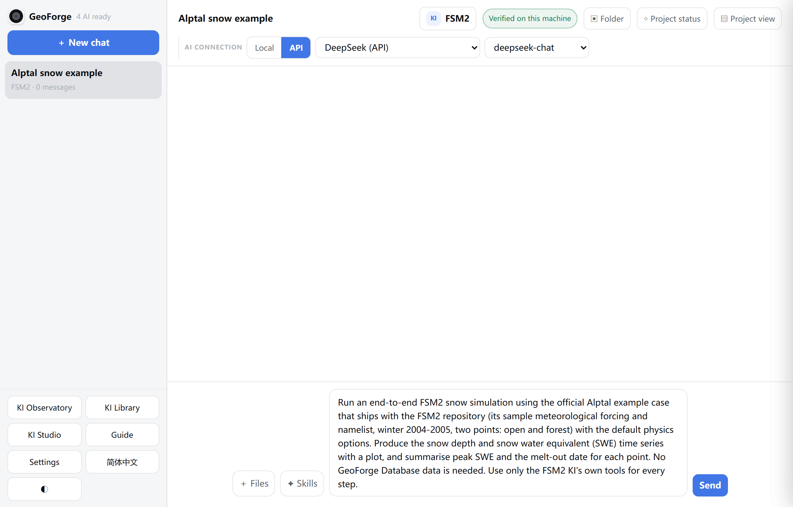

A good request names:

| What | In the example |
|---|---|
| The model and the case | FSM2, the official Alptal example |
| Place and period | Alptal, winter 2004–2005, an open and a forest point |
| Settings that matter to you | the default physics options |
| The outputs you want | snow depth and SWE series, a plot, peak SWE and melt-out date per point |
| Data you have, or do not want | the shipped forcing; no GeoForge Database data |
| How the work should be done | only the KI's own tools |

> **Tip:** Ask for steps that use the KI's own tools. In the first run for this manual, the plan included a step "written by the agent" (no tool), and the project could not reach **Completed** (see "If the project does not reach Completed" below).

## Step 5: Send, and let the AI plan

1. Click **Send**.

    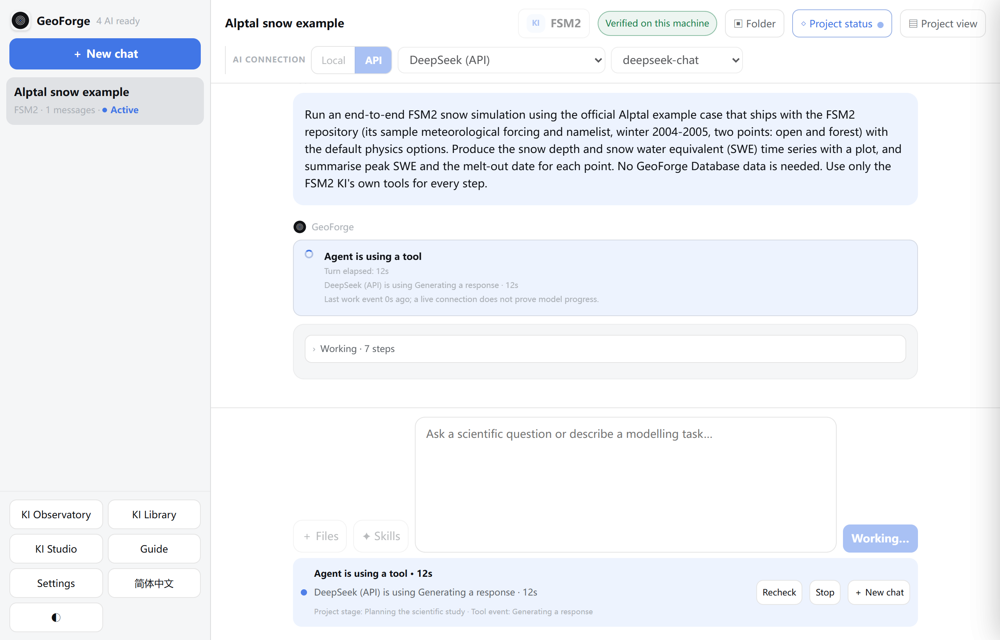

    Check that **Send** reads **Working…**, and that the activity bar under the message box shows what the AI is doing, for example **Agent is using a tool** with the elapsed time and the line "Project stage: Planning the scientific study".

While the AI plans, GeoForge lets it read the KI and your project, and write a draft plan. It cannot download, install or run anything yet. The activity bar has three buttons:

| Button | What it does |
|---|---|
| **Recheck** | Refreshes what the bar shows about the AI's activity |
| **Stop** | Ends the current turn. Send a message to continue later. |
| **＋ New chat** | Starts another chat. This one keeps working. |

## Step 6: Answer the planning questions

When the AI needs a decision from you, a card opens with the label **Needs you**. In this run there was one question: which FSM2 physics options to use.

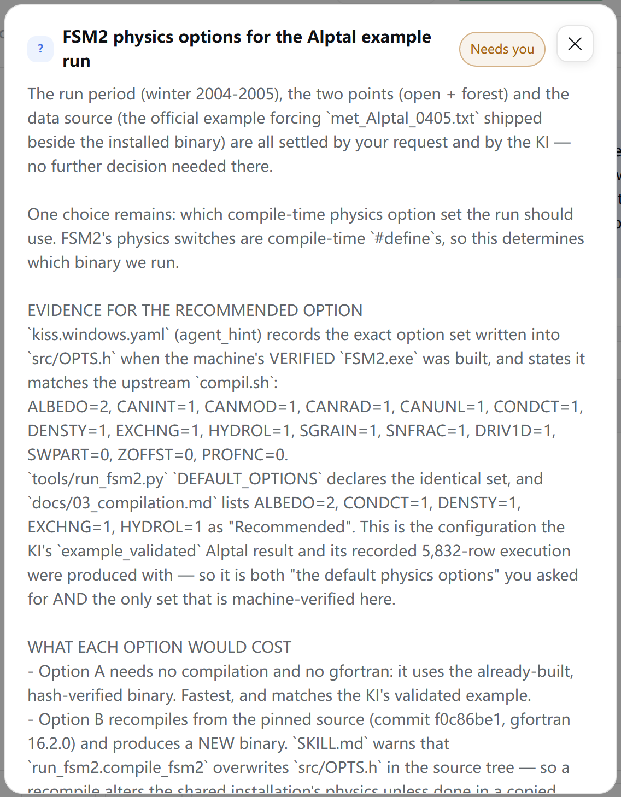

Check the title, here "FSM2 physics options for the Alptal example run", and the explanation under it. The AI explains the evidence it used and what each choice would cost.

1. Read the question and its explanation. Scroll down in the card to see all of it.
2. Click the option you want. Here: **A — Use the verified pre-built FSM2.exe with its default physics options (recommended)**.

    

    Check that the option you chose is highlighted.

3. Scroll to the bottom of the card and click **Continue with this choice**.

Question cards end with these controls. The approval card (Step 7) has the same ones except **Use my own answer / file**.

| Control | Use it to |
|---|---|
| **Use my own answer / file** | Answer in your own words, or give a file location. Write the answer in **Optional note for the agent**. |
| **Optional note for the agent** | Add context to your choice |
| **Continue with this choice** | Send your answer. The AI continues planning. |
| **Ask about these choices** | Ask the AI to explain before you decide |
| **Not now** or **✕** | Close the card without answering. Reopen it with **◇ Project status** → **Respond**. |

Answer on the card, not by typing in the chat: a typed reply is not recorded as your answer.

Other runs may ask more questions, for example which evaluation you want or where outputs should go. Each is answered the same way.

## Step 7: Read the plan

When planning is finished, the card **Approve the plan?** opens. Its title and options stay in English in Chinese mode.

Read it from the top:

| Section | What to check |
|---|---|
| **What I understood** | It matches your request. The chips below show the KI, and the area and period when the AI states them. |
| **Data** | Every input. **You (…)** lists inputs you must provide. **The run prepares itself (…)** lists inputs that are already on disk or made by a step: click it to see them. Here all 10 are prepared by the run. |
| **Steps** | Each step, its kind (**run**, **postprocess**, **check**, …) and the KI tool it uses, here `run_fsm2.py` and `parse_fsm2_output.py`. **run by GeoForge (preflight)** means GeoForge runs the KI's own check. |
| **Scientific decisions** | The choices behind the plan, with "From your answer: …" under the ones you made |
| **Waiting on you** | Choices that will take a default unless you pick another. Read them. |
| **Not ready to execute yet** | Steps that cannot run as planned, for example "step 's3_config' has no tool — not ready to execute". |

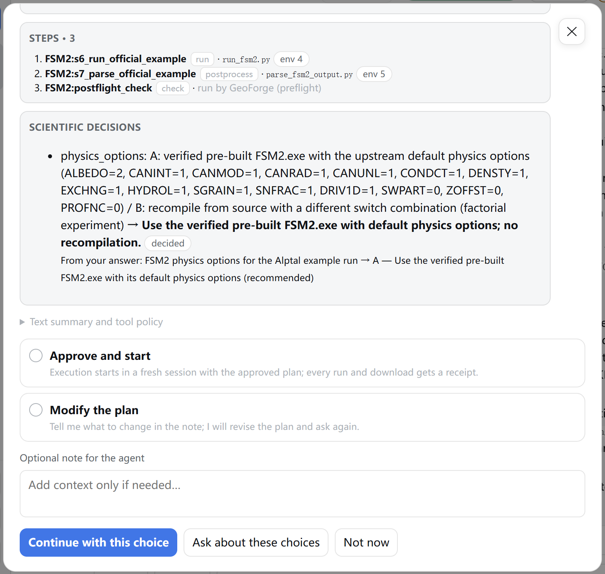

Check the lower part: **Text summary and tool policy** (click to open), the options **Approve and start** and **Modify the plan**, and **Optional note for the agent**.

Look out for two things in particular:

- A step marked **written by the agent** or **no tool — cannot execute**. Such a step can never get a run record. If it writes result files, the project cannot reach **Completed**.
- A **Not ready to execute yet** section. GeoForge still lets you approve, but the run is likely to stop. In the third run for this manual, approving such a plan ended in a failed validation.

In both cases choose **Modify the plan** (Step 8). The plan in the screenshots has three steps, all with a tool or run by GeoForge, and no **Not ready to execute yet** section: it is ready.

> **Caution:** Also compare **Data** with any data-source choice before you approve (Chapter 9, 9.16, issue 1). It does not apply to this example, which downloads nothing.

## Step 8: Approve, or ask for changes

To approve:

1. Click **Approve and start**.

    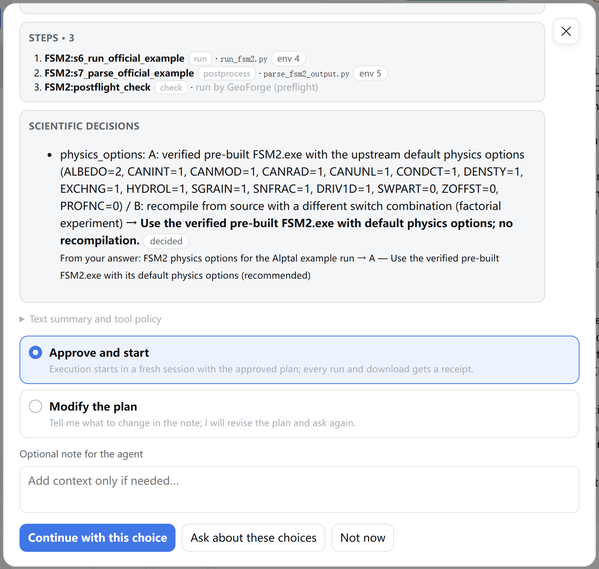

2. Click **Continue with this choice**.

GeoForge records your approval with a fingerprint of the plan. From now on the AI may run only the approved steps with the approved tools, and every run gets a signed run record.

To ask for changes instead:

1. Click **Modify the plan**.
2. In **Optional note for the agent**, write what to change. When the card shows **Not ready to execute yet**, you can write: "Some steps cannot run yet (see Not ready to execute yet). Please revise the plan so that every step uses one of the KI's own tools, and drop any step this example does not need."
3. Click **Continue with this choice**.

The AI revises the plan and shows a new **Approve the plan?** card. Read it again from the top.

## Step 9: Software setup, if needed

If FSM2 is not yet verified on this computer, GeoForge sets it up first, in the same turn. The chat shows the setup work, and **◇ Project status** shows **Prepare** as the active stage with **0 / 1 software verified**.

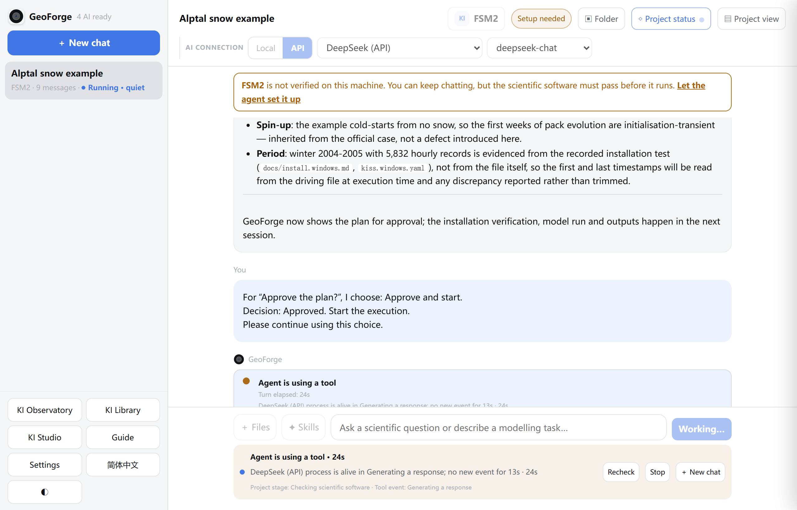

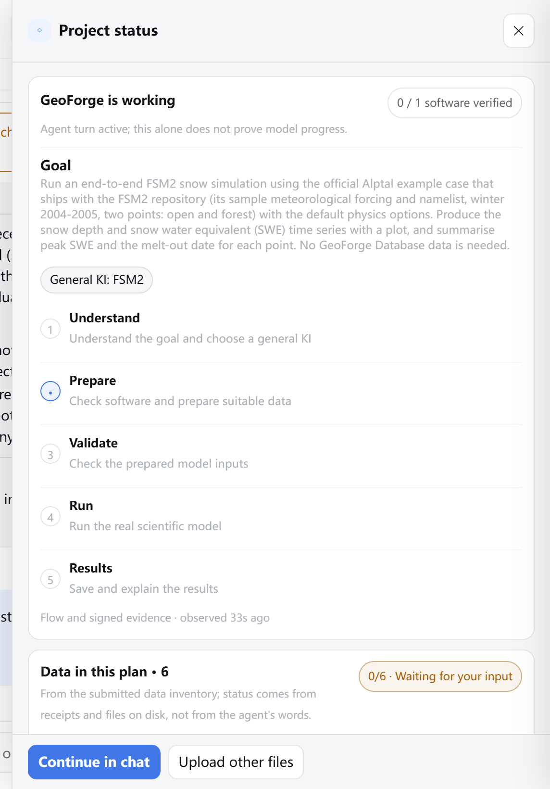

Check that **Prepare** is the active stage and that the pill reads **0 / 1 software verified**.

Wait until the chat says "**Software verified. Starting your approved plan in a new session…**". In the first run for this manual, setup took about five minutes. Chapter 4 describes setup in full.

In 0.6.55, API software setup is restricted to installation and bounded startup checks. The approved scientific execution follows a successful preflight. Unrecorded results from an older attempt still cannot establish completion.

## Step 10: The run

GeoForge starts the approved steps in a fresh AI session that has only the approved plan.

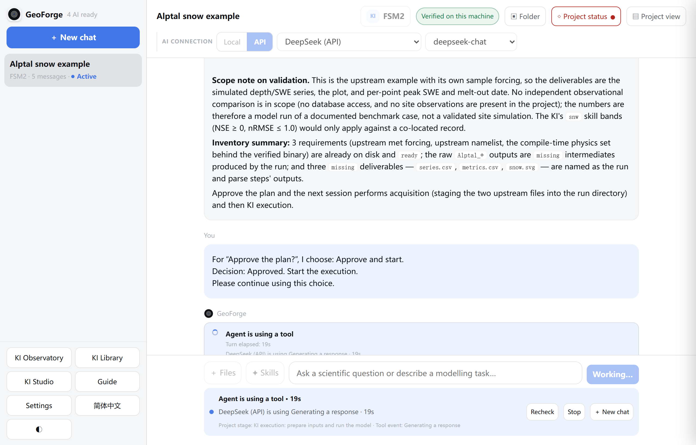

Check that the activity bar shows "Project stage: KI execution: prepare inputs and run the model". The **◇ Project status** button may show a red dot for a moment if an attempt fails; a passing retry replaces it. What counts is the state at the end.

Browser disconnection or closing a tab no longer ends the active turn in 0.6.55. Reopen GeoForge and the chat to inspect its saved progress; use **Stop** to stop work.

## Step 11: Check Completed

When the turn ends, the chat ends with the AI's summary and a line from GeoForge itself, starting with **Completed.**

1. Click **◇ Project status** in the chat header.

    

    Check that:

    - the headline reads **Project complete**, with "Flow completed with current approved execution evidence.";
    - all five stages, **Understand**, **Prepare**, **Validate**, **Run** and **Results**, have a tick;
    - the pill on the right reads **1 / 1 software verified**.

2. Scroll down to **Data in this plan**. Here it reads "10/10 · Files available; preparation and scientific checks still required". GeoForge has the files; judging them scientifically is still your job.
3. Click **✕** to close the panel.

If the **Completed.** line also says that earlier failed attempts were superseded by a passing retry, that is normal. In this run the AI first called the tools with `--help` and with malformed arguments; those attempts failed, the correct runs passed, and every attempt stays in the run history (`runs\evidence.json`).

## Step 12: Read the results

### In the chat

Scroll up to the AI's summary. It describes what ran, with the run record of each step:

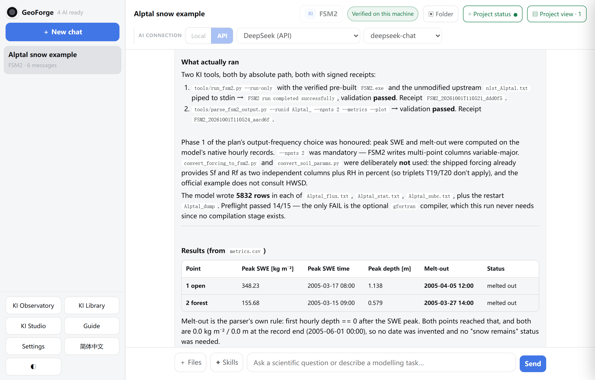

Then the results:

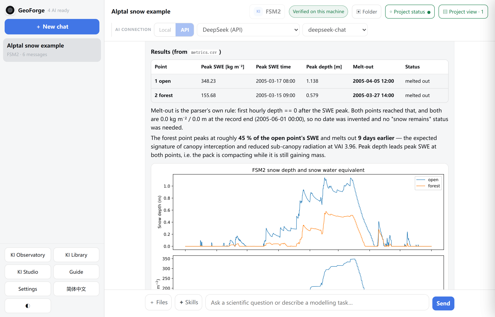

In this run:

| Point | Peak SWE (kg m⁻²) | Peak SWE time | Peak depth (m) | Melt-out |
|---|---|---|---|---|
| 1 open | 348.23 | 2005-03-17 08:00 | 1.138 | 2005-04-05 12:00 |
| 2 forest | 155.68 | 2005-03-15 09:00 | 0.579 | 2005-03-27 14:00 |

The forest point holds about 45 % of the open point's peak SWE and melts out nine days earlier. The first run for this manual produced the same numbers, which is what a reproduction of an official example should do.

### In Project view

1. Click **▤ Project view** in the chat header. The number after it counts the panels.

    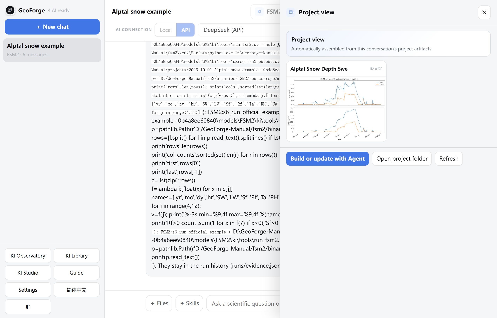

    Check the panel **Alptal Snow Depth Swe** with the two-part plot: snow depth above, SWE below, open and forest.

| Button | What it does |
|---|---|
| **Build or update with Agent** | Asks the AI to add or update panels |
| **Open project folder** | Opens the project folder in File Explorer (Finder on a Mac) |
| **Refresh** | Reloads the panels from the project files |

### In the project folder

Click **▣ Folder** in the chat header. In this run the results are in:

| File | What it holds |
|---|---|
| `outputs\fsm2_alptal\Alptal_flux.txt`, `Alptal_stat.txt`, `Alptal_subc.txt` | FSM2's own hourly output, 5,832 rows each |
| `outputs\fsm2_alptal\Alptal_dump` | FSM2's state at the end of the run |
| `outputs\fsm2_alptal\series.csv` | Snow depth, SWE and the other variables for both points, hourly |
| `outputs\fsm2_alptal\metrics.csv` | Peak SWE, peak depth and melt-out date per point |
| `artifacts\alptal-snow-depth-swe.svg` | The plot |
| `runs\` | The plan, your approval, the evidence summary and the run logs |

Chapter 6 explains the folder in full.

## What Completed means here

**Completed** means: every step of the plan you approved ran through GeoForge, each has a signed run record, the outputs passed GeoForge's automatic checks (they exist, are not empty, contain no NaN or infinite values), and no result file exists that no passing run produced.

It does not mean the model is right for Alptal. This was a forward run of FSM2's own example with its own forcing. No observations were compared, so no skill score exists, and the AI's summary says so. To evaluate the model, plan a new project that includes observations and an explicit comparison.

After **Completed** you can still ask the AI about the results in this chat. It can no longer run, download or change inputs here. For another period, another site or other physics options, start a new chat.

## If the project does not reach Completed

The first project for this manual did not reach **Completed**, although the model ran correctly. Its story shows the three things to look for.

1. **Files without a run record.** The setup agent had run the example inside the project (known issue 3), and the plan contained a step "written by the agent" whose audit files had no run record. GeoForge listed five such files and kept the project open.

    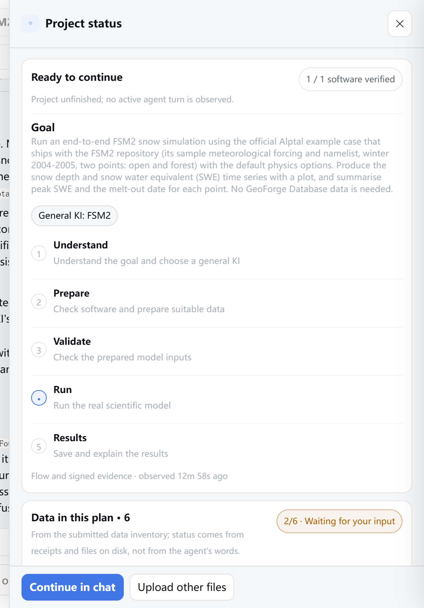

    Check the headline: **Ready to continue**, not **Project complete**. In 0.6.54 the chat did not say why, because the run came straight after setup (fixed in 0.6.55).

2. **A failed later attempt.** Asked to finish, the AI reran the model step in a scratch folder without naming its outputs. That attempt failed validation, and the latest attempt of each step is the one that counts.

    

    Check the headline **Project needs attention** with "An execution attempt failed; agent diagnosis is needed."

3. **The AI's words are not evidence.** In its next reply the AI wrote that validation had passed. The run records said otherwise, and **Project status** kept showing the failure.

What to do in such a case:

1. Open **◇ Project status** and read the headline and the status line. Chapter 9, 9.11 lists every message and its fix.
2. Send: "GeoForge says the project is not Completed yet. Please read runs/evidence.json, re-run every approved step whose latest attempt failed exactly as approved, and regenerate or remove any file that has no passing run record. Do not change the approved science or inputs."
3. After the reply, check **◇ Project status** again rather than trusting the summary.
4. If files without a run record remain, and they are not your own inputs, move them out of `outputs\`, `artifacts\`, `inputs\` and `calibration\`, for example into a new folder `notes\` in the project, then send a message so GeoForge checks again.
5. If the project still does not complete, start a new chat with a clearer request (as in Step 4) and the software already verified. That is what produced the run in this chapter.

## If something goes wrong

| What you see | What to do |
|---|---|
| **Send** stays grey | Under **AI connection**, choose **API** or **Local** and a provider that is ready (Chapter 2). |
| No card appears after planning, and the chat ends with "Plan was not submitted for approval: - The provider failed or was interrupted. Your draft is preserved; retry planning." | Send "Please retry planning from your saved draft." On Windows, keep the tab open while the AI works. |
| "GeoForge could not finish this turn: ConnectionAbortedError …" | Historical 0.6.54 Windows interruption when the browser disconnected; fixed in 0.6.55. Preserve the error if it recurs on a current build. |
| A question card or the approval card disappeared | Click **◇ Project status**, then **Respond**. |
| The approval card shows **Not ready to execute yet** | Choose **Modify the plan** and ask for a plan whose steps all use the KI's tools (Step 8). |
| Setup fails after approval | Send "Please continue setting up FSM2." Chapter 4 lists setup problems. |
| The run ends without **Completed** | See "If the project does not reach Completed" above, and Chapter 9, 9.11. |
