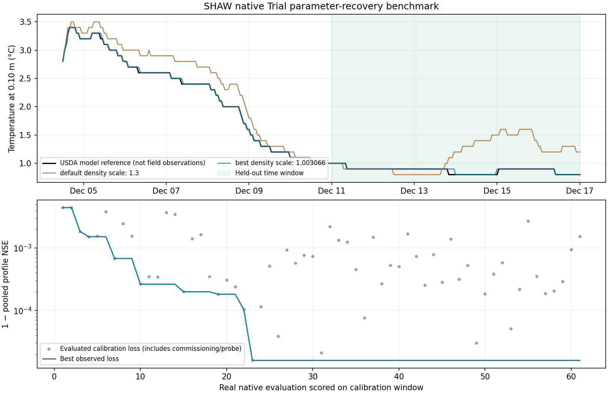

# 10 Calibration

## Calibrate a real model

Calibration searches for parameter values that improve a model's fit to a chosen target. GeoForge supplies a common search engine, while a KI adapter must write the parameters into the real model, execute it and score its outputs. The engine must never replace the scientific model.

> **Separate three claims.** A working engine, a successful calibration run and a model validated against independent observations are different results. The SHAW benchmark in this guide tests recovery of the publisher's reference output; it is not field validation.

### Prepare a project

1. First run the uncalibrated model on the intended input data. Check dates, units, water/energy balances and physical plausibility before optimizing anything.
2. Start a new chat if the earlier project is already **Completed**. Choose the intended KI and AI before sending the first message.
3. Provide authentic observations with timestamps, units, locations and missing-value rules. Specify which simulated output corresponds to each measured variable.
4. State parameter names, meanings, units, defensible bounds, fixed parameters, fitting period and a separate held-out period. Keep the held-out data out of parameter search.
5. Set the search method, run budget and random seed. Ask for both baseline and fitted scores on both periods.

### Example request for your own observations

> Calibrate my selected model against the observation file I will upload. First check the baseline and the time/space/unit alignment. Propose a small set of physically defensible parameters and bounds; keep forcing and measurement corrections fixed unless independently justified. Fit only the agreed training period and reserve the later period as holdout. Use DDS with a budget of 100 evaluations and a recorded seed. Report baseline and fitted metrics on both periods, rejected runs and the exact model/input versions. Show the plan before running.

The dates, bounds and metrics are scientific decisions for your case. They are not supplied by this example request. Answer GeoForge's planning cards and use the input's **Upload files** button to bind required observations.

### Prepare the adapter without executing it

If the selected KI needs a project adapter, planning can write only that KI’s calibration contract and runner into its project calibration folder. This prepares the two files for review; it does not authorize optimization, native model execution or arbitrary project edits.

### Review and run

1. In **◇ Project status → Details → Calibration**, check whether an adapter and project case exist. **Adapter needed** means preparation is still required; it is not an engine failure.
2. **Calibrate with agent** (or **Continue calibration**) sends a request to the chat. **Add observations** attaches files; bind any required plan input through its own upload row.
3. On **Approve the plan?**, review inputs, parameter bounds and defaults, objective, train/holdout split, algorithm, requested budget, seed and executable calibration step. The plan binds the exact adapter and calibration contract that will run. Change the plan if they differ from your study.
4. Select **Approve and start**, then **Continue with this choice**. GeoForge records approved execution; a verbal claim from the AI does not replace that record.
5. Keep the app running. **Stop** ends the current attempt and preserves its recorded outcome. A stopped or failed attempt must not be presented as a successful fit.

Changing the adapter, contract, data, parameter bounds or invocation after approval requires the relevant plan to be reviewed again. Both API agents and local CLI agents must use the approved calibration step and its recorded run; switching agent type does not bypass approval. Do not change files underneath a running optimization.

## Choose a defensible protocol

### Engine, adapter and case

| Part | Responsibility | Project location |
|---|---|---|
| Shared engine | Runs the selected optimizer and checks the holdout | Bundled with GeoForge |
| KI adapter | Applies parameters, launches the native model, reads real output and returns a score | `calibration/kis/<KI>/` |
| Project case | Defines parameters, targets, periods, objectives and budget | `calibration/cases/` |
| Run evidence | Records requests, logs, scores, parameters and acceptance | `calibration/runs/<run id>/` |

A shipped adapter is a starting point, not proof that it fits your particular basin, variable or observation format. For a KI without one, the agent prepares a project-owned adapter; the shared optimizer remains unchanged. The tested SHAW benchmark uses this route.

### Search methods

| Target | Available methods | Practical choice |
|---|---|---|
| One scalar loss | DDS, SCE-UA, DREAM | Choose a loss whose direction and units you understand. Record the seed and budget. |
| Several competing objectives | NSGA-II, NSGA-III, MOEA/D | Review trade-offs among candidate solutions rather than choosing by a single hidden average. |

The method names describe search algorithms, not a guarantee of convergence. A large parameter space needs more evidence and computation than a small, identifiable one. The app accepts a requested optimizer budget from 1 to 10,000. This is not a strict ceiling on native model calls: optimizer initialization or population batches, baseline checks and holdout checks can add work. Review the actual evaluation count and allow for the cost of each native run. Begin with a small smoke run before committing a large budget.

### Before approving

- **Target and alignment:** match the same variable, units, time support and spatial support. A point observation does not automatically validate a basin mean.
- **Bounds:** justify them from model documentation, measurements or literature. Keep physically linked parameters consistent; do not optimize nuisance parameters merely because they move the answer.
- **Forcing:** do not tune precipitation, elevation or observation transformations simply to hide a model-data disagreement.
- **Split:** use a held-out period that the search cannot see. Warm-up may precede a scoring period but must be documented.
- **Metrics:** state which metric determines acceptance and which are diagnostic. Include baseline and fitted values, sample counts and missing-data handling.
- **Reproducibility:** retain the native executable version/hash, original inputs, applied parameters, seed, budget and scoring code.

For Celsius temperature, percentage bias is inappropriate because Celsius has an arbitrary zero; the SHAW reference test reports NSE and RMSE instead. For other variables, choose metrics using that model's validation convention rather than copying this temperature protocol.

An improved training score with worse holdout performance is evidence of overfitting or a deficient protocol. It is not a reason to reuse the holdout as more training data and report the same holdout score as independent.

## Read the result and keep evidence

### Interpret the Calibration card

| Status | Meaning and next action |
|---|---|
| **Engine unavailable** | The bundled engine cannot load; repair the installation before running. |
| **Adapter needed** | The selected KI needs a project adapter. |
| **Project case needed** | Define the target, parameter bounds, observations and held-out period. |
| **Workflow prepared** | A case exists; the agent must still check it against this study. |
| **Holdout passed** | The result satisfied the configured held-out check. Read the report and scientific limitations. |
| **Holdout not passed** | Do not promote the fitted parameters as a validated result. Diagnose the protocol or model/data mismatch. |
| **Run needs review** | Inspect the failed or interrupted attempt and its logs. |

**Validated** on the latest calibration means it passed the configured check. It does not certify all model physics, identify a unique parameter set, or establish validity at other sites. **Not promoted** means the fit is not accepted for use by that workflow.

### Open the files

Use the project's files/Results view or its folder on disk. Under `calibration/runs/<run id>/`, keep:

- `report.json`: the host's result and acceptance summary.
- `engine-report.json`: optimization and holdout details.
- `engine-request.json`: the actual engine request, including the declared case and protocol.
- `engine.log`: execution and diagnostic messages.

Each run retains its own immutable copy of the calibration runtime, so a later run cannot overwrite the earlier run’s recorded runtime evidence. Keep the project adapter, case, original observations and native model inputs with these reports. Individual evaluation files should make it possible to verify which values were applied to the model. A successful process exit without readable scientific output is not a valid evaluation.

### Decide whether the fit is usable

1. Confirm the real model ran and every reported parameter was applied. Check the command, executable identity and generated parameter/input files.
2. Compare baseline versus fitted metrics on **both** training and holdout periods; verify the sample counts and dates.
3. Inspect time series and residuals, not only a headline score. Check physical constraints and balances required by the KI.
4. Report uncertainty, identifiability limitations and any boundary-hitting parameter. A single best point does not quantify uncertainty.
5. Check GeoForge’s run records and final project status. A missing or rejected required holdout check is a warning, not scientific completion. The AI’s narrative cannot override failed validation, stale inputs or missing evidence.

Use GeoForge’s **Stop** control to interrupt an optimization. Windows launches non-interactive calibration subprocesses without requesting a console window. Any model-specific graphical interaction still needs separate verification.

If a run fails, preserve its reports and error text, fix the actual cause and obtain a fresh passing run. Never rename a failed report as a success or substitute reference output for model execution.

## Tested example: SHAW reference recovery

This Windows benchmark exercises the real SHAW 3.03 native executable repeatedly through its KI wrapper and the bundled calibration engine. It asks whether optimization can recover a known parameter setting from the publisher's own output.

> **Scope:** the target is an official model reference, not measured field data. The result demonstrates parameter application, native execution, scoring and holdout handling. It must not be quoted as observational model skill.

### Reproducible setup

Use the five unchanged SHAW Trial inputs listed in the three-page quickstart and the publisher's temperature reference table from the [official SHAW 3.03 archive](https://www.ars.usda.gov/ARSUserFiles/20520500/SHAW/303/Shaw303.zip). The reference file is `Shaw303/Output/Trial/temp.out` inside that archive. Preserve the original files. The project adapter creates a separate candidate input set for each evaluation.

| Setting | Tested value |
|---|---|
| Parameter | `bulk_density_scale`, applied to all 11 soil nodes |
| Bounds | 0.8 to 1.5 |
| Deliberately perturbed baseline | 1.3 |
| Known reference setting | 1.0 |
| Method / seed / search budget | DDS / 20261002 / 60 requested optimizer evaluations |
| Training rows | 155 hourly rows × 11 nodes; 1986-12-04 13:00 to 1986-12-10 23:00 |
| Held-out rows | 145 hourly rows × 11 nodes; 1986-12-11 00:00 to 1986-12-17 00:00 |
| Metrics | NSE and temperature RMSE in °C; no Celsius PBIAS |

These bounds and the artificial baseline are a **software reference-recovery protocol**, not recommendations for estimating field soil density. Other Trial parameters and forcing remain fixed.

### Actual result

The fitted scale was **1.003065603**. Training NSE was **0.99998413** and RMSE **0.011098 °C**. Held-out NSE improved from **0.98713640** at the perturbed baseline to **0.99998794**. The configured held-out check passed, and the engine marked the result promotable within this benchmark.

The shared engine was pinned at revision `579162102f71f2fa4619b874a21bd219caaed25e`. The adapter was project-owned (`calibration/kis/SHAW/calibration.yaml` and `tools/calib_run.py`), not a newly claimed universal SHAW adapter. Full execution evidence was retained in the test project and `D:/GeoForge-Calibration-20261002/native-calibration-result.json` on the validation machine.

The source and frozen Windows engine produced the same fitted result. The test made 64 actual native calls, including the probe, baseline and holdout checks. A separate run at the known reference setting 1.0 reproduced the publisher’s temperature output byte for byte. All six optimizer backends also passed a synthetic interface test; those synthetic tests do not demonstrate scientific performance.

### Inspect the actual model output

The upper panel compares the publisher reference, the deliberately perturbed baseline and the fitted native run at 0.10 m soil depth. Shading marks the held-out period. The lower panel shows actual scored evaluations and the best training loss. These are model reference outputs, not field observations.

### Ask the AI for this benchmark

> Prepare a project-owned SHAW calibration adapter that runs the real native Trial for every evaluation. Use the official temperature output only as a reference-recovery target, not observations. Recover bulk_density_scale on all 11 nodes in [0.8, 1.5], with baseline 1.3, DDS seed 20261002 and budget 60. Train through 1986-12-10 23:00 and hold out 1986-12-11 00:00 through 1986-12-17 00:00. Report applied parameters, actual run records, NSE and RMSE for both splits and the uncalibrated baseline. Preserve original inputs and present a plan before execution.

For a scientific study, replace this reference-recovery target with suitable independent observations and justify a new protocol. Do not reuse these near-perfect reference scores as evidence for a real catchment or field site.
