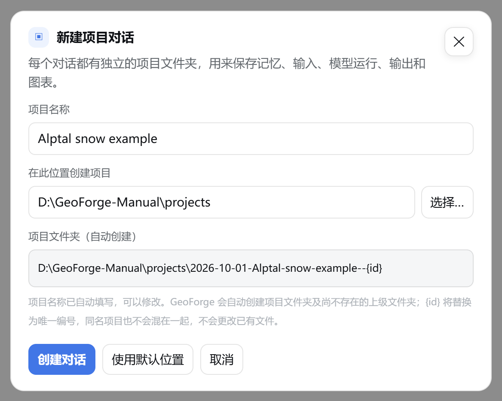

# 0 快速入门

> **Windows 0.6.55 版。** 本手册保留真实 FSM2 流程及 0.6.54 采集的截图；当前修复与 SHAW/CRHM/VIC 验证见第 11 章。最短操作路径见 **使用指南 → 快速上手 · 3 页**；校准有独立指南及第 10 章。所有界面截图来自真实应用，没有虚构画面。

本章分八步，带你走完从安装 GeoForge Desktop 0.6.55 到 GeoForge 把一次模型运行标记为 **Completed**（已完成）的全过程。每一步都注明了详细说明所在的章节。

截图来自 Windows 版的中文界面。示例是用 DeepSeek API 密钥运行 FSM2 积雪模型，这是 0.6.54 在 Windows 上唯一做过端到端测试的情况。

中文模式下，有些文字仍显示为英文，例如计划审批卡片、系统托盘菜单、**Completed** 等部分状态信息。本章照原样写出这些英文，第一次出现时在括号里给出中文意思。括号里的中文不会显示在界面上。

## 先记住三点

1. **对话是入口。** 每个任务都从在对话中描述它开始。GeoForge 根据你写的内容制定计划。
2. **一个 KI 描述一个科学模型。** KI（Knowledge Infrastructure，知识基础设施）是 GeoForge 为某个模型（例如 FSM2）打包好的知识：怎样安装、准备、运行和检查它。有了 KI，不等于模型软件已经装在你的电脑上。
3. **一个对话就是一个项目文件夹。** 每个对话在你的电脑上都有自己的文件夹，存放输入、模型运行、输出、图件和运行记录。运行记录是 GeoForge 为它执行的每一步写下的签名文件，记下执行的命令以及读取和写入的文件。

## 第 1 步：安装并打开 GeoForge *（第 1 章）*

| | Windows | macOS |
|---|---|---|
| 使用的发布版本 | `windows-v0.6.55` | `v0.6.54` |
| GeoForge 显示在哪里 | 默认浏览器中的一个页面，外加系统托盘中的一个图标 | 独立的窗口 |
| 怎样退出 | 右键点击托盘图标，选择 **Exit GeoForge**（退出 GeoForge） | 关闭窗口 |

在 Windows 上：

1. 打开 [windows-v0.6.55 发布页面](https://github.com/lzwei196/KISS-Knowledge-Infrastructure-for-Scientific-Simulation/releases/tag/windows-v0.6.55)。
2. 下载 `GeoForge-Desktop-Setup-v0.6.55-Windows-x64.exe`。
3. 双击下载的文件，按安装程序的提示一直做到最后。不需要管理员权限。安装程序的每一页都是英文。如果 Windows 阻止运行这个文件，参见第 1 章。
4. 从“开始”菜单打开 **GeoForge Desktop**。

    确认 GeoForge 在浏览器中以页面形式打开，并且系统托盘中出现了它的图标。

关闭浏览器标签页并不会退出 GeoForge，它仍在托盘中运行。要退出，右键点击托盘图标，选择 **Exit GeoForge**。托盘菜单在中文模式下也是英文。

在 macOS 上：按第 1 章的说明，从 `v0.6.54` 发布版本安装。macOS 的 0.6.54 版本构建于 2026 年 9 月 19 日，没有包含 Windows 版之后的一些改动，所以本手册中的部分界面在 Mac 上看起来会有所不同。

## 第 2 步：连接 AI *（第 2 章）*

GeoForge 需要一个 AI 来制定计划和执行工作。本例使用 DeepSeek API 密钥。GeoForge 数据库（第 3 章）是可选的，这里用不到。

1. 点击侧边栏底部的 **设置**。
2. 如果 **AI 服务** 页面还没打开，点击 **AI 服务**。
3. 在 **DeepSeek (API)** 卡片上，把密钥粘贴到 **粘贴 API 密钥** 输入框中。
4. 在同一张卡片上，选中 **默认使用**。
5. 点击 **保存**。

    

    确认 **关闭** 旁边短暂出现“已保存”，并且 **DeepSeek (API)** 卡片显示 **已填写密钥**，**默认使用** 已选中。

6. 点击 **关闭**。

    

    确认侧边栏顶部显示“数字 + **个 AI 已就绪**”（这里是 **4 个 AI 已就绪**），而不是 **需要设置 AI**。

如果想改用安装在电脑上的 Agent（例如 Claude Code、OpenAI Codex 或 Kimi Code）：

1. 按照该 Agent 自己的说明，在 PowerShell（Windows）或“终端”（macOS）中登录。
2. 在 **设置 → AI 服务** 中，点击 **重新检查本地 CLI**。

    确认该 Agent 的卡片显示 **已登录**。

> **注意：** 在 0.6.54 中，只有 DeepSeek API 这条路径在 Windows 上做过端到端测试，本地 Agent 没有测试过。在 Windows 上，必须先在 **设置 → 权限** 中选择 **允许完整电脑访问并启用 Kimi**，Kimi Code 才会启动（第 2 章说明了其中的风险）。

## 第 3 步：新建对话并选择模型 *（第 4 章和第 5 章）*

1. 点击 **＋ 新建对话**。

    

    确认 **项目名称** 已经填好，**项目文件夹（自动创建）** 显示了项目将要存放的位置。`{id}` 会被替换为一个唯一编号。

2. 保留建议的 **项目名称**，或者输入新的名称。
3. 保留 **在此位置创建项目** 中的文件夹，或者输入其他路径（例如 `D:\GeoForge-Manual\projects`）。在 Windows 上，**选择…** 打不开文件夹选择窗口，所以请直接输入或粘贴路径。
4. 点击 **创建对话**。

    

    确认对话名称出现在顶部和侧边栏中，侧边栏里名称下方显示 **Auto KI · 0 messages**（自动选择 KI · 0 条消息）。这一行在中文模式下也是英文。

5. 在 **AI 连接** 下，点击 **API** 使用 API 密钥，或点击 **本地** 使用电脑上的 Agent。
6. 在旁边的第一个下拉列表中选择服务商（这里是 **DeepSeek (API)**）。
7. 在第二个下拉列表中选择模型（这里是 **deepseek-chat**）。

    > **提示：** 在 Windows 上，GeoForge 每次启动都会使用一个新的本地地址，所以页面可能记不住你上次选的 **本地**/**API**。发送第一条消息前，先检查一下 **AI 连接**。

如果想让 GeoForge 根据你的请求选择 KI，保持 **自动选择 KI** 不变，直接进入第 4 步。如果想自己选择 KI：

1. 点击顶部的 **自动选择 KI**。
2. 在 **搜索 KI…** 框中输入模型名称，例如 `FSM2`。

    

    确认列表中出现了这个模型。**需要设置** 表示模型软件还没有在这台电脑上通过验证。

3. 勾选模型旁边的复选框。
4. 点击 **应用**。

    

    确认顶部显示 **FSM2** 和 **需要设置**，并且有一条英文横幅提示 “FSM2 is not verified on this machine”（FSM2 尚未在本机验证）。现在不需要设置它：你批准计划后，GeoForge 会先设置软件，再运行模型。

> **注意：** 发送第一条消息后，这个对话的 KI、**本地**/**API** 选择、服务商和模型就固定了。要更改其中任何一项，请新建对话。

## 第 4 步：描述你的任务 *（第 5 章）*

1. 点击消息输入框（**提出科学问题或描述一个建模任务…**）。
2. 输入你的请求。写清地点、时段、过程、需要的输出，以及你已有的数据或不想用的数据。
3. 点击 **发送**。

    确认 **发送** 变成了 **处理中…**，并且在 AI 工作期间，消息输入框下方出现一条带 **停止** 按钮的状态栏。

下面是第 5 章示例使用的请求，原文是英文（SWE 指雪水当量）：

> Run an end-to-end FSM2 snow simulation using the official Alptal example case that ships with the FSM2 repository (its sample meteorological forcing and namelist, winter 2004-2005, two points: open and forest) with the default physics options. Produce the snow depth and snow water equivalent (SWE) time series with a plot, and summarise peak SWE and the melt-out date for each point. No GeoForge Database data is needed. Use only the FSM2 KI's own tools for every step.

中文大意：使用 FSM2 仓库自带的官方 Alptal 示例（自带的气象驱动数据和 namelist，2004-2005 年冬季，开阔地和林地两个点），用默认物理选项端到端运行一次 FSM2 积雪模拟。输出雪深和雪水当量（SWE）时间序列并作图，总结每个点的 SWE 峰值和积雪融尽日期。不需要 GeoForge 数据库的数据。每一步都只使用 FSM2 KI 自带的工具。

像“什么是 SWE？”这样的普通问题会得到回答，但不会开始制定计划。GeoForge 用简单的关键词来判断：英文消息中出现 model、simulation 或 run，中文消息中出现“模拟”“运行”等词，就会开始规划。

## 第 5 步：回答规划阶段的问题 *（第 5 章）*

AI 制定计划期间，GeoForge 只允许它读取内容和起草计划。下载、安装和模型运行都要等你批准。AI 需要你做决定时，会弹出一张带 **需要你** 标签的卡片。卡片一次只出现一张。

1. 阅读卡片上的问题。
2. 选择一个选项。如果想用自己的话回答，选择 **使用我的答案 / 文件**，并在 **给 Agent 的可选说明** 中输入你的回答。

    

    确认你选的选项已高亮显示。你的项目中的问题会和这个例子不同。

3. 点击卡片底部的 **按此选择继续**。
4. 之后出现的每张新卡片都照此操作。

请直接在卡片上回答：在对话中输入的回复不会被记为你的回答。如果你用 **暂不处理** 或 **✕** 关掉了卡片，可以通过 **◇ 项目状态 → 回答这个问题** 重新打开它。

## 第 6 步：批准计划 *（第 5 章）*

规划完成后，会弹出 **Approve the plan?**（是否批准计划？）卡片。这张卡片的标题和选项在中文模式下也是英文。卡片中的栏目有 **任务理解**、**数据**、**步骤**，在适用时还有 **数据来源，你来选**、**科学决定**、**等待你处理** 和 **尚不能执行**。

确认能看到 **任务理解**、**数据** 和三个 **步骤**，并且卡片上没有 **尚不能执行** 一栏。

1. 阅读 **任务理解** 和 **步骤**，确认它们与你的请求一致。
2. 阅读 **数据**。每一行是一项输入；如果为它选定了具体的数据集，数据集写在 ← 符号后面。
3. 选择 **Approve and start**（批准并开始）。
4. 点击 **按此选择继续**。

如果想修改计划，选择 **Modify the plan**（修改计划），在 **给 Agent 的可选说明** 中写下要改的地方，然后点击 **按此选择继续**。AI 会修改计划，并显示一张新卡片。

如果 **数据** 中 **需要你处理** 下的某一行要你提供自己的文件，批准后要等这个文件到位才能继续。请在 **◇ 项目状态 → 本次计划的数据** 中，用该行的 **上传文件** 按钮上传（第 6 章）。

> **检查实际计划：** 数据来源、必需输入和可执行步骤必须符合你的请求。如果不一致，或者出现 **尚不能执行**，请选择 **Modify the plan**。第 9 章说明如何诊断当前批准状态。

## 第 7 步：让 GeoForge 获取数据并运行 *（第 3、4、5 章）*

你批准后，GeoForge 会自己下载已批准的数据，并在消息输入框上方的横幅中显示进度。FSM2 示例使用 FSM2 自带的驱动数据，所以不会下载任何东西。如果模型软件还没有在这台电脑上通过验证，GeoForge 会先设置软件，再运行已批准的步骤。

1. 留意消息输入框上方的横幅，以及对话中 AI 的消息。
2. 如果横幅中出现 **开始已批准的运行**，点击它。

> **当前 Windows 行为：** API 软件设置只安装并验证环境。科学示例应在之后单独审阅并批准的项目计划中执行。

GeoForge 数据库中有些大文件必须从百度网盘手动下载。这时 **◇ 项目状态** 中会显示一张手动下载卡片：

1. 点击 **打开下载链接** 下载文件，用卡片上显示的 **提取码** 提取。
2. 等下载完全结束。
3. 把文件复制到 **放置到** 后面显示的文件夹中（点击 **复制路径** 可以复制这个路径）。
4. 点击 **文件已放好，继续**。

要停止当前工作，点击消息输入框下方状态栏中的 **停止**。在 Windows 上，Agent 在后台启动的任务在点击 **停止** 后可能仍在运行，请到任务管理器中检查（第 9 章）。

## 第 8 步：确认 Completed 并阅读结果 *（第 5 章和第 6 章）*

1. 点击顶部的 **◇ 项目状态**。

    

    确认面板标题为 **项目已完成**，五个步骤都显示勾号。**◇ 项目状态** 按钮会变成绿色。

2. 点击 **✕** 关闭面板。
3. 在对话中阅读 AI 对结果的总结。
4. 点击 **▣ 文件夹**，在文件资源管理器（macOS 上是“访达”）中打开项目文件夹。
5. 点击 **▤ 项目视图**，查看结果面板。

达到 **Completed** 之后，你仍可以在这个对话中向 AI 询问结果，但它不能再运行、下载或修改输入。要换一个时段或情景，请新建对话。

## “Completed”说明了什么，没说明什么

**Completed** 表示 GeoForge 为已批准计划的每一步都找到了一份通过检查的签名运行记录，并且输出通过了 GeoForge 的自动检查。例如：运行没有报错；输出文件存在且不为空；文件中没有 NaN 或无穷大值；时间轴完整；主要输出不是全为零，也不是同一个常数。AI 只在对话中描述、没有实际执行的工作不算数。

**Completed** 不代表科学上已经验证。除非你的计划包含了与观测数据的比较，否则没有做过任何比较。下载的数据没有经过科学检查。KI 中引用的基准评分也不是你这次运行的评分。

所以，已完成的项目仍可能在 **本次计划的数据** 中显示 **工具已生成，待科学检查**；没有通过检查的运行记录支撑的 **项目视图** 面板，标题后面会带英文 “— experimental / unvalidated”（实验性 / 未验证）。你可以问 AI：“你做了哪些假设？哪些是实测的，哪些是生成的？”

## 如果出现问题

| 你看到的情况 | 处理方法 |
|---|---|
| **需要设置 AI**、英文横幅 **Connect an AI to begin.**（请先连接 AI），或英文提示 “No API connection yet. Open AI 设置 and add a key.”（还没有 API 连接，请打开 AI 设置添加密钥） | 打开 **设置 → AI 服务**，添加密钥或登录一个 Agent。“AI 设置”是这个页面的旧名称。参见第 2 章。 |
| 已经保存了密钥，**发送** 仍是灰色。 | 在 **AI 连接** 下点击 **API**（或 **本地**），然后选择一个已就绪的服务商。 |
| 在 Windows 上关掉了浏览器标签页。 | GeoForge 仍在运行。双击托盘图标，或右键点击它并选择 **Open GeoForge**（打开 GeoForge）。不要再从“开始”菜单启动，否则会运行第二个 GeoForge。 |
| “当前在浏览器模式。请直接输入文件夹路径；桌面版会打开系统文件夹选择器。” | 在 Windows 上点击 **选择…** 时会出现这条提示。请把文件夹路径输入或粘贴到 **在此位置创建项目** 中。 |
| 模型或 AI 选错了，但第一条消息已经发出。 | 新建一个对话，发送前选好。 |
| 问题卡片或审批卡片不见了。 | 点击 **◇ 项目状态**，然后点击 **回答这个问题**。 |
| 出现 “GeoForge verification: not complete yet”（GeoForge 验证：尚未完成），项目没有达到 **Completed**。 | 请 AI 重新生成或删除这条消息中列出的文件。不要删除你自己的输入文件。参见第 9 章。 |

## 接下来读什么

| 章节 | 阅读目的 |
|---|---|
| 1 安装与首次启动 | 在 Windows 或 macOS 上安装、启动和退出 |
| 2 连接 AI | 设置密钥、本地 Agent、代理和权限 |
| 3 GeoForge 数据库 | 激活数据目录，了解它的下载方式 |
| 4 安装科学模型 | 设置或验证模型软件，或者使用你已有的软件 |
| 5 你的第一个项目 | 完整走一遍从提出请求到 **Completed** 的运行 |
| 6 项目与文件 | 找到输出、图件和运行记录 |
| 7 更多工具 | 使用 **KI 库**、**KI 观测台**、**KI 工作室** 等工具 |
| 8 语言、外观和键盘 | 切换语言（**English** / **简体中文**）和主题（**◐**），了解按键用法 |
| 9 故障排除与已知问题 | 解决问题，查看当前 Windows 的限制 |
