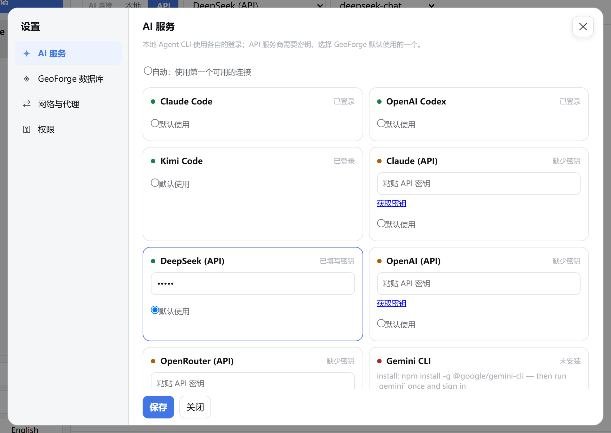

# 2 连接 AI

本章介绍怎样把 GeoForge 连接到 AI、为每个对话选择 AI、在需要时设置代理，以及在开始项目前检查连接。

至少连接一个 AI 之后，GeoForge 才能制定计划、运行任务。在这之前，侧栏顶部显示 **需要设置 AI**，并有一条横幅提示 “Connect an AI to begin.”（连接一个 AI 才能开始）。中文界面下这条横幅仍是英文。

AI 连接正常，只说明 GeoForge 能和 AI 通信，不说明模型运行的结果是否正确。GeoForge 的运行记录会写明实际运行了什么；结果在科学上对不对，仍要由你判断。后面的章节会分别讲这两点。

## 连接 AI 的两种方式

| | API 密钥 | 本地 Agent CLI |
|---|---|---|
| 是什么 | AI 公司发给你的密钥。GeoForge 直接调用该服务。 | 已安装在这台电脑上并已登录的命令行 AI 程序。GeoForge 用你的用户账户替你运行它。 |
| 0.6.54 支持的服务 | **DeepSeek (API)**、**OpenAI (API)**、**OpenRouter (API)**、**Claude (API)**（Anthropic） | **Claude Code**、**OpenAI Codex**、**Kimi Code**、**Gemini CLI**、**Qwen Code** |
| 需要另装的软件 | 无 | 大多数需要 Node.js；在 Windows 上用 Claude Code 还需要 Git for Windows |
| 谁向你收费 | AI 公司，按用量从你的 API 账户扣费 | 你在该 CLI 上的账户或订阅 |
| Windows 0.6.54 测试中完整跑通项目的 | **DeepSeek (API)**，使用 FSM2 积雪模型示例 | 暂无 |

拿不准时，先用 **DeepSeek (API)**。它不需要其他软件，在中国大陆通常不用代理就能访问，也是 0.6.54 在 Windows 上唯一完整跑通过整个项目的 AI。

你可以连接多个 AI。每个对话只用其中一个。

## 打开设置

所有 AI 设置都在同一个窗口里。

1. 点击左侧栏底部的 **设置**。

    **设置** 窗口打开。第一次打开时显示 **AI 服务** 页面。之后会回到你上次用的页面，直到重新加载 GeoForge 页面或重启 GeoForge。

2. 如果显示的是其他页面，点左侧的 **AI 服务**。

    

    确认左侧列出四个页面，底部有 **保存** 和 **关闭**。

3. 要切换页面，点左侧的页面名称：

    | 页面 | 在这里设置什么 |
    |---|---|
    | **AI 服务** | API 密钥、本地 Agent CLI、默认 AI 和连接测试 |
    | **GeoForge 数据库** | 可选的数据目录（见第 3 章） |
    | **网络与代理** | GeoForge 是否使用代理，以及哪些服务走代理 |
    | **权限** | Kimi Code 文件访问权限，以及当前对话的 MCP 服务器 |

4. 改完后点 **保存**。点一次 **保存**，四个页面上的更改都会保存。**关闭** 旁边会短暂显示 “已保存”。

> **注意：** 只有点 **保存**、**测试 AI 与 GitHub** 或 **保存并测试数据库**（后两个会先保存）时，更改才会保留。点 **关闭**、**✕**、按 Esc 键或点窗口外面，都会直接关掉窗口。下次打开 **设置** 时，所有页面上没保存的更改都没有了。

> **提示：** **KI 库** 页面有一个自己的小 **⚙** 设置框。它是较早的简化版，没有 **权限**、**重新检查本地 CLI** 和 **测试 AI 与 GitHub**。请改用主界面侧栏里的 **设置** 按钮。

## 用 API 密钥连接 AI

**AI 服务** 页面上，每个 API 服务都有一张卡片。下表列出这些服务和 GeoForge 为它们提供的模型，顺序与模型列表一致：

| 卡片 | 对话顶部可选的模型 | **获取密钥** 打开的页面 |
|---|---|---|
| **DeepSeek (API)** | `deepseek-chat`（预选）、`deepseek-reasoner` | `https://platform.deepseek.com/api_keys` |
| **OpenAI (API)** | `gpt-4o`（预选）、`gpt-4o-mini` | `https://platform.openai.com/api-keys` |
| **OpenRouter (API)** | `claude-sonnet-4-5`、`deepseek-chat`（预选） | `https://openrouter.ai/keys` |
| **Claude (API)** | `claude-sonnet-4-5`（预选）、`claude-opus-4-1` | `https://console.anthropic.com/settings/keys` |

下面以 DeepSeek 为例。其他卡片的操作相同。

1. 点击 **设置**。
2. 如果显示的是其他页面，点 **AI 服务**。
3. 找到 **DeepSeek (API)** 卡片。还没有密钥时，卡片显示 **缺少密钥** 和一个橙色圆点。
4. 点卡片上的 **获取密钥**。浏览器会打开服务商的密钥页面。
5. 在这个页面登录你的 DeepSeek 账户，创建一个 API 密钥并复制。这一步在服务商网站上完成，不在 GeoForge 里。
6. 回到 GeoForge，点卡片上的 **粘贴 API 密钥** 输入框。
7. 粘贴密钥。
8. 如果你平时主要用这个 AI，在同一张卡片上选中 **默认使用**。（见下文 “选择默认 AI”。）
9. 点击 **保存**。

    对照上面 “打开设置” 里的 **AI 服务** 截图：**DeepSeek (API)** 卡片显示 **已填写密钥**，圆点变绿，密钥框里只有圆点，**默认使用** 已选中（卡片边框变蓝）。**获取密钥** 链接不见了。

10. 点击 **测试 AI 与 GitHub**，确认密钥能用（见下文 “检查连接：测试 AI 与 GitHub”）。密钥保存了，不等于能用。
11. 点击 **关闭**。

    侧栏顶部 **GeoForge** 旁边的文字从 **需要设置 AI** 变成类似 **1 个 AI 已就绪**。

### 更换或删除密钥

密钥保存后，GeoForge 不会再显示它。重新打开 **设置** 时，输入框里只有一个占位内容：“…” 加上密钥的最后四个字符，显示为五个圆点。

更换密钥：

1. 点卡片上的密钥输入框。
2. 按 Ctrl+A（macOS：Cmd+A），再按 Delete。输入框变空。
3. 粘贴新密钥。
4. 点击 **保存**。

删除密钥时，只做第 1、2、4 步。

> **注意：** 如果没先清空输入框就粘贴新密钥，新密钥会接在占位内容后面，GeoForge 会继续用旧密钥，而且不提示。一定要先清空输入框。

### 密钥保存在哪里

GeoForge 把密钥保存在你自己用户目录下的一个设置文件里：

| 平台 | 文件 |
|---|---|
| Windows | `%APPDATA%\KISS\settings.json`（通常是 `C:\Users\you\AppData\Roaming\KISS\settings.json`） |
| macOS | `~/Library/Application Support/KISS/settings.json`（只有你的账户能读取） |

这个文件没有加密。不要共享、上传或同步这个文件夹，求助时也不要把它发出去。

### 用环境变量设置的密钥

GeoForge 还会读取电脑上的这几个环境变量：`DEEPSEEK_API_KEY`、`OPENAI_API_KEY`、`OPENROUTER_API_KEY` 和 `ANTHROPIC_API_KEY`。（环境变量是 Windows 或 macOS 传给每个程序的命名设置。）

- 如果设置了其中一个，对应的卡片会显示 **已填写密钥**，即使你从没粘贴过密钥。
- 如果你又在 **设置** 里保存了密钥，在 GeoForge 重启之前用的是保存的密钥。从下次启动开始，以环境变量为准。

所以，如果保存的密钥在重启后被拒绝，请检查有没有这样的变量：

- **Windows：** 在开始菜单搜索 “环境变量”，打开 **编辑账户的环境变量**（英文系统为 **Edit environment variables for your account**）。删掉这个变量，或把它改成同一个密钥。然后重启 GeoForge。
- **macOS：** 在 `~/.zshrc` 里找类似 `export DEEPSEEK_API_KEY=…` 的一行。删掉它，或改成同一个密钥。然后退出并重新打开 GeoForge。

> **提示：** 保存的 **Claude (API)** 密钥，Claude Code CLI 也能读到。这时 Claude Code 会被当作已登录，可能改用这个 API 密钥计费，而不是用你的 Claude 订阅。如果想让 Claude Code 用订阅，请把 **Claude (API)** 的密钥留空。

## 连接本地 Agent CLI

本地 Agent CLI 是在 PowerShell（Windows）或 “终端”（macOS）里运行的 AI 程序。GeoForge 会用你的用户账户和你自己的登录信息启动它。你需要先在 GeoForge 之外安装并登录一次。

### 事先准备

- **Node.js（LTS 版本）**，从 `https://nodejs.org` 下载。它提供 `npm`，Claude Code、OpenAI Codex、Gemini CLI 和 Qwen Code 都用它安装。
- **Git for Windows**，从 `https://git-scm.com` 下载。在 Windows 上用 Claude Code 时需要它。Claude Code 通过它自带的 Git Bash 运行命令。
- 该 CLI 所属 AI 公司的账户。

### 安装和登录命令

每张还没就绪的卡片下面，GeoForge 都会显示同样的命令。这段说明是英文的。

| 卡片 | 安装命令 | 登录命令 |
|---|---|---|
| **Claude Code** | `npm install -g @anthropic-ai/claude-code` | `claude auth login` |
| **OpenAI Codex** | `npm install -g @openai/codex`（需要 0.144.0 或更新版本） | `codex login` |
| **Gemini CLI** | `npm install -g @google/gemini-cli` | 运行一次 `gemini` 并登录 |
| **Qwen Code** | `npm install -g @qwen-code/qwen-code` | 运行一次 `qwen` 并登录 |
| **Kimi Code** | Windows：没有发布安装程序，卡片会指向 `https://code.kimi.com`。macOS：见下文。 | `kimi login` |

在 macOS 上，在 “终端” 里用这条命令安装 Kimi Code：

```
curl -fsSL https://code.kimi.com/kimi-code/install.sh | bash
```

### 操作步骤

1. 安装 Node.js。
2. **仅限 Windows 上的 Claude Code：** 安装 Git for Windows。
3. 打开一个**新的** PowerShell 窗口（Windows）或 “终端” 窗口（macOS）。安装 Node.js 之前打开的窗口找不到 `npm`。
4. 输入表中的安装命令，按 Enter。
5. 输入登录命令，按 Enter。
6. 在 CLI 打开的浏览器页面里完成登录。
7. **仅限 Windows：** 在任务栏右下角的系统托盘里右键点 GeoForge 图标，选择 **Exit GeoForge**（退出 GeoForge）。托盘菜单是英文的。

    > **注意：** **Exit GeoForge** 会同时停止还在运行的 Agent、下载和模型运行。只在没有重要任务运行时退出。

8. **仅限 Windows：** 从开始菜单打开 **GeoForge Desktop**。

    GeoForge 只在启动时读取一次程序文件夹列表。它运行期间装好的 CLI，可能要重启后才会被发现。如果你只是登录了一个 GeoForge 已经找到的 CLI，可以跳过第 7、8 步。

9. 点击 **设置**。
10. 如果显示的是其他页面，点 **AI 服务**。
11. 滚动到卡片下方，点击 **重新检查本地 CLI**。

    按钮旁边先显示 “正在检查…”，然后显示 “检查完成”。

12. 查看你所用 CLI 的卡片（见下表）。

> **提示：** 每次你切回 GeoForge 的标签页或窗口，它也会重新检查那些已安装但还没就绪的 CLI。点 **重新检查本地 CLI** 是立即检查。

### 卡片上的状态是什么意思

| 卡片显示 | 圆点 | 含义 | 怎么做 |
|---|---|---|---|
| **已登录** | 绿色 | 已安装，已登录。 | 不用做什么，已经可以用。 |
| **已登录** | 橙色 | 已安装，但 GeoForge 无法确认登录状态。**Gemini CLI** 和 **Qwen Code** 总是这样。 | 可以用。在对话里发第一条消息时，就能看出登录是否有效。 |
| installed; sign-in required（已安装，需要登录） | 橙色 | 已安装，未登录。 | 运行卡片下方显示的登录命令，然后点 **重新检查本地 CLI**。 |
| … update required (0.130.0 < 0.144.0)（需要更新） | 橙色 | **OpenAI Codex** 版本太旧，GeoForge 用不了。括号里前一个是你的版本，后一个是最低要求。 | 再运行一次 `npm install -g @openai/codex`，然后点 **重新检查本地 CLI**。 |
| **未安装** | 红色 | GeoForge 找不到这个程序。 | 用卡片下方显示的安装命令安装。 |

表中第 3、4 行的状态文字在中文界面下仍是英文。

“已安装”“已登录”“能用” 是三项不同的检查。只有真正发一条消息，才能证明最后一项；**测试 AI 与 GitHub** 会替你发这条消息。

> **注意：** 在 Windows 0.6.54 上，还没有哪个本地 Agent CLI 完整跑通过整个项目。如果你想走测试过的路线，请用 **DeepSeek (API)**。

## 在 Windows 上使用 Kimi Code：允许完整电脑访问

在 macOS 上，GeoForge 借助 macOS 的一项安全功能，把 Kimi Code 限制在项目文件夹里。Windows 目前没有这样的功能。所以在 Windows 上，你允许 Kimi Code 完整访问你的文件之前，它一直是关闭的。

在这之前，**Kimi Code** 卡片仍可能显示 **已登录**，你甚至可以在对话里选 Kimi。但回复只有下面这条英文消息：

“[Kimi Code was not started: project-scoped security could not be applied (project-scoped Kimi is currently available on macOS only). Choose Full computer access in AI Settings only if you accept that risk.]”

（大意：Kimi Code 没有启动，因为无法启用项目范围的安全限制，这项限制目前只在 macOS 上可用；只有在你接受风险时，才去 AI Settings 里选择完整电脑访问。消息里的 “AI Settings” 指 **设置 → 权限**。）

允许 Kimi Code 运行：

1. 点击 **设置**。
2. 点左侧的 **权限**。

    

    确认 **Kimi Code 文件访问权限** 显示默认值 **不启用 Kimi Code（安全）**。下方说明写着 Kimi Code 在 Windows 上不会启动。

3. 在 **Kimi Code 文件访问权限** 列表里，选择 **允许完整电脑访问并启用 Kimi**。

    浏览器弹出确认框：“启用后，Kimi Code 可以读取和修改此 Windows 账户可访问的所有文件。确定接受此风险并启用吗？”

4. 只有在你接受这个风险时才点 **确定**。点 **取消** 会把列表恢复为 **不启用 Kimi Code（安全）**。这两个按钮由浏览器提供，英文浏览器里显示为 **OK** 和 **Cancel**。

    点 **确定** 后，列表下方的说明变成：“Kimi Code 将能读取和修改当前 Windows 账户可以访问的所有文件。仅在你接受此风险时启用。”

5. 点击 **保存**。
6. 重新给 Kimi 发送你的消息。

在 macOS 上，同一个列表里是另外两个选项：

| macOS 选项 | Kimi Code 可以使用什么 |
|---|---|
| **项目范围（推荐）** | 当前项目、它的 KI、已批准的数据，以及 Kimi 自己的登录信息。需要访问其他文件夹时，对话里会出现一张 “Kimi needs access to one folder”（Kimi 需要访问一个文件夹）卡片，带有 **Allow once**（仅允许一次）和 **Always for this project**（在本项目中始终允许）两个按钮。这张卡片是英文的。 |
| **完整电脑访问权限** | 你的 macOS 账户能打开的所有文件。只在任务无法在项目范围模式下运行时使用。 |

**权限** 页面的 **MCP 连接** 部分是给高级用户用的。（MCP 服务器是可以额外交给 Agent 使用的工具。）没有打开任何对话时，**为当前对话选择 MCP 服务器** 不起作用。

## 选择默认 AI

默认 AI 是你不做选择时 GeoForge 替你选的那个。

1. 点击 **设置**。
2. 如果显示的是其他页面，点 **AI 服务**。
3. 二选一：

    - 在某张卡片上选 **默认使用**，固定一个默认 AI。
    - 选页面顶部的 **自动：使用第一个可用的连接**，让 GeoForge 用第一个就绪的 AI。

4. 点击 **保存**。

默认 AI 用在三个地方：

- **新对话：** 只要对话顶部的 **本地** | **API** 开关处在它所属的那一类，它就会被预选。默认 AI 是 **DeepSeek (API)** 时，顶部必须选在 **API**。
- **Agent 设置**（安装模型，见第 4 章）：在这里它会被预选。
- **测试 AI 与 GitHub：** 第 [6/6] 步测试的是默认 AI。

更改默认 AI 不会影响已经开始的对话。

## 为单个对话选择 AI

每个对话有自己的 AI。发第一条消息之前，在对话顶部的 **AI 连接** 处选择。

1. 点 **＋ 新建对话** 开始一个新对话（第 6 章介绍这个对话框）。
2. 先不要输入，看对话顶部的 **AI 连接**。
3. 用已安装的 Agent CLI 就点 **本地**，用密钥类服务就点 **API**。
4. 在第一个列表里选择 AI。

    还没就绪的选项是灰色的，破折号后面写着原因，例如 “Claude Code — 需要登录”。没有密钥的 API 服务显示 “— 未安装”，在这里的意思是 “没有保存密钥”。“— login checked on first use”（首次使用时检查登录，Gemini CLI、Qwen Code）不是错误，可以选。这一条是英文的。

5. 在第二个列表里选择模型。对本地 CLI 来说，**CLI 默认设置** 表示使用 CLI 自己设定的模型。

    

    发送前检查顶部：**API** 处于高亮状态，两个列表显示 **DeepSeek (API)** 和 **deepseek-chat**，侧栏里这个对话显示 “0 messages”（0 条消息，这里仍是英文）。只有所选 AI 已就绪时，**发送** 才是蓝色的。

6. 输入第一条消息。
7. 点击 **发送**。

> **提示：** 把鼠标停在 **本地** 或 **API** 上，可以看到这一类有几个 AI 已就绪。提示文字是英文，例如 “2 ready”。

### 发出第一条消息后，AI 就固定了

第一条消息发出后，这个对话的 **本地** | **API** 开关、两个列表和 KI 按钮（**自动选择 KI** 或已指定 KI 的名称）都会变灰。鼠标停在 AI 列表上会显示 “本对话已锁定 AI，请新建对话后更换”；停在模型列表上会显示 “本对话已锁定模型，请新建对话后更换”。

原因是：对话内容保存在这个 AI 自己的会话里，别的 AI 读不到。换 AI 会丢掉之前的记录。

要换 AI、模型或 KI，请新建一个对话，在发送前选好。从 0.6.54 起，GeoForge 重启后，对话仍保留原来的 AI。

> **提示（Windows）：** GeoForge 每次启动都会换一个新的本地地址，所以浏览器记不住你上次选的是 **本地** 还是 **API**，新对话可能停在 **本地**。如果你只用 API 密钥，而新对话显示 **本地**，并出现横幅 “No local agent CLI is installed…”，请点 **API**。

## 网络与代理

只有当网络上某些服务被屏蔽或很慢时，才需要看这一节。在中国大陆，GitHub、Claude、OpenAI、OpenRouter 和 Gemini 通常需要代理；DeepSeek、Kimi 和 Qwen 通常不需要。

GeoForge 不提供代理。它可以使用你已经在运行的代理，例如本机的代理软件。

1. 点击 **设置**。
2. 点左侧的 **网络与代理**。

    

    查看 **代理** 下方的说明。图中写的是 “已检测到 http://127.0.0.1:7897。GeoForge 只会把它传给下方选中的服务。” 勾选的四项（**GitHub 与 KI 更新**、**观测数据服务**、**Claude Code**、**OpenAI Codex**）是默认设置。

3. 在 **代理** 下选择一项：

    | 选项 | 作用 |
    |---|---|
    | **使用 Mac 系统代理（推荐）** | 使用电脑的系统代理。名字里虽然写着 “Mac”，在 Windows 上同样适用。 |
    | **手动输入代理** | 使用你输入的地址，例如 `http://127.0.0.1:7897`。 |
    | **不使用代理** | 所有连接都直连，并清除 GeoForge 各个 AI 连接里的代理设置。 |

4. 如果选了 **手动输入代理**，输入代理软件显示的地址和端口。地址必须以 `http://`、`https://`、`socks5://` 或 `socks5h://` 开头。地址里不能带用户名或密码；登录交给本机的代理软件处理。
5. 在 **以下服务使用代理** 下，勾选需要走代理的服务，其他的取消勾选（见下面的表）。
6. 点击 **保存**。
7. 点左侧的 **AI 服务**。
8. 点击 **测试 AI 与 GitHub**。第 [4/6] 步按 **GitHub 与 KI 更新** 的勾选情况测试 GitHub；第 [6/6] 步按该 AI 自己的勾选情况测试 AI。

> **注意：** 在 Windows 上，第一个选项仍然叫 **使用 Mac 系统代理（推荐）**。它指的是 Windows 系统代理，也就是在 Windows 代理设置里设定的代理，或代理软件用 “系统代理” 模式设定的代理。如果都没有设置，说明会写 “没有检测到系统代理，GeoForge 将使用普通网络连接。”

### 每个勾选项管什么

| 勾选项 | 哪些连接走代理 |
|---|---|
| **GitHub 与 KI 更新**（默认勾选） | **测试 AI 与 GitHub** 里 GeoForge 自己的 GitHub 检查，以及 KI 库更新 |
| **观测数据服务**（默认勾选） | 与 GeoForge 数据库的连接（第 3 章） |
| 每个 AI，例如 **Claude Code**（默认勾选）、**OpenAI Codex**（默认勾选）、**DeepSeek (API)** | 这个 AI 自己的连接，**以及** 它的 Agent 用 Git、pip 或 curl 做的下载，例如设置时从 GitHub 获取模型源码 |

没勾选的服务总是直连，即使设置了代理。

中国大陆常见的选法：

| 勾选 | 不勾选 |
|---|---|
| **GitHub 与 KI 更新**、**观测数据服务**、**Claude Code**、**OpenAI Codex**、**Gemini CLI**、**Claude (API)**、**OpenAI (API)**、**OpenRouter (API)** | **DeepSeek (API)**、**Kimi Code**、**Qwen Code** |

> **提示：** **GitHub 与 KI 更新** 不包括 AI 的 Agent 发起的下载。如果你用 DeepSeek、Kimi 或 Qwen 且不走代理，而 Agent 在设置时无法从 GitHub 下载模型源码，就把这个 AI 也勾上，点 **保存**，再让 Agent 重试。

## 检查连接：测试 AI 与 GitHub

在这几个页面上做了任何更改后，以及开始第一个项目之前，都要运行这个测试。

1. 点击 **设置**。
2. 如果显示的是其他页面，点 **AI 服务**。
3. 选择要测试的 AI：在它的卡片上选 **默认使用**。如果选的是 **自动：使用第一个可用的连接**，测试的是对话顶部当前显示的 AI。
4. 滚动到卡片下方，点击 **测试 AI 与 GitHub**。

    **关闭** 旁边出现 “正在测试真实连接……”。GeoForge 会先保存你的全部设置，然后一个灰色方框里逐行出现六个步骤的报告。报告只有英文。

5. 等到最后一行 “done.” 出现，并且 **关闭** 旁边显示 “测试完成”。
6. 对照下表阅读报告。

| 步骤 | 检查什么 | 正常结果 | 说明 |
|---|---|---|---|
| [1/6] KI harness contract | GeoForge 内置的模型运行规则是否完好 | OK | 这里出现 FAIL，无法在设置里修复。复制报告并求助。 |
| [2/6] Python 3 for model environments | 电脑上是否装有 Python | OK 和一个路径 | Windows 用户请看下面的注意事项。 |
| [3/6] Agent CLIs on this machine | 每个已安装的 CLI、它的位置和登录状态 | 你用的 CLI 显示 OK | 如果你用 API 密钥，“FAIL  none found — install one” 没关系。 |
| [4/6] GitHub model-source connection | 能否访问 GitHub，用了哪个代理 | “OK  GitHub answered (HTTP 200)” | 出现 FAIL 时，按 “Fix:” 行操作：勾选 **GitHub 与 KI 更新**，或改正代理地址。 |
| [5/6] API keys in the environment | GeoForge 有哪些 API 密钥 | “OK  DeepSeek (API) (DEEPSEEK_API_KEY is set)” | “none set (fine if you use an agent CLI)”（没有设置；用 Agent CLI 时没关系） |
| [6/6] Agent sign-in — running the agent for real | 向被测试的 AI 真实发送一条短消息 | API：“OK … answered (HTTP 200) — key is valid”。CLI：“OK … answered — signed in and working” | 出现 FAIL 时，看它下面的几行，以及 “Fix:” 行（如果有）。 |

**OK** 表示这一步通过。**FAIL** 行后面跟着原始错误信息，大多数步骤还有一行以 “Fix:” 开头的修复建议。

> **注意（Windows）：** 报告里有些建议是为 macOS 写的。[2/6] 在 Windows 上经常显示 FAIL，并建议运行 `brew install python` 或 `xcode-select --install`；这些命令在 Windows 上不存在。这一行不影响你连接 AI 或对话；只有设置时需要 Python 的模型才用得到它（第 4 章）。[6/6] 失败时，把下面提到的 “Terminal” 理解为 PowerShell，忽略 `echo $HOME` 这条建议；“switch the menu bar to API” 的意思是在对话顶部点 **API**。

> **注意：** 第 [6/6] 步是真实调用。用 API 密钥时，服务商会对这次很小的请求收费；用 CLI 时，会用掉你套餐里的一点额度。

> **注意（Windows）：** [6/6] 会直接运行 Kimi Code。即使 **权限** 仍是 **不启用 Kimi Code（安全）**，它也可能报告 Kimi 正常；但在你启用之前，对话仍然不会启动 Kimi。

求助时，请复制整份报告。GeoForge 不会在报告里打印你的密钥，但服务商的错误信息可能带出密钥的一部分，文件夹路径也会显示你的用户名。分享前先通读一遍。

## 如果出了问题

下表中的横幅、保存错误和测试结果在中文界面下大多仍是英文，这里照原样列出。

| 你看到的 | 原因 | 怎么做 |
|---|---|---|
| 横幅 “Connect an AI to begin. Open AI Settings to add a key or configure a local agent.”，侧栏显示 **需要设置 AI** | 没有就绪的 AI。 | 按上面的说明添加密钥，或登录 CLI。“AI Settings” 是 **设置** 的旧名称。 |
| 横幅 “No API connection yet. Open AI 设置 and add a key.” | 对话顶部选在 **API**，但没有保存密钥。 | 添加密钥；如果你用 CLI，就点 **本地**。 |
| 横幅 “No local agent CLI is installed. Open AI 设置 for setup details.”，带 **Recheck**（重新检查）按钮 | 顶部选在 **本地**，但没找到 CLI。 | 如果你用密钥，点 **API**。如果你刚在 Windows 上装了 CLI，先重启 GeoForge，再点 **Recheck**。 |
| 横幅 “Local CLIs are installed but not ready — OpenAI Codex: sign-in needed. run `codex login` in PowerShell.”，带 **Recheck** 按钮 | CLI 已安装，但没登录。 | 运行横幅里的命令，再点 **Recheck**。 |
| **发送** 一直是灰色 | 顶部选的 AI 没有就绪，或者对话还在处理中。 | 在列表里选一个没变灰的 AI，或者先把你想用的那个修好。 |
| PowerShell 提示 “无法加载文件 …npm.ps1，因为在此系统上禁止运行脚本”（英文系统：“npm.ps1 cannot be loaded because running scripts is disabled on this system”） | Windows 阻止了 PowerShell 版的 `npm`。 | 用 `npm.cmd` 代替 `npm`，例如 `npm.cmd install -g @openai/codex`。 |
| 装好后 CLI 仍显示 **未安装** | 安装时 GeoForge 正在运行，或者安装失败了。 | Windows：从托盘退出 GeoForge，再重新启动。macOS：退出 GeoForge，再重新打开。然后在新的 PowerShell 或 “终端” 窗口里输入 `claude --version`（或 `codex --version`、`gemini --version`）：如果提示找不到命令，就重新安装。 |
| 你已经登录，CLI 却显示 “installed; sign-in required” | 登录的是另一个账户，或者登录没有完成。 | 在 PowerShell 或 “终端” 里运行 `claude auth status` 或 `codex login status`，看 CLI 自己怎么报告。重新登录，然后点 **重新检查本地 CLI**。 |
| **OpenAI Codex** 上显示 “update required (… < 0.144.0)” | Codex CLI 版本太旧。 | 运行 `npm install -g @openai/codex`，然后点 **重新检查本地 CLI**。 |
| 测试 [6/6]：“FAIL  DeepSeek (API): HTTP 401 — key rejected”（或 403） | 服务商拒绝了这个密钥。 | 到服务商网站上检查密钥。把输入框完全清空，重新粘贴，点 **保存**，再测一次。同时检查有没有同名的环境变量。 |
| 测试 [6/6]：“FAIL  cannot reach DeepSeek (API): …” | 这个 AI 的网络或代理线路不对。 | 在 **网络与代理** 页面勾选或取消勾选这个 AI，点 **保存**，再测一次。 |
| 测试 [4/6]：“FAIL  cannot reach GitHub: …” | GitHub 被屏蔽，或者代理地址不对。 | 勾选 **GitHub 与 KI 更新**，检查代理地址，点 **保存**，再测一次。 |
| 粘贴了新密钥，用的却还是旧密钥 | 新密钥接在了占位内容后面，没有替换旧密钥。 | 把输入框完全清空，重新粘贴，点 **保存**。 |
| 保存失败，提示 “proxy address is required in manual mode” | 选了 **手动输入代理**，但地址是空的。 | 输入地址，或者选其他选项。 |
| 保存失败，提示 “proxy must start with http://, https://, socks5://, or socks5h://” | 地址没有协议前缀，或者前缀不对。 | 写完整地址，例如 `http://127.0.0.1:7897`。 |
| 保存失败，提示 “proxy credentials are not stored here; use a local authenticated proxy” | 地址里带有用户名或密码。 | 删掉它们，让代理软件处理登录。 |
| Kimi 只回复 “[Kimi Code was not started: project-scoped security could not be applied …]” | Windows 上 Kimi 默认关闭。 | **设置 → 权限 → 允许完整电脑访问并启用 Kimi**，点 **确定**，再点 **保存**，然后重新发送。 |
| AI 或模型列表变灰，并提示 “本对话已锁定 AI，请新建对话后更换” | 对话已经开始了。 | 新建对话，在发第一条消息前选好 AI。 |
| 重新打开 **设置** 后，你的更改不见了 | 关窗口前没有点 **保存**。 | 重新修改，然后点 **保存**。 |
