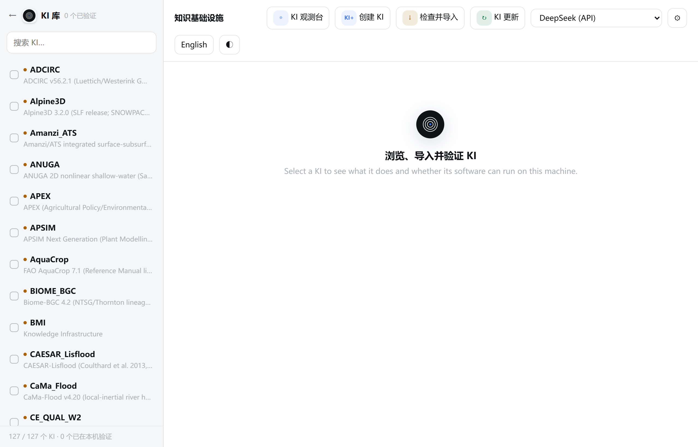
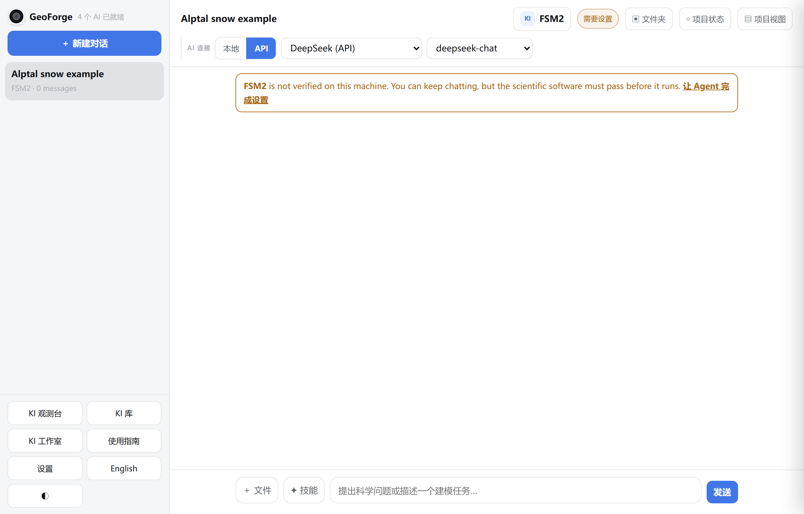
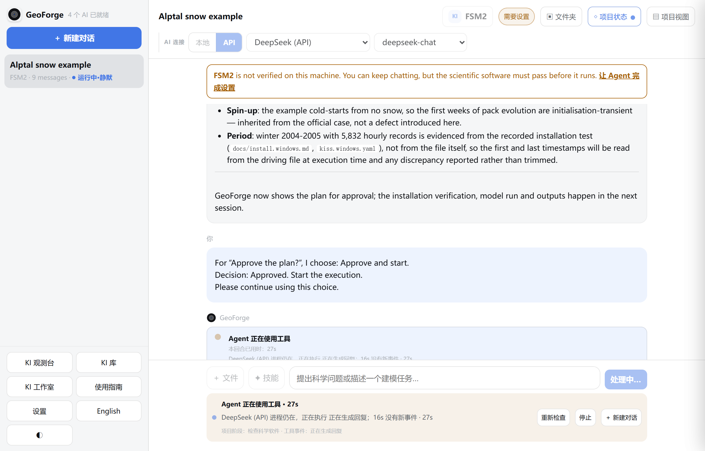
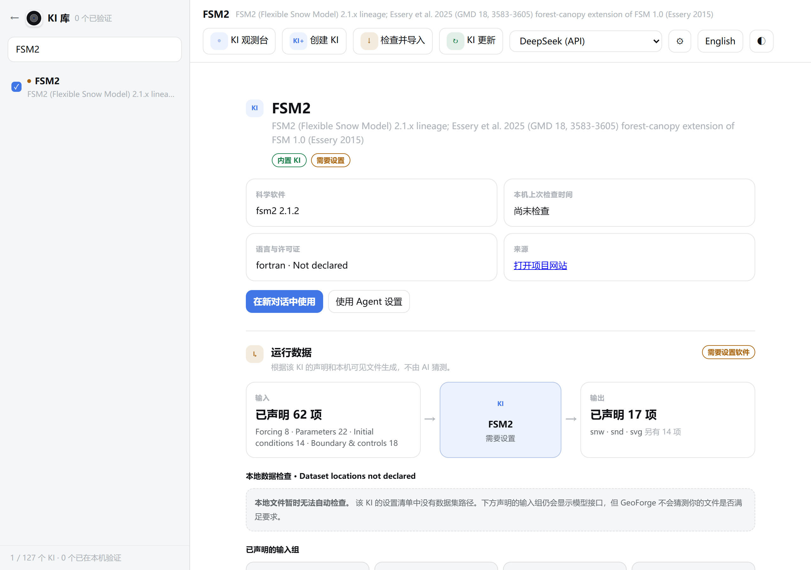
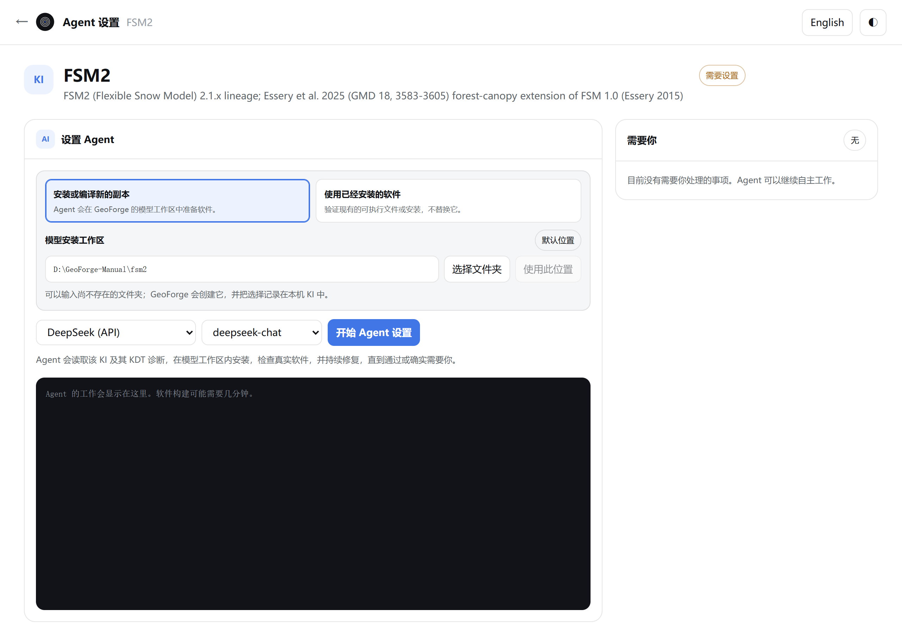
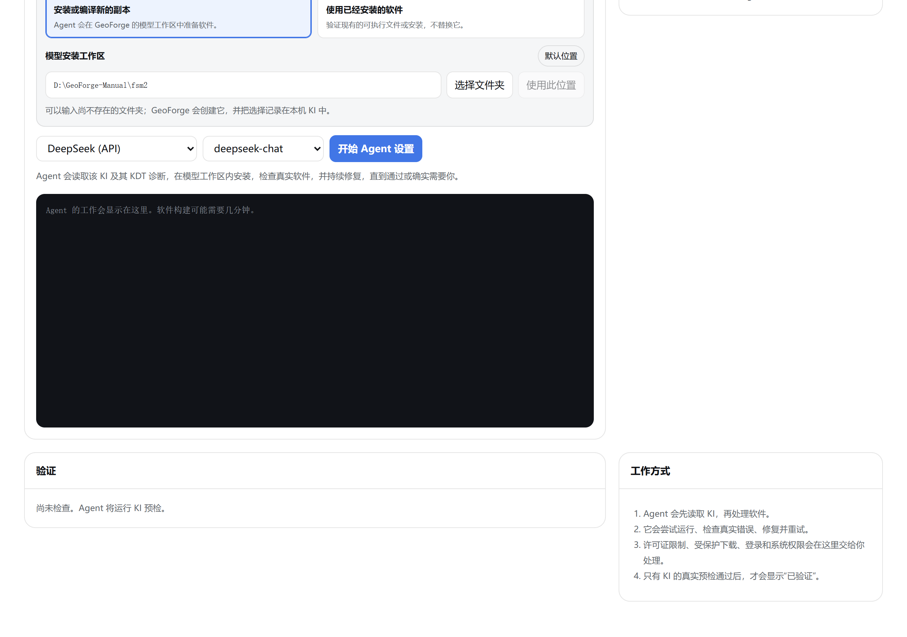
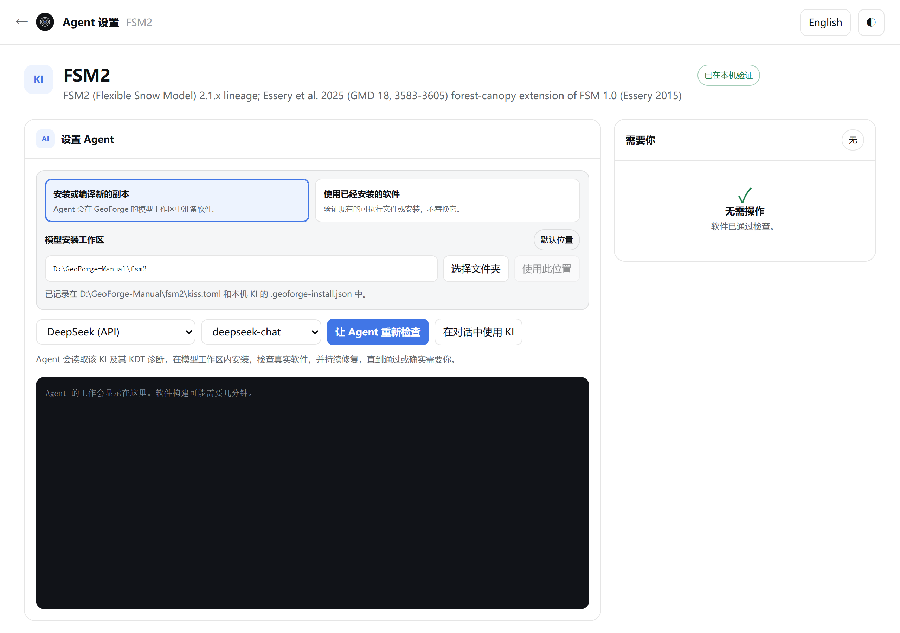
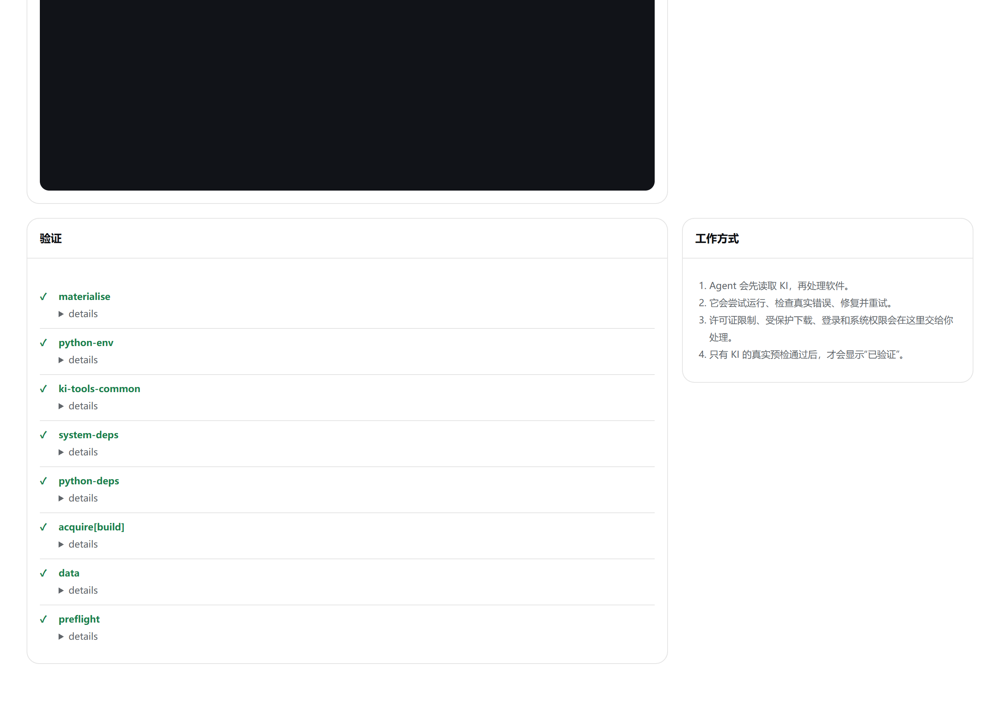
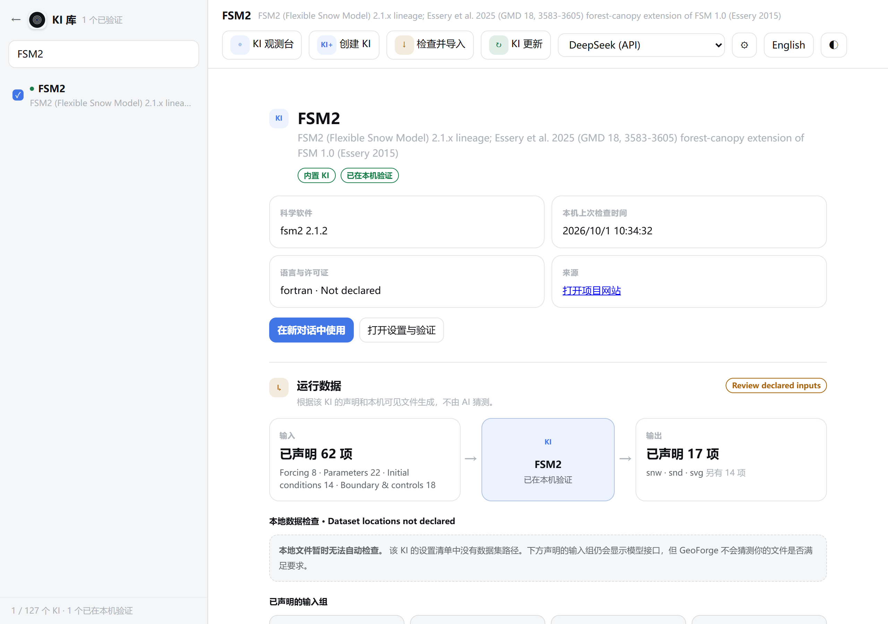
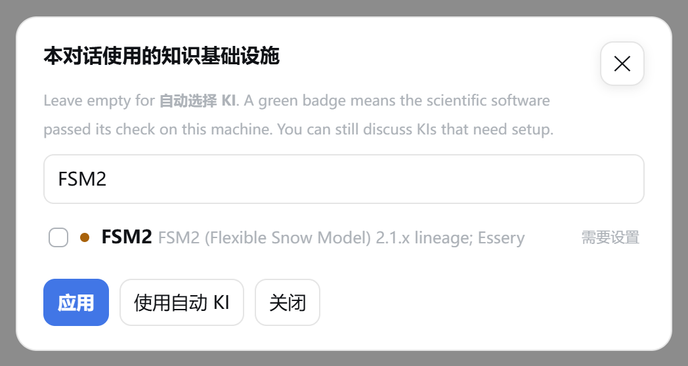

# 4 安装科学模型

本章介绍三件事：怎样让模型软件在你的电脑上运行起来（在项目里批准计划后设置，或者提前在 **Agent 设置** 页面设置）；**已在本机验证** 是什么意思；怎样为对话选择 KI。

本章的例子用 FSM2 和 **DeepSeek (API)**。FSM2 是第 5 章示例用的积雪模型。0.6.54 在 Windows 上完整测试过的，就是这个组合。

## KI 与模型软件

对每个模型，GeoForge 都把两样东西分开：

| | KI | 模型软件 |
|---|---|---|
| 是什么 | GeoForge 为某一个模型准备的、经过检查的知识包：怎样安装、准备输入、运行和检查这个模型 | 科学程序本身，例如 `FSM2.exe` |
| 从哪里来 | 随 GeoForge 提供（0.6.54 有 127 个 KI），或者由你导入（第 7 章） | Agent 按 KI 指定的官方来源，在你的电脑上下载或编译 |
| FSM2 的大小 | 不到 1 MB | Windows 测试中约 1.1 GB，几乎全是编译它用的私有编译器 |

FSM2 的 KI 里有：给 Agent 的说明；四个工具（转换驱动数据、转换土壤参数、运行 FSM2、读取输出）；已知错误及修复方法；Windows 安装说明和 Windows 安装配方；一项启动检查。它不包含 FSM2 程序本身。安装 GeoForge 不会安装任何模型软件。

随 GeoForge 或官方 KI 库更新提供的 KI，在 **KI 库** 里带有徽标 **内置 KI**。

### KI 的软件状态

每个 KI 都会显示它的软件在本机的状态。在 **KI 库** 里，它是名称前的彩色圆点；在对话的 KI 选择窗口里，它是一个标签；在对话顶部，它是 KI 名称旁边的状态标签。

| 标签 | 圆点 | 含义 |
|---|---|---|
| **已在本机验证** | 绿色 | 模型软件在本机通过了 KI 的最终检查。 |
| **需要设置** | 橙色 | 还没有在本机验证。Agent 会根据 KI 自己想办法安装。 |
| **可以开始设置** | 橙色 | 还没有在本机验证。KI 带有一份已知能用的安装配方。 |
| **需要手动设置** | 橙色 | 还没有在本机验证。GeoForge 无法自行获取软件，你可能要自己提供一部分。 |
| **验证失败** | 红色 | 本机上一次检查失败。请重新设置软件。 |

仅对 APEX：**Recheck APEX0806**（重新检查 APEX0806）表示之前的检查测的是另一个 APEX 版本。请重新设置。这个标签在中文界面下仍是英文。

1. 点击侧栏底部的 **KI 库**。

    

    查看列表底部的一行，这里是 **127 / 127 个 KI · 0 个已在本机验证**，每个名称前都是橙色圆点。刚安装的 GeoForge 还没有验证任何模型软件，这是正常的。

验证结果只属于一台电脑。GeoForge 把结果和装好的软件一起，保存在这个模型的安装文件夹里。换一台电脑、换一个 Windows 用户账户，或者换一个安装文件夹，都会从 **需要设置** 重新开始。反过来，一个模型验证通过后，这台电脑上的所有项目都用同一份安装：每个模型只需设置一次。

## 两种设置软件的方式

| | 在项目里 | 提前设置 |
|---|---|---|
| 什么时候 | 在计划上点 **Approve and start**（批准并开始）之后 | 任何时候，在开始项目之前 |
| 怎么开始 | 你批准后，等已批准的数据到位，GeoForge 自动开始 | **KI 库** → **使用 Agent 设置**，或者对话横幅里的 **让 Agent 完成设置** |
| 由哪个 AI 来做 | 对话所用的 AI | 你在 **Agent 设置** 页面上选的 AI |
| 安装文件夹 | 为这个 KI 记录的文件夹；默认是 `C:\Users\you\kiss\fsm2` | 你可以自己选文件夹，或者指向已经装好的软件 |
| 在哪里查看进度 | 对话、活动栏和 **◇ 项目状态** | **Agent 设置** 页面上的日志和 **需要你** 方框 |
| 怎么停止 | 活动栏里的 **停止** | 页面上没有停止按钮；要停止就退出 GeoForge |
| 之后 | GeoForge 开始你批准的运行 | 之后所有项目里，这个 KI 都显示 **已在本机验证** |

两种方式用的是同一个安装文件夹，运行同样的最终检查，保存同样的记录。和其他 Agent 工作一样，设置会消耗所选 AI 的用量。

以下情况适合提前设置：你想换一个文件夹或磁盘；想让 GeoForge 使用你已经装好的软件；想用另一个 AI 来安装；或者只是想在规划研究之前，先确认模型能在这台电脑上运行。

## 让项目设置软件

制定计划时不会安装任何东西。只有你批准计划之后，才会设置软件。第 5 章完整走一遍 FSM2 项目；这一节只讲其中的软件设置。

1. 新建一个对话并选择 KI（见下文 “在对话中使用 KI”），或者保留 **自动选择 KI**。

    

    查看对话顶部：KI 按钮显示 **FSM2**，旁边的标签是 **需要设置**，对话上方有一条英文横幅 “**FSM2** is not verified on this machine. You can keep chatting, but the scientific software must pass before it runs.”（FSM2 尚未在本机验证。你可以继续对话，但科学软件必须先通过检查才能运行），末尾是链接 **让 Agent 完成设置**。如果想让项目来设置软件，可以不管这个链接。

2. 发送你的请求（第 5 章）。
3. 回答规划问题。
4. 在批准卡片上阅读计划。卡片标题 **Approve the plan?**（是否批准计划？）和其中的选项在中文界面下仍是英文。
5. 点击 **Approve and start**（批准并开始）。

    如果计划需要数据，GeoForge 先获取已批准的数据。然后，因为软件还没验证，对话所用的 AI 会在 KI 的安装文件夹里设置软件。

    

    确认顶部的状态标签仍是 **需要设置**，消息框下方的活动栏里有 **停止**。只有最终检查通过后，标签才会变成 **已在本机验证**。

6. 点击对话顶部的 **◇ 项目状态**，查看当前阶段。

    

    确认当前阶段是 **准备**（“检查软件并准备适合的数据”），右侧的标签显示 **0 / 1 个软件已验证**。

7. 等待最终检查。检查通过后，对话里显示 “**Software verified. Starting your approved plan in a new session…**”（软件已验证，正在新会话中开始你批准的计划），这行字是英文的。随后 GeoForge 开始执行已批准的步骤。第 5 章从这里接着讲。

如果已批准的数据是在后台下载完的，消息框上方的横幅会显示 **已获取批准的数据 · 需要先配置软件**。点击 **开始已批准的运行**：GeoForge 会先设置软件，再运行（第 3 章）。

要停止设置，点活动栏里的 **停止**。点了 **停止**，GeoForge 就不会运行最终检查。已经下载或编译好的文件留在安装文件夹里。想继续时，发一条消息。

如果这一回合结束时检查没有通过，在同一个对话里发一条消息，例如 “请继续设置 FSM2。” Agent 会再试一次，第一次尝试留下的文件都还在。项目里开始的设置，请在这个项目的对话里完成。

0.6.55 的 API 软件配置只允许安装及有界启动检查。预检通过后，另行执行已批准的科学步骤。旧尝试中没有运行记录的结果仍不能证明完成。

> **提示：** 想自己选安装文件夹，或者想用已经装好的软件，请在批准计划之前打开 **Agent 设置** 页面。项目总是使用为这个 KI 记录的文件夹。

## 提前设置软件

### 打开 Agent 设置页面

1. 点击侧栏底部的 **KI 库**。
2. 在 **搜索 KI…** 中输入 `FSM2`。
3. 点击列表中的 **FSM2**。

    

    查看名称下面的两个徽标 **内置 KI** 和 **需要设置**，**本机上次检查时间** 卡片显示 **尚未检查**，以及 **在新对话中使用** 和 **使用 Agent 设置** 两个按钮。

4. 在 **KI 库** 顶部的 AI 列表里（这里是 **DeepSeek (API)**），选择负责设置的 AI。**Agent 设置** 页面会预先选好这个 AI；到了页面上仍可以改。
5. 点击 **使用 Agent 设置**。**Agent 设置** 页面在同一个标签页中打开。

在对话里，横幅中的链接 **让 Agent 完成设置** 会为这个 KI 打开同一个页面。这时页面预选的是你的默认 AI（第 2 章），不一定是对话所用的 AI。如果对话里有几个 KI 都没验证，横幅里的链接会变成 **打开 KI 库**。

要返回，点左上角的 **←**。它回到 **KI 库**；**KI 库** 自己的 **←** 再回到主窗口。

### 页面的各个部分

确认选中的是 **安装或编译新的副本**，**模型安装工作区** 旁边的徽标是 **默认位置**，两个列表显示 **DeepSeek (API)** 和 **deepseek-chat**，**需要你** 显示 **无**，右上角的徽标是 **需要设置**。

截图中 GeoForge 的工作文件夹是 `D:\GeoForge-Manual`，所以默认文件夹显示为 `D:\GeoForge-Manual\fsm2`。正常安装时是 `C:\Users\you\kiss\fsm2`。

| 部分 | 显示什么 |
|---|---|
| 顶栏 | **Agent 设置**、KI 名称、**←**、语言按钮（中文界面下显示 **English**）和 **◐** |
| 标题 | KI 名称、它的参考文献，以及右侧的软件状态徽标 |
| **设置 Agent** | 软件装在哪里、由哪个 AI 来做、开始按钮、进度卡片和日志 |
| **需要你** | 这次设置中，Agent 向你要东西的唯一地方 |
| **验证** | 最终检查的结果，每一步一行 |
| **工作方式** | 用四点概括设置过程 |

中文界面下，这个页面的按钮和标题大多是中文。日志、请求卡片的类型和标题、**验证** 里的检查项名称，以及 GeoForge 服务器返回的错误提示，仍是英文。

确认 **验证** 下写着 “尚未检查。Agent 将运行 KI 预检。” “预检” 是 KI 自带的启动检查。

### 选择软件安装位置

选中 **安装或编译新的副本** 时，Agent 会在 **模型安装工作区** 下显示的文件夹里装一份新的副本。如果用默认文件夹，直接跳到 “选择 AI 并开始”。

换一个文件夹：

1. 点 **模型安装工作区** 下面的路径输入框。
2. 按 Ctrl+A（macOS：Cmd+A）选中路径。
3. 输入或粘贴完整路径，例如 `D:\GeoForge-Manual\models\fsm2`。这个文件夹可以还不存在。
4. 点击 **使用此位置**。改了路径之后，这个按钮才能点。

    GeoForge 会创建这个文件夹并记录下来。徽标变成 **用户选择**，下方说明变成 “已记录在 … 和本机 KI 的 .geoforge-install.json 中。”

| 平台 | **选择文件夹** |
|---|---|
| Windows | 只会弹出提示 “请直接在安装路径框中输入完整路径。” 请从文件资源管理器的地址栏复制路径，粘贴到输入框里。 |
| macOS | 打开系统的文件夹选择器。选好文件夹后，点 **使用此位置**。 |

GeoForge 不接受这些路径：没有盘符的路径、整个磁盘、你的主文件夹、已经分给另一个 KI 的文件夹，以及你没有写入权限的文件夹。原因会显示在提示框里（见 “如果出了问题”）。

在 Windows 上，请选一个短、不含空格的路径，放在剩余空间有好几 GB 的磁盘上，不要放在 OneDrive 里。Windows 对大多数路径限制为 260 个字符，而编译工具会在安装文件夹里建很深的子文件夹。

> **注意：** 更改文件夹不会搬走已经装好的软件。之后 GeoForge 会到新文件夹里找软件，所以在你于新文件夹里重新设置之前，KI 会再次显示 **需要设置**。旧文件夹仍留在磁盘上。

### 使用已经安装的软件

如果这台电脑上已经装了这个模型（例如课题组装的），GeoForge 可以检查这份现有的副本，不必重新编译一份。GeoForge 只允许 Agent 读取和运行这个软件，不会覆盖它。GeoForge 为这个 KI 生成的文件（KI 的工作副本、日志和验证记录）仍然放在 KI 的安装文件夹里。

1. 点击 **使用已经安装的软件**。出现 **已有安装或可执行文件** 面板，徽标为 **尚未选择**。
2. 点这个面板里的路径输入框。
3. 粘贴程序文件的完整路径，例如 `D:\GeoForge-Manual\lab-models\FSM2\FSM2.exe`，或者它所在文件夹的路径。
4. 点击 **使用此路径**。

    徽标变成 **已找到**，说明变成 “将验证 …。Agent 只能读取和运行这里的软件，不会覆盖它。” 开始按钮变成 **验证已有软件**。

5. 接着看下面的 “选择 AI 并开始”。

| 平台 | **选择文件夹** 和 **选择文件** |
|---|---|
| Windows | 只会弹出提示 “请直接输入已有软件的完整路径。” 请直接粘贴路径。 |
| macOS | 打开系统的文件夹或文件选择器。 |

如果不知道软件装在哪里，先选好 AI，然后点 **让 Agent 查找并验证**，代替第 2 到第 5 步。这会立即启动 Agent。

GeoForge 会在 Windows 的程序搜索路径里找以模型命名的程序，并在 `C:\Program Files`、`C:\Program Files (x86)` 和 `C:\Users\you\AppData\Local` 的下一级找同名的文件夹或程序。然后由 Agent 检查找到的东西。

如果什么也没找到，日志会显示 “No likely installation was found automatically; the agent will ask for a path instead of reinstalling.”（没有自动找到可能的安装；Agent 会向你要路径，而不是重新安装）。GeoForge 会要求 Agent 不要装新副本，除非你切回 **安装或编译新的副本**。

### 选择 AI 并开始

1. 在文件夹方框下方的第一个列表里选择 AI。还没就绪的 AI 是灰色的，后面写着 “— 不可用”。
2. 在第二个列表里选择模型。对本地 Agent CLI，**Agent 默认设置** 表示使用 CLI 自己的设置。
3. 点击开始按钮。

开始按钮上的文字说明它要做什么：

| 按钮文字 | 什么时候出现 |
|---|---|
| **开始 Agent 设置** | 第一次设置新副本 |
| **继续 Agent** | 之前的设置已经准备过这个文件夹 |
| **验证已有软件** | 选中了 **使用已经安装的软件** |
| **让 Agent 重新检查** | KI 已经验证过 |

点下按钮后，GeoForge 先记录文件夹（如果你改过），再准备这个文件夹（放入 KI 的工作副本和给 Agent 的书面说明），然后运行一次 KI 的检查。如果检查已经通过，日志显示 “FSM2 is already verified and ready to use.”（FSM2 已验证，可以使用），不会用到 AI。否则，Agent 从检查失败的地方开始工作。

和对话不同，这个页面不会锁定 AI。下一次尝试可以换一个 AI。

### 跟踪进度

Agent 工作时，开始按钮下方会出现一张进度卡片：

- 标题说明 Agent 在做什么，例如 “正在运行安装命令” 或 “正在读取 KI 与诊断”。
- 下面一行在页面持续收到信号时显示 “Agent 进程连接正常 · 3 秒前收到信号”，长时间编译时也是这样。如果超过 14 秒没有收到信号，会显示 “命令仍在运行 · 等待下一次 Agent 信号（… 秒）”。
- 右侧的计时器按分和秒计时。
- 三个阶段依次亮起：**1 · 读取 KI**、**2 · 安装与修复**、**3 · 最终验证**。阶段是 GeoForge 根据日志估计的，仅供参考。

下面的黑色日志区显示 Agent 的消息和命令输出，内容大多是英文。连续的工具调用会缩成一行，例如 “↳ 正在运行安装命令 · 4 steps”（4 步）。GeoForge 还会把日志保存为安装文件夹里的 `setup-agent.log`。

在 2026 年 9 月的 Windows 安装测试中，FSM2 用了约 3 分钟；编写本手册时，在项目里设置用了约 5 分钟。大多数模型几分钟就能装好；装成功的模型里，最慢的用了约 17 分钟。网络慢时，第一次编译会更久，因为 Agent 要下载源码，常常还要下载编译器。

0.6.55 中，浏览器断开连接或关闭标签页不再结束正在进行的回合。重新打开 GeoForge 和对话即可查看保存的进度；要停止工作请用 **停止**。

这个页面没有停止按钮。要停止在这里开始的设置：

- **Windows：** 右键点 GeoForge 托盘图标，选择 **Exit GeoForge**（退出 GeoForge）。托盘菜单是英文的。它会先停止正在运行的 Agent 和命令，然后退出。
- **macOS：** 退出 GeoForge，或者关闭它的窗口。

已经下载或编译好的文件留在安装文件夹里，下次设置可以接着用。

### Agent 需要你时

Agent 只会为它不该自己做的事停下来：许可证、受保护的下载、登录、影响整台电脑的改动，或者科学上的选择。这时 **需要你** 上的徽标显示 **现在需要你**，日志最后一行是 “Paused for the user. The required action is shown beside this log.”（已暂停，等待用户处理；需要你做的事显示在日志旁边）。

请求卡片可能包含：

| 部分 | 用途 |
|---|---|
| 类型标签：DOWNLOAD、LICENCE、LOGIN、PERMISSION、CHOICE 或 OTHER | 需要哪种帮助。这些标签是英文的，依次表示下载、许可证、登录、权限、选择和其他。 |
| 标题和简短说明 | 要做什么、为什么。很长的技术报告会折叠在 **查看完整技术报告** 下面。 |
| **打开官方页面 ↗** | 下载、许可证或登录用的官方页面 |
| “需要放在：…” | 文件应该放在哪里 |
| 一条命令和 **复制** | 你可以复制后自己运行的命令，例如在 PowerShell 里运行。先读一遍；GeoForge 不会替你运行。 |
| 文件框和 **把文件交给 Agent** | 仅限 DOWNLOAD 和 LICENCE：把你下载的文件交给 Agent |
| **给 Agent 的可选说明** | 随你的回答一起发给 Agent 的简短说明 |

把下载的文件交给 Agent：

1. 点击 **打开官方页面 ↗**。
2. 从这个页面下载文件。如果页面要求登录或接受许可证，由你自己完成。
3. 回到 **Agent 设置** 页面，点 **把文件交给 Agent** 上方的文件框。
4. 选择下载好的文件。
5. 点击 **把文件交给 Agent**。

    GeoForge 把文件保存到安装文件夹的 `user-files\` 里，并立即重新启动 Agent。文件最大 300 MB。

其他请求：

1. 按卡片上的要求去做。
2. 如果有帮助，在 **给 Agent 的可选说明** 里写一句说明。如果是 CHOICE 请求，把你的答案写在这里。
3. 点击 **我已完成 — 继续**。Agent 会接着工作。

如果你做不到，点 **我无法完成 — 帮帮我**。GeoForge 会新建一个选好这个 KI 的对话，并把问题描述填进消息框。读一遍，然后点 **发送**，和 AI 讨论别的办法。在你回到 **Agent 设置** 页面回应这张卡片之前，设置会一直暂停。

> **注意：** 不要在说明里输入密码、许可证密钥或 Token。说明会保存在安装文件夹里，并发送给 AI。

**需要你** 上的其他徽标：**无** 表示没有等你处理的事。**需要操作** 表示 Agent 在检查通过之前停下了（见 “如果出了问题”）。**可以继续** 表示你已经回应，Agent 还没接手。你交给 Agent 的文件列在 **已提供的文件** 下面。

### 设置完成时

最终检查通过后，日志最后显示 “GeoForge final check: PASS”（GeoForge 最终检查：通过）和 “FSM2 is verified and ready to use.”（FSM2 已验证，可以使用），右上角的徽标变成 **已在本机验证**。

确认徽标是 **已在本机验证**；**需要你** 显示 ✓ **无需操作** 和 “软件已通过检查。”；按钮变成 **让 Agent 重新检查** 和 **在对话中使用 KI**。这里的 FSM2 是在第 5 章的项目里设置的，所以这个页面的日志区只有占位文字，文件夹下方的说明是 “已记录在 D:\GeoForge-Manual\fsm2\kiss.toml 和本机 KI 的 .geoforge-install.json 中。”

确认 **验证** 下每一行都有 ✓。FSM2 的检查项是 **materialise**、**python-env**、**ki-tools-common**、**system-deps**、**python-deps**、**acquire[build]**、**data** 和 **preflight**。

**验证** 下的每一行前面都有一个标记：

| 标记 | 含义 |
|---|---|
| ✓ | 通过 |
| ↺，后面带 “· repaired”（已修复） | 先失败，经 Agent 修复后通过 |
| ◇，后面带 “· handled in each project”（在每个项目中处理） | 数据步骤。数据属于各个项目，所以它不影响软件验证。 |
| – | 跳过 |
| ✕ | 失败 |

点某一行下面的 **details**（详情），可以看这项检查的输出。FSM2 的 **preflight** 详情把每项检查标为 OK、WARN 或 FAIL。WARN 行（例如 “WARN  binary: gfortran”）只是提示，不影响验证。

设置成功后：

- **在对话中使用 KI**：新建一个对话，选好这个 KI，并使用本页选择的 AI。它会跳过 **新建项目对话** 窗口（第 6 章）。
- **让 Agent 重新检查**：以后再运行一次检查，例如 Windows 更新之后。如果检查通过，不会用到 AI。

回到 **KI 库**，这个 KI 现在是这样：

查看徽标 **内置 KI** 和 **已在本机验证**，**本机上次检查时间** 下显示日期和时间，原来的 **使用 Agent 设置** 按钮变成了 **打开设置与验证**。在只设置了 FSM2 的电脑上，列表下方那一行的结尾是 **1 个已在本机验证**。

## “已在本机验证”是什么意思

**已在本机验证** 只表示一件事：设置完成后，KI 自己的最终检查在这台电脑上通过了。这项检查由 GeoForge 在 Agent 完成工作后亲自运行。Agent 说 “能用了” 不算数。

对 FSM2，这项检查确认：

- KI 的四个 FSM2 工具都在；
- `FSM2.exe` 存在并能启动：不给输入时，它运行到读取设置的那一步，然后按预期停下；
- FSM2 源码文件夹、编译脚本和官方 Alptal 示例文件都在；
- Python 能加载工具需要的 numpy 和 pandas 包。

这项检查不运行模拟。其他 KI 检查的内容不一样；要知道检查了什么，请看 **preflight** 的详情。

**已在本机验证** 不表示你的数据已经准备好，不表示计划是对的，也不表示模型在你的研究区能给出正确结果。GeoForge 对项目的保证是：每个已批准的步骤都有签名的运行记录之后，项目才会显示 **已完成**（第 5 章）。即使官方示例完整跑完，也只是一次正向运行，不是用观测数据做的验证。科学上对不对，仍然要由你判断。

GeoForge 把结果保存为安装文件夹里的 `status.json`，并在 **本机上次检查时间** 下显示检查时间。

## Windows 说明

### 设置可能需要什么，从哪里来

| 需要 | 怎么处理 | 例子 |
|---|---|---|
| 模型源码 | Agent 从 KI 指定的官方来源下载，通常用 Git。GeoForge 不带 Git。设置需要从源码编译的模型之前，先安装 Git for Windows（`https://git-scm.com`）。 | FSM2：GitHub 上的一个固定版本 |
| 编译器（Fortran、C、C++） | Agent 按 KI 的 Windows 说明，把一份私有编译器下载到安装文件夹里。不需要管理员权限，也不会给整台电脑安装任何东西。 | FSM2：带 gfortran 的 WinLibs（MinGW-w64）编译器 |
| Python 和 Python 包 | GeoForge 会在电脑上找 Python 3（第 2 章 **测试 AI 与 GitHub** 的第 [2/6] 步），并把模型使用的 Python 记录在安装文件夹的 `kiss.toml` 里。Agent 安装 KI 需要的包。如果 GeoForge 找不到 Python，Agent 就得自己准备一个（例如在安装文件夹里放一份私有副本），或者问你。 | FSM2 的工具需要 numpy 和 pandas。Windows 测试中用的是电脑上已经装好的 Python 3.13。 |
| 其他编译辅助工具 | KI 的 Windows 说明里列出的工具的私有副本 | micromamba，用来装 conda-forge 包（SUMMA、LISFLOOD 等）；7-Zip，用来解压安装包（APEX、Alpine3D 等）；winflexbison（RHESSys） |
| Agent 不能安装的、面向整台电脑的工具 | Agent 会在 **需要你** 里问你 | “Install the required build libraries”（安装所需的编译库） |

127 个 KI 都带有之前测试安装时整理的 Windows 安装说明。其中 23 个还带有 Windows 安装配方：APEX、Alpine3D、CAESAR_Lisflood、CE_QUAL_W2、CRHM、Cell2Fire、DSSAT、Daisy、ESMF、FSM2、HYPE、HexWatershed、LISFLOOD、MARRMoT、RAPID、RHESSys、SUMMA、SWAP、SWAT_Plus、SimFire、TELEMAC_MASCARET、TRIGRS 和 TopoFlow。

Agent 发起的下载（包括用 Git 下载）只有在 **设置** → **网络与代理** 里勾选了这个 AI 时，才会走代理（第 2 章）。

GeoForge 只在启动时读取一次 Windows 的程序搜索路径。装好 Git for Windows 或其他工具后，先从托盘退出 GeoForge，再重新启动，然后继续设置。

### 设置 Agent 可以改动什么

GeoForge 要求设置 Agent 把写的每个文件都放在安装文件夹里，不改动安装文件夹以外的软件。使用 **DeepSeek (API)** 这类 API 服务时，GeoForge 还会强制执行这条规则：它只运行已知的安装工具，并拒绝文件路径指向安装文件夹以外的命令。凡是需要管理员权限、或者会改动整台电脑的事，都会作为请求交回给你（在 **Agent 设置** 页面的 **需要你** 里）。

GeoForge 启动设置命令时不打开控制台窗口，所以设置过程中一般不会弹出黑色窗口。等待键盘输入的命令会直接失败，不会一直卡住。

### 安装文件夹和磁盘空间

| 项目 | 里面是什么 |
|---|---|
| `binaries\` | 模型软件。FSM2 的程序是 `binaries\FSM2\source\repo\FSM2.exe` |
| `ki\` | GeoForge 为本机准备的 KI 工作副本 |
| `ki_tools_common\` | GeoForge 的共享辅助工具，所有 KI 都会用到 |
| `kiss.toml` | KI 使用的文件夹，以及模型使用的 Python |
| `status.json` | 验证记录 |
| `.geoforge-install.json` | 记录这份安装在哪里 |
| `setup-agent.log` | 在 **Agent 设置** 页面上启动的设置的日志 |
| `user-files\` | 你交给 Agent 的文件 |
| `setup-request.json` | 当前的 **需要你** 请求；之前的请求保存在文件名带编号的文件里 |
| `CLAUDE.md`、`AGENTS.md` 等文件 | 给 Agent 的设置说明 |

私有编译器和其他工具也存放在这个文件夹里。Windows 测试中 FSM2 占了约 1.1 GB，几乎全是编译器。更大的模型可能需要好几 GB。

不要动这个文件夹。删除它会同时删掉软件和验证记录，KI 会重新显示 **需要设置**。

### 0.6.55 的 Windows 验证范围

保留的 FSM2 历史流程可用于理解设置界面。Windows 0.6.55 还完成了 SHAW、VIC 和 CRHM 的辅助安装与真实、经批准的原生运行；第 11 章记录输入、版本及科学输出检查。这些测试过程中修复了编译器、运行库或 KI 集成问题，并不证明所有 KI 都能无人干预安装，也不等于所有模型已通过科学验证。

API 软件设置只负责安装和预检。科学示例应在单独审阅并批准的项目流程中运行。浏览器断开不再结束当前回合；重新打开 GeoForge 和原对话可查看保存的进度，要停止工作请使用 **停止**。

9 月的历史安装测试中，127 个 KI 有 91 个能安装并启动、35 个需要人工介入、1 个失败。这只是启动测试，不是你电脑上的本机验证，也没有检验科学结果。受保护下载、账户登录、许可证及主要面向 Linux 的大型模型，仍可能需要你额外处理。

## 在对话中使用 KI

### 为对话选择 KI

请在发第一条消息之前选择 KI。第一条消息发出后，对话的 KI 就固定了，和 AI 一样（第 2 章）。

1. 点击 **＋ 新建对话**，创建对话（第 6 章）。
2. 点击对话顶部的 **自动选择 KI**。**本对话使用的知识基础设施** 窗口打开。
3. 在 **搜索 KI…** 中输入 `FSM2`。

    

    看 FSM2 这一行右侧的标签。这里显示 **需要设置**：你仍然可以选择这个 KI，并用它制定计划。

4. 点击 FSM2 这一行，勾选它。
5. 点击 **应用**。

对话顶部现在显示 **FSM2** 和它的状态，和 “让项目设置软件” 里第一张截图一样。如果软件还没验证，对话上方会出现横幅 “… is not verified on this machine”（…尚未在本机验证）。

发第一条消息之前，要改回自动选择：

1. 点对话顶部的 KI 按钮。它现在显示 KI 名称。
2. 点击 **使用自动 KI**。这一步只是清除勾选。
3. 点击 **应用**。

做耦合研究时，可以勾选多个 KI。这时顶部会显示 KI 的数量，以及类似 **1/2 已在本机验证** 的状态。

> **提示：** 如果一个对话用了几个 KI，请在批准计划之前，从 **KI 库** 把每个 KI 都设置好。

### 让 GeoForge 选择：自动选择 KI

如果什么都不勾选，顶部显示 **自动选择 KI** 和状态标签 **按任务自动选择**。GeoForge 会读你的第一条请求，选择 KI，并在对话里告诉你，例如 “**Task understood · KI: FSM2.** Building the plan…”（已理解任务 · KI：FSM2。正在制定计划……）。这行字是英文的。

如果选中的 KI 还没验证，你批准计划后，会按上文的方法设置软件。如果 GeoForge 选错了模型，请新建对话，自己选择 KI。

### 用其他方式开始带 KI 的对话

- **KI 库** 里的 **在新对话中使用**，使用 **KI 库** 顶部选择的 AI。
- KI 验证通过后，**Agent 设置** 页面上的 **在对话中使用 KI**。

这两种方式都会跳过 **新建项目对话** 窗口（第 6 章）。

## 让 KI 保持最新

KI 库更新会替换 KI 定义：说明、工具、检查和安装说明。它不会改动已安装的模型软件、验证记录、你的项目，也不会改动你导入的 KI。已验证的 KI 在更新后仍然是已验证的。

| 平台 | 怎样更新 |
|---|---|
| Windows | 只在你要求时更新：**KI 库** → **KI 更新** → **再次检查**。在 0.6.54 中，结果通常是 “GeoForge 保留了当前 KI 库，因为仓库中的版本会移除本机平台的安装说明或安装配方。”，按钮随后显示 **已保留当前库**。这是预期的，也是安全的。 |
| macOS | 每次启动时自动检查 |

第 7 章完整介绍了 **KI 库更新** 窗口。

## 如果出了问题

下表中，GeoForge 服务器返回的错误、日志里的提示和请求卡片的标题在中文界面下仍是英文，这里照原样列出，并在括号里附上大意。

| 你看到的 | 原因 | 怎么做 |
|---|---|---|
| 点 **选择文件夹** 后弹出提示 “请直接在安装路径框中输入完整路径。” | 在 Windows 上，GeoForge 在你的浏览器里运行，浏览器不能替它打开文件夹选择器。 | 从文件资源管理器的地址栏复制路径，粘贴到输入框，然后点 **使用此位置**。 |
| 弹出提示 “请直接输入已有软件的完整路径。” | 同上，发生在 **使用已经安装的软件** 中。 | 粘贴路径，然后点 **使用此路径**。 |
| “the installation folder must be an absolute path”（安装文件夹必须是绝对路径） | 路径没有盘符。 | 写完整路径，例如 `D:\GeoForge-Manual\models\fsm2`。 |
| “choose a dedicated model folder, not the disk or home folder”（请为模型单独选一个文件夹，不要用整个磁盘或主文件夹） | 你输入的是整个磁盘，或者 `C:\Users\you`。 | 给这个模型用一个单独的文件夹。 |
| “that folder is already assigned to …”（这个文件夹已经分给了 …） | 另一个 KI 在用这个文件夹。 | 每个 KI 用自己的文件夹。 |
| “the installation folder is not writable: …”（安装文件夹不可写），或者含有 “[WinError 5]” 的消息 | 你的账户不能写入这个文件夹，例如 `C:\Program Files` 里面的文件夹。 | 选一个你自己的数据盘或用户文件夹里的文件夹。 |
| “the existing installation was not found: …”（找不到已有的安装） | 已有软件的路径不对。 | 在文件资源管理器里核对路径，重新粘贴，然后点 **使用此路径**。 |
| 弹出提示 “请选择已有安装路径，或者让 Agent 自动查找。” | 选了 **使用已经安装的软件**，但没有填路径。 | 输入路径，或者点 **让 Agent 查找并验证**。 |
| 开始按钮一直是灰色 | **需要你** 里有请求，或者没有就绪的 AI（列表里显示 “— 不可用”）。 | 先回应请求。如果没有就绪的 AI，先连接一个（第 2 章）。 |
| **需要你** 显示 **需要操作**，标题是 “Setup is not finished”（设置尚未完成）或 “Agent connection stopped”（Agent 连接已停止） | Agent 在检查通过之前停下了。卡片上的说明是 “The agent stopped before verification passed. Continue the repair; GeoForge will show a specific request here if an external action is needed.”（Agent 在验证通过前停止了。请继续修复；如果需要外部操作，GeoForge 会在这里显示具体请求。） | 点击 **继续修复**。如果它又以同样的方式停下，点 **询问哪里出了问题**。 |
| 日志最后是 “GeoForge final check: FAIL” 和 “The check still fails. Continue the agent for another repair pass.”（检查仍未通过，请让 Agent 再修复一轮） | 软件还不能正常工作。 | 在 **验证** 里展开 ✕ 那一行下面的 **details**，看 FAIL 行。然后点 **继续修复**。 |
| 日志最后是 “setup agent failed: …”（设置 Agent 运行失败） | GeoForge 运行 Agent 时出错。 | 点击 **继续修复**。如果再次出现，附上 `setup-agent.log` 报告问题（第 9 章 9.18 节）。 |
| “实时显示连接已中断。Agent 会在后台继续；此页面将从保存的日志中刷新状态。” | 页面断开了连接：标签页被刷新或关闭了，或者 GeoForge 没能启动 Agent。 | 观察日志一分钟。如果日志不再增长，点 **继续修复**。在 Windows 上，设置期间请让这个标签页一直开着。 |
| **需要你** 里出现请求 “Install the required build libraries”（安装所需的编译库） | 编译需要面向整台电脑的工具，但电脑上没有，例如 `gfortran`。Agent 不能自己安装它们。 | 如果卡片上有 `pacman -S …` 命令（装了 MSYS2 时会有），在 PowerShell 里运行它，然后点 **我已完成 — 继续**。否则，你可以让 Agent 改用私有副本：把这个要求写在 **给 Agent 的可选说明** 里，再点 **我已完成 — 继续**。 |
| **需要你** 里出现请求 “… cannot connect”（无法连接，类型为 LOGIN） | 用来设置的 AI 连不上它的服务。模型安装本身并没有失败。即使在 Windows 上，说明里也会提到 “this Mac” 和 “AI Settings”（指 **设置**）。 | 检查网络。如果这个 AI 需要代理，在 **设置** → **网络与代理** 里勾选它，点 **保存**（第 2 章），然后点 **我已完成 — 继续**。如果想换一个 AI，先在页面的 AI 列表里选好，再点 **我已完成 — 继续**。 |
| 点 **把文件交给 Agent** 后弹出提示 “file larger than 300 MB”（文件超过 300 MB） | 用这种方式交给 Agent 的文件最大 300 MB。 | 自己把文件复制到 “需要放在：” 后面显示的文件夹，然后点 **我已完成 — 继续**。 |
| 已验证过的 KI 又显示 **需要设置** | 你改了安装文件夹，用另一个工作文件夹启动了 GeoForge，移动或删除了安装文件夹，或者换了电脑或用户账户。 | 用 **使用 Agent 设置** 重新设置。想用旧的副本，就选 **使用已经安装的软件** 并指向它。 |
| KI 显示 **验证失败** | 本机上一次检查失败。 | 在 **KI 库** 里点 **使用 Agent 设置**。在 **Agent 设置** 页面上，先看 **验证** 下 ✕ 那一行，然后点 **需要你** 里的 **继续修复**（或者点开始按钮，这时它显示 **继续 Agent**）。 |
| 对话里出现 “[could not prepare the FSM2 setup workspace: …]”（无法准备 FSM2 的设置工作区） | GeoForge 没能准备好这个 KI 的安装文件夹。 | 打开这个 KI 的 **Agent 设置** 页面，检查 **模型安装工作区** 下的文件夹。选一个你能写入的文件夹，点 **使用此位置**，然后重新发送消息。 |
| 对话里的设置结束了，但没有出现 “Software verified. Starting your approved plan in a new session…” | 最终检查没有通过，或者你点了 **停止**。 | 在同一个对话里发一条消息，例如 “请继续设置 FSM2。” |
| 在项目里设置时，Agent 跑了模型示例，花了很长时间 | 0.6.54 的历史设置行为；当前 API 设置只负责安装与预检。 | 如果结果留在安装文件夹里，不用处理。如果结果进了项目，让项目到不了 **已完成**，见第 5 章 “如果项目没有达到 Completed”。 |
| 点 **停止** 或 **Exit GeoForge** 后，编译程序还在运行（Windows） | 某些经 Git Bash 启动的独立子进程可能需要单独检查。 | 在任务管理器里结束它（第 9 章 9.10 节）。 |
| **KI 更新** 报告保留了当前 KI 库 | 在 0.6.54 的 Windows 版中，这是预期的结果。 | 不用处理。你的 KI 和已验证的软件都没有变化。 |
