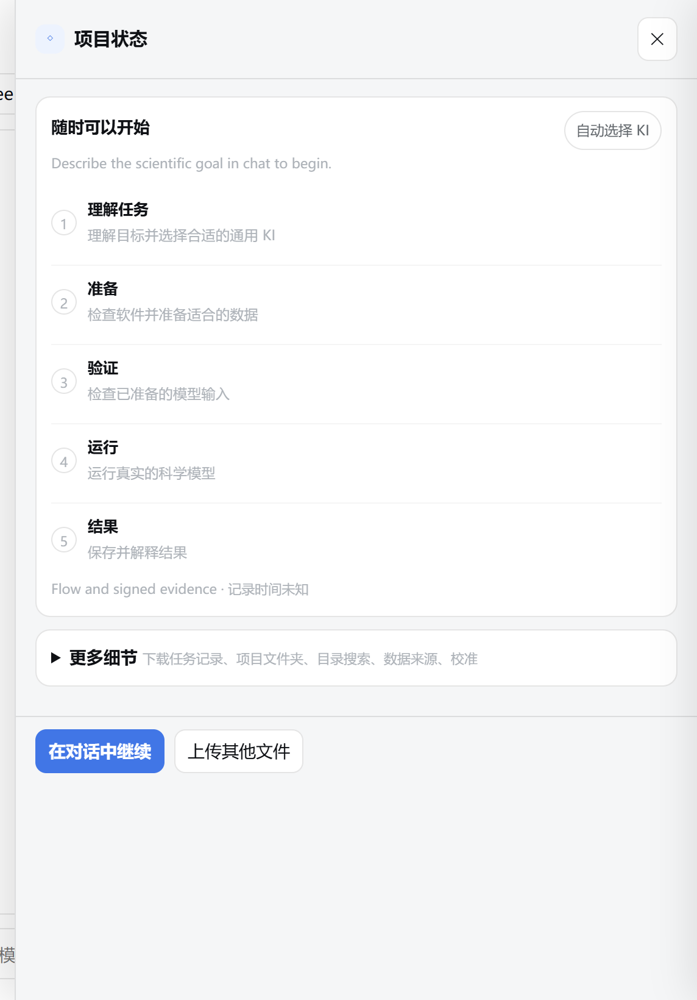

# 6 项目与文件

本章介绍 GeoForge 把每个对话的工作存放在哪里，怎样把你自己的文件交给它，怎样看 **项目状态** 面板，以及怎样移动、共享或归档项目，同时不让它的运行记录失效。

## 6.1 一个对话，一个项目文件夹

侧边栏里的每个对话都对应你磁盘上的一个文件夹。这个文件夹保存对话历史、你的输入、下载的数据、模型运行、输出和图表，以及签名的运行记录。你点击 **创建对话** 时 GeoForge 就会建好它，不用等你发送消息。

已安装的模型软件不在项目里。它放在该模型的安装文件夹中，默认位于 GeoForge 的工作文件夹内（例如 `C:\Users\you\kiss\fsm2`）。所以你的所有项目共用每个模型的同一份安装。

> **提示：** 一个对话只做一个科学目标。对话发出第一条消息后，它的 AI 和 KI 就固定了。所以新的问题、研究区或试验，本来就该放到新对话里。

## 6.2 创建项目文件夹

1. 点击侧边栏顶部的 **＋ 新建对话**。弹出 **新建项目对话** 对话框。
2. 看一下 **项目名称**。GeoForge 会自动填写：如果你在打开任何对话之前已经输入了消息，就用这条消息的第一行；否则用带日期的名称，例如 `新项目 2026-10-01 093015`。你可以修改。
3. 检查 **在此位置创建项目**。这是上级文件夹。可以保留默认值，也可以输入完整路径，例如 `D:\GeoForge-Manual\projects`。
4. 看一下 **项目文件夹（自动创建）**。这就是 GeoForge 将要创建的文件夹。
5. 点击 **创建对话**（也可以在 **项目名称** 中按 Enter）。

检查预览路径是否以 `<date>-<your name>--{id}` 结尾（`<date>` 是日期，`<your name>` 是你填的项目名称）。GeoForge 会把 `{id}` 换成一个唯一的 12 位编码，所以两个同名项目也不会共用一个文件夹。

在没有打开任何对话时点击 **发送** 或 **＋ 文件**，也会弹出这个对话框。**使用默认位置** 会恢复默认的上级文件夹。**取消** 会关闭对话框，不创建任何东西。

从 **在新对话中使用**（**KI 库**）、**询问 Agent**（**KI 观测台**）或 **在对话中使用 KI**（模型的设置页面）开始的对话，不会弹出这个对话框。它们的文件夹建在默认上级文件夹里，并在你发出第一条消息后改名。

缺少的上级文件夹，GeoForge 会帮你创建；那里已有的文件不会被改动。默认上级文件夹是 GeoForge 工作文件夹中的 `projects` 文件夹：

| | Windows | macOS |
|---|---|---|
| 默认上级文件夹 | `C:\Users\you\kiss\projects` | `~/kiss/projects` |
| **选择…** | 不会弹出文件夹选择器，因为 GeoForge 运行在你的网页浏览器中。对话框会显示“当前在浏览器模式。请直接输入文件夹路径；桌面版会打开系统文件夹选择器。”请直接输入路径，或者从文件资源管理器的地址栏复制路径后粘贴。 | 打开 macOS 的文件夹选择器。 |

**命名规则。** 项目名称长度为 1 到 120 个字符，至少要包含一个字母或数字。可以用中文名称，生成的文件夹名也好认。在文件夹名中，空格和大多数标点会变成 `-`，并且只取前 56 个字符。

> **注意：** 现在就选好最终位置。项目的运行记录与文件夹的完整路径绑定（见 6.9），以后移动文件夹，GeoForge 就无法再验证这些记录。请选择一个你有写入权限、剩余空间充足的本地磁盘。

## 6.3 项目文件夹里有什么

项目文件夹的结构如下（示例：`D:\GeoForge-Manual\projects\2026-10-01-Alptal-snow-example--<id>`）。有些文件夹要到第一次用到时才会出现。表中尖括号部分要换成实际名称：`<input>` 是输入项名称，`<dataset>` 是数据集名称，`<KI>` 是 KI 名称，`<number>` 是编号。

| 条目 | 内容 |
|---|---|
| `README.md` | 对这个文件夹的简短说明。 |
| `session.json` | 对话的工作状态，供应用使用。 |
| `kiss.toml` | 路径设置。为这个对话准备好 KI 后，GeoForge 会写入一次。 |
| `memory\transcript.jsonl` | 完整的对话历史，每行一条消息。 |
| `inputs\` | 输入数据，分别放在 `forcing\`、`parameters\`、`initial_conditions\`、`boundary_conditions\`、`observations\` 和 `static\` 中。从 GeoForge 数据库下载的数据放在 `observations\<dataset>\` 或 `geoforge_subsets\` 中。 |
| `inputs\uploads\` | 你通过 **＋ 文件**、拖放或 **上传其他文件** 添加的文件。 |
| `inputs\user\<input>\` | 你为计划中某个特定输入项上传的文件（见 6.6）。 |
| `outputs\<KI>\` | 模型自己的输出文件，例如 `outputs\FSM2\alptal_0405\`。 |
| `artifacts\` | 图表、表格、书面的运行说明，以及项目视图文件（`project-view.json`）。 |
| `runs\` | 计划（`plan.json`、`data-inventory.json`）、你的批准（`approval.json`）、进度状态、证据摘要（`evidence.json`）、事件日志和运行日志（`logs\`）。 |
| `models\<KI>\` | 本项目的一份 KI 说明和工具副本（`ki\`），以及它的路径设置。不是模型软件本身。 |
| `calibration\` | 本项目的校准设置、校准案例和校准运行。 |
| `references\papers\` | 你添加给 Agent 阅读的 PDF 论文。 |
| `.geoforge\` | GeoForge 受保护的记录：签名的运行记录（`receipts\`）、你保存的规划答复（`user-answers.json`）、下载进度和手动下载信息。 |
| `setup-request.json`、`setup-request-<number>.json` | 当前等你处理的问题卡片或请求卡片，以及你回答后保留下来的早先卡片。 |

Windows 的文件资源管理器会显示 `.geoforge`。macOS 的访达（Finder）会隐藏名称以点开头的文件夹；在访达中按 Command-Shift-.（句点）即可显示。

## 6.4 哪些可以添加、打开，哪些不要动

| 你可以 | 位置 |
|---|---|
| 随时打开和复制 | `outputs\`、`artifacts\`、`memory\transcript.jsonl`、`README.md`，以及 `runs\` 中的文件（只看不改） |
| 添加文件 | `inputs\user\<input>\`（在批准之前）、`inputs\uploads\`、`references\papers\` |
| 绝不要编辑、移动或删除 | `.geoforge\`、`runs\approval.json`、`runs\plan.json`、`runs\data-inventory.json`、`runs\flow-state.json`、`session.json` |

最后一行为什么重要：

- 批准、进度状态和每条运行记录都有签名，也就是用只有 GeoForge 持有的密钥封存（见 6.9）。手动编辑会让签名校验失败，GeoForge 随后会把这条记录当作无效。
- 如果你批准之后 `plan.json` 或 `data-inventory.json` 有变化，你的批准就和计划对不上了，必须重新批准。
- 如果 `.geoforge\user-answers.json` 无法读取，批准会停下，直到这个文件修好为止。
- 如果你替换或删除了已下载的文件，**项目状态** 就不再显示它可用。

> **注意：** 如果某个数据文件既不在已批准的计划中，也不是由有记录的运行生成的，项目就无法进入 **已完成** 状态。这条规则适用于 `inputs\`、`outputs\`、`artifacts\` 和 `calibration\` 中的 `.csv`、`.txt`、`.dat`、`.out`、`.bin`、`.nc`、`.tif`、`.png` 和 `.json` 文件。请在批准之前添加文件，让计划能把它们列进去；也不要把你自己的笔记或测试文件存放在这些位置。如果对话中点名了这样的文件，请看本章末尾的“如果出现问题”。

> **提示：** 在运行开始或重新运行之前，先在 Excel 或其他程序中关闭输出文件。文件被其他程序打开时，Windows 不允许模型替换它。

## 6.5 用“文件夹”按钮打开项目文件夹

1. 在侧边栏中打开这个对话。
2. 点击顶部栏中的 **▣ 文件夹**。
3. 找到新打开的窗口，它显示的就是项目文件夹。如果看不到，请在任务栏或程序坞（Dock）中找。

| | Windows | macOS |
|---|---|---|
| 文件夹在哪里打开 | 文件资源管理器 | 访达 |

检查顶部栏中有 **▣ 文件夹**、**◇ 项目状态** 和 **▤ 项目视图**。没有打开对话时，它们是灰色的。点击 **▣ 文件夹** 后，消息输入框下方那一行会显示“已打开”和文件夹路径。

还有其他按钮也能打开同一个位置。**项目视图** 面板底部的 **打开项目文件夹** 会打开项目文件夹。对话选定 KI 后，**项目状态 → 更多细节** 下的 **本次运行的数据** 卡片中有 **打开全部输入**，每个数据组里还有 **打开文件夹**；它们打开的是输入文件夹。

## 6.6 把你的文件交给 GeoForge

添加文件主要有三种方式。只有一种会把文件和计划中的某个输入项绑定。

| 按钮 | 位置 | 文件存到 | 是否绑定到计划输入项？ | 用途 |
|---|---|---|---|---|
| **上传文件** | **◇ 项目状态 → 本次计划的数据**，在 **需要你处理** 组下的某一行 | `inputs\user\<input>\` | 是，在你批准计划时绑定 | 计划要求你提供的数据，例如你自己的站点文件或观测数据 |
| **上传其他文件** | **项目状态** 面板底部 | `inputs\uploads\` | 否 | 让 Agent 查看的零散文件 |
| **＋ 文件**，或把文件拖到消息输入框上 | 消息输入框左侧 | `inputs\uploads\` | 否 | 与你正在写的消息相关的文件 |

另有两个按钮用于特殊情况。**添加论文 PDF** 会把 PDF 论文保存到 `references\papers\`，每个最大 100 MB。它在 **项目状态 → 更多细节 → 查看技术数据明细** 中，对话选定 KI 后出现在 **可选的模型资料** 卡片里。**添加观测数据**（在 **更多细节** 下的 **模型校准** 卡片中）的用法和 **＋ 文件** 相同。

三种主要方式的共同点：

- 文件会立即复制到项目中，并在消息输入框上方显示为一个小标签，上面有文件名和大小。只有你点击 **发送** 后，Agent 才会知道这些文件。
- 上传本身不会发送、批准或检查任何东西。
- GeoForge 从不覆盖文件。如果文件名已被占用，新副本的名称会加一个后缀。文件名中的特殊字符会变成 `_`。
- 单个文件最大 300 MB。更大的数据见 6.6.3。

GeoForge 的消息里用正斜杠写路径，例如 `inputs/user/site/`。它和文件资源管理器中的 `inputs\user\site\` 是同一个文件夹。

### 6.6.1 给消息附加文件

1. 点击 **＋ 文件**。
2. 在文件对话框中选择一个或多个文件，然后确认。
3. 检查消息输入框上方的文件标签。输入框下方那一行会显示，例如“2 个文件可以发送”。
4. 要把某个文件从这条消息中去掉，点击它标签上的 ✕。文件仍保留在项目中。
5. 输入你的消息。
6. 点击 **发送**。Agent 会收到这些附件在项目中的路径。如果你没有输入文字，GeoForge 会发送“请检查我附上的文件。”

> **提示：** 也可以跳过第 1、2 步，直接把文件从文件资源管理器或访达拖到消息输入框上。

你应该看到：每个文件一个标签，**发送** 按钮可用。

对话正在处理时不能附加文件：在 AI 完成当前这一轮回复之前，**＋ 文件** 是灰色的。请等这一轮回复结束，或者把文件添加到另一个对话中。

### 6.6.2 为计划输入项上传文件

如果计划说某个输入项必须由你提供，就用这个方法。在 **Approve the plan?**（是否批准计划？）对话框中，这类输入项列在 **需要你处理** 组下，并标有“需你提供文件”。这个对话框的标题和选项在中文界面中也显示为英文。对话框会盖住整个窗口，所以要先关掉它，上传文件，再重新打开。

1. 在 **Approve the plan?** 对话框中点击 **暂不处理**。这样既不批准也不拒绝。
2. 点击 **◇ 项目状态**。
3. 在 **本次计划的数据** 下找到 **需要你处理** 组。你的输入项那一行显示 **等你处理**、一段以“请你自行准备：”开头的说明（格式、单位、要求和目标文件夹），以及 **上传文件** 按钮。
4. 点击 **上传文件**。
5. 在文件对话框中选择一个或多个文件，然后确认。
6. 检查这一行。现在它显示 **文件存在，尚未核实**，**上传文件** 按钮消失了。
7. 看面板底部那一行：“已保存并加入待发送附件（未自动发送、批准或验证）：…”。GeoForge 还会在消息输入框里放一段说明，请 Agent 检查这些文件。你可以不管它：批准时，你的批准消息会替换这段说明，文件会随批准消息一起发出。
8. 在面板顶部的 **需要你处理** 下，点击 **回答这个问题**。**Approve the plan?** 对话框会再次打开。
9. 点击 **Approve and start**（批准并开始）。
10. 点击 **按此选择继续**。
11. 等对话中出现回复：“Your file is now named as the input: … The updated card is in the chat; approve it to start.”（你的文件已指定为该输入项……更新后的卡片在对话中，批准后即开始。这条回复为英文。）这时 GeoForge 已把 `inputs\user\<input>\` 中的每个文件绑定到该输入项，并记录了它的校验和（文件确切内容的指纹）。随后会打开一个新的 **Approve the plan?** 对话框。
12. 检查新对话框中的 **等待你处理** 部分。这里列出“your file is now named as the input: <input> → inputs/user/<input>/<file name>”。该输入项本身已移到 **运行时自动准备** 组，并标为“已在本机”。
13. 点击 **Approve and start**。
14. 点击 **按此选择继续**。签名的批准中现在记录了：这个输入项用的是你的文件。

你应该看到：这一行右侧的状态，以及说明下方的 **上传文件** 按钮。

你应该看到：**等待你处理** 中有你的文件路径。如果显示的文件不对，请选择 **Modify the plan**，不要批准。

> **注意：** 如果某个输入项在等你的文件，而它的文件夹是空的，批准会停下，并显示英文提示“Upload your file with the Upload button on the card”（请用卡片上的上传按钮上传文件）。实际上，**上传文件** 按钮在 **项目状态 → 本次计划的数据** 中，不在卡片上。

批准时，GeoForge 会绑定 `inputs\user\<input>\` 中的所有文件，名称以点开头的文件除外。要替换文件，请在批准之前用文件资源管理器或访达删除旧文件；否则新旧两个文件都会被绑定。如果批准后想换用另一个文件，请在对话中要求修改计划，这样新文件会在下次批准时绑定。

### 6.6.3 大文件

上传的单个文件上限是 300 MB，超过时会显示英文提示“file larger than 300 MB”（文件超过 300 MB）。更大的数据请这样处理：

1. 点击 **▣ 文件夹**。项目文件夹会在文件资源管理器或访达中打开。
2. 打开目标文件夹。如果是计划要求你提供的输入项，目标文件夹是 `inputs\user\<input>\`；如果它不存在，就新建一个，名称必须与 **本次计划的数据** 中显示的输入项名称完全一致。其他文件请放到 `inputs\uploads\`。
3. 把数据复制到这个文件夹。
4. 在对话中告诉 Agent 文件放在哪里。请在批准之前做这一步，这样计划才能写明这些文件（见 6.4 中的“注意”）。

`inputs\user\<input>\` 中的文件，不管是怎么放进去的，都会在批准时绑定。每次批准时，GeoForge 都会计算每个文件的校验和，文件很大时需要一些时间。

## 6.7 “项目状态”面板

1. 点击顶部栏中的 **◇ 项目状态**。面板会在右侧打开。
2. 从上往下看。
3. 点击 ✕ 关闭面板，或点击 **在对话中继续**，关闭面板并回到消息输入框。

在新对话中，检查卡片标题是 **随时可以开始**，右侧是 **自动选择 KI**；五个阶段都没有标记；**更多细节** 处于折叠状态。

面板包含以下几块：

| 区块 | 显示内容 |
|---|---|
| **需要你处理** | 只在有卡片等你处理时出现。可能是一个选择或问题，例如 **Approve the plan?**（点击 **回答这个问题** 可重新打开）；可能是百度网盘手动下载（**文件已放好，继续**）；也可能是许可证、登录或权限步骤（有时带 **打开官方页面**）。 |
| 进度卡片 | 标题为 **随时可以开始**、**可以继续**、**GeoForge 正在处理**、**有一件事需要你**、**项目已完成**、**项目需要处理** 或 **Status unconfirmed**（状态未确认，这个标题在中文界面中仍是英文）；上方显示 **需要你处理** 卡片时，标题只显示 **项目进度**。右侧显示 **自动选择 KI** 或“N / M 个软件已验证”。下面依次是一行摘要、**目标**、KI 标签（例如“通用 KI：FSM2”）和五个阶段。最后一行说明状态来自哪里、是多久以前记录的。 |
| **本次计划的数据** | 有了计划之后才出现。所有输入项分成三组：**GeoForge 自动下载**、**需要你处理** 和 **运行时自动准备**，每项都带状态。 |
| **更多细节** | 默认折叠，旁边的说明是“下载任务记录、项目文件夹、目录搜索、数据来源、校准”。里面有：状态依据、数据下载任务、**本次运行的数据**（对话选定 KI 后带 **打开全部输入**）、**GeoForge 数据库** 搜索、**数据来源与下载记录**（有记录时才出现）、**模型校准** 和 **查看技术数据明细**。 |
| 底部按钮 | **在对话中继续** 和 **上传其他文件**。 |

五个阶段：

| 阶段 | 含义 |
|---|---|
| **理解任务** | 理解目标并选择合适的通用 KI |
| **准备** | 检查软件并准备适合的数据 |
| **验证** | 检查已准备的模型输入 |
| **运行** | 运行真实的科学模型 |
| **结果** | 保存并解释结果 |

圆点标出的是当前工作所在的阶段。它不能证明之前的检查已经通过；工作往后推进时，前面的阶段也不会打勾。只有项目完成时，五个阶段才会全部打勾。在规划和下载数据期间，圆点一直停在 **理解任务**；这时请看摘要那一行。

**本次计划的数据** 中的状态来自签名记录和磁盘上的文件，而不是 Agent 的说法：

| 状态 | 含义 |
|---|---|
| **等你处理** | 需要你上传、下载或选择某样东西。 |
| **尚未准备** | 还没有准备好。 |
| **文件存在，尚未核实** | 文件已经到位，但还没有人检查过内容。 |
| **已下载，待科学检查** | GeoForge 已下载并签了记录；它在科学上是否适用还没有检查。 |
| **工具已生成，待科学检查** | 由一个有记录的运行步骤生成。 |
| **下载失败** | 下载没有成功。 |
| **计划中未用到** | 列在计划中，但没有步骤用到它。 |

已完成的项目仍可能显示“待科学检查”。这是如实的：运行完成不等于模型通过了验证。

**◇ 项目状态** 按钮的名称不会变。项目有了目标后，按钮上会出现一个彩色圆点表示状态，鼠标悬停提示以状态名开头：

| 圆点 | 悬停提示开头 | 含义 |
|---|---|---|
| 蓝色，闪动 | 进行中 | GeoForge 或 Agent 正在工作。 |
| 琥珀色 | 需要你 | 有事情在等你处理。 |
| 绿色 | 已完成 | 每个已批准的步骤都有一条通过的签名运行记录，也没有遗留未记录的数据文件。这不代表结果在科学上有效。 |
| 红色 | 需要处理 | 某个步骤失败、工作受阻，或记录无法读取。 |
| 灰色 | 就绪 或 尚未确认 | 没有任务在运行，也没有事情等你；或者状态无法确认。 |

## 6.8 在对话之间切换

1. 点击侧边栏中的任一对话即可打开。最新的对话在最上面。
2. 看每个标题下面的那一行：对话的 KI（或 **Auto KI**）和消息数，例如“Auto KI · 0 messages”（自动选择 KI · 0 条消息）。这一行在中文界面中仍显示为英文。正在工作的对话还会显示 **有新活动**、**运行中·静默**、**需要检查** 或 **连接异常**。

离开一个对话后，它的工作会继续。一个对话运行时，你可以打开另一个对话，或点击 **＋ 新建对话**。这个按钮在侧边栏顶部和活动栏上都有；活动栏是对话工作时出现在消息输入框下方的那一条。应用不会卡住。回到这个对话时，你会看到它最新的消息、等你处理的卡片或结果。

切换对话时，未发送的消息会留在原来的对话里；但如果你重新加载或关闭页面，它就会丢失。活动栏上的 **停止** 只停止你当前正在看的对话。

## 6.9 移动、备份或共享项目

GeoForge 用保存在这台电脑上的密钥，为批准、进度状态和每条运行记录签名。密钥放在项目文件夹之外（Windows 上是 `C:\Users\you\.config\geoforge\flow-keys`，macOS 上是 `~/.config/geoforge/flow-keys`）。每个密钥只对应一个文件夹路径。

因此，如果你移动、重命名或复制了项目文件夹（即使在同一台电脑上），或者在另一台电脑上打开它，GeoForge 都无法在那里验证这个项目的记录。文件本身（输出、图表、对话记录）不受影响，仍然可以阅读。项目一旦有了计划，移动后的副本在 **项目状态** 中就会显示 **项目需要处理**，并附英文提示“Project evidence is unreadable; inspect status details.”（项目证据无法读取，请查看状态详情。）

| 你想要 | 这样做 |
|---|---|
| 继续处理一个项目 | 文件夹留在原处，名称不变。 |
| 备份 | 把整个文件夹复制到备份盘，原文件夹留在原处。副本只当作存档来看。如果以后要在这台电脑上恢复，请放回完全相同的原路径，并使用原名称；这样它的记录就能再次通过验证。 |
| 把结果发给同事 | 只发送他们需要的 `artifacts\` 和 `outputs\` 中的文件，不要发整个文件夹。 |
| 释放磁盘空间 | 先归档对话（6.10），再自己删除归档后的文件夹。 |

> **注意：** 不要删除或编辑 `flow-keys` 文件夹。没有它，GeoForge 就无法验证你任何一个项目的运行记录。

把整个项目文件夹发给别人之前，先弄清楚里面有什么：

- 完整的对话历史（`memory\transcript.jsonl`）；
- 如果项目用过手动下载，还有来自 GeoForge 数据库的百度网盘分享链接和提取码。它们保存在 `.geoforge\manual-download-details.json` 和 `setup-request` 文件等位置，这样重启后下载卡片还在。这些链接和提取码是发给你的，不要公开发布；
- 下载的数据，它们可能有自己的许可条款。

你的 AI 密钥和 GeoForge 数据库 Token 不会保存在项目文件夹中。

**查看别人发给你的项目。**

1. 把文件夹复制到你的默认项目文件夹中，例如 `C:\Users\you\kiss\projects`。文件夹名称保持不变（必须以 `--` 加 12 位编码结尾）。
2. 看 GeoForge 的侧边栏。几秒钟内这个对话就会出现，因为 GeoForge 窗口可见时，列表会自动刷新。

这样的项目只用来查看：它的记录在你的电脑上无法验证；它保留了发送者选择的 AI；模型软件也必须先装在你的电脑上，才能运行任何东西。要做新的运行，请新建对话。

## 6.10 归档（删除）对话

1. 把鼠标移到侧边栏中的对话上。标题那一行的右端会出现一个 ✕。
2. 点击 ✕（悬停提示为“Archive chat; project files are kept”，即“归档对话，项目文件会保留”）。
3. 弹出对话框“Archive this chat? Its local project files will be kept.”（归档这个对话？本地项目文件会保留。）。点击 **确定**（英文浏览器中为 **OK**）。

这个悬停提示和确认框的文字在中文界面中都是英文。

对话会从侧边栏消失。什么都没有删除：GeoForge 会把文件夹移到旁边的 `_archived` 文件夹中，并在名称后加上 `-deleted-<number>`。对于默认位置的项目，归档位置是 `C:\Users\you\kiss\projects\_archived\`。

对话正在工作时，✕ 是灰色的。请等 AI 完成这一轮回复，或先点击 **停止**。

要释放磁盘空间，请自己用文件资源管理器或访达删除 `_archived` 中的文件夹。模型输出和下载的数据可能很大。

> **提示：** GeoForge 没有恢复已归档对话的按钮。要找回一个对话，把它的文件夹从 `_archived` 移回原处，并去掉名称末尾的 `-deleted-<number>`。如果项目不在默认位置，还要把 `C:\Users\you\kiss\sessions\_archived\<id>-deleted-<number>.json` 移回为 `C:\Users\you\kiss\sessions\<id>.json`。几秒钟内对话会重新出现在侧边栏中。放回原路径后，它的记录会再次通过验证。

## 如果出现问题

下表中的英文提示在中文界面中也以英文显示。

| 你看到的情况 | 处理方法 |
|---|---|
| 点击 **选择…** 没有反应，对话框显示“当前在浏览器模式。请直接输入文件夹路径……”（Windows） | 这是正常现象。直接输入或粘贴完整的文件夹路径。 |
| **创建对话** 是灰色的，预览处显示“填写项目名称和保存位置后，将自动生成路径。” | 两个输入框中有一个是空的。请填写 **项目名称** 和 **在此位置创建项目**。 |
| “无法预览路径：project location must be an absolute folder path” | 输入以盘符开头的完整路径，例如 `D:\GeoForge-Manual\projects`。 |
| “无法预览路径：project name must contain a letter or number” | 在名称中至少加一个字母或数字。 |
| 预览下方出现红色的“could not create project location …” | 这个磁盘不存在，或者你没有写入权限。请换一个文件夹。你填写的内容会保留，可以直接重试。 |
| “无法打开文件夹选择器，请直接输入路径。”（macOS） | 在 **在此位置创建项目** 中输入或粘贴完整的文件夹路径。 |
| 点击 **▣ 文件夹** 后，消息输入框下方那一行显示错误（例如“no such session”），而不是“已打开 …” | 项目文件夹已不在原来的路径下，或名称变了。把它移回原路径，并恢复原名称。 |
| “file larger than 300 MB” | 改用文件资源管理器或访达复制文件（6.6.3）。 |
| “本对话正在处理。请将文件添加到新对话，或等待本轮完成。” | 等 AI 完成这一轮回复，再附加文件。 |
| 批准停下，并显示“These still need your decision before anything runs: … Upload your file with the Upload button on the card (it goes to inputs/user/…)” | 在对话框中点击 **暂不处理**。在 **◇ 项目状态 → 本次计划的数据** 中，用那一行的 **上传文件** 上传，然后点击 **回答这个问题**，再次批准（6.6.2）。 |
| “Your saved answers cannot be read (…). Fix or remove that file, then approve again.” | `.geoforge\user-answers.json` 被编辑过或已损坏。能撤销修改就撤销。如果删除这个文件，批准可以恢复，但 GeoForge 会当作你之前从未回答过规划问题；请仔细检查卡片。 |
| 对话中显示“**GeoForge verification:** not complete yet — … these files are not vouched for by a passing receipted run (left by a failed attempt or written outside run-tool); regenerate or remove them: …” | 如果列出的文件是你添加的，把它移出项目文件夹（在别处留一份）。然后发一条简短的消息，例如“继续”。如果文件是 Agent 在有记录的运行之外生成的，请让它通过已批准的步骤重新生成。在 Windows 上，Agent 启动的后台任务在点击 **停止** 后可能仍在运行（已知问题），并写出这类文件；请先在任务管理器中结束它。 |
| 移动、重命名或复制文件夹后，显示 **项目需要处理** 和“Project evidence is unreadable; inspect status details.” | 把文件夹移回原路径，并恢复原名称。放在别处的副本可以阅读，但无法验证。 |
| 移动文件夹后，对话从侧边栏消失了 | 把文件夹移回原路径，并恢复原名称。几秒钟内侧边栏会重新显示它。 |
