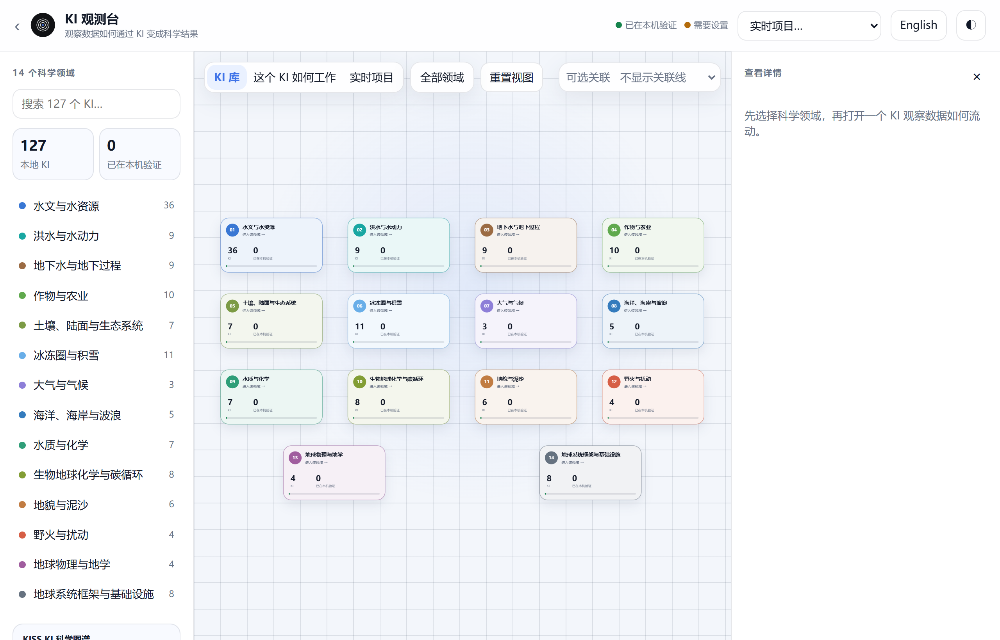
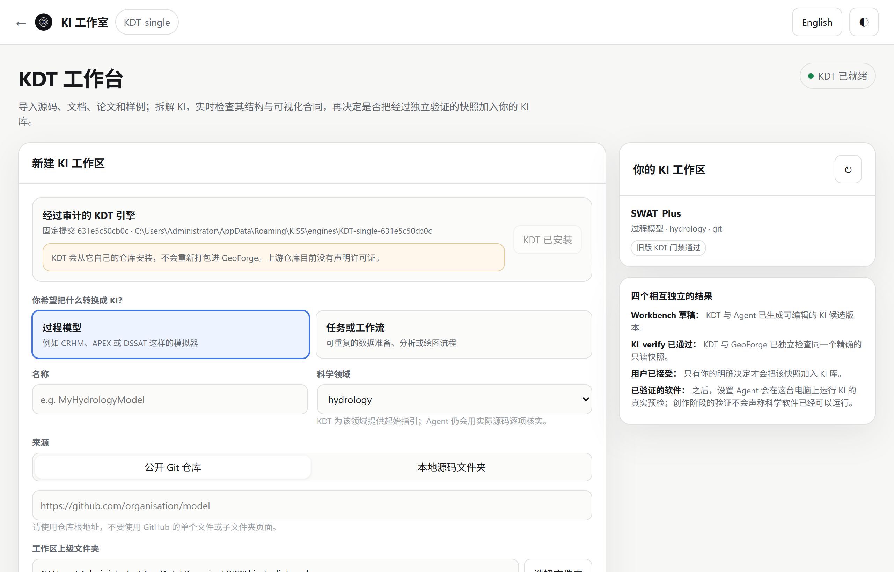
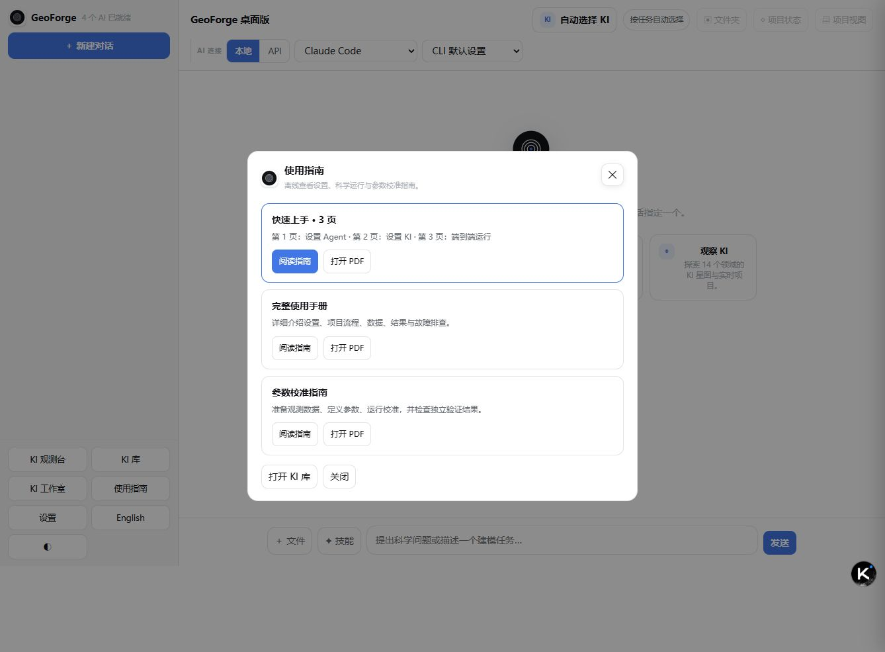

# 7 更多工具

本章介绍对话之外的几个工具：**KI 库**、**KI 观测台**、**KI 工作室**、技能、MCP 服务器、应用内的 **使用指南**，以及模型校准。

## 各个工具在哪里

前三个工具在侧栏底部有按钮，在开始页也有卡片。

| 工具 | 从哪里打开 | 用途 |
|---|---|---|
| **KI 库** | 侧栏 **KI 库**；开始页 **浏览并验证**；**使用指南** → **打开 KI 库** | 查看所有 KI，检查其软件能否在本机运行，导入 KI，更新 KI 库 |
| **KI 观测台** | 侧栏 **KI 观测台**；开始页 **观察 KI**；**KI 库** 顶栏 | 了解有哪些 KI、某个 KI 如何工作；向 AI 询问某个 KI |
| **KI 工作室** | 侧栏 **KI 工作室**；开始页 **创建 KI**；**KI 库** 顶栏的 **创建 KI** | 把你自己的模型或工作流做成经过检查的 KI |
| **✦ 技能** | 消息框旁边 | 为某个对话指定一个可复用的流程，例如一种绘图方法 |
| MCP 服务器 | **设置** → **权限** | 让某个对话中的本地 Agent 使用外部服务，例如 GitHub |
| **使用指南** | 侧栏 **使用指南** | 阅读 GeoForge 的三步简介 |
| 模型校准 | **◇ 项目状态** → **更多细节** → **模型校准** | 用你的观测数据调整模型参数 |

每个页面左上角的 **←** 或 **‹** 用来返回。在 **KI 工作室** 中，它返回 **KI 库**；在 **KI 库** 和 **KI 观测台** 中，它返回主窗口。

## KI 库

KI（Knowledge Infrastructure，知识基础设施）是针对某一个科学模型、经过检查的指南，说明怎样安装、准备、运行和检查这个模型。**KI 库** 列出本机上的所有 KI，并显示每个 KI 的模型软件是否已在本机检查过。

### 查看 KI 的状态

1. 点击侧栏底部的 **KI 库**。

    

    查看列表底部的一行，例如 **127 / 127 个 KI · 0 个已在本机验证**。刚安装的 GeoForge 还没有验证任何 KI，这是正常的。

2. 在 **搜索 KI…** 中输入模型名称的一部分，缩短列表。
3. 点击列表中的一个 KI。它的详情显示在右侧。

    查看 KI 名称下方的两个徽标。第一个说的是 KI 软件包本身，第二个说的是本机上的模型软件。

每个名称前的圆点让你一眼看出软件状态：绿色表示已在本机验证，红色表示上次检查失败，橙色表示软件还需要设置。

| 徽标 | 含义 |
|---|---|
| **内置 KI** | 这个 KI 随 GeoForge 或官方 KI 库更新一起提供。 |
| **有效的已导入软件包** | 这个 KI 是你导入的，并且通过了软件包检查。 |
| **软件包尚未检查** | GeoForge 还没有检查这个软件包。 |
| **已在本机验证** | 模型软件在本机通过了这个 KI 自带的启动检查（即“预检”）。检查日期显示在 **本机上次检查时间** 中。 |
| **需要设置** 或 **可以开始设置** | 软件还没有在本机验证。你仍然可以选择这个 KI：你批准计划后，GeoForge 会让 Agent 把软件设置好。 |
| **需要手动设置** | 同上，但 GeoForge 无法自行获取软件，你可能要自己提供一部分。 |
| **验证失败** | 本机上一次检查失败。请让 Agent 重新设置。 |

请把三件事分开看。KI 在库里，说明 GeoForge 能读取它的指南。**已在本机验证** 说明模型程序能在本机运行。这两者都不代表某个项目已经有了所需的数据和决定，也都不能说明模型结果在科学上是否正确。

四张信息卡分别显示 **科学软件** 及其版本、**本机上次检查时间**（从未检查过时显示 **尚未检查**）、**语言与许可证**，以及 **来源**（**打开项目网站**）。

### 从 KI 库开始对话或设置软件

- **在新对话中使用**：新建一个已选好这个 KI 的对话。它使用 **KI 库** 顶部选择器中显示的 AI。这样会跳过 **新建项目对话** 窗口，所以项目放在默认位置（第 6 章），对话名称取自你的第一条消息。
- **使用 Agent 设置**：打开 **Agent 设置** 页面，安装并验证模型软件。KI 验证通过后，这个按钮变为 **打开设置与验证**。第 4 章介绍这个页面。
- **运行数据**：显示这个 KI 需要什么，包括 **输入** → KI → **输出**、**本地数据检查**、**已声明的输入组**（**驱动数据**、**参数**、**初始条件**、**边界与控制**），以及 **耦合 KI**（如果有）。点击某个组可以查看其中的条目。

**运行数据** 根据 KI 自身的文件和 GeoForge 在本机找到的内容生成。它描述的是 KI，不是你的某个项目。项目的数据请看 **◇ 项目状态**（第 6 章 6.7 节）。

想用通俗的话理解 **运行数据**，请点击 **需要更简单的说明吗？** 下方的 **说明我的数据**。说明由页面顶部选择器中的 AI 撰写。它不能更改数据要求，也不能更改验证标记。如果还没有连接 AI，按钮显示 **请先连接 AI**，无法点击。

> **提示：** 看到“本地文件暂时无法自动检查。”，说明这个 KI 没有列出 GeoForge 可以检查的文件路径。输入组仍然描述了模型的接口。

> **注意：** **KI 库** 顶栏中的 ⚙ 按钮会打开一个旧版的小设置窗口。它没有 **权限** 页面，API 密钥输入框也不会隐藏你输入的内容。请改用主窗口侧栏中的 **设置**。输入密钥时，不要分享 ⚙ 窗口的截图。

### 导入 KI 软件包

同事发给你的 `.zip` 软件包可以作为 KI 加入。GeoForge 会先检查软件包，检查通过后才加入。KI 的名称取自文件名（不含 `.zip`）。

1. 在 **KI 库** 顶栏点击 **检查并导入**。
2. 选择 `.zip` 文件。**KI 软件包检查** 窗口打开，显示“Checking *名称* before importing…”（导入前正在检查）。这个窗口中的检查信息以英文显示。
3. 阅读结果。**BLOCK** 行会阻止导入。**WARN** 行只是建议，不会阻止导入。

    确认摘要说明软件包有效（is a valid KI package）。否则 **导入有效 KI** 会一直是灰色。

4. 点击 **导入有效 KI**。新 KI 在列表中被选中，并带有徽标 **有效的已导入软件包**。

导入只检查软件包的结构。和其他 KI 一样，模型软件仍要在本机设置并验证。点击 **取消** 可以不导入直接离开。

### 更新 KI 库

GeoForge 可以从官方 GeoForge 仓库下载更新的 KI 定义。使用下载的 KI 库之前，GeoForge 会检查其中的每个软件包。下载或检查失败时，继续使用当前的库。更新不会改动你的对话、输入数据、已安装的模型软件、验证记录，以及你自己导入的 KI。

| 平台 | GeoForge 何时检查 KI 更新 |
|---|---|
| Windows | 只在你要求时检查。第一次检查要下载并检查约 88 MB，所以不会在启动时自动进行。 |
| macOS | 每次启动时自动检查。你也可以手动检查。 |

手动检查：

1. 在 **KI 库** 顶栏点击 **KI 更新**。**KI 库更新** 窗口打开。
2. 点击 **再次检查**。检查期间，顶栏按钮显示 **正在检查 KI……**。
3. 阅读窗口顶部的摘要。

    查看摘要。在 0.6.54 的 Windows 版中，它通常说明保留了当前的库。

在 Windows 上出现这个结果是预期的，也是安全的。Windows 版中的每个 KI 都带有 Windows 安装说明，其中 23 个还有 Windows 安装配方。在线仓库目前还没有这些内容。如果新库会删掉它们，GeoForge 就拒绝使用，保留你现有的库。等仓库加入 Windows 说明后，更新就会恢复。

保留之后，顶栏按钮显示 **已保留当前库**。主窗口打开时，右下角也可能出现提示 **已保留当前 KI 库**。点击 **查看报告** 打开这个窗口，或点击 **关闭** 关掉提示。

如果只能通过代理访问 GitHub，请在主窗口中设置：**设置** → **网络与代理**，勾选 **GitHub 与 KI 更新**，然后点击 **保存**（第 2 章）。这个窗口里的 **网络设置** 按钮打开的是上文提到的旧版 ⚙ 设置窗口。

## KI 观测台

**KI 观测台** 是一张地图，帮你了解有哪些 KI，以及每个 KI 如何把数据变成结果。它只读取 KI 的描述，从不运行模型代码。它唯一能创建的东西是新对话，方式是点击 **询问 Agent**。

### 浏览领域和单个 KI

1. 点击侧栏底部的 **KI 观测台**。

    

    查看左栏：**14 个科学领域** 及各自的 KI 数量，还有两个方框 **本地 KI** 和 **已在本机验证**。右上角的图例中，绿点表示 **已在本机验证**，橙点表示 **需要设置**。

2. 点击一张领域卡片，或左栏中的领域名称。这个领域的 KI 以卡片形式显示。每张卡片显示这个 KI 声明的输入、处理过程和输出的数量，例如 **4 IN · 6 PROCESS · 3 OUT**（这一行以英文显示）。
3. 点击一张 KI 卡片。这个 KI 的 **这个 KI 如何工作** 标签页随即打开。

    查看领域名称旁边的徽标，它表示这个 KI 在本机的状态：**已在本机验证** 或 **需要设置**。

4. 点击一张阶段卡片。右侧的 **查看详情** 面板会说明这个阶段做了什么。
5. 在 **查看详情** 面板中展开 **技术依据**，可以看到这个 KI 使用的确切名称。
6. 要查看这个 KI 的完整工作流图（即“DAG”），点击 **完整技术 DAG**。图中有四条泳道：**输入**、**核心引擎**、**验证闸门** 和 **结果**。
7. 点击 **工作原理**，回到阶段视图。

图的下方，**可视化能力** 列出这个 KI 声明的展示类型，例如图表或地图。

> **提示：** **工作原理** 中流动的动画表示 KI 各个科学阶段的顺序，并不表示模型正在运行。

其他浏览方式：

- 在 **搜索 127 个 KI…** 中输入，可以在所有领域中查找 KI。
- 拖动地图可以移动它，用鼠标滚轮可以缩放。
- 在 **KI 库** 标签页中，点击 **重置视图** 回到全部领域。在某个 KI 的视图中，点击 **← 返回领域** 返回上一级。
- **查看相关 KI** 显示与这个 KI 有关联的 KI。**可选关联** 用来选择画出哪些关联线：**不显示关联线**、**科学耦合**、**共享数据** 或 **全部证据**。

### 向 AI 询问某个 KI

**询问 Agent** 会 **新建** 一个对话，选好这个 KI，并立即发送一个关于它的问题。这个按钮在 KI 标题栏中；当 **查看详情** 面板显示的是某个 KI、阶段或图节点时，面板里也有这个按钮。

1. 打开观测台之前，先检查主窗口顶部的 **AI 连接**（**本地** | **API**、服务商和模型）。新对话会使用这里的选择，而对话发出第一条消息后就不能再更换 AI。
2. 在观测台中点击 **询问 Agent**。按钮显示 **正在创建新对话…**。
3. 稍等片刻。GeoForge 会切换到新对话，并发送类似这样的问题：“请用简单的语言解释 FSM2 KI 的数据如何通过核心流程变成结果。”

说明：

- 这个对话会跳过 **新建项目对话** 窗口。项目放在默认位置，以问题命名。
- 每点击一次，就多一个对话和一个项目文件夹。不需要的对话可以在对话列表中点击 **✕** 归档。归档会保留项目文件（第 6 章）。
- 这个问题是请 AI 解释，通常会直接得到回答，不会开始制定计划。要运行模型，请在这个对话或新对话中描述你的任务。
- 如果没有可用的 AI，问题会留在消息框中，并提示“新对话已经创建，问题已填入。连接 AI 后点击发送。”

### 查看对话项目的进展

右上角的 **实时项目…** 列表显示你的对话。选择一个，就会打开 **实时项目** 标签页。它用一排八个步骤显示对话记录的阶段，从 “understanding”（理解任务）到 “results”（结果），并显示 Agent 当前在做什么。这些步骤名称以英文显示。徽标 **等待用户** 表示这个对话需要你回答。

这个标签页只用来查看。要回答问题或批准计划，请回到对话中。对话中的 **◇ 项目状态** 仍然是项目的完整记录（第 6 章 6.7 节）。

## KI 工作室

**KI 工作室** 可以把你自己的模型，或可重复的任务（例如数据清洗或绘图流程），做成 GeoForge 能使用的 KI。它面向高级用户。KI 工作室使用一个名为 KDT 的独立引擎来读取你的源码并检查结果。AI Agent 编写 KI，两道独立的检查对它进行测试，最后由你决定是否把它加入 KI 库。

### 创建 KI

1. 点击侧栏底部的 **KI 工作室**。

    

    查看右上角的状态标签。第一次打开时显示 **正在检查 KDT…**，然后显示 **需要安装 KDT**。引擎安装好后显示 **KDT 已就绪**。你以前的工作区列在 **你的 KI 工作区** 下。

2. 在 **经过审计的 KDT 引擎** 下点击 **安装 KDT 引擎**。这一步只需做一次。GeoForge 会用 Git 从 GitHub 下载这个引擎（KDT-single）。它不随 GeoForge 一起提供，它的仓库也没有声明许可证。
3. 在 **你希望把什么转换成 KI？** 下，选择 **过程模型** 或 **任务或工作流**。
4. 输入 **名称**。
5. 选择 **科学领域**。如果列表里没有你的领域，选择 **其他 — 自行输入**，再输入领域名称。这时 Agent 只根据你的源码、示例和测试推导工作流。
6. 在 **来源** 下，选择 **公开 Git 仓库** 或 **本地源码文件夹**。
7. 粘贴仓库的主地址（例如 `https://github.com/organisation/model`），或源码文件夹的路径。
8. 检查 **工作区上级文件夹**。GeoForge 会在这里新建一个文件夹，从不修改你的原始源码。
9. 选择 **AI Agent**。
10. 选择 **Agent 模型**。
11. 点击 **创建工作区**。**KI 创建流程** 面板随即打开。
12. 可选：在 **这个 KI 的源资料** 下，粘贴论文、手册或示例的 DOI、网页链接或本地路径。
13. 点击 **Add**（添加）。这个按钮以英文显示。每添加一条资料，就重复一次第 12 和第 13 步。
14. 按顺序完成面板中五个带编号的步骤：

    | 步骤 | 按钮 | 作用 |
    |---|---|---|
    | 1 分析模型源码 | **运行 KDT 探测** | KDT 读取源码、构建文件、文档以及输入/输出路径。 |
    | 2 使用 Agent 拆解并构建 | **构建或修复 KI** | Agent 编写 KI：工作流、工具、检查和绘图。 |
    | 3 检查 Workbench 实时预览 | **查看上方预览** | 阅读四条泳道：**工作流 DAG**、**工具与数据输入/输出**、**诊断与预检**、**可视化函数**。需要修复时，重复第 2 步。 |
    | 4 完成并运行 KI_verify | **完成并验证** | KDT 先检查 KI，然后 GeoForge 检查它的一个固定只读副本（KI_verify 就是这项结构检查）。 |
    | 5 由你做最终决定 | **接受并加入 KI 库** | 在你点击这个按钮之前，不会加入任何内容。 |

    接受之前，确认结果显示 **独立 KI_verify 已通过**。如果显示 **KI_verify 需要修改**，请阅读列出的问题，点击 **继续修改**，然后重复第 2 步。

**四个相互独立的结果** 面板说明了为什么要把这些结果分开看：

- **Workbench 草稿**：只是一个可编辑的候选版本。
- **KI_verify 已通过**：KDT 和 GeoForge 都检查了这个 KI 的结构。
- **用户已接受**：只有你点击第 5 步的按钮时才会发生。
- **已验证的软件**：在之后发生，即模型软件在运行它的电脑上通过检查时。

前三项都不能说明模型程序能运行，四项都不能说明模型在科学上是正确的。

| 平台 | 在 KI 工作室中选择文件夹 |
|---|---|
| Windows | **选择文件夹** 只会显示“桌面应用中可以选择文件夹；浏览器模式请在这里粘贴路径。”请从文件资源管理器的地址栏复制路径并粘贴，例如 `D:\GeoForge-Manual\kis`。 |
| macOS | **选择文件夹** 会打开系统的文件夹选择器。 |

> **注意：** **安装 KDT 引擎** 需要 Git，而 GeoForge 不包含 Git。如果缺少 Git，会显示英文消息“Git is not installed. Install the Xcode command line tools, then retry.”（未安装 Git，请安装 Xcode 命令行工具后重试）。Xcode 工具只适用于 macOS。在 Windows 上，请安装 Git for Windows 后重试。

0.6.54 的 Windows 端到端测试只覆盖了使用 DeepSeek API 的 FSM2 示例。KI 工作室不在这次测试范围内。

## 技能

技能是 Agent 可以照着做的书面流程，例如怎样画出可用于发表的图。Agent 会自己挑选有用的技能。只有当你希望某个技能在整个对话中都使用时，才需要指定它。

GeoForge 不自带技能。列表中显示的是已经为你的 Agent 安装好的技能。每个技能是一个包含 `SKILL.md` 文件的文件夹，位于以下位置之一：

- `C:\Users\you\.agents\skills`
- `C:\Users\you\.codex\skills`
- `C:\Users\you\.claude\skills`

在 macOS 上，这些文件夹位于你的主文件夹中，名称相同。本地 Agent 和 API 服务商都可以使用它们。

### 用技能按钮指定技能

1. 打开对话。
2. 点击消息框旁边的 **✦ 技能**。**本对话使用的技能** 窗口打开。
3. 如果列表很长，在 **搜索技能…** 中输入关键词。
4. 点击每个你需要的技能。再点一次可以取消。
5. 点击 **应用**。

查看按钮。它现在显示已指定的技能数量，例如 **✦ 1**。要取消所有已指定的技能，再次打开窗口，点击 **清除**，然后点击 **应用**。

### 用斜杠命令指定技能

1. 在空消息框的开头输入 `/`。菜单打开，显示 **/skills**（**浏览所有已安装技能**）和最多八个技能。
2. 继续输入以缩小范围，例如 `/plot`。
3. 点击一个技能。提示“/*名称* is active for this chat”（该技能已在本对话中启用）表示指定成功。这条提示以英文显示。

你也可以在一条消息中同时输入技能名称和请求，然后按 Enter。例如，如果你有一个名为 `hydrograph-plot` 的技能，可以输入 `/hydrograph-plot 绘制 2015 年的逐日流量`。GeoForge 会指定这个技能，并把其余部分作为你的消息发送。只发送 `/skills` 会打开 **本对话使用的技能** 窗口。

## 对话使用的 MCP 服务器

MCP（Model Context Protocol，模型上下文协议）服务器把 Agent 连接到外部服务，例如 GitHub。GeoForge 本身不运行 MCP 服务器。它列出你已经为本地 Agent Claude Code 和 OpenAI Codex 设置好的服务器，并让你为每个对话选择可以使用哪些服务器。

> **注意：** 只有本地 Agent Claude Code 和 OpenAI Codex（**AI 连接** 下的 **本地**）可以使用 MCP 服务器。API 服务商（例如 DeepSeek）只使用 GeoForge 自带的工具。0.6.54 没有在 Windows 上对本地 Agent 做端到端测试。

1. 打开要使用这个服务器的对话。没有打开对话时，第 4 步的按钮不起作用。
2. 点击侧栏底部的 **设置**。
3. 点击左侧的 **权限**。

    

    确认 **MCP 连接** 下有按钮 **为当前对话选择 MCP 服务器**。**Kimi Code 文件访问权限** 在第 2 章中介绍。

    > **提示：** 如果你在设置中改过别的内容，现在先点击 **保存**。下一步会直接关闭设置窗口，不会保存。

4. 点击 **为当前对话选择 MCP 服务器**。设置窗口关闭，**MCP 连接** 窗口打开。
5. 点击这个对话要使用的每个服务器，让它处于勾选状态。每一行显示它为哪些 Agent 配置过，例如 **已为 codex, claude · stdio 配置**。
6. 点击 **应用**。

点击 **应用** 之前，确认需要的服务器都已勾选。之后你可以在同一个对话中修改选择。

如果已经安装了 Codex CLI，并且安装了官方的 `github-mcp-server` 程序或 Docker，**GitHub MCP** 卡片会提供 **为 Codex 配置**。配置完成后，消息会说明第一次使用这个服务器时会打开 GitHub 登录。否则，卡片只显示一个链接 **官方设置指南**。

MCP 服务器让 Agent 能做更多事，但它不能代替 KI 的检查，也不能代替项目的运行记录。

## 使用指南：三个离线文档

点击侧栏底部的 **使用指南**，即可按当前界面语言打开三个文档：

| 文档 | 用途 |
|---|---|
| **快速上手 · 3 页** | 每页一个阶段：配置 Agent、配置 KI、完成一次真实 SHAW 运行 |
| **完整使用手册** | 详细流程、真实界面截图与排错 |
| **参数校准指南** | 参数、观测、训练/留出划分、真实模型适配器，以及参考恢复测试 |

每张卡片有 **阅读指南**（本地 HTML）和 **打开 PDF**（可打印文档）。文档随应用提供，不需要联网；服务商登录、软件或数据下载及云端 AI 调用仍需要各自的网络连接。

检查三个文档卡片都在。快速指南 PDF 恰好三页；完整手册和校准指南更长。

## 校准

校准必须通过 KI 适配器运行真正的模型。第 10 章介绍完整流程、校准卡片状态，以及可复现的 SHAW 参考恢复测试。打开 **使用指南 → 参数校准指南** 可单独阅读同样内容。用模型参考输出做的基准，不是实测观测验证。

## 如果出了问题

| 你看到的情况 | 怎么做 |
|---|---|
| **KI 更新** 显示“GeoForge 保留了当前 KI 库……”，或出现提示 **已保留当前 KI 库**。 | 不需要处理。这在 0.6.54 的 Windows 版中是预期结果，你的库没有变化。点击 **关闭**。 |
| “KI 更新未完成；GeoForge 已继续使用上一次验证通过的版本。”，或出现提示 **KI 更新未完成** | 网络或软件包检查失败，你的库没有变化。如果需要代理，在 **设置** → **网络与代理** 中勾选 **GitHub 与 KI 更新**，点击 **保存**，然后点击 **再次检查**。 |
| “*名称* cannot be imported yet. Fix the blocking findings and try again.”（暂时无法导入，请修正阻止导入的问题后重试） | 阅读 **BLOCK** 行，并把它们发给软件包的制作者。 |
| 某条 **BLOCK** 行写着“a KI named '…' already exists; rename the zip and re-import”（同名 KI 已存在，请重命名 zip 后重新导入）。 | 重命名 `.zip` 文件，然后再次点击 **检查并导入**。KI 的名称取自文件名。 |
| **说明我的数据** 显示 **请先连接 AI**。 | 在 **设置** → **AI 服务** 中连接 AI（第 2 章），然后重新打开 **KI 库**。 |
| **询问 Agent** 显示“无法创建对话”和“没有使用旧对话”。 | 问题没有发送，已有的项目也没有改动。关闭这条消息后重试。 |
| 点击 **询问 Agent** 后显示：“新对话已经创建，问题已填入。连接 AI 后点击发送。” | 在 **AI 连接** 下点击 **API** 或 **本地**，选择一个可用的服务商，然后点击 **发送**。 |
| **这个 KI 如何工作** 没有反应。 | 先打开一个 KI：点击一个领域，再点击一张 KI 卡片。 |
| KI 工作室：“Git is not installed. Install the Xcode command line tools, then retry.” | 在 Windows 上，安装 Git for Windows。在 macOS 上，安装 Xcode 命令行工具。然后再次点击 **安装 KDT 引擎**。 |
| KI 工作室：地址框下方显示“这个页面不能直接克隆。请使用仓库根地址：…” | 粘贴消息中建议的地址，也就是仓库的主页面，而不是其中的某个文件或文件夹。 |
| KI 工作室：“桌面应用中可以选择文件夹；浏览器模式请在这里粘贴路径。” | 在 Windows 上，从文件资源管理器的地址栏复制路径并粘贴。 |
| **本对话使用的技能** 显示“没有找到匹配的技能。” | 技能文件夹中没有安装任何技能，或没有技能与你的搜索匹配。 |
| **为当前对话选择 MCP 服务器** 没有反应。 | 先打开一个对话，然后再次打开 **设置** → **权限**。 |
| **MCP 连接** 显示“本地 Agent 尚未配置 MCP 服务器。” | 先按照这个服务器自己的说明，为 Claude Code 或 Codex 设置好它。 |
| 你在校准期间关闭了一个黑色控制台窗口。 | 那一次模型运行会被算作失败。其他窗口不要关。本轮结束后，请 Agent 检查 `calibration\runs\` 中的运行。 |
| 在已完成的对话中点击 **让 Agent 校准**，只得到一段解释。 | 已完成的对话是只读的。请新建一个对话来做校准。 |
| **模型校准** 卡片显示 **校准引擎不可用**。 | 当前版本无法加载校准引擎，因此无法进行任何校准。请报告这个问题（第 9 章 9.18 节）。 |
